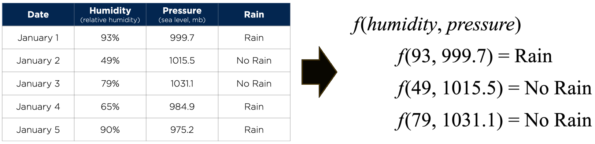
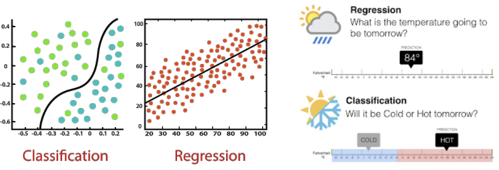
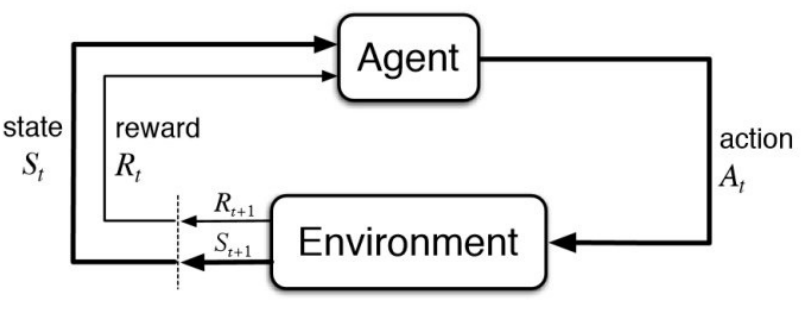
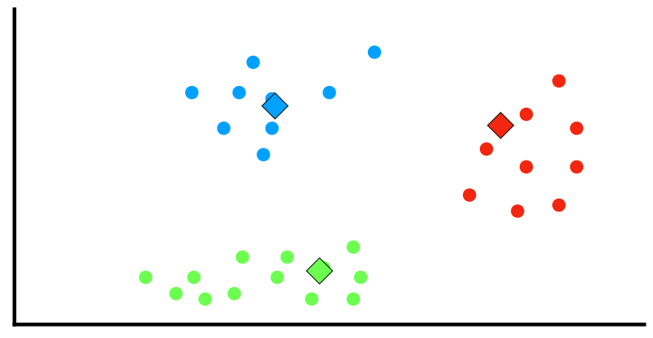

# 10. Machine Learning (1)

## What is (Machine) Learning?
- Agent가 세상을 관찰한 후 성능을 향상시키면 학습하는 것
- Agent가 컴퓨터일 때 machine learning이라 부름: 컴퓨터가 data를 관찰하고, data 기반 model을 구축하며, 이 model을 세상에 대한 가설이자 문제 해결 software로 사용
- Machine이 학습해야 하는 이유
    - 설계자(프로그래머)가 모든 가능한 미래 상황을 예측할 수 없음
    - 설계자가 해결책을 program하는 방법을 모르는 경우
    - 대부분의 사람들은 가족 얼굴 인식에 능숙하지만, 무의식적으로 수행
- 본 과정에서는 다양한 machine learning model (알고리즘)을 탐색

## Three Types of Learning (1): Supervised Learning
- Input과 함께 제공되는 세 가지 type의 feedback이 있으며, 이는 세 가지 주요 학습 type을 결정
- Supervised learning: Agent가 input-output 쌍을 관찰하고 input에서 output으로 mapping하는 함수를 학습
    - 예: camera 이미지(input)와 "버스", "보행자" 등(output)의 쌍
    - 이러한 output을 label이라고 함
    - Agent는 새로운 이미지가 주어졌을 때 적절한 label을 예측하는 함수를 학습

## Classification vs. Regression
- Output이 유한한 값 집합(예: sunny / cloudy / rainy 또는 true / false) 중 하나일 때, 학습 알고리즘을 classification이라 함
- Output이 숫자(예: 내일의 기온)일 때, 학습 알고리즘은 regression이라 불림

## Three Types of Learning (2): Unsupervised Learning
- Unsupervised learning: Agent가 명시적인 feedback 없이 input의 pattern을 학습
- 가장 일반적인 unsupervised learning task는 clustering
  - 잠재적으로 유용한 input example의 cluster 감지
  - 예: Internet에서 가져온 수백만 개의 이미지를 보고, computer vision system이 영어 사용자가 "cats"라고 부르는 유사한 이미지의 큰 cluster를 식별

## Three Types of Learning (3): Reinforcement Learning
- Reinforcement learning: Agent가 일련의 reinforcement (보상 및 처벌)로부터 학습
- 예: Chess 게임이 끝난 후 agent는 이겼음(보상) 또는 졌음(처벌)을 통보받음
- Reinforcement 이전에 어떤 action이 가장 책임이 있는지 결정하고, 미래에 더 많은 보상을 목표로 action을 변경하는 것은 agent의 몫

## Difference between RL and SL
| Reinforcement learning | Supervised learning |
| :--- | :--- |
| Reinforcement learning은 순차적으로 결정을 내리는 것. 간단히 말해, output은 현재 input의 상태에 따라 달라지며 다음 input은 이전 output에 따라 달라진다고 말할 수 있음. | Supervised learning에서는, 결정이 초기 input 또는 처음에 주어진 input에 따라 내려짐. |
| Reinforcement learning에서 결정은 종속적이므로, 종속적인 결정의 sequence에 label을 부여 | Supervised learning에서 결정은 서로 독립적이므로, 각 결정에 label이 주어짐. |
| 예: Chess game | 예: Object recognition |

## Self-Supervised Learning
- 이전 세 가지 범주화 측면에서 unsupervised learning에 속함
- Self-supervised learning (SSL) method는 downstream task에 좋은 feature를 생성하는 "pretext" task를 해결
    - Pretext: 구실, 핑계
    - Supervised learning objective (예: classification, regression)로 학습
    - 이러한 pretext task의 label은 자동으로 생성됨
- 예: 이미지 변형 예측 학습 / 손상된 이미지 완성 학습
- SSL의 강점
    - Pretext task 해결을 통해 model이 좋은 feature를 학습 가능
    - Pretext task를 위한 label을 자동으로 생성 가능
- SSL의 의미
    - 일반적으로 self-supervised learning task의 성능에는 관심이 없음 (예: model이 이미지 회전 예측을 완벽하게 학습하는지 여부는 중요하지 않음)
    - 학습된 feature encoder를 downstream target task에서 평가

# Basic ML Algorithms

## Supervised learning: (𝑘-)nearest neighbors

## Rain Prediction Problem

## Rain Prediction Problem → Supervised Learning
- Supervised learning: Input-output 쌍의 data set이 주어지면, input을 output에 mapping하는 함수를 학습

## Rain Prediction → Supervised Learning → Classification
- Classification: Input point를 discrete category로 mapping하는 함수를 학습하는 supervised learning task

## Nearest-Neighbor Classification
- Nearest-neighbor classification: Input이 주어지면, 해당 input에서 가장 가까운 data point의 class를 선택하는 알고리즘

## $k$-Nearest-Neighbors Classification
- $k$-nearest-neighbor classification: Input이 주어지면, 해당 input에서 가장 가까운 $k$개의 data point 중 가장 일반적인 class를 선택하는 알고리즘

## $k$-Nearest-Neighbors Algorithm
- $k$-nearest neighbors algorithm ($k$-NN)은 classification과 regression 모두를 위한 non-parametric method
- Input: Data set에서 $k$개의 가장 가까운 training example
- Training example은 일반적으로 다차원 feature space의 vector이며, 각각 class label을 가짐
- Output
    - $k$-NN classification: Output은 class membership
    - $k$-NN regression: Output은 $k$개 nearest neighbors 값의 평균

## Strengths and Weaknesses of $k$-NN Algorithm
- 강점
    - Training이 (거의) 필요 없음: 알고리즘의 training phase는 training sample의 feature vector와 class label을 저장하는 것으로만 구성
    - 이것이 non-parametric method로 간주되는 이유
- 약점
    - 기본 "majority voting" classification의 단점은 class distribution이 편향(skewed)될 때 발생
    - 즉, 더 빈번한 class의 example이 수가 많기 때문에 $k$ nearest neighbors 사이에서 일반적이어서 새로운 example의 예측을 지배하는 경향
    - 이 문제를 극복하는 한 가지 방법은 test point에서 각 $k$ nearest neighbors까지의 거리를 고려하여 classification에 가중치(weight)를 주는 것 (weighted nearest neighbors)
    - Parameter 선택: 최적의 $k$ 선택은 data에 따라 다름. 좋은 $k$는 다양한 heuristic technique을 통해 선택되어야 함

## Is It Class A or Class B?

# Basic ML Algorithmss
### Unsupervised learning: 𝑘-means clustering

## $k$-Means Clustering Algorithm

- $n$개의 observation 또는 data point 집합 $(\mathbf{x}_1,~\mathbf{x}_2,~\dots,~\mathbf{x}_n)$이 주어졌을 때 (각 $\mathbf{x}_i$는 $d$-차원 vector), $k$-means clustering은 $n$개의 observation을 $k(\le n)$개의 집합 $\mathbf{S} = \{S_1,~S_2,~\dots,~S_k\}$로 분할하여 WCSS (within-cluster sum of squares), 즉 variance를 최소화하는 것을 목표로 함
- 공식적으로, 목표는 다음을 찾는 것:
$$ \underset{\mathbf{S}}{\operatorname{argmin}} \sum_{i=1}^{k} \sum_{\mathbf{x} \in S_i} \left\| \mathbf{x} - \boldsymbol{\mu}_i \right\|^2 $$
- 여기서 $\boldsymbol{\mu}_i$는 $S_i$에 있는 point들의 평균
- $k$-means 알고리즘은 Expectation-Maximization (EM) 알고리즘의 instance
- 초기 $k$개의 평균 집합 $\boldsymbol{\mu}_1^{(1)},~\dots,~\boldsymbol{\mu}_k^{(1)}$이 주어지면, 알고리즘은 두 단계를 번갈아 수행
- Assignment (Expectation) step: 각 data point를 가장 가까운 평균(least squared Euclidean distance)을 가진 cluster에 할당
    $$ S_i^{(t)} = \{ \mathbf{x}_p : \left\| \mathbf{x}_p - \boldsymbol{\mu}_i^{(t)} \right\|^2 \le \left\| \mathbf{x}_p - \boldsymbol{\mu}_j^{(t)} \right\|^2 \quad \forall j,~1 \le j \le k \} $$
    - 여기서 각 $\mathbf{x}_p$는 정확히 하나의 $S^{(t)}$에 할당됨
- Update (Maximization) step: 각 cluster에 할당된 data point들의 (centroid) 평균을 다시 계산
    $$ \boldsymbol{\mu}_i^{(t+1)} = \frac{1}{|S_i^{(t)}|} \sum_{\mathbf{x}_p \in S_i^{(t)}} \mathbf{x}_p $$
- 할당이 더 이상 변경되지 않을 때 알고리즘은 수렴
- 그러나 알고리즘이 최적(optimum)을 찾는 것이 보장되지는 않음