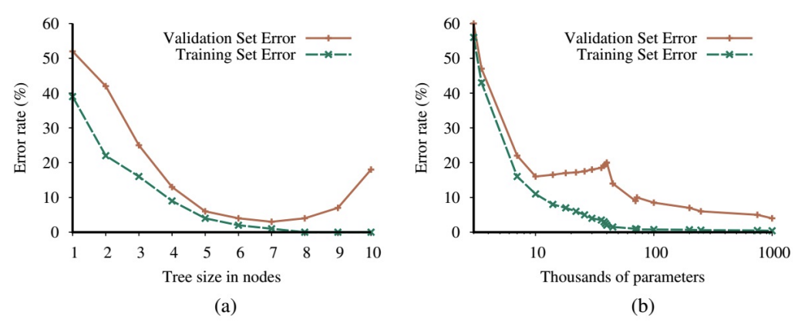

# 11. Machine Learning (2)

## More Details on (Supervised) Machine Learning
- 분야 파악에 필요한 핵심 concepts

## Supervised Learning
- Supervised learning의 공식적인 작업
- $N$개의 입출력 쌍 $(x_1,~ y_1),~ (x_2,~ y_2),~ \dots,~ (x_N,~ y_N)$의 training set이 주어짐
- 각 쌍은 알 수 없는 함수 $y = f(x)$에 의해 생성
- 실제 함수 $f$를 근사하는 함수 $h$의 발견
- 함수 $h$: Hypothesis
- 가능한 함수 집합인 hypothesis space $\mathcal{H}$에서 도출
- 예: Hypothesis space는 3차 다항식(polynomials)의 집합일 수 있음
- $h$는 model class $\mathcal{H}$에서 도출된 model이거나 function class에서 도출된 함수
- 출력 $y_i$: Ground truth (또는 gold-standard)
- Model이 예측하도록 요청받는 실제 정답

## How Do We Choose a Hypothesis Space?
- 데이터 생성 process에 대한 사전 지식 활용
- 사전 지식이 없는 경우: Exploratory Data Analysis (EDA) 수행
- 통계적 test 및 시각화(histograms, scatter plots, box plots 등)를 통해 데이터 파악 및 적절한 hypothesis space에 대한 insight 얻기
- 또는 여러 hypothesis spaces를 시도하고 가장 잘 작동하는 것을 평가

## How Do We Choose a Good Hypothesis from the Hypothesis Space?
- 일관된(consistent) hypothesis 기대: Training set의 모든 $x_i$에 대해 $h(x_i) = y_i$
- Continuous-valued 출력: Ground truth와 정확히 일치하기 어려움. 대신 $h(x_i)$가 $y_i$에 가까운 best-fit 함수 탐색
- Hypothesis의 진정한 척도: Training set이 아닌, 아직 보지 못한 입력(test set)을 처리하는 능력
- Test set: $(x_j,~ y_j)$ 쌍의 두 번째 sample로 평가
- $h$가 test set의 출력을 정확하게 예측하면 '일반화(generalizes well)'가 잘 되었다고 함

## Bias and Variance
- Hypothesis space 분석 방법: Bias (데이터셋과 무관)와 variance (training set 간의 차이)
- Bias: 다른 training sets에 대해 평균을 냈을 때, 예측 hypothesis가 기대값에서 벗어나는 경향
- Bias는 종종 hypothesis space에 의해 부과된 제약으로 인해 발생
- 예: 선형 함수(linear functions)의 hypothesis space는 강한 bias를 유도 (직선으로만 구성)
- Hypothesis가 데이터에서 pattern을 찾지 못할 때: Underfitting
- Variance: Training data의 변동(fluctuation)으로 인한 hypothesis의 변화량
- Low variance: 데이터셋의 작은 차이가 hypothesis의 작은 차이로 이어짐 (처음 3개 열)
- High variance: 12차 다항식(degree-12 polynomials)은 높은 variance를 가짐 (x축 양 끝에서 두 함수가 매우 다름)
- 함수가 훈련된 특정 data set에 너무 집중하여, 보지 못한 데이터(unseen data)에서 성능이 저하될 때: Overfitting

## Bias-Variance Tradeoff
- 종종 bias-variance tradeoff 발생
- 복잡하고 low-bias인 (training data에 잘 맞는) hypothesis와, 단순하고 low-variance인 (일반화가 더 잘 될 수 있는) hypothesis 간의 선택
- Ockham's razor (오컴의 면도날)
- 14세기 영국 철학자 William of Ockham
- "필요 없이 (실체의) 복수성(plurality)을 가정해서는 안 된다"는 원칙. 의심스러운 설명을 "깎아내는(shave off)" 데 사용됨

## How to Find the Best Hypothesis
- Supervised learning: Data가 주어졌을 때 가장 확률이 높은 hypothesis $h^*$ 선택
- $h^* = \text{argmax}_{h \in \mathcal{H}} P(h | \text{data})$
- Bayes' rule에 따라:
  $$h^* = \text{argmax}_{h \in \mathcal{H}} P(\text{data} | h) P(h)$$
- $P(h)$ (사전 확률, prior probability): 부드러운 1차 또는 2차 다항식에서 높고, 크고 뾰족한 12차 다항식에서 낮음
- Data가 정말 필요하다고 할 때만 특이한 함수를 허용하고, 낮은 사전 확률을 부여하여 억제
- Q: $\mathcal{H}$를 모든 컴퓨터 program 또는 모든 Turing machine의 class로 사용하지 않는 이유?
- A: Hypothesis space의 표현력(expressiveness)과 그 공간 내에서 좋은 hypothesis를 찾는 계산 복잡성(computational complexity) 간의 tradeoff 때문

# Model Selection and Optimization

## I.I.D. Assumption
- Machine learning의 목표: 미래의 예시(future examples)에 최적으로 맞는 hypothesis 선택
- "미래의 예시"와 "최적의 적합(optimal fit)"이란 무엇인가?
- 가정 1: 미래의 예시가 과거와 같을 것 (Stationarity assumption)
- 각 예시 $E_j$는 동일한 사전 확률 분포(prior probability distribution)를 가짐:
  $$P(E_j) = P(E_{j+1}) = P(E_{j+2}) = \dots$$
- 각 예시는 이전 예시와 독립적(independent):
  $$P(E_j) = P(E_j | E_{j-1},~ E_{j-2},~ \dots)$$
- 이 두 방정식을 만족하는 예시: Independent and identically distributed (독립 항등 분포) 또는 i.i.d.

## Error Rate and Two Different Datasets
- Optimal fit 정의: Error rate (오차율)를 최소화하는 hypothesis
- Error rate: $(x,~ y)$ 예시에 대해 $h(x) \neq y$인 비율
- (추후: "거의" 정답인 답변에 부분 점수(partial credit) 허용)
- Test set을 통해 hypothesis의 error rate 추정
- Hypothesis가 test 전에 test 정답을 보는 것은 cheating (부정행위)
- 가장 간단한 방지법: 예시를 두 set으로 분리
- Training set: Hypothesis 생성용
- Test set: Hypothesis 평가용

## Hyperparameters and Three Datasets
- 단일 hypothesis 생성 시: Training/test set 분리로 충분
- 여러 hypothesis 생성 시 (예: 두 ML model 비교, model 내 설정 조정): 불충분
- Hyperparameters: 개별 model이 아닌 model class의 parameters
- 연구자가 KNN classifier의 hyperparameter를 바꿔가며 test set error rate를 측정하는 경우:
- 개별 hypothesis는 test set을 보지 않았지만, 연구자를 통해 전체 process가 test set을 "엿봄"
- 해결책: Training, experimenting, hyperparameter-tuning, re-training 등이 모두 끝날 때까지 test set을 완전히 분리(hold out)

## Three Datasets and Cross-Validation
- 3개의 data set 필요
  - Training set: 후보 models 훈련
  - Validation set (development set 또는 dev set): 후보 models 평가 및 최선책 선택
  - Test set: 최종 model의 편향 없는(unbiased) 최종 평가
- K-fold cross-validation
  - 3개 set을 만들기에 data가 충분하지 않을 때 사용
  - Data를 $k$개의 동일한 subset으로 분리
  - $k$ 라운드의 학습 수행: 매 라운드마다 $1/k$은 validation set으로, 나머지는 training set으로 사용
  - 많이 쓰이는 $k$ 값: 5, 10
  - (Cross-validation 사용 시에도) 여전히 별도의 test set 필요
    

## Model Selection and Optimization
- 예시: 선형 함수(linear function)는 data set에 underfit, 고차 다항식(high-degree polynomial)은 overfit
- 좋은 hypothesis를 찾는 작업은 2개의 하위 작업으로 간주 가능
- Model (class) selection (hypothesis space 선택): 좋은 hypothesis space 선택
- Optimization (또는 training): 해당 space 내에서 최상의 hypothesis 탐색

## Model Selection
- Model selection의 일부는 질적(qualitative)이고 주관적(subjective)
- 예: 문제에 대한 지식을 바탕으로 decision trees 대신 polynomials 선택
- Model selection의 일부는 양적(quantitative)이고 경험적(empirical)
- 예: Polynomials class 내에서, validation data set 성능에 기반하여 `Degree = 2` 선택

# An Algorithm for Model Selection

## Two Different Patterns That Occur in Model Selection

- Model complexity가 증가함에 따라 training set error는 단조롭게(monotonically) 감소
- 많은 model class에서 complexity가 증가하면 training set error가 0에 도달
- (a) U자형 validation-error 곡선
- (b) Validation error가 (약간의 변동과 함께) 지속적으로 감소 시작
- 이는 서로 다른 model class가 초과 용량(excess capacity)을 어떻게 활용하는지, 그리고 그것이 당면한 문제와 얼마나 잘 일치하는지에 따라 달라짐