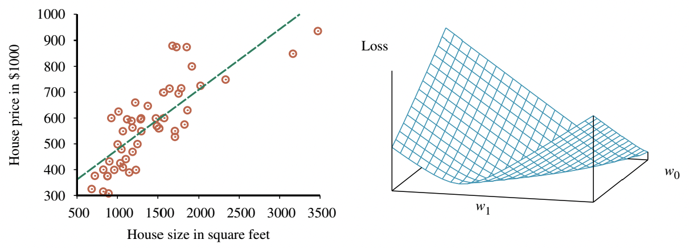
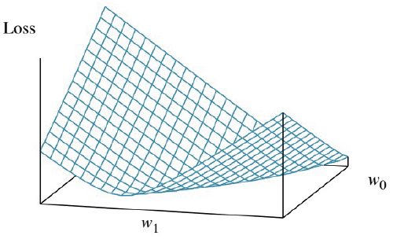
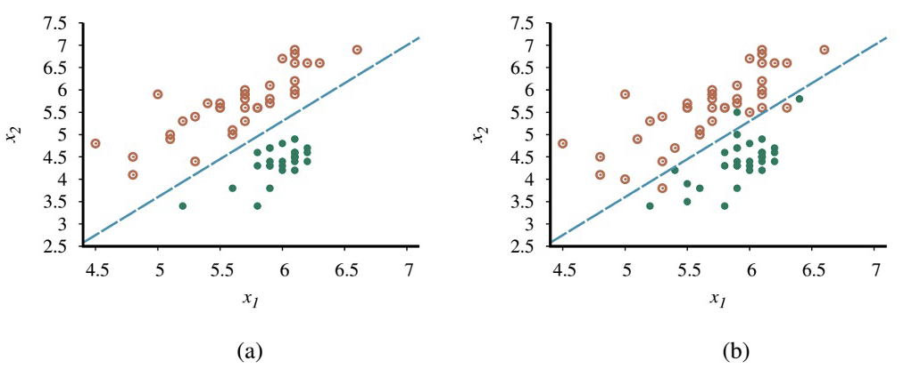
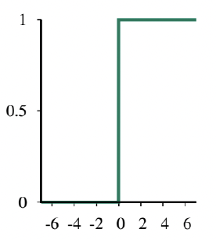
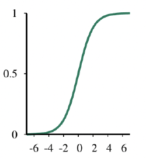

# Linear Models

## Linear Functions
- 연속값 입력(continuous-valued inputs)을 받는 선형 함수(linear functions)라는 다른 가설 공간(hypothesis space) 사용
- Univariate linear function를 사용한 선형 회귀(linear regression), 즉 "직선 피팅(fitting a straight line)"을 다룸
- 다변수 사례(multivariate case) 및 경성/연성 임계값(hard and soft thresholds)을 적용하여 선형 함수를 분류기(classifiers)로 변환하는 방법도 포함

## Univariate Linear Regression
- 입력 $x$와 출력 $y$를 갖는 univariate 선형 함수(직선)의 형태
  - $y = w_1 x + w_0$
- $w_1$과 $w_0$는 학습할 실수 값의 계수(coefficients)
- 이 계수들을 가중치(weights)라고 부름.
  - 항들의 상대적 가중치 변경으로 $y$ 값 변화
- 가중치 벡터(vector) $\mathbf{w}$를 $<w_1,~w_0>$로 정의
- 가설(hypothesis) 함수: $h_{\mathbf{w}}(x) = w_1 x + w_0$
- 선형 회귀(linear regression)의 작업: 데이터(data)에 가장 잘 맞는 $h_{\mathbf{w}}$를 찾는 것
- 목표: 경험적 손실(empirical loss)을 최소화하는 가중치 $w_1,~w_0$ 찾기
- 전통적으로 $L_2$라 불리는 제곱 오차 손실(squared-error loss) 함수를 모든 학습 예제에 대해 합산하여 사용
$$\text{Loss}(h_{\mathbf{w}}) = \sum_{j=1}^{N} L_2(y_j,~h_{\mathbf{w}}(x_j))$$
$$= \sum_{j=1}^{N} (y_j - h_{\mathbf{w}}(x_j))^2$$
$$= \sum_{j=1}^{N} (y_j - (w_1 x_j + w_0))^2$$
- 목표: $\mathbf{w}^* = \arg\min_{\mathbf{w}} \text{Loss}(h_{\mathbf{w}})$ 찾기
- 손실 합 $\sum_{j=1}^{N} (y_j - (w_1 x_j + w_0))^2$은 $w_0$와 $w_1$에 대한 편도함수(partial derivatives)가 $0$일 때 최소화됨.
- $0$으로 설정되는 방정식
$$\frac{\partial}{\partial w_0} \sum_{j=1}^{N} (y_j - (w_1 x_j + w_0))^2 = 0 \quad $$
$$\text{and}$$
$$\quad \frac{\partial}{\partial w_1} \sum_{j=1}^{N} (y_j - (w_1 x_j + w_0))^2 = 0$$
- 이 방정식들은 유일해(unique solution)를 가짐
$$w_1 = \frac{N \sum_j x_j y_j - (\sum_j x_j)(\sum_j y_j)}{N \sum_j x_j^2 - (\sum_j x_j)^2}$$
$$w_0 = \frac{\sum_j y_j - w_1 (\sum_j x_j)}{N}$$

## Univariate Linear Regression
### Proof ($w_0$ 유도)
$$\frac{\partial}{\partial w_0} \sum_{j=1}^{N} (y_j - (w_1 x_j + w_0))^2 = \frac{\partial}{\partial w_0} \sum_{j=1}^{N} (w_0^2 - 2(y_j - w_1 x_j)w_0 + \dots)$$
$$= \sum_{j=1}^{N} (2w_0 - 2(y_j - w_1 x_j)) = 0$$
$$\therefore N w_0 = \sum_{j=1}^{N} y_j - w_1 \sum_{j=1}^{N} x_j$$
$$\therefore w_0 = \frac{\sum_j y_j - w_1 (\sum_j x_j)}{N}$$

### Proof ($w_1$ 유도)
$$\frac{\partial}{\partial w_1} \sum_{j=1}^{N} (y_j - (w_1 x_j + w_0))^2$$
$$= \frac{\partial}{\partial w_1} \sum_{j=1}^{N} (x_j^2 w_1^2 + 2x_j(w_0 - y_j)w_1 + \dots)$$
$$= \sum_{j=1}^{N} (2x_j^2 w_1 + 2x_j(w_0 - y_j)) = 0$$
$$\therefore \sum_{j=1}^{N} x_j^2 w_1 + \sum_{j=1}^{N} (x_j w_0 - x_j y_j) = 0$$
- $w_0$ 대입
$$\therefore \sum_{j=1}^{N} x_j^2 w_1 + \sum_{j=1}^{N} x_j \left( \frac{\sum_k y_k - w_1 \sum_k x_k}{N} \right) - \sum_{j=1}^{N} x_j y_j = 0$$
- (슬라이드 표기 $\sum_k$는 $\sum_j$와 동일)
- 양변에 $N$을 곱하고 $w_1$에 대해 정리
$$\therefore N \sum_{j=1}^{N} x_j^2 w_1 + \left(\sum_{j=1}^{N} x_j\right) \left(\sum_j y_j - w_1 \sum_j x_j\right) - N \sum_{j=1}^{N} x_j y_j = 0$$
$$\therefore \left( N \sum_{j=1}^{N} x_j^2 - \left(\sum_{j=1}^{N} x_j\right) \left(\sum_j x_j\right) \right) w_1$$
$$= N \sum_{j=1}^{N} x_j y_j - \left(\sum_{j=1}^{N} x_j\right) \left(\sum_j y_j\right)$$
$$\therefore w_1 = \frac{N \sum_j x_j y_j - (\sum_j x_j)(\sum_j y_j)}{N \sum_j x_j^2 - (\sum_j x_j)^2}$$

## Weight Space
- 많은 학습 형태가 손실(loss)을 최소화하기 위해 가중치(weights)를 조정하는 것을 포함하며, 가중치 공간(weight space)에서 일어나는 일에 대한 시각적 이해가 도움됨.
- 가중치 공간: 가능한 모든 가중치 설정으로 정의되는 공간
- 예: Univariate 선형 회귀의 경우, $w_0$와 $w_1$로 정의되는 가중치 공간은 2차원
- 손실 함수(loss function)를 $w_0$와 $w_1$의 함수로 3D plot에 시각화 가능
- 손실 함수는 볼록(convex) 함수이며, 이는 $L_2$ 손실 함수를 사용하는 모든 선형 회귀 문제에서 사실임
- 볼록 함수는 지역 최적해(local optima)가 아닌 전역 최적해(global optimum)를 보장
  

## Gradient Descent 경사하강법
- Univariate linear model은 편도함수가 $0$이 되는 최적의 해를 찾기 쉽다는 좋은 특성을 가짐
- 하지만 항상 분석적인 해를 구하기 쉬운 것은 아니므로, 도함수의 $0$ 지점을 찾는 해법에 의존하지 않고 복잡성에 상관없이 모든 손실 함수에 적용 가능한 손실 최소화 방법을 도입
- 연속적인 가중치 공간(continuous weight space)을 매개변수의 점진적 수정을 통해 탐색: **경사 하강법(Gradient Descent)**  

1. 가중치 공간에서 임의의 시작점(starting point) 선택
  - 예: 선형 회귀의 $(w_0,~w_1)$ 평면
2. 경사(gradient)의 추정치 계산
3. 가장 가파른 내리막 방향(steepest downhill direction)으로 약간 이동
4. (local) 최소 손실을 갖는 가중치 공간의 한 지점으로 convergence할 때까지 반복

- 알고리즘
  >  $\mathbf{w} \leftarrow$ (매개변수 공간의 임의의 지점)  
  >  while (수렴되지 않는 동안) do  
  >>  for ($\mathbf{w}$의 각 $w_j$에 대해) do  
  >>>  $w_j \leftarrow w_j - \alpha \frac{\partial}{\partial w_j} \text{Loss}(\mathbf{w})$
- 매개변수 $\alpha$는 learning rate(학습률) 또는 step size(스텝 크기)라고 불림
- $\alpha$는 고정 상수(fixed constant)일 수도 있고, 학습 과정이 진행됨에 따라 시간 경과에 따라 감소(decay)할 수도 있음.

## Gradient Descent for Univariate Linear Regression
- 단변량 회귀의 경우, 손실은 이차(quadratic)식이므로 편도함수는 선형(linear)이 됨.
- 하나의 훈련 예제 $(x,~y)$만 있는 단순화된 경우
  $$\frac{\partial}{\partial w_i} Loss(\mathbf{w}) = \frac{\partial}{\partial w_i} (y - h_{\mathbf{w}}(x))^2$$
  $$= 2(y - h_{\mathbf{w}}(x)) \cdot \frac{\partial}{\partial w_i} (y - h_{\mathbf{w}}(x))$$
  $$= 2(y - h_{\mathbf{w}}(x)) \cdot \frac{\partial}{\partial w_i} (y - (w_1x + w_0))$$
- $w_0$와 $w_1$ 모두에 적용
  $$\frac{\partial}{\partial w_0} Loss(\mathbf{w}) = -2(y - h_{\mathbf{w}}(x))$$
  $$\frac{\partial}{\partial w_1} Loss(\mathbf{w}) = -2(y - h_{\mathbf{w}}(x)) \cdot x$$
- 이 결과를 원래의 경사 하강법 방정식에 대입하고, 2를 명시되지 않은 학습률 $\alpha$에 포함시키면, 다음 학습 규칙(learning rule)을 얻음
  $$w_0 \leftarrow w_0 + \alpha (y - h_{\mathbf{w}}(x))$$
  $$w_1 \leftarrow w_1 + \alpha (y - h_{\mathbf{w}}(x)) \cdot x$$
- 이 업데이트는 직관적으로 이해 가능: 만약 $h_{\mathbf{w}}(x) > y$ (즉, 출력이 너무 큼)이면, $w_0$를 약간 줄이고, $x$가 양의 입력이면 $w_1$을 줄이고 $x$가 음의 입력이면 $w_1$을 늘림

## Batch and Stochastic Gradient Descent
- $N$개의 훈련 예제에 대해, 각 예제의 개별 손실 합계를 최소화하고자 함.
- 합의 도함수는 도함수의 합이므로
  $$w_0 \leftarrow w_0 + \alpha \sum_{j=1}^N (y_j - h_{\mathbf{w}}(x_j))$$
  $$w_1 \leftarrow w_1 + \alpha \sum_{j=1}^N (y_j - h_{\mathbf{w}}(x_j)) \cdot x_j$$
- 이 업데이트는 단변량 선형 회귀를 위한 배치 경사 하강법(batch gradient descent) 학습 규칙 (결정론적 경사 하강법(deterministic gradient descent)이라고도 함)
- 모든 훈련 예제를 다루는 한 단계를 에포크(epoch)라고 함.
- 더 빠른 변형: 확률적 경사 하강법(stochastic gradient descent) 또는 SGD
- 각 단계에서 무작위로 적은 수의 훈련 예제를 선택하고, 경사 하강법 방정식에 따라 업데이트
- 원래 SGD 버전은 각 단계마다 단 하나의 훈련 예제만 선택했지만, 현재는 $N$개 예제 중 $m$개의 미니배치(minibatch)를 선택하는 것이 더 일반적

## Stochastic Gradient Descent
- 일부 CPU 또는 GPU 아키텍처에서는, $m$을 선택하여 병렬 벡터 연산(parallel vector operations)을 활용, $m$개 예제로 스텝을 밟는 것이 단일 예제 스텝만큼 빠름.
- 이러한 제약 내에서, $m$을 각 학습 문제에 맞게 조정(tuned)해야 하는 하이퍼파라미터(hyperparameter)로 취급
- 미니배치 SGD의 수렴이 엄격하게 보장되지는 않음. 최소값 주변에서 안정되지 않고 진동(oscillate)할 수 있음.
- 이를 완화하기 위해 학습률 $\alpha$를 감소시키는 스케줄(schedule)을 만들 수 있음.
- SGD는 선형 회귀 이외의 모델, 특히 신경망(neural networks)에 널리 적용됨.
- 손실 표면(loss surface)이 볼록하지 않은 경우에도, 이 접근 방식은 전역 최소값에 가까운 좋은 지역 최소값을 찾는 데 효과적임이 입증됨.

# Multivariable Linear Regression

## Multivariable (Multivariate) Linear Regression
- 각 예제 $\mathbf{x}_j$가 $n$-요소 벡터인 multivariable linear regression(다변량 선형 회귀) 문제로 쉽게 확장 가능
- 가설 공간(hypothesis space)은 다음 형태의 함수 집합
$$h_{\mathbf{w}}(\mathbf{x}_j)$$
$$= w_0 + w_1x_{j,1} + w_2x_{j,2} + \dots + w_n x_{j,n}$$
$$= w_0 + \sum_{i=1}^n w_i x_{j,i}$$
- 더 간단한 표기를 위해, 항상 1과 같은 값을 갖는 가상의(dummy) 입력 속성 $x_{j,0}$를 만듦.
- 그러면, $h$는 가중치와 입력 벡터의 dot product
$$h_{\mathbf{w}}(\mathbf{x}_j) = \mathbf{w} \cdot \mathbf{x}_j = \mathbf{w}^T\mathbf{x} = \sum_{i=0}^n w_i x_{j,i}$$
- 최적의 가중치 벡터 $\mathbf{w}^*$는 예제에 대한 제곱 오차 손실을 최소화
$\mathbf{w}^* = \text{argmin}_{\mathbf{w}} \sum_{j} L_2(y_j,~\mathbf{w} \cdot \mathbf{x}_j)$

## How to Compute $\textbf{w}^*$ in Multivariable Linear Regression
- 단변량 선형 회귀의 경우처럼, 경사 하강법은 손실 함수의 (유일한) 최소값에 도달
- 각 가중치 $w_i$에 대한 업데이트 방정식
$$w_i \leftarrow w_i + \alpha \sum_{j} (y_j - h_{\mathbf{w}}(\mathbf{x}_j)) \cdot x_{j,i}$$
- 선형 대수(linear algebra)와 벡터 미적분(vector calculus)의 도구를 사용하면, 손실을 최소화하는 $\mathbf{w}$를 해석적(analytically)으로 풀 수도 있음.
- $\mathbf{y}$를 훈련 예제의 출력 벡터, $\mathbf{X}$를 데이터 행렬(data matrix) (즉, 행당 하나의 $n$-차원 예제를 갖는 입력 행렬)이라 함.
- 예측된 출력 벡터는 $\hat{\mathbf{y}} = \mathbf{X}\mathbf{w}$
- 모든 훈련 데이터에 대한 제곱 오차 손실
$$L(\mathbf{w}) = ||\hat{\mathbf{y}} - \mathbf{y}||_2^2 = ||\mathbf{X}\mathbf{w} - \mathbf{y}||_2^2$$
- 기울기를 $0$으로 설정
$$\nabla_{\mathbf{W}} L(\mathbf{w}) = \nabla_{\mathbf{W}} ||\mathbf{X}\mathbf{w} - \mathbf{y}||_2^2$$
$$= \nabla_{\mathbf{W}} (\mathbf{X}\mathbf{w} - \mathbf{y})^T (\mathbf{X}\mathbf{w} - \mathbf{y})$$
$$= \nabla_{\mathbf{W}} [\mathbf{w}^T\mathbf{X}^T\mathbf{X}\mathbf{w} - 2\mathbf{y}^T\mathbf{X}\mathbf{w} + \mathbf{y}^T\mathbf{y}]$$
$$= 2\mathbf{X}^T\mathbf{X}\mathbf{w} - 2\mathbf{X}^T\mathbf{y}$$
$$= 2\mathbf{X}^T (\mathbf{X}\mathbf{w} - \mathbf{y}) = 0$$
- 재정리하면, 최소 손실 가중치 벡터는 다음과 같음. (정규 방정식(Normal Equation))
$\mathbf{w}^* = (\mathbf{X}^T\mathbf{X})^{-1}\mathbf{X}^T\mathbf{y}$

## Regularization for Multivariable Linear Regression
- 고차원 공간의 multivariable linear regression에서는 실제로는 관련 없는 차원이 우연히 유용한 것처럼 보여 과적합(overfitting)을 초래할 수 있음.
- 따라서, 과적합을 피하기 위해 다변량 선형 함수에 정규화(regularization)를 사용하는 것이 일반적
- 정규화를 사용하면 가설(hypothesis)의 총 비용(cost)을 최소화, 경험적 손실과 가설의 복잡도(complexity)를 모두 계산
  $$Cost(h) = EmpLoss(h) + \lambda~Complexity(h)$$
- 복잡도는 가중치의 함수로 지정 가능
  $$Complexity(h_{\mathbf{w}}) = L_q(\mathbf{w}) = \sum_{i} |w_i|^q$$
- $q=1$이면, $L_1$ 정규화, **절댓값의 합을 최소화**
- $q=2$이면, $L_2$ 정규화, **제곱의 합을 최소화**

## Property of $L_1$ Regularization
- $L_1$ 정규화는 중요한 이점이 있음.
  - Sparse model을 생성하는 경향
- 즉, 종종 많은 가중치를 $0$으로 설정하여, 해당하는 속성(attributes)이 **완전히 관련 없다**고 선언
- $Loss(\mathbf{w}) + \lambda Complexity(\mathbf{w})$를 최소화하는 것은 $Complexity(\mathbf{w}) \leq c$ 제약 하에 $Loss(\mathbf{w})$를 최소화하는 것과 동일

# Linear Classification & Logistic Regression

## Linear Classification
- 선형 함수는 regression뿐만 아니라 classification(분류)를 수행하는 데에도 사용 가능
  - 예: 지진/핵폭발 분류
- 결정 경계(decision boundary)는 두 클래스(classes)를 분리하는 선 (or 고차원에서는 표면)
- 선형 결정 경계는 linear separator라고 하며, 이러한 seperator를 허용하는 데이터를 linearly separable하다고 함.
$$-4.9 + 1.7x_1 - x_2 = 0$$

$$\mathbf{w} = [-4.9,~1.7,~-1]$$

$$h_{\mathbf{w}}(\mathbf{x}) = 1 \text{ if } \mathbf{w} \cdot \mathbf{x} \geq 0 \text{ and } 0 \text{ otherwise.}$$

## Linear Classifers with a Threshold Function
- $h$는 선형 함수 $\mathbf{w} \cdot \mathbf{x}$를 임계 함수(threshold function)에 통과시킨 결과로 생각할 수 있음.
$$h_{\mathbf{w}}(\mathbf{x}) = Threshold(\mathbf{w} \cdot \mathbf{x}) \text{~where~} Threshold(z)$$
$$= 1 \text{ if } z \geq 0 \text{ and } 0 \text{ otherwise.}$$
- 문제: (1) 경사 하강법과 (2) 최적 가중치($\mathbf{w}^*$)를 도출하기 위한 닫힌 형태(closed form)의 계산, 둘 다 활용 불가
- $\mathbf{w} \cdot \mathbf{x} = 0$인 지점을 제외한 가중치 공간 거의 모든 곳에서 기울기가 $0$이고, $\mathbf{w} \cdot \mathbf{x} = 0$인 지점에서는 **기울기가 정의되지 않기** 때문
  

## Problems of Linear Classification with a Hard Threshold
- 선형 함수의 출력을 임계 함수에 통과시키는 것이 선형 분류기(linear classifier)를 생성함을 확인
- 하지만 임계값의 **경성**(hard nature)은 몇 가지 문제를 야기
- 가설 $h_{\mathbf{w}}(\mathbf{x})$는 미분 불가능하며 입력과 가중치에 대해 불연속 함수임. 이는 perceptron rule을 사용한 학습을 매우 예측 불가능하게 만듦.
- 또한, 선형 분류기는 경계에 매우 가까운 예제에 대해서도 항상 $1$ 또는 $0$의 완전한 확신에 찬 예측을 알림. 일부 예제는 명확한 $0$ 또는 $1$로, 다른 예제는 불분명한 경계선 케이스로 분류할 수 있다면 더 좋을 것
- 이 모든 문제는 임계 함수를 부드럽게(softening) 함으로써 (경성 임계값을 연속적이고 미분 가능한 함수로 근사) 크게 해결 가능

## Logistic Function
- 로지스틱 함수(logistic function) (시그모이드 함수(sigmoid function)라고도 함)
   $$Logistic(z) = \frac{1}{1 + e^{-z}}$$
   
- 임계 함수를 로지스틱 함수로 대체
$$h_{\mathbf{w}}(\mathbf{x}) = Logistic(\mathbf{w} \cdot \mathbf{x})$$
$$= \frac{1}{1 + e^{-\mathbf{w} \cdot \mathbf{x}}}$$
- Data set에 대한 손실을 최소화하기 위해 이 모델의 가중치를 맞추는(fitting) 과정: 로지스틱 회귀(logistic regression)

## How to Compute $\mathbf{w}^*$ in Logistic Regression
- 가설이 더 이상 $0$ 또는 $1$만 출력하지 않으므로 $L_2$ 손실 함수 사용
- $g$를 로지스틱 함수, $g'$을 그 도함수로 사용
- 단일 예제 $(\mathbf{x},~y)$에 대해, 기울기 유도는 $h$의 실제 형태가 삽입되는 지점까지 선형 회귀와 동일
  $$\frac{\partial}{\partial w_i} Loss(\mathbf{w}) = \frac{\partial}{\partial w_i} (y - h_{\mathbf{w}}(\mathbf{x}))^2$$
  $$= 2(y - h_{\mathbf{w}}(\mathbf{x})) \cdot \frac{\partial}{\partial w_i} (y - h_{\mathbf{w}}(\mathbf{x}))$$
  $$= -2(y - h_{\mathbf{w}}(\mathbf{x})) \cdot g'(\mathbf{w} \cdot \mathbf{x}) \cdot \frac{\partial}{\partial w_i} (\mathbf{w} \cdot \mathbf{x})$$
  $$= -2(y - h_{\mathbf{w}}(\mathbf{x})) \cdot g'(\mathbf{w} \cdot \mathbf{x}) \cdot x_i$$
- 로지스틱 함수의 도함수 $g'$은 $g'(z) = g(z)(1 - g(z))$를 만족
  $$\frac{\partial}{\partial z} \frac{1}{1 + e^{-z}} = \frac{\partial}{\partial z} (1 + e^{-z})^{-1}$$
  $$= -1 \cdot (1 + e^{-z})^{-2} \cdot (-e^{-z})$$
  $$= \frac{e^{-z}}{(1 + e^{-z})^2}$$
  $$= \frac{1}{1 + e^{-z}} \cdot \frac{e^{-z}}{1 + e^{-z}} = g(z)(1 - g(z))$$

따라서,

  $$g'(\mathbf{w} \cdot \mathbf{x}) = g(\mathbf{w} \cdot \mathbf{x})(1 - g(\mathbf{w} \cdot \mathbf{x}))$$
  $$= h_{\mathbf{w}}(\mathbf{x})(1 - h_{\mathbf{w}}(\mathbf{x}))$$
- 손실을 최소화하기 위한 가중치 업데이트는 입력과 예측 간의 차이 $(y - h_{\mathbf{w}}(\mathbf{x}))$ 방향으로 스텝을 밟으며, 스텝의 길이는 상수 $\alpha$와 $g'$에 따라 달라짐
  $$w_i \leftarrow w_i + \alpha (y - h_{\mathbf{w}}(\mathbf{x})) \cdot h_{\mathbf{w}}(\mathbf{x})(1 - h_{\mathbf{w}}(\mathbf{x})) \cdot x_i$$