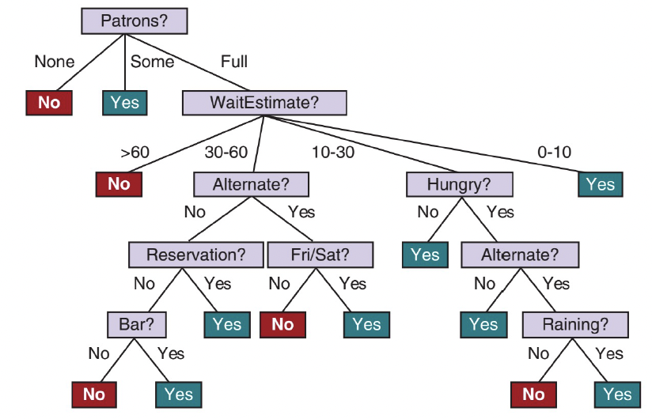
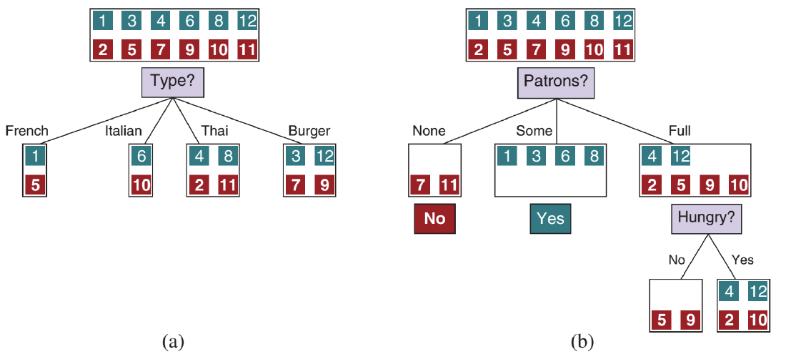
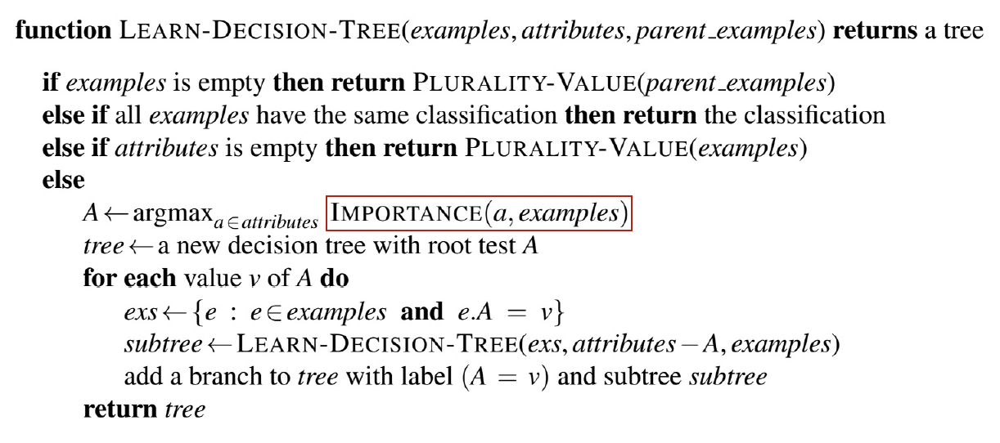

# Other Classic ML Models (1)

# Naïve Bayes

## Naïve Bayes Models
- 머신러닝에서 아마도 가장 일반적이고 단순한 Bayesian network 모델
- Naïve Bayes(나이브 베이즈) 모델은 클래스 변수(class variable)가 주어졌을 때, 특정 특성의 값이 다른 특성의 값과 (조건부적으로) independent하다고 가정함.
- 실제로는 조건부 독립 가정이 엄격하게 사실이 아니더라도 잘 작동하는 경우가 많음.

## Text Classification with Naïve Bayes
- 텍스트 분류 작업에 Naïve Bayes 모델을 사용하는 방법
- 작업: 주어진 텍스트가 어떤 클래스(class)나 카테고리(\text{category})에 속하는지 결정
- "원인" = $\text{Category}$ 변수, "결과" 변수 = 특정 키워드의 존재 여부 ($\text{HasWord}_i$)
- 예제 문장 (신문 기사)
  - “Stocks rallied on Monday, with major indexes gaining 1% as optimism persisted over the first quarter earnings season.” (business)
  - “Heavy rain continued to pound much of the east coast on Monday, with flood warnings issued in New York City and other locations.” (weather)
- 작업: 각 문장을 주요 섹션 (news, sports, business, weather, or entertainment)으로 분류
- Naïve Bayes 모델은 사전 확률(prior probabilities) $P(\text{Category})$와 조건부 확률(conditional probabilities) $P(\text{HasWord}_i~|~\text{Category})$로 구성됨.
- 사후 확률(Posterior probability)은 사전 확률과 likelihood(가능도) (조건부 확률)의 곱에 비례
$$
\begin{aligned}
& P(\text{Category} | \text{HasWord}_{w1},~ \text{HasWord}_{w2},~ \dots,~ \text{HasWord}_{wn}) \\
& = \frac{P(\text{HasWord}_{w1},~ \text{HasWord}_{w2},~ \dots,~ \text{HasWord}_{wn} | \text{Category}) P(\text{Category})}{P(\text{HasWord}_{w1},~ \text{HasWord}_{w2},~ \dots,~ \text{HasWord}_{wn})} \\
& \propto P(\text{HasWord}_{w1},~ \text{HasWord}_{w2},~ \dots,~ \text{HasWord}_{wn} | \text{Category}) P(\text{Category}) \\
& = P(\text{HasWord}_{w1} | \text{Category}) \cdots P(\text{HasWord}_{wn} | \text{Category}) P(\text{Category}) \\
& = \prod_{i} P(\text{HasWord}_{wi} | \text{Category}) P(\text{Category})
\end{aligned}
$$
  - Naïve Bayes 가정: 각 단어의 존재는 카테고리가 주어졌을 때 조건부 독립
### 각 카테고리 $c$에 대해
- $P(\text{Category} = c)$는 이전에 본 모든 문서 중 카테고리 $c$의 비율로 추정
- 예: 9%가 날씨 기사면 $P(\text{Category} = \text{weather}) = 0.09$
- $P(\text{HasWord}_i~|~\text{Category})$는 각 카테고리의 문서 중 단어 $i$를 포함하는   비율로 추정
- 예: 비즈니스 기사의 37%가 "stocks"를 포함하면 $P(\text{HasWord}_{\text{"stocks"}} = \text{true}~|~\text{Category} = \text{business}) = 0.37$
### 새 문서 분류
- 키워드 확인 후, 공식을 적용하여 카테고리에 대한 사후 확률 분포(posterior probability distribution)를 얻음.
- 하나의 카테고리만 예측해야 하는 경우, 가장 높은 사후 확률을 가진 것을 선택
### Naïve Bayes 모델은 단어가 문서 범주에 따라 결정되는 빈도로 문서에서 독립적으로 발생한다고 가정
- 이 독립 가정은 실제로는 위배
- 예: "first quarter" 구문은 "first" $\times$ "quater"가 제안하는 것보다 비즈니스 (or 스포츠) 기사에서 더 자주 발생
### 이러한 오류에도 불구하고, 가능한 카테고리의 순위(ranking)는 종종 매우 정확
- Naïve Bayes 모델은 언어 결정, 문서 검색, 스팸 필터링(spam filtering) 및 기타 분류 작업에 널리 사용
- 실제 사후 확률 값이 중요한 작업(예: 의료 진단)의 경우, 신경망(neural networks)과 같은 더 정교한 모델을 선호

# Decision Trees 결정 나무?
- Attribute values의 벡터를 단일 출력 값("decision")에 매핑하는 함수의 표현
- 결정 트리(Decision tree)는 root에서 시작하여 leaf에 도달할 때까지 일련의 테스트를 수행하여 결정에 도달
- 내부 노드(Internal node): 입력 속성 중 하나에 대한 테스트
- 가지(Branches): 속성의 가능한 값
- 리프 노드(Leaf nodes): 함수가 반환할 값 지정
- 입력 및 출력 값은 이산형(discrete) 또는 연속형(continuous)일 수 있음.
- 현재: 이산형 입력, Boolean (true/false) 출력 $\rightarrow$ Boolean (=binary) classification(불리언 (=이진) 분류)
- 표기법(Notation): $j$는 예제 인덱스 ($\mathbf{x}^j$는 $j$번째 예제의 입력 벡터,~$y^j$는 출력),~$x_{j,i}$는 $j$번째 예제의 $i$번째 속성

## Example Problem: Restaurant Waiting
- 문제: 식당에서 테이블을 기다릴지 결정하는 문제
- 출력 $y$: Boolean 변수 $WillWait$ (기다릴 경우 true)
- 입력 $\mathbf{x}$: 10개 속성 값의 벡터 (모두 이산형 값)
  1. $Alternate$: 근처에 적절한 대안 식당이 있는지
  2. $Bar$: 기다릴 수 있는 편안한 바(bar) 공간이 있는지
  3. $Fri/Sat$: 금요일 또는 토요일인지 (true)
  4. $Hungry$: 지금 배가 고픈지
  5. $Patrons$: 식당 안 사람 수 ($None$, $Some$, $Full$)
  6. $Price$: 식당 가격대 ($$$, $$$$, $$$$$)
  7. $Raining$: 밖에 비가 오는지
  8. $Reservation$: 예약을 했는지
  9. $Type$: 식당 종류 (French, Italian, Thai, or burger)
  10. $WaitEstimate$: 호스트의 예상 대기 시간 (0–10, 10–30, 30–60, or >60 분)
- 12개 예제 세트가 그림에 표시
  - 데이터가 매우 적음: $2^6 \times 3^2 \times 4^2 = 9216$ 가지 가능한 입력 조합 중 12개만 주어짐
  - 12개의 증거(evidence)만으로 누락된 9,204개의 출력 값을 추측해야 함.

| Example | Alt | Bar | Fri | Hun | Pat | Price | Rain | Res | Type | Est | WillWait |
| :--- | :--- | :--- | :--- | :--- | :--- | :--- | :--- | :--- | :--- | :--- | :--- |
| $x_1$ | Yes | No | No | Yes | Some | $$$ | No | Yes | French | 0–10 | $y_1 = \text{Yes}$ |
| $x_2$ | Yes | No | No | Yes | Full | $ | No | No | Thai | 30–60 | $y_2 = \text{No}$ |
| $x_3$ | No | Yes | No | No | Some | $ | No | No | Burger | 0–10 | $y_3 = \text{Yes}$ |
| $x_4$ | Yes | No | Yes | Yes | Full | $$$ | Yes | No | Thai | 10–30 | $y_4 = \text{Yes}$ |
| $x_5$ | Yes | No | Yes | No | Full | $$$ | No | Yes | French | >60 | $y_5 = \text{No}$ |
| $x_6$ | No | Yes | No | Yes | Some | $$ | Yes | Yes | Italian | 0–10 | $y_6 = \text{Yes}$ |
| $x_7$ | No | Yes | No | No | None | $ | Yes | No | Burger | 0–10 | $y_7 = \text{No}$ |
| $x_8$ | No | No | No | Yes | Some | $$ | Yes | Yes | Thai | 0–10 | $y_8 = \text{Yes}$ |
| $x_9$ | No | Yes | Yes | No | Full | $ | Yes | No | Burger | >60 | $y_9 = \text{No}$ |
| $x_{10}$ | Yes | Yes | Yes | Yes | Full | $$$ | No | Yes | Italian | 10–30 | $y_{10} = \text{No}$ |
| $x_{11}$ | No | No | No | No | None | $ | No | No | Thai | 0–10 | $y_{11} = \text{No}$ |
| $x_{12}$ | Yes | Yes | Yes | Yes | Full | $ | No | No | Burger | 30–60 | $y_{12} = \text{Yes}$ |

## A Decision Tree for Restaurant Waiting

## Learning Decision Trees from Examples
## 목표: 학습 데이터(training data)와 일치(consistent)하면서 가능한 가장 작은 Decision tree를 찾는 것
- 보장된 가장 작은 트리를 찾는 것은 난해(intractable)함.
- 간단한 휴리스틱을 사용하여 가장 작은 트리에 가까운 것을 효율적으로 찾을 수 있음.
- `LEARN-DECISION-TREE` 알고리즘은 탐욕적 분할 정복(greedy divide-and-conquer) 전략을 채택
- 항상 가장 중요한(most important) 속성을 먼저 테스트한 다음, 테스트 결과로 정의되는 더 작은 하위 문제(subproblems)를 재귀적으로 해결
- "가장 중요한 속성": 예제의 분류에 가장 큰 차이를 만드는 속성
### 목표: 적은 수의 테스트로 올바른 분류에 도달 (트리의 모든 경로가 짧고 트리가 얕음)
- 그림 (a)는 $Type$이 좋지 않은 속성임을 보여줌 (4개의 결과 모두 양성/음성 예제가 동일)
- 그림 (b)는 $Patrons$가 상당히 중요한 속성임을 보여줌 ($None$ 또는 $Some$인 경우, 명확한 답($No$ 또는 $Yes$)을 얻음)

- 값이 $Full$이면, 혼합된 예제 세트가 남음. 이러한 재귀적 하위 문제(recursive subproblems)에 대한 4가지 경우
  1. 남은 예제가 모두 양성 (또는 모두 음성)인 경우: 완료 ($Yes$ 또는 $No$로 답함). (b)의 $None$ 및 $Some$ 가지 예시
  2. 일부 양성 및 일부 음성 예제가 있는 경우: 이들을 분할할 최상의 속성을 선택함. (b)에서 남은 예제를 분할하기 위해 $Hungry$가 사용
  3. 남은 예제가 없는 경우: 이 속성 값 조합에 대해 관찰된 예제가 없음을 의미. 부모 노드(parent) 구성에 사용된 예제 세트에서 가장 일반적인 출력 값을 반환
  4. 속성은 남지 않았지만 양성 및 음성 예제가 모두 있는 경우: 데이터의 오류나 노이즈(noise), 비결정론적(nondeterministic) 도메인, 또는 구별할 수 있는 속성을 관찰할 수 없기 때문일 수 있음. 남은 예제 중 가장 일반적인 출력 값을 반환

## `LEARN-DECISION-TREE` Algorithm

- 샘플 training set에 대한 학습 알고리즘의 출력
- 트리는 내부 노드의 테스트, 가지의 속성 값, 리프 노드의 출력 값으로 구성
- 학습 알고리즘은 $Raining$과 $Reservation$에 대한 테스트를 포함하지 않음 (모든 예제를 분류하는 데 필요하지 않기 때문)

## Choosing Attribute Tests
- Decision tree learning algorithm은 가장 높은 IMPORTANCE를 가진 속성을 선택
- Entropy 개념을 사용하여 정의되는 information gain을 사용하여 IMPORTANCE를 측정
### Entropy 복습
- Random variable의 불확실성 척도
- 값 $x$가 확률 $P(x)$를 갖는 확률변수 $X$의 엔트로피
  - $H(X) = -\sum_{x} P(x) \log_2 P(x)$
- 공정한 동전 던지기 엔트로피 = 1 bit
- 확률 $q$로 true인 boolean 확률변수의 엔트로피 $B(q)$: $B(q) = -(q \log_2 q + (1-q) \log_2(1-q))$
- $p$개의 positive example과 $n$개의 negative example을 포함하는 training set에서, 전체 세트에 대한 출력 변수의 엔트로피는 $H(Output) = B(\frac{p}{p+n})$
- 식당 training set: $p = n = 6$이므로, 해당 엔트로피는 $B(0.5)$ 즉 1 bit
- 속성 $A$에 대한 테스트 결과는 정보를 제공하여 전체 엔트로피를 감소시킴
- $d$개의 고유한 값을 가진 속성 $A$는 training set $E$를 $E_1,~\dots,~E_d$ 부분집합(subsets)으로 나눔
- 각 부분집합 $E_k$는 $p_k$개의 positive example과 $n_k$개의 negative example을 가지며, 해당 가지를 따르면 $B(\frac{p_k}{p_k+n_k})$ 비트의 추가 정보가 필요
- 속성 $A$를 테스트한 후 남은 expected entropy
- $Remainder(A) = \sum_{k=1}^{d} \frac{p_k + n_k}{p + n} B(\frac{p_k}{p_k+n_k})$
### 속성 $A$ 테스트로 인한 information gain
- $Gain(A) = B(\frac{p}{p+n}) - Remainder(A)$
- $Gain(A)$가 IMPORTANCE 함수를 구현함
- $Gain(Patrons) = 1 - [\frac{2}{12} B(\frac{0}{2}) + \frac{4}{12} B(\frac{4}{4}) + \frac{6}{12} B(\frac{2}{6})] \approx 0.541$ bits
- $Gain(Type) = 1 - [\frac{2}{12} B(\frac{1}{2}) + \frac{2}{12} B(\frac{1}{2}) + \frac{4}{12} B(\frac{2}{4}) + \frac{4}{12} B(\frac{2}{4})] = 0$ bits
- $Patrons$가 분할하기 더 좋은 속성이라는 직관을 확인시켜 줌
- $Patrons$는 모든 속성 중 최대 information gain을 가지므로 decision tree learning 알고리즘에 의해 root로 선택됨.