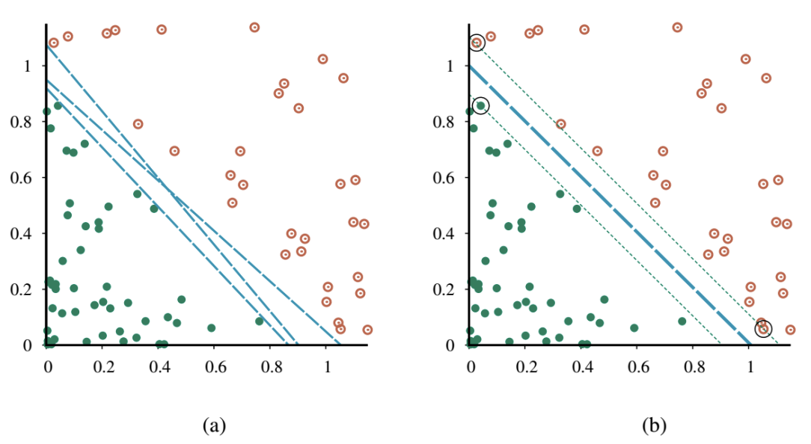
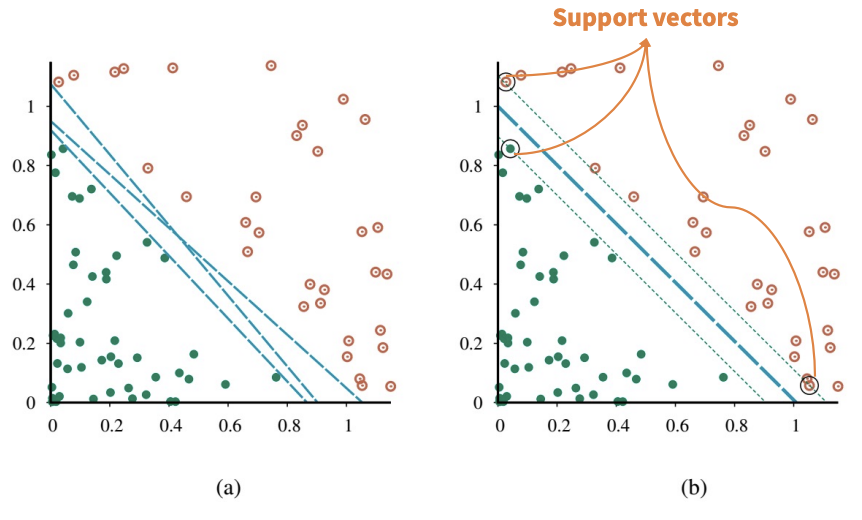
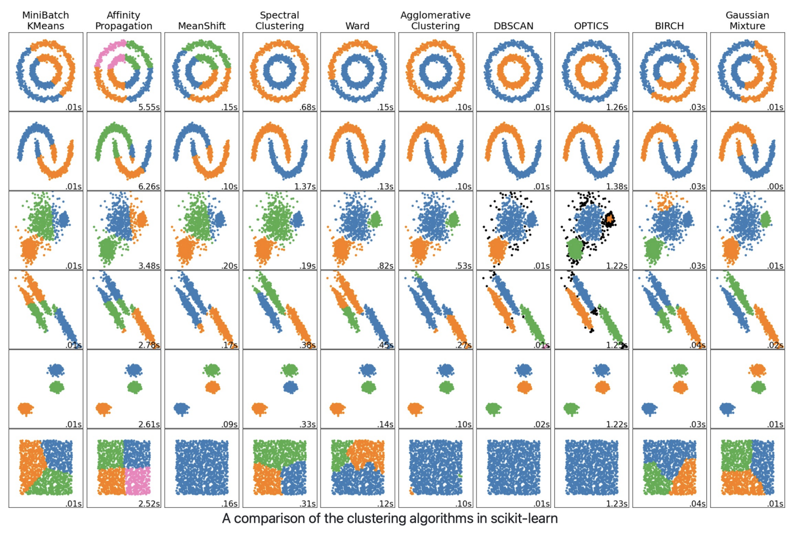
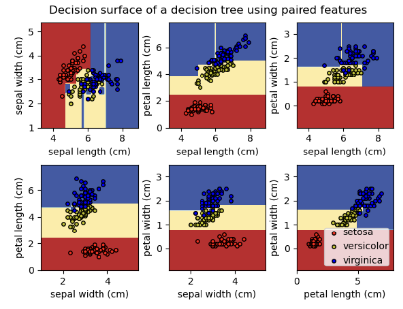
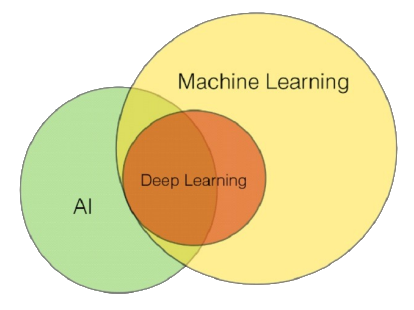
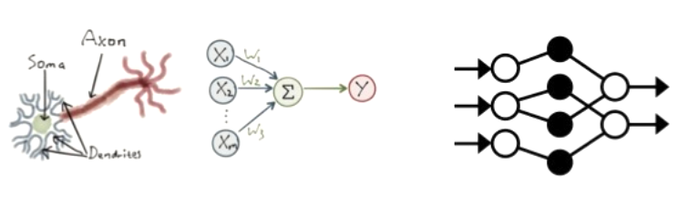
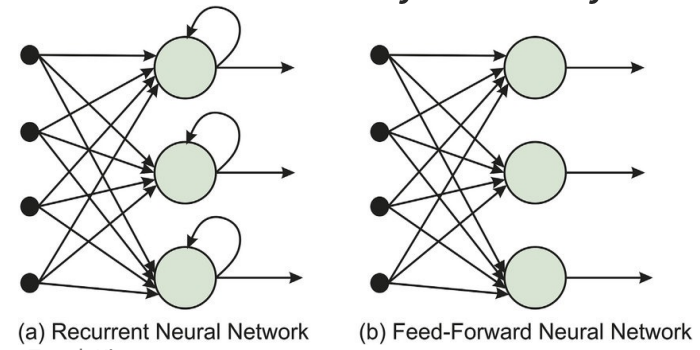
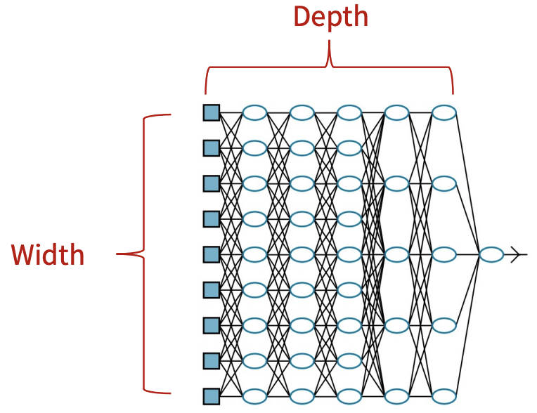

# Artificial Intelligence: Other Classic ML Models (2)

# Support Vector Machines

## Support Vector Machines (SVMs)
- 2000년대 초반, "off-the-shelf" supervised learning (도메인에 대한 사전 지식 없이 사용하는)에 가장 인기 있었던 model class
- 현재 이 위치는 deep learning network와 random forest가 차지했지만, SVM은 여전히 3가지 매력적인 속성을 보유
  1. SVM은 maximum margin separator (결정 경계)를 구축 (example point까지 가능한 가장 큰 거리를 가짐). 이는 일반화(generalize)에 도움
  2. SVM은 linear separating hyperplane을 생성하지만, kernel trick을 사용해 데이터를 더 높은 차원의 공간으로 embedding 할 수 있음. 원본 input space에서 linearly separable 하지 않은 데이터가 고차원 공간에서는 쉽게 분리되는 경우가 많음
  3. SVM은 nonparametric임. Separating hyperplane은 parameter 값의 집합이 아닌 example point 집합에 의해 정의됨. Nearest-neighbor model은 모든 example을 유지해야 하지만, SVM model은 separating plane에 가장 가까운 example (일반적으로 차원 수의 몇 배에 불과한)만 유지. 따라서 SVM은 nonparametric model과 parametric model의 장점을 결합: 복잡한 함수를 표현하는 유연성을 가지면서 overfitting에 강함

## Properties of SVMs
- SVM은 maximum margin separator를 구축
- Margin은 그림의 점선으로 둘러싸인 영역의 너비 (separator에서 가장 가까운 example point까지 거리의 2배)

- SVM은 데이터를 더 높은 차원의 공간으로 embedding 하는 능력(kernel trick)을 가짐

- SVM은 nonparametric임. Separating hyperplane은 parameter 값의 집합이 아닌 example point 집합에 의해 정의됨
- Logistic regression은 어떤 separating line을 찾으며, 이 line의 정확한 위치는 모든 example point에 따라 달라짐
- SVM의 핵심 통찰은 일부 example (즉, support vector)이 다른 것보다 더 중요하며, 이에 집중하는 것이 더 나은 generalization으로 이어질 수 있다는 것


# Implementing ML Models in Python

## Scikit-learn
- [https://scikit-learn.org/](https://scikit-learn.org/)

## K-NNs in Scikit-learn
- [https://scikit-learn.org/stable/auto_examples/neighbors/plot_classification.html#sphx-glr-autoexamples-neighbors-plot-classification-py](https://scikit-learn.org/stable/auto_examples/neighbors/plot_classification.html#sphx-glr-autoexamples-neighbors-plot-classification-py)

## Clustering in Scikit-learn


## (Gaussian) Naïve Bayes in Scikit-learn
- [https://scikit-learn.org/stable/modules/naive_bayes.html](https://scikit-learn.org/stable/modules/naive_bayes.html)

`GaussianNB`는 classification을 위한 Gaussian Naive Bayes algorithm을 구현함. Feature의 likelihood는 Gaussian이라고 가정:

$$P(x_i | y) = \frac{1}{\sqrt{2\pi\sigma^2_y}}\exp\left(-\frac{(x_i - \mu_y)^2}{2\sigma^2_y}\right)$$

Parameter $\sigma_y$와 $\mu_y$는 maximum likelihood를 사용하여 추정

```python
>>> from sklearn.datasets import load_iris
>>> from sklearn.model_selection import train_test_split
>>> from sklearn.naive_bayes import GaussianNB
>>> X, y = load_iris(return_X_y=True)
>>> X_train, X_test, y_train, y_test = train_test_split(X, y, test_size=0.5, random_state=0)
>>> gnb = GaussianNB()
>>> y_pred = gnb.fit(X_train, y_train).predict(X_test)
>>> print("Number of mislabeled points out of a total %d points : %d"
...       % (X_test.shape[0], (y_test != y_pred).sum()))
Number of mislabeled points out of a total 75 points : 4
```

## Decision Trees in Scikit-learn
- [https://scikit-learn.org/stable/auto_examples/tree/plot_iris_dtc.html](https://scikit-learn.org/stable/auto_examples/tree/plot_iris_dtc.html)


## SVMs in Scikit-learn
- [https://scikit-learn.org/stable/auto_examples/svm/plot_separating_hyperplane.html#sphx-glrauto-examples-svm-plot-separating-hyperplane-py](https://scikit-learn.org/stable/auto_examples/svm/plot_separating_hyperplane.html#sphx-glrauto-examples-svm-plot-separating-hyperplane-py)

# Neural Networks and Deep Learning (1)

## Introduction to Neural Networks and Deep Learning

## AI, ML, and DL (The Slide From the First Lecture)
- Artificial Intelligence (AI), Machine Learning (ML), Deep Learning (DL)
- 이 용어들은 미디어와 대중이 별다른 주의 없이 상호 교환적으로 활용하는 경우가 많음
- 2010년대 statistical machine learning의 전례 없는 성공은 AI의 다른 모든 접근 방식을 압도했으며, 일부 (특히 비즈니스계)에서는 "artificial intelligence"라는 용어를 "neural network를 사용한 machine learning"을 의미하는 데 사용
- AI, ML, DL의 계층 구조
- ML은 보통 AI의 부분집합으로 간주되며, DL은 ML의 특정 부분
- 그러나 ML이 전적으로 AI에 흡수되는지에 대해서는 여전히 논란이 있음


## Deep Learning
- Deep learning은 machine learning을 위한 광범위한 technique family이며, hypothesis는 조정 가능한 연결 강도를 가진 복잡한 대수적 circuit 형태를 띰
- "Deep"이라는 단어는 circuit이 일반적으로 많은 layer로 구성되어 input에서 output까지의 계산 경로가 여러 단계를 거친다는 사실을 의미
- Deep learning은 현재 visual object recognition, machine translation, speech recognition, speech synthesis, image synthesis와 같은 application에 가장 널리 사용되는 접근 방식
- Computer Vision
- Natural Language Processing
- Speech & Music Processing
- Reinforcement Learning
- Healthcare, Legal, …
- Physical AI & Robotics

## Neural Networks
- Deep learning은 뇌의 neuron network를 computational circuit으로 modeling 하려던 초기 연구에 기원을 둠
- 이러한 이유로 deep learning method로 훈련된 network는 종종 neural network라고 불림 (실제 neural cell 및 구조와의 유사성은 피상적일지라도)


## Why is Deep Learning Successful?
- Deep learning 성공의 진정한 이유는 아직 완전히 밝혀지지 않았지만, 다른 method에 비해 명백한 이점을 가짐
- Linear/logistic regression은 많은 input 변수를 처리할 수 있지만, 각 input에서 output까지의 계산 경로는 매우 짧음 (단일 weight와의 곱셈 후 aggregate output에 더해짐)
- 더욱이, 서로 다른 input 변수들은 서로 상호작용 없이 ( (a) ) output에 독립적으로 기여. 이는 해당 model의 expressive power를 현저히 제한
- 대부분의 실제 real-world concept은 훨씬 더 복잡하지만, 이 model들은 input space에서 linear function과 경계만 표현 가능
- Decision tree는 많은 input 변수에 의존할 수 있는 긴 계산 경로를 허용
- 그러나 이는 가능한 input vector 중 상대적으로 작은 부분에 대해서만 해당 ( (b) ). Decision tree가 가능한 input의 상당 부분에 대해 긴 계산 경로를 가진다면, input 변수의 수에 대해 exponentially large 해야 함
- Deep learning의 기본 아이디어는 계산 경로가 길도록 circuit을 훈련하는 것
- 모든 input 변수가 복잡한 방식으로 상호작용하도록 허용 ( (c) )
- 이러한 circuit model은 많은 중요한 learning problem 유형에 대해 real-world data의 복잡성을 포착할 만큼 충분히 expressive 한 것으로 밝혀짐


# Simple Feedforward Networks

## Feedforward Networks
- (Deep) feedforward (neural) network (또는 multi-layer perceptrons (MLPs))는 한 방향으로만 connection을 가짐
- 지정된 input 및 output node가 있는 directed acyclic graph를 형성
- 각 node는 input의 함수를 계산하고 그 결과를 network의 후속 node로 전달
- 정보는 input node에서 output node로 network를 통해 흐르며, loop가 없음
- Recurrent network는 중간 또는 최종 output을 자체 input으로 다시 feedback
- 이는 network 내의 signal 값이 internal state 또는 memory를 갖는 dynamical system을 형성함을 의미

- Neural network에서 input 값은 일반적으로 continuous하며, node는 continuous input을 받아 continuous output을 생성
- Node에 대한 input 중 일부는 network의 parameter
- Network는 이 parameter 값을 조정하여 network 전체가 training data에 맞도록 학습
- Feedforward network의 목표는 어떤 함수 $f^*$를 근사(approximate)하는 것
- 예: Classifier의 경우 $y = f^*(\mathbf{x})$는 input $\mathbf{x}$를 category $y$로 mapping
- Feedforward network는 $y = f(\mathbf{x};~ \boldsymbol{\theta})$라는 mapping을 정의하고, 최상의 함수 근사(approximation)를 결과로 내는 parameter $\boldsymbol{\theta}$의 값을 학습
- Feedforward network는 일반적으로 많은 서로 다른 함수를 함께 구성(composing)하여 표현되기 때문에 network라고 불림
- 예: $f^{(1)}$, $f^{(2)}$, $f^{(3)}$ 세 함수가 chain으로 연결되어 $f(\mathbf{x}) = f^{(3)}(f^{(2)}(f^{(1)}(\mathbf{x})))$를 형성
- 이 경우 $f^{(1)}$은 network의 첫 번째 layer, $f^{(2)}$는 두 번째 layer라고 불림
- Chain의 전체 길이가 model의 depth를 결정. "Deep learning"이라는 이름이 여기서 유래
- Feedforward network의 마지막 layer는 output layer라고 불림
- Input layer와 output layer 사이의 layer들은 hidden layer라고 불림
  - Network의 각 hidden layer는 일반적으로 vector-valued
  - 이러한 hidden layer의 dimensionality가 model의 width를 결정
  
- Vector의 각 element는 neuron과 유사한 역할을 하는 것으로 해석될 수 있음
- 또한 layer가 병렬로 작동하는 많은 unit으로 구성되어 있으며, 각 unit은 vector-to-scalar 함수를 나타낸다고 생각할 수 있음
- 각 unit은 많은 다른 unit으로부터 input을 받고 자신의 activation value를 계산한다는 의미에서 neuron과 유사
- 그러나 neural network의 목표는 뇌를 완벽하게 model 하는 것이 아님

## Computation of Feedforward Networks
- Network 내의 각 node를 unit (또는 perceptron)이라고 함
  - 전통적으로 unit은 (1) 이전 node들로부터의 input의 weighted sum을 계산하고 (2) nonlinear function을 적용하여 output을 생성
  - $a_j$를 output unit $j$라 하고 $w_{i,j}$를 unit $i$에서 unit $j$로의 link에 연결된 weight라 할 때;
  $$a_j = g_j(\sum_i w_{i,j} a_i) \equiv g_j(in_j)$$
  - 여기서 $g_j$는 unit $j$와 연관된 nonlinear activation function이고, $in_j$는 unit $j$로의 input의 weighted sum
  
  - 앞의 방정식을 vector 형태로 작성 가능
  $$\mathbf{a} = \mathbf{g}(\mathbf{W}\mathbf{x})$$
- Activation function이 nonlinear라는 사실이 중요
  - 만약 그렇지 않다면, unit의 모든 구성(composition)은 여전히 linear function을 나타낼 것 ($W = W_1W_2$일 때 $\mathbf{W}\mathbf{x} = \mathbf{W_1}\mathbf{W_2}\mathbf{x}$)
  - Nonlinearity는 충분히 큰 unit network가 임의의 함수를 표현할 수 있게 하는 요소
- Universal approximation theorem
  - Computational unit의 layer가 두 개뿐인 network (첫 번째는 nonlinear, 두 번째는 linear)가 임의의 continuous function을 임의의 정확도로 근사(approximate)할 수 있음을 명시

## Activation Funtions
- 다양하고 서로 다른 activation function이 사용됨
- Logistic 또는 sigmoid function (logistic regression에서도 사용):
$$\sigma(x) = 1/(1 + e^{-x})$$
- ReLU function (Rectified Linear Unit의 약어):
$$\text{ReLU}(x) = \max(0,~x)$$
- Softplus function (ReLU function의 smooth version)
- Tanh function:
$$\tanh(x) = \frac{e^{2x} - 1}{e^{2x} + 1}$$