# 19. Language Modeling and Recurrent Neural Networks

# Language Modeling
Classic $n$-gram 모델

## Language Modeling

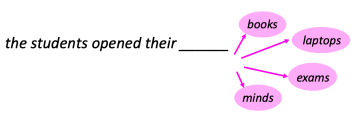

- Next word가 무엇인지 예측하는 Task
- 공식적 정의
    - Words sequence $x^{(1)}, x^{(2)}, \dots, x^{(t)}$가 주어졌을 때, Next word $x^{(t+1)}$의 Probability distribution 계산
    - $P(x^{(t+1)}|x^{(t)}, \dots, x^{(1)})$
- 이를 수행하는 System을 Language Model이라 지칭
- Text 자체에 Probability를 할당하는 System으로 간주 가능
$$
P(x^{(1)}, \dots, x^{(T)}) = P(x^{(1)}) \times P(x^{(2)}|x^{(1)}) \times \dots \times P(X^{(T)}| x^{(T-1)} , ~\dots ,x^{(1)})
$$
$$
= \prod_{t=1} ^T P(x^{(t)}|x^{(t)} | x ^{(t-1)},~ \dots, x ^ {(1)})
$$
- Language Model을 가지고 할 수 있는 것?
    - Score sentences: 문장의 자연스러움 평가
        - Jane went to the store. → high
        - Store to Jane went the. → low
    - Generate sentences(문장 생성)
        ```py
        while didn't choose end-of-sentence symbol:
            Calculate probability
            Sample a new word from the probability distribution
        ```

## You Use Language Models Every Day!
- 자동 완성
- 검색 엔진
- ChatGPT

## $N$-Gram Language Models
- Deep learning 이전의 근본적이고 고전적인 Language Model 구현 방식
- $N$-gram: $n$개의 연속적인 Words 덩어리
    - Unigrams: "the", "students"
    - Bigrams: "the students", "student opened"
    - Trigrams: "the students opened", "students opened their"
    - Four-grams: "the students opened their"
- Idea: 빈도 통계를 수집하여 next word 예측에 활용


- Markov assumption
    - $x^{(t+1)}$은 오직 앞선 $n-1$개의 Words에만 의존한다고 가정
$$P(x^{(t+1)}|x^{(t)}, \dots, x^{(1)}) = P(x^{(t+1)}|x^{(t)}, \dots, x^{(t-n+2)})$$
$$= \frac{P(x*{(t+1)}, x^{(t)},~\dots,~x^{(t-n+2)})}{P(x^{(t)},~\dots,~x^{(t - n + 2)})}$$
- Large corpus에서 개수를 세어(Counting) 확률 계산 (Statistical approximation)
    - Count ratio를 통해 Conditional probability 근사

## $N$-Gram Language Models: Example
- 4-gram Language Model 학습 가정
- <del>as the proctor started the clock, the</del> students opened their ______
$$
P(w|\text{students opened their})=\frac{\text{count}(\text{students opened their}~w)}{\text{count}(\text{students opened their})}
$$
- Corpus 내 "students opened their" 뒤에 오는 단어들의 빈도를 확인하여 확률 부여
    - "books": (0.4)
    - "exams": (0.1)

## Generating Text with a $N$-Gram Language Model
- 간단한 trigram 언어 모델
    - 170만 이상의 단어 모음 (Reuters: 경제, 경영 뉴스)
    - 언어 모델로 텍스트를 생성할 수 있음.

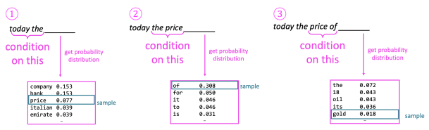

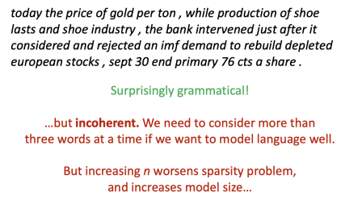

# Neural Language Models
Based on feed-forward NNs and RNNs

## A (Fixed-Window) Neural Language Model
- output distribution
$$
\hat{\bm{y}}=\text{softmax}(\bm{Uh} + \bm{b_2} ) \in \mathbb{R}^{|V|}
$$
- hidden layer
$$\bm{h} = f(\bm{We+b_1})$$
- concatenated word embeddings
$$\bm{e}=[\bm{e}^{(1)};~\bm{e}^{(2)};~\bm{e}^{(3)};~\bm{e}^{(4)}]$$
- words / one-hot vectors
$$\bm{x}^{(1)},~\bm{x}^{(2)},~\bm{x}^{(3)},~\bm{x}^{(4)}$$

- *Yoshua Bengio et al.* (2000)이 제안한 초기 버전
- $N$-gram Language Model 대비 개선점
    - Sparsity problem 없음
    - 관측된 모든 $N$-grams를 저장할 필요 없음
- 남은 문제점
    - Fixed window 크기가 너무 작음
    - Window 크기를 늘리면 Weights $W$가 커짐
    - $x^{(1)}$과 $x^{(2)}$가 서로 완전히 다른 Weights $W$에 곱해짐 (비대칭성)
- 임의의 길이인 Input을 처리할 수 있는 Neural architecture 필요성 대두

## Recurrent Neural Networks (RNN)
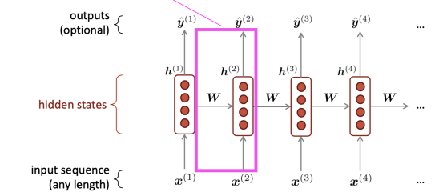
- Core idea: 동일한 Weights $W$를 반복적으로 적용

## A Simple RNN Language Model
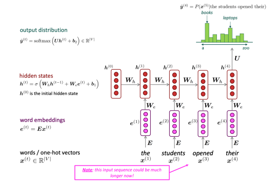
- Recurrent 구조를 활용한 Language Model 도식

## RNN Language Models
- RNN의 장점
    - 모든 길이의 Input 처리 가능
    - 이론적으로 Step $t$의 연산에 아주 오래전 Step의 정보 활용 가능
    - Input context가 길어져도 Model size가 증가하지 않음
    - 모든 Timestep에 동일한 Weights를 적용하므로 Input 처리 방식에 대칭성 존재
- RNN의 단점
    - Recurrent computation 속도가 느림
    - 실제로는 먼 과거의 정보에 접근하기 어려움 (Vanishing gradient 등)

## Training an RNN Language Model


- 절차
    - Words sequence로 구성된 Big corpus 준비
    - RNN-LM에 입력하여 매 Step $t$마다 Output distribution $\hat{\bm{y}}^{(t)}$ 계산
- Loss function
    - Predicted probability distribution $\hat{\bm{y}}^{(t)}$와 True next word $\bm{y}^{(t)}$ (One-hot) 간의 Cross-entropy
$$
J^{(t)}(\theta) = CE(\bm{y}^{(t)}, \hat{\bm{y}}^{(t)}) = -\sum_{w \in V} \bm{y}_w^{(t)} \log \hat{\bm{y}}_w^{(t)} = -\log \hat{\bm{y}}_{x^{(t+1)}}^{(t)}
$$
- 전체 Training set에 대해 Average loss 계산
$$
J(\theta)= \frac{1}{T} \sum _{t=1} ^T - \log \hat{\bm{y}} ^{t} _{x_{t+1}}
$$

- 전체 Corpus에 대해 한 번에 Loss와 Gradients를 계산하는 것은 **비용이 과다**함
$$
J(\theta) = \frac{1}{T} \sum_{t=1} ^{T} J^{(t)} (\theta)
$$
- 실제로는 $x^{(1)}, \dots, x^{(T)}$를 Sentence (또는 Document) 단위로 처리
- Stochastic Gradient Descent (SGD)를 활용하여 작은 Chunk (Batch) 데이터에 대해 Loss 및 Gradient 계산 후 Weights update 반복

## Generating Text with an RNN Language Model

- 특정 Text style로 학습된 RNN-LM을 통해 해당 스타일의 Text generation 가능
- 예시: Obama speeches, Harry Potter 소설 스타일 등

# Recurrent Neural Networks for Other Applications
Tagging, classification, question answering, speech recognition

## RNNs Can Be Used for Tagging

- Part-of-speech tagging, Named Entity Recognition 등

## RNNs Can Be Used for Sentence Classification
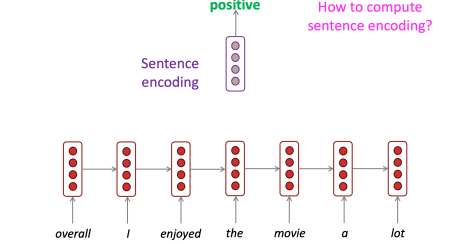
- Sentiment classification 등

## RNN-LMs Can Be Used to Generate Text

- Speech recognition, Machine Translation, Summarization 등

# Variants of RNNs

## Bidirectional and Multi-Layer RNNs: Motivation
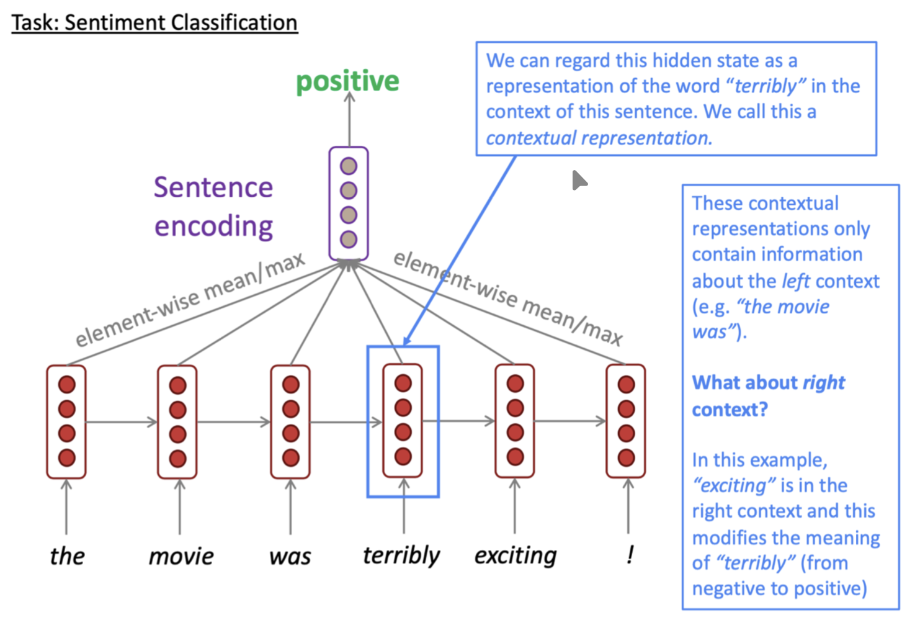
- 양방향 정보를 활용하거나 깊이를 더하기 위한 동기

## Bidirectional RNNs
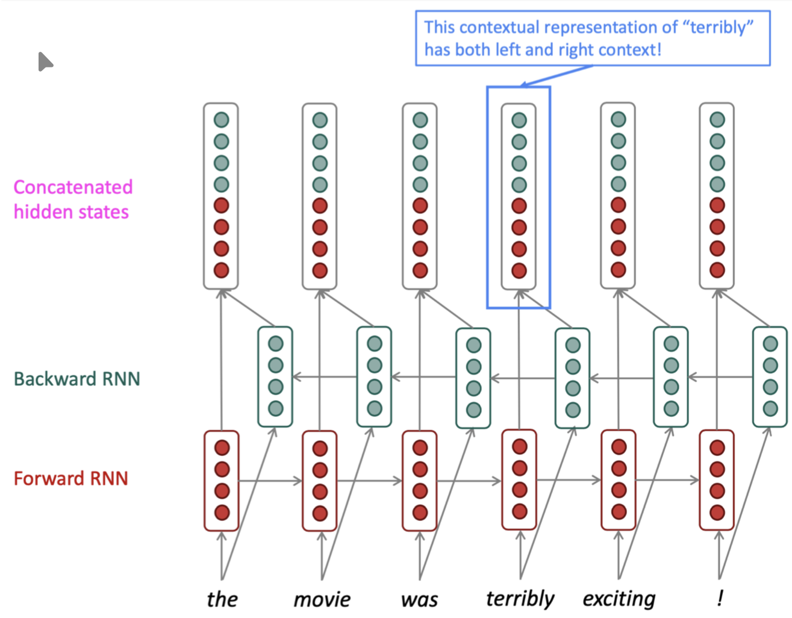
- Forward 및 Backward 정보를 결합하여 활용

## Multi-Layer RNNs

- RNN을 여러 층으로 쌓아 구성

## Long Short-Term Memory RNNs (LSTMs)

- 1997년 Hochreiter와 Schmidhuber가 Vanishing gradients problem의 해결책으로 제안한 RNN의 일종
- inputs sequence $x^{(t)}$가 주어지면 hidden states sequence $h^{(t)}$와 cell states $c^{(t)}$를 계산
- timestep $t$에서의 과정:
- Forget gate: 이전 cell state에서 유지할 것과 잊을 것을 제어
$$f^{(t)} = \sigma(W_f h^{(t-1)} + U_f x^{(t)} + b_f)$$
- Input gate: 새로운 cell content 중 어떤 부분을 cell에 기록할지 제어
$$i^{(t)} = \sigma(W_i h^{(t-1)} + U_i x^{(t)} + b_i)$$
- Output gate: cell의 어떤 부분을 hidden state로 출력할지 제어
$$o^{(t)} = \sigma(W_o h^{(t-1)} + U_o x^{(t)} + b_o)$$
> *(Sigmoid function: 모든 gate 값은 0과 1 사이)*
- New cell content: cell에 기록될 새로운 내용
$$\tilde{c}^{(t)} = \tanh(W_c h^{(t-1)} + U_c x^{(t)} + b_c)$$
- Cell state: 이전 cell state에서 일부 내용을 지우고("forget"), 새로운 cell content를 일부 기록("input")
$$c^{(t)} = f^{(t)} \circ c^{(t-1)} + i^{(t)} \circ \tilde{c}^{(t)}$$
- Hidden state: cell에서 일부 내용을 읽음("output")
$$h^{(t)} = o^{(t)} \circ \tanh c^{(t)}$$
- 참고 사항
    - 이들은 모두 동일한 길이 $n$의 vector
    - Gates는 element-wise (또는 Hadamard) product $\circ$를 사용하여 적용 

## 1. The Repeating Module (Chain Structure)

- 표준적인 RNN과 달리, LSTM의 반복 모듈은 4개의 상호작용하는 Layer를 포함

## 2. Detailed LSTM Cell Diagram
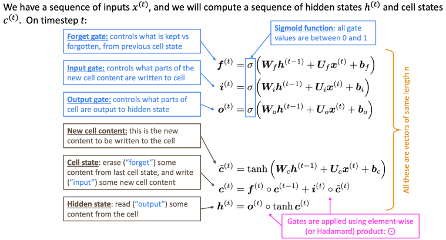

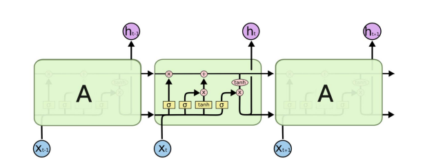

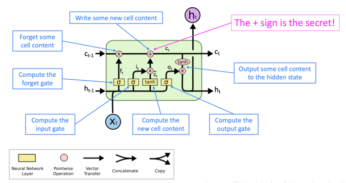

## Diagram Legend
- `(X)`: Pointwise Multiplication (Element-wise)
- `(+)`: Pointwise Addition (The "Secret" regarding gradients)
- `SIGMOID`, `TANH`: Neural Network Layers (Activation Functions)
- `->`: Vector Transfer
- `Combine`: Concatenation