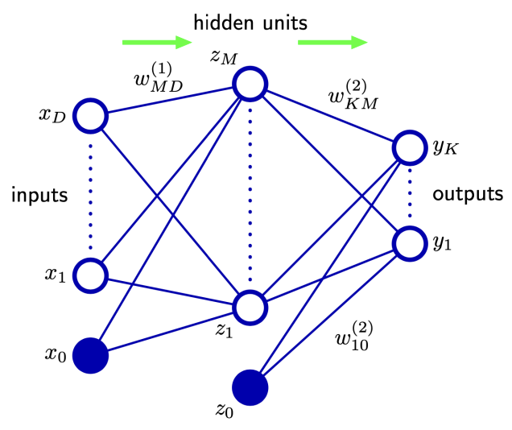

# 20. Neural Networks and Deep Learning (2)

# More Details on Feedforward Networks

## Computation of Feedforward Networks (Review)
- Network 내의 각 node는 unit (또는 perceptron)이라 불림
- Unit 계산: (1) 이전 node들로부터의 입력에 대한 weighted sum 계산, (2) output 생성을 위한 비선형 함수 적용
- $a_j$는 unit $j$의 output, $w_{ij}$는 unit $i$에서 $j$로의 weight
- 수식: $a_j = g_j(\sum_i w_{ij} a_i) \equiv g_j(in_j)$
- $g_j$: unit $j$와 연관된 비선형 activation function
- $in_j$: unit $j$로의 입력에 대한 weighted sum

## Feedforward Networks with Another Notation

- 입력 변수 $x_1, \dots, x_D$의 $M$개 linear combinations 구성
- $a_j = \sum_{i=1}^D w_{ji}^{(1)} x_i + w_{j0}^{(1)}$, 여기서 $j = 1, \dots, M$ 이고 (1)은 첫 번째 layer
- $w_{ji}^{(1)}$: weights, $w_{j0}^{(1)}$: biases
- $a_j$: activations
- 각 activation $a_j$는 미분 가능한 비선형 activation function $h(\cdot)$를 통해 변환
- $z_j = h(a_j)$, $z_j$는 hidden units
- Hidden units $z_j$는 다시 linear combination 되어 output unit activations $a_k$를 생성
- $a_k = \sum_{j=1}^M w_{kj}^{(2)} z_j + w_{k0}^{(2)}$, 여기서 $k = 1, \dots, K$ 이고 $K$는 총 output 수
- $a_k$는 적절한 activation function을 통해 network output $y_k$가 됨
- Standard regression: Identity ($y_k = a_k$)
- Multiple binary classification: Logistic sigmoid function ($y_k = \sigma(a_k)$)
- Multiclass classification: Softmax activation function ($y_k = \exp(a_k) / \sum_l \exp(a_l)$)
- 전체 network function (예: sigmoid output)
$$y_k(\mathbf{x},~ \mathbf{w}) = \sigma(\sum_{j=1}^M w_{kj}^{(2)} h(\sum_{i=1}^D w_{ji}^{(1)} x_i + w_{j0}^{(1)}) + w_{k0}^{(2)})$$ 
- $\mathbf{w}$: 모든 weight와 bias parameter를 그룹화한 vector
- 이 과정은 정보의 forward propagation으로 해석 가능
- Neural network model: 입력 $\mathbf{x} = \{x_i\}$에서 출력 $\{y_k\}$로의 비선형 함수
- Bias parameter는 $x_0 = 1$인 추가 입력 변수 $x_0$를 정의하여 weight parameter에 흡수 가능
$$a_j = \sum_{i=0}^D w_{ji}^{(1)} x_i$$
- 단순화된 전체 network function (2-layer bias 포함)
$$y_k(\mathbf{x},~ \mathbf{w}) = \sigma(\sum_{j=0}^M w_{kj}^{(2)} h(\sum_{i=0}^D w_{ji}^{(1)} x_i))$$
- Vector 및 matrices 활용 추가 단순화
$$\mathbf{y}(\mathbf{x},~ \mathbf{w}) = \sigma(\mathbf{W}^{(2)} h(\mathbf{W}^{(1)} \mathbf{x}))$$
- Feedforward nets는 일반적으로 fully-connected

## How to Count the Number of Layers in NNs
- Neural network의 layer 수 계산 용어에 혼란 존재
- 3-layer network: Unit의 layer 수를 세는 방식 (input을 unit으로 취급)
- Single-hidden-layer network: Hidden units의 layer 수를 세는 방식
- Two-layer network: Network 속성을 결정하는 데 중요한 adaptive weights의 layer 수를 세는 방식

# Training of Feedforward Nets

## Different Loss (Error) Functions for Different Problems
- Regression
  - Output activation function: Identity ($y_k = a_k$)
  - Loss (error) function: Sum-of-squares (L2 or squared) error function
$$E(\mathbf{w}) = \frac{1}{2} \sum_{n=1}^N \| \mathbf{y}(\mathbf{x}_n, \mathbf{w}) - \mathbf{t}_n \|^2$$
- Binary classification
  - Single target variable $t$ ($t=1$은 $C_1$, $t=0$은 $C_2$)
  - Output activation function: Sigmoid $y = \sigma(a)$
  - Loss (error) function: Negative log likelihood 또는 cross-entropy error function

$$
E(\mathbf{w}) = - \sum_{n=1}^N \{ t_n \log y_n + (1 - t_n) \log(1 - y_n) \}
$$
$$
y_n = y(\mathbf{x}_n, \mathbf{w})
$$

- Multiclass classification
  - 각 input은 $K$개의 상호 배타적인 class 중 하나에 할당
  - Target $t_k \in \{0, 1\}$는 1-of-K coding scheme 사용
  - Network output 해석: $y_k(\mathbf{x},~ \mathbf{w}) = P(t_k = 1|\mathbf{x})$
  - Output activation function: Softmax $y_k = \exp(a_k) / (\sum_l \exp(a_l))$
  - Loss (error) function: Negative log likelihood 또는 cross-entropy error function
$$E(\mathbf{w}) = - \sum_{n=1}^N \sum_{k=1}^K t_{nk} \log y_k(\mathbf{x}_n, \mathbf{w})$$
- 요약
  - 문제 유형에 따라 output unit activation function과 matching error function의 자연스러운 선택 존재

## Information Theory (Review)
- Entropy
  - Random variable의 불확실성 척도
  - $H(X) = -\mathbb{E}_{x \sim P(X)} [\log P(x)] = \mathbb{E}_{x \sim P(X)} [\log \frac{1}{P(x)}]$
- Kullback-Leibler (KL) Divergence
  - 동일한 random variable $X$에 대한 두 확률 분포 $P(X)$와 $Q(X)$가 얼마나 다른지 측정
  - $D_{KL}(P \| Q) = \mathbb{E}_{x \sim P(X)}[\log \frac{P(x)}{Q(x)}] = \mathbb{E}_{x \sim P(X)}[\log P(x) - \log Q(x)]$
- Cross-entropy
  - $H(P,~ Q) = -\mathbb{E}_{x \sim P(X)}[\log Q(x)] = H(X) + D_{KL}(P \| Q)$
  - $Q$에 대해 cross-entropy를 최소화하는 것은 KL divergence를 최소화하는 것과 동일