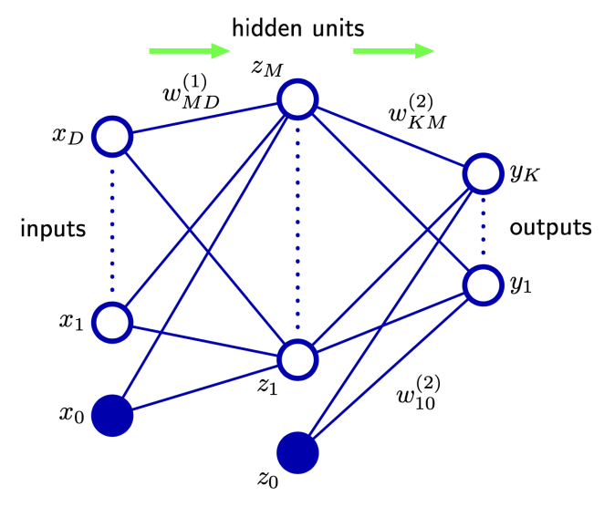

# 21. Neural Networks and Deep Learning (3)

## Training of Feedforward Nets

## A Graphical Illustration on Softmax

## Cross-Entropy and Maximum Likelihood Estimation
- Maximum Likelihood Estimation (MLE)
  - Examples $\{\mathbf{x}_n\}$: $P_{\text{true}}(\mathbf{x})$ (unknown)에서 independently drawn
  - Model: $P_{\text{model}}(\mathbf{x};~\mathbf{w})$ (parameters $\mathbf{w}$ or $\theta$)
  - Goal: $P_{\text{model}}(\mathbf{x};~\mathbf{w})$가 $P_{\text{true}}(\mathbf{x})$ (strictly, $P_{\text{empirical}}(\mathbf{x})$)와 가장 유사한 $\mathbf{w}$ 탐색
  - MLE principle
  $$\mathbf{w}_{\text{MLE}} = \arg\max_{\mathbf{w}} P_{\text{model}}(\mathbf{x};~\mathbf{w})$$
  - Independence (Likelihood): $\mathbf{w}_{\text{MLE}} = \arg\max_{\mathbf{w}} \prod_{n=1}^{N} P_{\text{model}}(\mathbf{x}_n;~\mathbf{w})$
  - Log likelihood (Computational stability): $\mathbf{w}_{\text{MLE}} = \arg\max_{\mathbf{w}} \sum_{n=1}^{N} \log P_{\text{model}}(\mathbf{x}_n;~\mathbf{w})$
- Cross-entropy와 MLE의 관계
 $$\mathbf{w}_{\text{MLE}} = \arg\max_{\mathbf{w}} \sum_{n=1}^{N} \log P_{\text{model}}(\mathbf{x}_n;~\mathbf{w})$$
  - Scaling (Argmax 불변):
$$\mathbf{w}_{\text{MLE}} = \arg\max_{\mathbf{w}} \frac{1}{N} \sum_{n=1}^{N} \log P_{\text{model}}(\mathbf{x}_n;~\mathbf{w})$$
$$= \arg\max_{\mathbf{w}} \mathbb{E}_{\mathbf{x} \sim P_{\text{empirical}}(\mathbf{x})}[\log P_{\text{model}}(\mathbf{x};~\mathbf{w})]$$
  - $P(\mathbf{x}) = P_{\text{empirical}}(\mathbf{x})$, $Q(\mathbf{x}) = P_{\text{model}}(\mathbf{x};~\mathbf{w})$로 치환
$$\mathbf{w}_{\text{MLE}} = \arg\max_{\mathbf{w}} \mathbb{E}_{P(\mathbf{x})}[\log Q(\mathbf{x})]$$
$$= \arg\min_{\mathbf{w}} - \mathbb{E}_{P(\mathbf{x})}[\log Q(\mathbf{x})] = \arg\min_{\mathbf{w}} H(P, Q)$$
- 결론
  - MLE를 사용한 $\mathbf{w}_{\text{MLE}}$ 획득 문제는 $P_{\text{empirical}}(\mathbf{x})$와 $P_{\text{model}}(\mathbf{x};~\mathbf{w})$ 간의 cross-entropy 최소화 문제와 동일

## Parameter Optimization
- Task: 선택된 $E(\mathbf{w})$를 최소화하는 weight vector $\mathbf{w}$ 탐색
- Global minimum: 모든 weight vector에 대해 error function의 가장 작은 값에 해당하는 minimum
- Local minima: Error function의 더 높은 값에 해당하는 다른 모든 minima
- Note: Neural network의 성공적 적용을 위해 global minimum 탐색이 필수적이 아닐 수 있음, 충분히 좋은 solution을 위해 여러 local minima 비교 필요

## Forward Propagation & Backpropagation
- **Error backpropagation** (or simply backprop)
  - Feed-forward neural network의 error function $E(\mathbf{w})$의 gradient $\nabla E(\mathbf{w})$를 평가하는 효율적인 기술
  - Chain rule을 매우 효율적인 특정 연산 순서로 계산하는 algorithm
- **Our example**
  - A simple layered network (sigmoidal hidden units, sum-of-squares error)
- In a general feed-forward network,
  - 각 unit은 weighted sum 계산
  $$a_j = \sum_i w_{ji} z_i$$
  - $z_i$: Unit $j$로 connection을 보내는 unit/input의 activation
  - $w_{ji}$: Connection과 연관된 weight
  - $a_j$는 nonlinear activation function $h(\cdot)$에 의해 변환되어 unit $j$의 activation $z_j$ 생성
  $$z_j = h(a_j)$$

## Forward Propagation
- For each pattern in the training set
  - Input vector를 network에 제공
  - $a_j$와 $z_j$의 연속 적용으로 모든 hidden unit 및 output unit의 activation 계산
  - 이 process는 **forward propagation**이라 불림 (정보의 forward flow)

## Chain Rule of Calculus
- Chain rule for scalars
  - $y = g(x)$ 이고 $z = f(g(x)) = f(y)$ 일 때
  - $\frac{dz}{dx} = \frac{dz}{dy} \cdot \frac{dy}{dx}$
- Chain rule for vectors
  - $\mathbf{x} \in \mathbb{R}^m,~\mathbf{y} \in \mathbb{R}^n$, $\mathbf{y} = g(\mathbf{x})$ 이고 $z = f(\mathbf{y})$ 일 때
  - $\frac{\partial z}{\partial x_i} = \sum_j \frac{\partial z}{\partial y_j} \cdot \frac{\partial y_j}{\partial x_i}$
  - Vector notation: $\nabla_{\mathbf{x}} z = (\frac{\partial \mathbf{y}}{\partial \mathbf{x}})^T \nabla_{\mathbf{y}} z$
  - $\frac{\partial \mathbf{y}}{\partial \mathbf{x}}$는 $g$의 $n \times m$ Jacobian matrix

## Backpropagation
- $E_n$의 $w_{ji}$에 대한 derivative 평가
  - $E_n$은 $w_{ji}$에 대해 오직 summed input $a_j$를 통해서만 Dependant
  - Chain rule: $\frac{\partial E_n}{\partial w_{ji}} = \frac{\partial E_n}{\partial a_j} \cdot \frac{\partial a_j}{\partial w_{ji}}$
  - Notation (errors $\delta$): $\delta_j \equiv \frac{\partial E_n}{\partial a_j}$
  - $\frac{\partial a_j}{\partial w_{ji}} = z_i$
  - Result: $\frac{\partial E_n}{\partial w_{ji}} = \delta_j \cdot z_i$
- $\frac{\partial E_n}{\partial w_{ji}} = \delta_j \cdot z_i$
  - Required derivative: Weight의 output end unit($j$)의 $\delta$ 값과 input end unit($i$)의 $z_i$ 값을 곱하여 획득
- Derivative 평가: Network의 각 hidden/output unit에 대한 $\delta_j$ 값 계산 필요
- For the output units (with L2 loss, assuming identity activation $y_j = a_j$)
  - $E_n(\mathbf{w}) = \frac{1}{2} \sum_k (y_k - t_k)^2$
  - $\delta_j = y_j - t_j$
- To evaluate the $\delta$'s for hidden units,
  - Chain rule: $\delta_j \equiv \frac{\partial E_n}{\partial a_j} = \sum_k \frac{\partial E_n}{\partial a_k} \cdot \frac{\partial a_k}{\partial a_j}$ (sum over units $k$ to which unit $j$ sends connections)
  - $\frac{\partial a_k}{\partial a_j} = \frac{\partial a_k}{\partial z_j} \cdot \frac{\partial z_j}{\partial a_j} = w_{kj} \cdot h'(a_j)$
- Backpropagation formula
  - $\delta_j = h'(a_j) \sum_k w_{kj} \delta_k$
  - Hidden unit의 $\delta$: Network 상위 unit으로부터 $\delta$를 backward로 propagate하여 획득

## Automatic Differentiation
- Gradient computation: Forward propagation의 symbolic expression에서 자동 추론 가능
- Modern DL frameworks (Tensorflow, PyTorch, etc.): Backpropagation 자동 수행

## A Simple Example of Backprop
- Function: $f(x,~y,~z) = (x+y)z$
- Intermediate variable: $q = x+y$, $f = qz$
- Example values: $x = -2,~y = 5,~z = -4$
- Forward propagation
  - $q = x + y \quad \rightarrow \quad q = -2 + 5 = 3$
  - $f = qz \quad \rightarrow \quad f = 3 \times (-4) = -12$
- Backpropagation (computing gradients)
  - $\frac{\partial f}{\partial f} = 1$
  
  - $\frac{\partial f}{\partial z} = q = 3$ (Local gradient $\frac{\partial f}{\partial z} = q$)
  - $\frac{\partial f}{\partial q} = z = -4$ (Local gradient $\frac{\partial f}{\partial q} = z$)
  - $\frac{\partial f}{\partial y} = \frac{\partial f}{\partial q} \cdot \frac{\partial q}{\partial y} = (-4) \cdot (1) = -4$ (Upstream $\frac{\partial f}{\partial q}$, Local $\frac{\partial q}{\partial y} = 1$)
  - $\frac{\partial f}{\partial x} = \frac{\partial f}{\partial q} \cdot \frac{\partial q}{\partial x} = (-4) \cdot (1) = -4$ (Upstream $\frac{\partial f}{\partial q}$, Local $\frac{\partial q}{\partial x} = 1$)
- Pattern: Gate (연산)는 local gradient를 계산하고, 이를 upstream gradient와 곱하여 downstream gradient 계산