# 24. Convolutional Neural Networks
# A Bit of History
Once upon a time...

## Convolutional Neural Networks

- Document recognition에 Gradient-based learning 적용
- LeCun, Bottou, Bengio, Haffner 1998

## The First Strong Result in Deep Learning
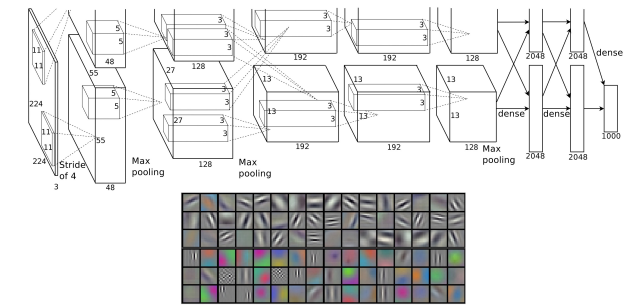
- Deep Convolutional Neural Networks를 활용한 ImageNet classification
- 일명 "AlexNet"
- Alex Krizhevsky, Ilya Sutskever, Geoffrey E Hinton, 2012
- ILSVRC (ImageNet Large Scale Visual Recognition Challenge) 2012 우승

## Famous Image Datasets: ImageNet

## Famous Image Datasets: MNIST
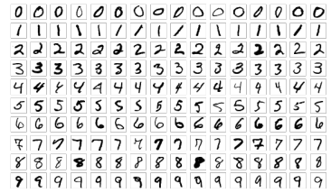
- The MNIST database
- "Modified National Institute of Standards and Technology database"
- 다양한 Image processing systems 학습에 일반적으로 사용되는 대규모 손글씨 숫자 Database
- 60,000개의 Training images와 10,000개의 Testing images 포함

## Famous Image Datasets: `CIFAR 10` vs. ``CIFAR 10`0`
- `CIFAR-10`
    - 10개 Class, Class당 6,000장의 이미지로 구성된 60,000장의 32x32 컬러 이미지
    - 50,000개의 Training images와 10,000개의 Test images 존재
- `CIFAR-100`
    - `CIFAR-10`과 유사하나, 각각 600장의 이미지를 포함하는 100개 Class 보유
    - Class당 500개의 Training images와 100개의 Testing images 존재

## Fast-Forward to Today: ConvNets Are Everywhere
- Classification
- Retrieval
- Detection
- Segmentation
- Image Captioning
- Style Transfer
- Self-driving Cars
- Diffusion models

# Convolutional Neural Networks
Convolutional Layer

## Recap: Fully Connected Layer (Simple FF Networks)
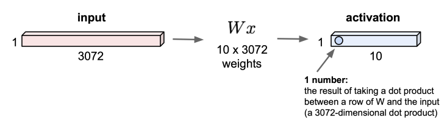
$32 \times 32 \times 3 ~\text{image} \to $ stretch to $3072 \times 1$

## Convolution Layer
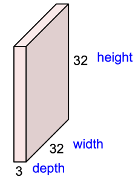

$32 \times 32 \times 3 ~\text{image} \to $ preserve spatial structure

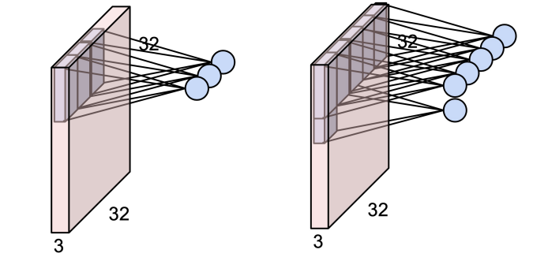

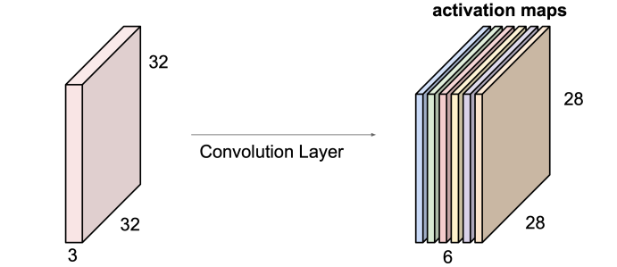

# Convolutional Networks
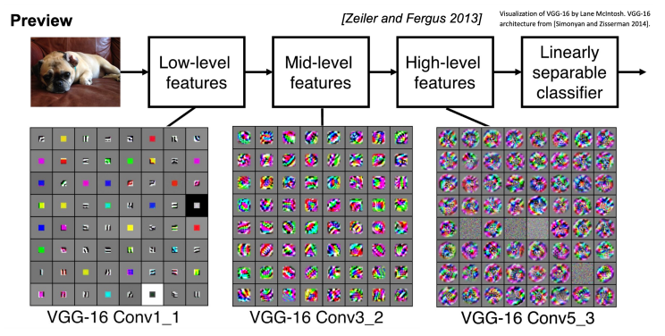

## A Closer Look at Spatial Dimensions
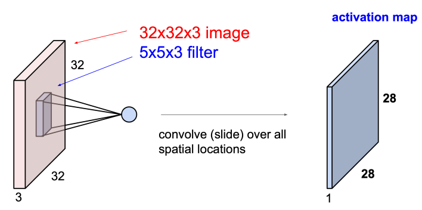

## In Practice: Common to Zero Pad the Border

## Caution

## Summary: Convolutional Layer
- 입력이 $W_1 \times H_1 \times C$라고 가정
- Conv layer는 4가지 Hyperparameters 필요:
    - Number of filters $K$
    - The filter size $F$
    - The stride $S$
    - The zero padding $P$
- 다음의 출력 $W_2 \times H_2 \times K$ 생성:
    - $W_2 = (W_1 - F + 2P) / S + 1$
    - $H_2 = (H_1 - F + 2P) / S + 1$
- Number of parameters: $F \times F \times C \times K$ weights + $K$ biases

## Pooling Layer
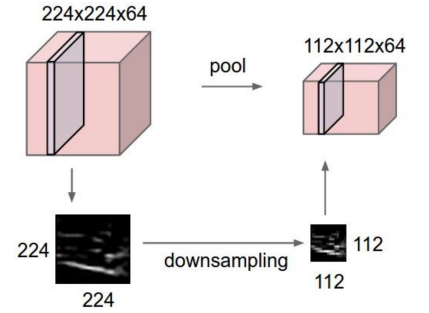
- Representations를 더 작고 관리하기 쉽게 만듦
- 각 Activation map에 대해 독립적으로 작동

## Max Pooling
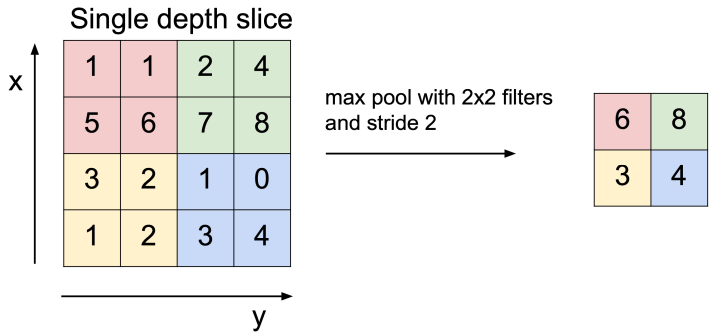

## Summary: Pooling Layer
- 입력이 $W_1 \times H_1 \times C$라고 가정
- Pooling Layer는 2가지 Hyperparameters 필요:
    - The spatial extent $F$
    - The stride $S$
- 다음의 출력 $W_2 \times H_2 \times C$ 생성:
    - $W_2 = (W_1 - F) / S + 1$
    - $H_2 = (H_1 - F) / S + 1$
- Number of parameters: 0

## Fully-Connected (FC) Layer
- 일반적인 Feedforward Neural Networks와 같이 전체 Input volume에 연결된 Neurons 포함

## Summary
- ConvNets는 CONV, POOL, FC layers를 쌓음
- 역사적인 Architectures 형태: `[(CONV-RELU)*N-POOL?]*M, (FC-RELU)*K, SOFTMAX`
    - $N$은 보통 5까지, $M$은 큼, $0 \le K \le 2$
- 더 작은 Filters와 더 깊은 Architectures를 향한 추세
- POOL/FC layers를 제거하는 추세 (Just CONV)

# Representative CNN Architectures
GoogleNet, VGGNet, ResNet, …

## ImageNet Large Scale Visual Recognition Challenge (ILSVRC) Winners

## VGGNet
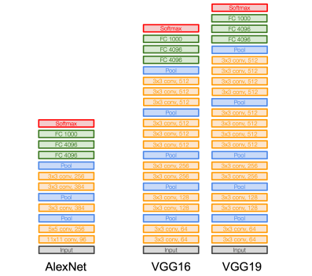
- 작은 Filters, 더 깊은 Networks
- 8 layers (AlexNet) → 16 - 19 layers (VGG16Net)
- 3x3 CONV stride 1, pad 1과 2x2 MAX POOL stride 2만 사용

## ResNet

- Residual connections를 사용하는 매우 깊은 Networks
- ImageNet을 위한 152-layer model - ILSVRC’15 classification 우승
- ILSVRC’15 및 COCO’15의 모든 Classification 및 Detection competitions 석권

## CNN for Text Classification

- Sentence Classification을 위한 Convolutional Neural Networks
- Yoon Kim, EMNLP 2014