# 26. Attention Mechanism and Self-Attention

# Sequence-to-Sequence Models
Focusing on neural machine translation

## Machine Translation
- **Machine Translation (MT)**
  - Source language의 문장 $x$를 target language의 문장 $y$로 번역하는 task
- The early history of MT: 1950s
  - "A.I."라는 용어가 만들어지기 전인 1950년대 초반에 시작
  - 주로 단어 치환을 수행하는 단순한 규칙 기반 시스템
  - 자연어 syntax, semantics, pragmatics(화용론)에 대한 이해 부족

## Neural Machine Translation
- **Neural Machine Translation (NMT)**
  - 하나의 end-to-end Neural Network로 machine Translation을 수행하는 방법
  - 해당 neural Network 아키텍처는 sequence-to-sequence model (a.k.a seq2seq)이라 불리며 두 개의 RNN을 포함

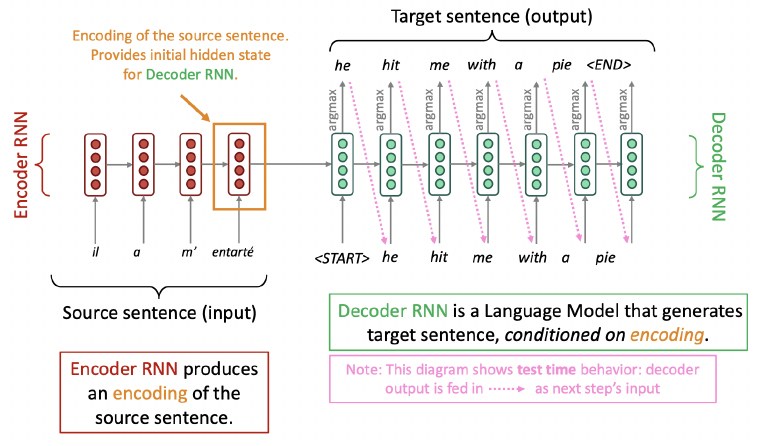

## Sequence-to-Sequence is Versatile!
- **Encoder-Decoder model**이라는 일반적인 개념
  - 하나의 neural network는 입력을 받아 neural representation을 생성
  - 다른 network는 해당 neural representation을 기반으로 출력을 생성
  - 입력과 출력이 sequence인 경우 이를 **Seq2seq model**이라 칭함
- **Sequence-to-sequence**는 MT(Machine Translation) 외에도 다양한 nLP(Natural Language Processing) Task에 유용
  - Summarization (Long text → Short text)
  - Dialogue (Previous utterances(발화) → Next utterance)
  - Code generation (Natural language → Python code)

## Neural Machine Translation (NMT)
- Sequence-to-sequence model은 **Conditional Language Model**의 한 예시
  - Decoder가 target sentence $y$의 다음 단어를 예측하므로 language model이라 할 수 있음.
  - 예측이 source sentence $x$에 조건을 받기(Conditioned) 때문에 conditional이라 할 수 있음.
- NMT는 $P(y|x)$를 직접 계산
$$P(y|x)$$
$$= P(y_1|x) P(y_2|y_1, x) P(y_3|y_1, y_2, x) \dots P(y_T|y_1, \dots, y_{T-1}, x)$$
- MT System 학습 방법
  - 대규모 parallel corpus 확보
  - Unsupervised NMT, data augmentation 등에 대한 흥미로운 연구 존재

## Training a Neural Machine Translation System
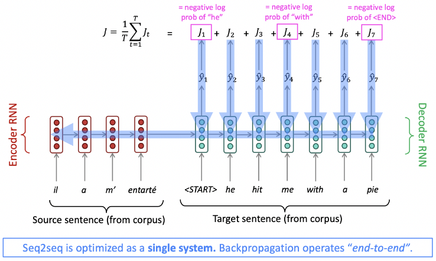

# Introduction to Attention

## The Bottleneck Problem of Seq2Seq

## Attention
- **Attention** (mechanism)은 bottleneck 문제에 대한 해결책 제공
  - Core idea: Decoder의 각 단계에서 encoder에 직접 연결하여 source sequence의 특정 부분에 집중(Focus)

## Sequence-to-Sequence with Attention
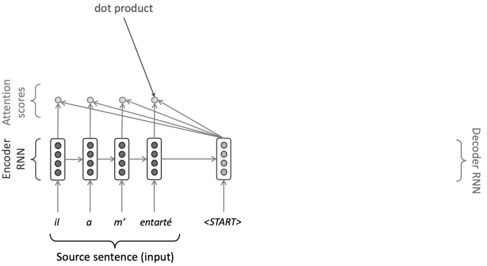

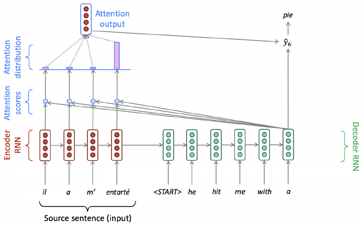

## Attention: In Equations
- Procedure
  1. Encoder hidden states $h_1, \dots, h_N \in \mathbb{R}^h$ 보유
  2. Timestep $t$에서 decoder hidden state $s_t \in \mathbb{R}^h$ 보유
  3. 이 단계의 attention scores $e_t$ 계산
    $$e^t = [s_t^T h_1, \dots, s_t^T h_N] \in \mathbb{R}^N$$
  4. Softmax를 취해 이 단계의 attention distribution $\alpha_t$ 획득 (확률 분포이며 합은 1)
    $$\alpha^t = \text{softmax}(e^t) \in \mathbb{R}^N$$
  5. $\alpha_t$를 사용하여 encoder hidden states의 weighted sum인 attention output $a_t$ 계산
    $$a_t = \sum_{i=1}^{N} \alpha_i^t h_i \in \mathbb{R}^h$$
  6. 마지막으로 attention output $a_t$를 decoder hidden state $s_t$와 concatenate하고 non-attention seq2seq model과 같이 진행
    $$[a_t; s_t] \in \mathbb{R}^{2h}$$

## Attention is Great!
- Attention은 NMT 성능을 크게 향상
  - Decoder가 source의 특정 부분에 집중하도록 하는 것이 매우 유용
- Attention은 MT 과정에 대해 더 "Human-like"한 model을 제공
  - 전체를 기억할 필요 없이 번역하면서 source sentence를 다시 볼 수 있음
- Attention은 bottleneck 문제 해결
  - Decoder가 source를 직접 볼 수 있게 하여 bottleneck 우회
- Attention은 vanishing gradient 문제 해결에 도움
  - 멀리 떨어진 state로의 shortcut 제공
    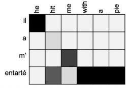
- Attention은 어느 정도의 interpretability(해석 가능성) 제공
  - Attention distribution을 검사하여 decoder가 무엇에 집중했는지 확인 가능
  - (Soft) Alignment를 무료로 획득
  - Alignment system을 명시적으로 학습하지 않았음에도 network가 스스로 alignment를 학습했다는 점이 흥미로움

## Attention is A General Deep Learning Technique
- Attention이 machine Translation을 위한 sequence-to-sequence model을 개선하는 훌륭한 방법임을 확인
  - 그러나, Seq2seq뿐만 아니라 다양한 아키텍처와 MT 외의 다양한 작업에서 attention 사용 가능
- Attention의 **더 일반적인** 정의
  - Vector **Values** 집합과 vector **Query**가 주어졌을 때, Attention은 **Query**에 의존하여 **Values**의 weighted sum을 계산하는 기법
- 때때로 **Query**가 **Values**에 **Attend**한다고 표현
  - 예: Seq2seq + Attention model에서 각 decoder hidden state (**Query**)는 모든 encoder hidden states (**Values**)에 attend
- 직관
  - Weighted sum은 **Values**에 포함된 정보의 선택적 요약(Selective summary)이며, **Query**가 어떤 **Values**에 집중할지 결정
  - Attention은 임의의 representations 집합(**Values**)으로부터 다른 representation(Query)에 의존하여 fixed-size representation을 얻는 방법
- 결론
  - Attention은 모든 Deep Learning Model에서 pointer 및 memory 조작을 위한 강력하고 유연하며 일반적인 방법이 됨.
  - 2010년 이후 NMT로부터 나온 새로운 아이디어

# From RNN to Attention-Based NLP Models Self-Attention
Self-Attention

## As of Last Lecture: Recurrent Models for (Most) NLP
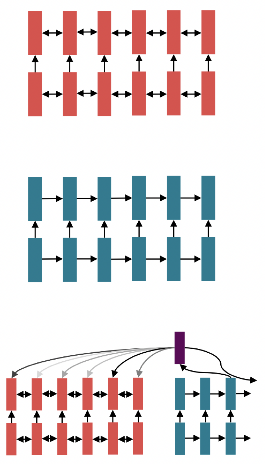
- 2016-2018년경, NLP의 사실상 표준 전략은 문장을 **Bidirectional LSTM**으로 인코딩하는 것
  - 예: 번역에서의 source sentence
- 그 후, 출력(Translation, Sentence, Summary)을 sequence로 정의하고 생성을 위해 LSTM 사용
- 유연한 memory 접근을 위해 attention 사용

## Same Goals, Different Building Blocks
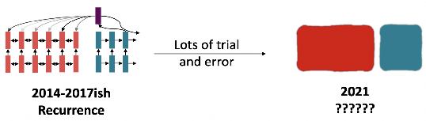
- Sequence-to-sequence 문제와 Encoder-Decoder model에 대해 학습
  - 현재로서는 문제를 바라보는 완전히 새로운 방식을 동기부여하려는 것이 아님
  - 대신 model에 적용하여 폭넓은 발전을 가능하게 할 최상의 **Building Blocks**를 찾으려는 것

## Issues with Recurrent Models: Linear Interaction Distance
- RNN은 "Left-to-right"로 unrolled(입력을 받아들여 처리)됨
  - 이는 **Linear locality**를 인코딩하며 유용한 heuristic
  - 가까운 단어들은 종종 서로의 의미에 영향을 미침
- Problem
  - RNN은 멀리 떨어진 단어 쌍이 상호작용하기 위해 $O(\text{sequence length})$ 단계가 필요

## Issues with Recurrent Models: Linear Interaction Distance
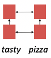
- 멀리 떨어진 단어 쌍의 상호작용에 $O(\text{sequence length})$ 단계가 필요하다는 의미
  - Long-distance dependencies 학습의 어려움 (Gradient 문제 때문)
  - 단어의 linear order가 "Baked in" 됨
    - 그러나 linear order가 문장을 생각하는 최선의 방법이 아닐 수 있음

## Issues with Recurrent Models: Lack of Parallelizability
- Forward 및 backward pass는 $O(\text{sequence length})$의 unparallelizable(병렬화 불가)한 연산을 포함
  - GPU는 한 번에 많은 독립적인 계산을 수행 가능
  - 그러나 미래의 RNN hidden states는 과거의 RNN hidden states가 계산되기 전까지는 완전히 계산될 수 없음
  - 이는 매우 큰 dataset에서의 **학습을 저해**

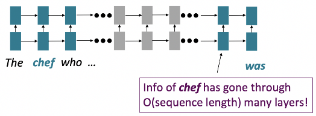

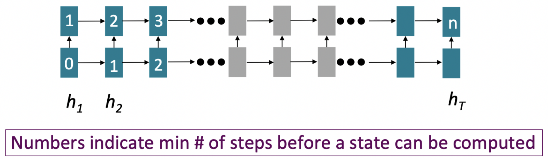

## If Not Recurrence, Then What? How About Attention?
- Attention은 각 단어의 representations를 **Query**로 취급하여 **Values** 집합의 정보에 접근하고 통합
  - Decoder에서 encoder로의 attention을 보았으나, 이제 단일 문장 내에서의 attention을 고려 → **Self-Attention!**
  - Attention의 경우, 병렬화 불가한 연산의 수가 sequence length에 따라 증가하지 않음
  - Maximum interaction distance: 모든 단어가 모든 layer에서 상호작용하므로 $O(1)$
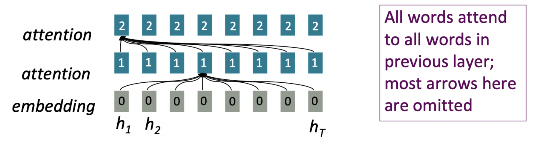

## Attention as a Soft, Averaging Lookup Table
- Attention을 Key-Value store에서의 fuzzy lookup 수행으로 생각할 수 있음

## Self-Attention Hypothetical Example

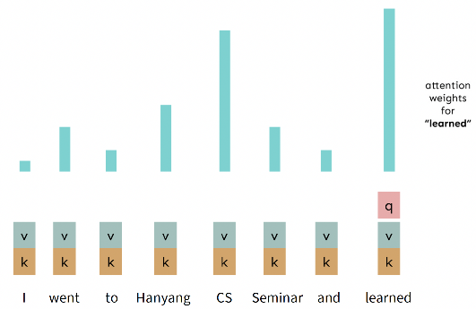

## Self-Attention: Keys, Queries, **Values** from the Same Sequence
- 단어장 $V$ 내의 단어 sequence $w_{1:n}$ 가정
  - 예: *"Zuko made his uncle tea"*
- 각 $w_i$에 대해 $x_i = Ew_i$ (여기서 $E \in \mathbb{R}^{d \times V}$는 embedding matrix)
1. 각 word embedding을 weight matrices $Q, K, V$ (각각 $\mathbb{R}^{d \times d}$)로 변환
  $$q_i = Qx_i \text{ (queries)}, \quad k_i = Kx_i \text{ (keys)}, \quad v_i = Vx_i \text{ (Values)}$$
2. Keys와 queries 간의 pairwise similarities 계산 및 softmax로 정규화
  $$e_{i,j} = q_i \cdot k_j, \quad \alpha_{i,j} = \frac{\exp(e_{i,j})}{\sum_{k} \exp(e_{i,k})}$$
3. 각 단어에 대한 출력을 **Values**의 weighted sum으로 계산
  $$o_i = \sum_{j} \alpha_{i,j} v_j$$

## Barriers & Solutions for Self-Attention as A Building Block
- **Barrier**(장애물): 순서에 대한 고유한 개념 부재
  - **Solution**: Input에 position representation 추가
- **Barrier**: Deep Learning을 위한 nonlinearity 부재 (단지 weighted average일 뿐임)
  - **Solution**: 각 self-attention output에 동일한 feedforward network 적용
- **Barrier**: Sequence 예측 시 미래를 보지 않도록 보장 필요
  - Machine translation의 경우
  - 혹은 language modeling의 경우
  - **Solution**: Attention weight를 인위적으로 0으로 설정하여 미래를 mask out