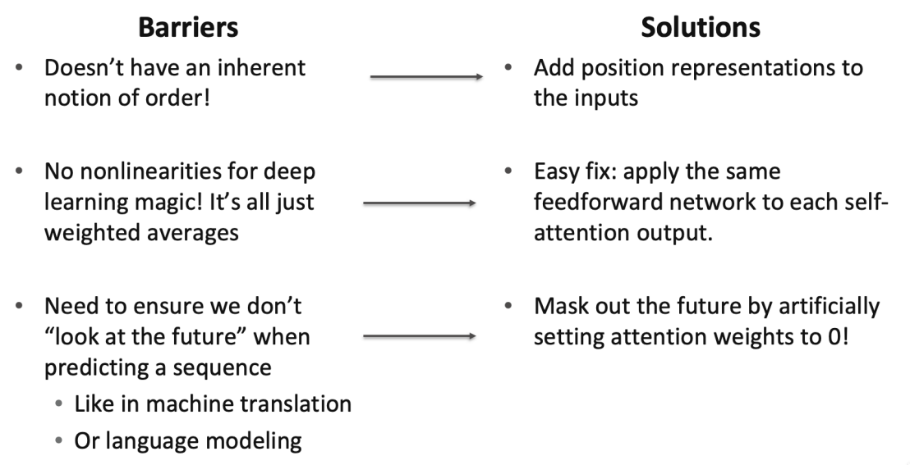

# 27. Transformers (1)

# Self-Attention
Modeling sequence without recurrence

## Review: Sequence-to-Sequence with Attention

## If Not Recurrence, Then What? How About Attention?
- Attention은 각 단어의 표현을 Query로 취급하여 value 집합의 정보에 접근 및 통합함.
  - Decoder에서 Encoder로의 Attention이 아닌, 단일 문장 내에서의 Attention $\rightarrow$ **Self-Attention**!
  - Attention 사용 시, 시퀀스 길이에 따른 병렬화 불가능 연산 수가 증가하지 않음.
  - 최대 상호작용 거리: $O(1)$ (모든 단어가 모든 레이어에서 상호작용하기 때문).

## Self-Attention: Keys, Queries, Values from the Same Sequence
- 단어 시퀀스 $w_{1:n}$ (어휘 $V$) 가정
  - 예: "Zuko made his uncle tea"
- 각 $w_i$에 대해 $x_i = Ew_i$ ($E \in \mathbb{R}^{d \times V}$는 임베딩 행렬)

1. 각 단어 임베딩을 가중치 행렬 $Q, K, V$ (각 $\mathbb{R}^{d \times d}$)로 변환함.
    - $q_i = Qx_i$ (Queries), $k_i = Kx_i$ (Keys), $v_i = Vx_i$ (Values).
2. Key와 Query 간의 쌍별(pairwise) 유사도 계산 및 Softmax로 정규화
    - $e_{ij} = q_i^T k_j$
    - $\alpha_{ij} = \frac{\exp(e_{ij})}{\sum_{j'} \exp(e_{ij'})}$
3. Value의 가중 합으로 각 단어의 출력 계산
    - $o_i = \sum_j \alpha_{ij}v_j$

## Self-Attention as a Building Block
- 우측 다이어그램과 같이 LSTM 레이어를 쌓는 것처럼 Self-Attention 블록을 쌓음.
- Self-Attention이 순환(Recurrence)의 완전한 대체제가 될 수 있는가?
  - No. 몇 가지 문제가 존재하며 이를 살펴볼 예정임.
  - 첫째, Self-Attention은 집합(Set)에 대한 연산임. 순서(Order)에 대한 내재적 개념이 없음.

> Self-Attention은 입력의 순서에 대해서 알지 못함.

## Barriers & Solutions for Self-Attention as A Building Block

## Fixing the First Self-Attention Problem: Sequence Order
- Self-Attention에는 순서 정보가 없으므로 Key, Query, Value에 문장의 순서를 인코딩해야 함.
- 각 시퀀스 인덱스를 벡터로 표현한다고 가정
  - $p_i \in \mathbb{R}^d$, $i \in \{1, 2, \dots, n\}$은 위치 벡터임.
  - $p_i$의 구성 방식은 아직 고려하지 않음.
  - 이 정보를 Self-Attention 블록에 통합하는 것은 간단함: 입력에 $p_i$를 더함.
  - $x_i$는 인덱스 $i$의 단어 임베딩임을 상기. 위치 정보가 포함된 임베딩은 다음과 같음
    - $\tilde{x}_i = x_i + p_i$

## Position Representation Vectors through Sinusoids
- 사인파 위치 표현 (Sinusoidal position representations)
  - 다양한 주기의 사인 함수를 연결함.
  - 원래의 Transformer 논문에서 제안된 방식임.
  - 장점
    - 주기성은 "절대 위치"가 중요하지 않을 수 있음을 시사함.
    - 주기가 다시 시작되므로 더 긴 시퀀스로 외삽(Extrapolate) 가능할 수 있음.
  - 단점
    - 학습되지 않음(Not learnable). 실제로는 외삽이 잘 작동하지 않음.
    

## Position Representation Vectors Learned from Scratch
- 학습된 절대 위치 표현 (Learned absolute position representations)
  - 모든 $p_i$를 학습 가능한 파라미터로 설정함; 행렬 $P \in \mathbb{R}^{d \times n}$을 학습하고 각 $p_i$를 해당 행렬의 열로 사용함.
  - 대부분의 시스템에서 이 방식을 사용함.
  - 장점: 유연성(Flexibility) - 각 위치가 데이터에 적합하도록 학습됨.
  - 단점: $1, \dots, n$ 범위를 벗어난 인덱스로는 절대 외삽 불가능함.
- 때때로 더 유연한 위치 표현을 시도하기도 함
  - 상대 선형 위치 Attention (Relative linear position attention).
  - 의존 구문 기반 위치 (Dependency syntax-based position).
  - 로터리 위치 임베딩 (Rotary position embedding, RoPE).

## Adding Non-Linearities in Self-Attention
- Self-Attention에는 요소별(elementwise) 비선형성이 존재하지 않음.
  - Self-Attention 레이어를 더 쌓는 것은 단순히 Value 벡터를 재평균화(re-averaging)하는 것에 불과함.
- 간단한 해결책
  - 각 출력 벡터를 후처리하기 위해 피드포워드 네트워크(Feed-forward network) 추가함.
  - $m_i = MLP(output_i) = W_2 \cdot ReLU(W_1 \cdot output_i + b_1) + b_2$

## Masking the Future in Self-Attention
- Decoder에서 Self-Attention을 사용하려면 미래를 볼 수 없도록 해야 함.
  - 매 타임스텝마다 Key와 Query 집합을 과거 단어만 포함하도록 변경할 수도 있음.
  - 병렬화(Parallelization)를 가능하게 하기 위해, 미래 단어에 대한 Attention 점수를 $-\infty$로 설정하여 마스킹 처리함.
  - $e_{ij} = \begin{cases} q_i^T k_j, & j \le i \\ -\infty, & j > i \end{cases}$

## Necessities for a Self-Attention Building Block
- Self-Attention
  - 방법론의 기초임.
- Position representations
  - Self-Attention은 입력의 순서를 고려하지 않는 함수이므로 시퀀스 순서를 명시해야 함.
- Nonlinearities
  - Self-Attention 블록의 출력 부분에 위치함.
  - 주로 간단한 피드포워드 네트워크로 구현됨.
- Masking
  - 미래를 보지 않으면서 연산을 병렬화하기 위함임.
  - 미래의 정보가 과거로 "유출"되는 것을 방지함.

## Transformers
- Self-Attention 기반의 신경망임.

## Transformer
- 오직 Attention 메커니즘으로만 설계된 신경망 아키텍처임 (CNN이나 RNN 없음).
  - Attention is all you need (Ashish Vaswani et al., NeurIPS 2017).
  - Self-Attention 메커니즘이 핵심에 위치함.
  - 표현의 병렬 계산 가능 $\Rightarrow$ 확장성(Scalability) $\uparrow$.
  - 본래 기계 번역(Seq2Seq 아키텍처)을 위해 제안됨.

## Transformer
- (슬라이드 16: 아키텍처 도표)

## The Transformer Decoder
- 트랜스포머 디코더는 언어 모델과 같은 시스템을 구축하는 방식임.
  - 최소한의 Self-Attention 아키텍처와 유사하지만 몇 가지 구성 요소가 추가됨.
  - 임베딩과 위치 임베딩은 동일함.
  - 다음으로 Self-Attention을 Multi-Head Self-Attention으로 대체할 것임.

## Recall the Self-Attention Hypothetical Example
- (슬라이드 18: 다이어그램)

## Hypothetical Example of Multi-Head Attention
- (슬라이드 19: 다이어그램)

## Sequence-Stacked Form of Attention
- 행렬을 통한 Key-Query-Value Attention 계산 방식임.
  - $X = [x_1; \dots; x_n] \in \mathbb{R}^{n \times d}$를 입력 벡터의 연결(Concatenation)로 정의함.
  - $XK \in \mathbb{R}^{n \times d}, XQ \in \mathbb{R}^{n \times d}, XV \in \mathbb{R}^{n \times d}$임.
  - 출력 정의: $output = \text{softmax}(XQ(XK)^T)XV \in \mathbb{R}^{n \times d}$.

## Multi-Headed Attention
- 문장의 여러 위치를 동시에 보고 싶다면?
  - 단어 $i$에 대해 Self-Attention은 $x_i^T Q^T K x_j$가 높은 곳을 보지만, 다른 이유로 다른 $j$에 집중해야 할 수도 있음.
- 여러 개의 $Q, K, V$ 행렬을 통해 다수의 Attention "Head"를 정의함.
  - $Q_l, K_l, V_l \in \mathbb{R}^{d \times \frac{d}{h}}$ ($h$는 Attention Head의 수, $l$은 1부터 $h$까지).
  - 각 Attention Head는 독립적으로 Attention 수행함
    - $output_l = \text{softmax}(XQ_l K_l^T X^T) - XV_l$, 여기서 $output_l \in \mathbb{R}^{d/h}$.
  - 그 후 모든 Head의 출력을 결합함!
    - $output = [output_1; \dots; output_h]Y$, 여기서 $Y \in \mathbb{R}^{d \times d}$.
  - 각 Head는 서로 다른 것을 보고, Value 벡터를 다르게 구성함.

## Multi-Head Self-Attention is Computationally Efficient
- $h$개의 Attention Head를 계산하더라도 비용이 크게 증가하지 않음.
  - $XQ \in \mathbb{R}^{n \times d}$를 계산한 후 $\mathbb{R}^{n \times h \times \frac{d}{h}}$로 Reshape 함 (XK, XV도 동일).
  - 그 후 $\mathbb{R}^{h \times n \times \frac{d}{h}}$로 Transpose 함; 이제 Head 축이 Batch 축처럼 동작함.
  - 거의 모든 과정이 동일하며, 행렬 크기도 동일함.

## Scaled Dot Product [Vaswani et al., 2017]
- "Scaled Dot Product" Attention은 학습을 도움.
  - 차원 $d$가 커지면 벡터 간 내적(Dot product) 값이 커지는 경향이 있음.
  - 이로 인해 Softmax 함수의 입력값이 커져 기울기(Gradient)가 작아짐.
- 해결책
  - 기존에 본 Self-Attention 함수 대신
    - $output_l = \text{softmax}(XQ_l K_l^T X^T) - XV_l$
  - Attention 점수를 $\sqrt{d/h}$로 나누어 차원 수($d/h$)에 따라 점수가 커지는 것을 방지함.
    - 
  - $output_l = \text{softmax}(\frac{XQ_l K_l^T X^T}{\sqrt{d/h}}) - XV_l$

## The Transformer Decoder
- 두 가지 최적화 트릭
  - Residual Connections
  - Layer Normalization
  - 대부분의 트랜스포머 다이어그램에서 이들은 "Add & Norm"으로 함께 표기됨.

## Residual Connections [He et al., 2016]
- Residual connections는 모델 학습을 돕는 트릭임.
  - $X^{(i)} = Layer(X^{(i-1)})$ ($i$는 레이어) 대신,
  - $X^{(i)} = X^{(i-1)} + Layer(X^{(i-1)})$ 로 설정함 (이전 레이어로부터의 "잔차"만 학습하면 됨).
  - 잔차 연결을 통한 기울기 전파가 원활함 (기울기가 1임).

## Layer Normalization [Ba et al., 2016]
- Layer normalization은 모델 학습 속도를 높이는 트릭임.
  - 아이디어: 각 레이어 내에서 평균을 0, 표준편차를 1로 정규화하여 은닉 벡터 값의 정보 없는 변동을 줄임.
  - LayerNorm의 성공 요인은 기울기 정규화에 있을 수 있음 [Xu et al., 2019].
- 세부 사항
  - $x \in \mathbb{R}^d$를 모델의 개별 (단어) 벡터라 가정함.
  - $\mu = \frac{1}{d} \sum_{j=1}^d x_j$: 평균 ($\mu \in \mathbb{R}$).
  - $\sigma = \sqrt{\frac{1}{d} \sum_{j=1}^d (x_j - \mu)^2}$: 표준편차 ($\sigma \in \mathbb{R}$).
  - $\gamma \in \mathbb{R}^d$와 $\beta \in \mathbb{R}^d$는 학습된 "Gain"과 "Bias" 파라미터임 (생략 가능).
  - 레이어 정규화 계산 수행함.

## The Transformer Decoder
- 트랜스포머 디코더는 트랜스포머 디코더 블록의 스택(Stack)임.
- 각 블록의 구성
  - Self-Attention
  - Add & Norm
  - Feed-Forward
  - Add & Norm

## The Transformer Encoder
- 트랜스포머 디코더는 언어 모델과 같이 단방향(Unidirectional) 문맥으로 제한됨.
- 양방향(Bidirectional) RNN처럼 양방향 문맥을 원한다면?
- 이것이 트랜스포머 인코더임. 유일한 차이점은 Self-Attention에서 마스킹을 제거한다는 것임.

## The Transformer Encoder-Decoder
- 기계 번역에서 소스 문장을 양방향 모델로 처리하고 타겟을 단방향 모델로 생성했던 것을 상기함.
- 이러한 Seq2Seq 형식을 위해 주로 트랜스포머 인코더-디코더를 사용함.
  - 일반적인 트랜스포머 인코더 사용함.
  - 트랜스포머 디코더는 인코더의 출력에 대해 Cross-Attention을 수행하도록 수정됨.

## Cross-Attention
- Self-Attention은 Key, Query, Value가 동일한 소스에서 옴.
- 디코더에서는 이전에 본 것과 더 유사한 형태의 Attention을 가짐.
  - $h_1, \dots, h_n$을 트랜스포머 인코더의 출력 벡터라 함 ($h_i \in \mathbb{R}^d$).
  - $z_1, \dots, z_n$을 트랜스포머 디코더의 입력 벡터라 함 ($z_i \in \mathbb{R}^d$).
  - Key와 Value는 인코더에서 추출됨 (메모리 역할)
    - $k_i = K h_i, v_i = V h_i$.
  - Query는 디코더에서 추출됨
    - $q_i = Q z_i$.