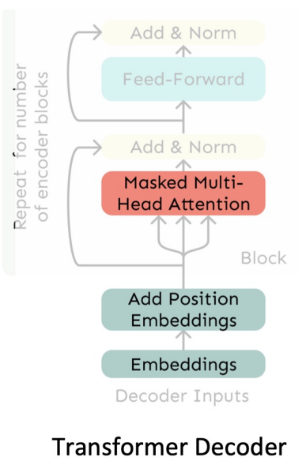
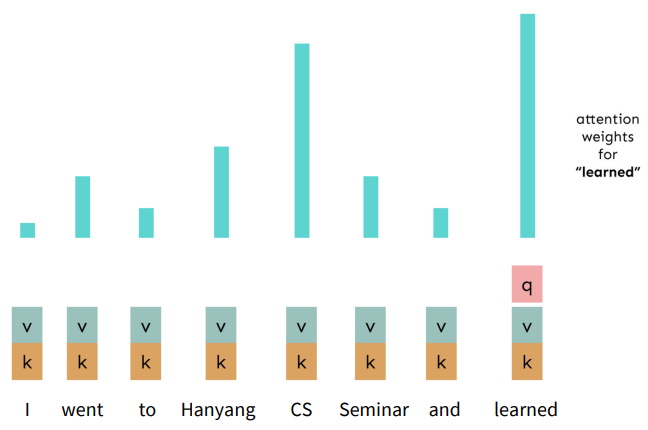
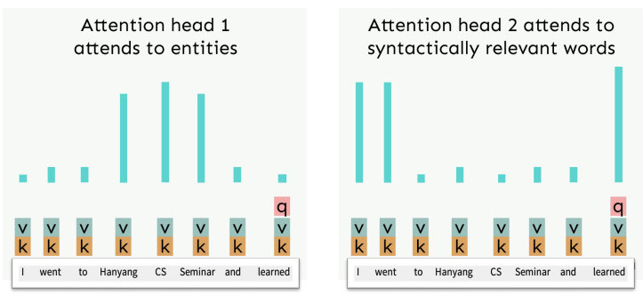
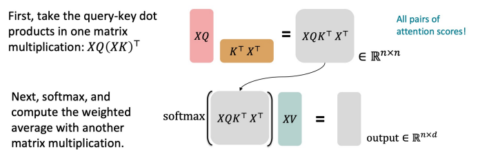
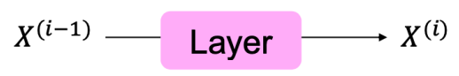
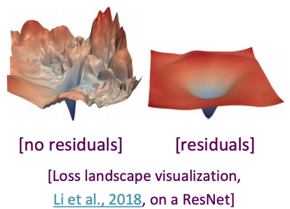
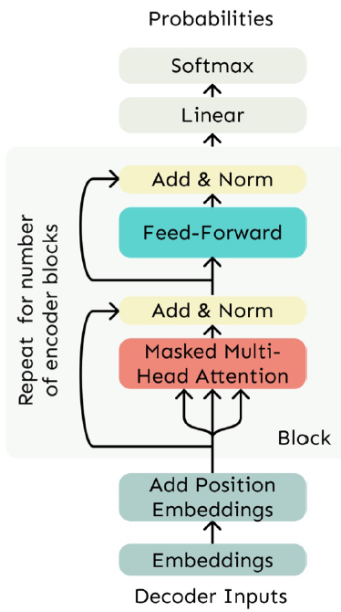
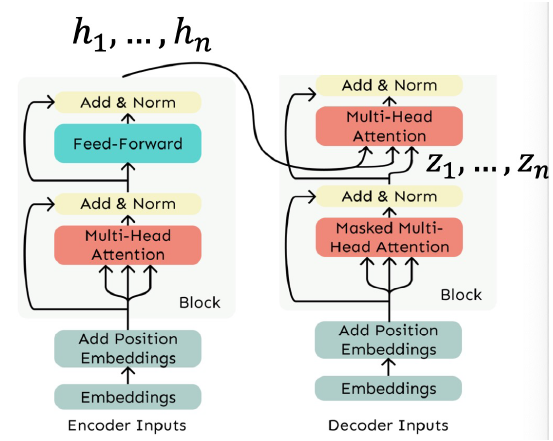

# 22. Transformers (2)

## Self-Attention: Keys, Queries, Values from the Same Sequence
- Vocabulary $V$의 단어 Sequence를 $w_{1:n}$으로 정의
  - 예: "Zuko made his uncle tea"
- 각 $w_i$에 대하여 $x_i = Ew_i$로 정의 ($E \in \mathbb{R}^{d \times V}$는 Embedding Matrix)
1. Weight Matrices $Q, K, V$ (각 $\mathbb{R}^{d \times d}$)를 사용해 각 Word Embedding 변환
  - $q_i = Qx_i$ (Queries), $k_i = Kx_i$ (Keys), $v_i = Vx_i$ (Values)
2. Key와 Query 간의 Pairwise Similarity 계산 및 Softmax 정규화
  - $e_{ij} = q_i^T k_j$
  - $\alpha_{ij} = \frac{\exp(e_{ij})}{\sum_{j'} \exp(e_{ij'})}$
3. 각 단어에 대한 Output을 Value들의 Weighted Sum으로 계산
$$o_i = \sum_{j} \alpha_{ij} v_j$$

# Transformers
Self-attention에 기반한 neural networks

## Transformer
- 오직 Attention Mechanism만으로 설계된 Neural Architecture (CNN이나 RNN 미사용)
  - "Attention is all you need" (Ashish Vaswani et al., NeurIPS 2017)
  - 핵심 요소인 Self-Attention Mechanism
  - Representation의 병렬 계산 가능 및 Scalability 향상
  - 본래 Machine Translation (Seq2seq Architecture)을 위해 제안됨

## The Transformer Decoder
- Language Model과 같은 시스템 구축에 활용되는 Transformer Decoder
  - 최소한의 Self-Attention Architecture와 유사하나 몇 가지 추가 구성 요소 포함
  - Embedding과 Position Embedding은 동일
  - 기존 Self-Attention을 Multi-Head Self-Attention으로 대체

## Recall the Self-Attention Hypothetical Example

## Hypothetical Example of Multi-Head Attention

## Sequence-Stacked Form of Attention
- Matrix 형태의 Key-Query-Value Attention 계산 방식
- Input Vector들의 Concatenation인 $X = [x_1; \dots; x_n] \in \mathbb{R}^{n \times d}$ 설정
- $XK \in \mathbb{R}^{n \times d}, XQ \in \mathbb{R}^{n \times d}, XV \in \mathbb{R}^{n \times d}$임
- Output 정의: $\text{output} = \text{softmax}(XQ(XK)^T)XV \in \mathbb{R}^{n \times d}$

## Multi-Headed Attention
- 문장 내 여러 위치를 동시에 참조해야 할 경우
- 단어 $i$에 대해 Self-Attention은 $x_i^T Q^T K x_j$가 높은 곳을 보지만, 다른 이유로 다른 $j$에 집중할 필요성 존재
- 여러 개의 $Q, K, V$ Matrices를 통해 여러 Attention "Heads" 정의
- $Q_l, K_l, V_l \in \mathbb{R}^{d \times \frac{d}{h}}$ ($h$: Attention Head 수, $l$: 1~$h$)
- 각 Attention Head의 독립적 Attention 수행
  - $\text{output}_l = \text{softmax}(XQ_l K_l^T X^T) * XV_l$ ($\text{output}_l \in \mathbb{R}^{n \times \frac{d}{h}}$)
- 모든 Head의 Output 결합
  - $\text{output} = [\text{output}_1; \dots; \text{output}_h]Y$ ($Y \in \mathbb{R}^{d \times d}$)
- 각 Head가 서로 다른 대상을 보고 Value Vector를 다르게 구성 가능

## Multi-Head Self-Attention is Computationally Efficient
- $h$개의 Attention Head를 계산하더라도 비용 효율적임
- $XQ \in \mathbb{R}^{n \times d}$ 계산 후 $\mathbb{R}^{n \times h \times \frac{d}{h}}$로 Reshape ($XK, XV$ 동일)
- $\mathbb{R}^{h \times n \times \frac{d}{h}}$로 Transpose하여 head Axis를 Batch Axis처럼 활용
- 그 외 거의 모든 부분이 동일하며 Matrix 크기도 같음

## Scaled Dot Product [Vaswani et al., 2017]
- Training을 돕기 위한 "Scaled Dot Product" Attention
- Dimensionality $d$가 커질수록 Vector 간 Dot Product가 커지는 경향
- 이로 인해 Softmax 입력값이 커져 Gradient가 작아지는 문제 발생
- Solution
  - 기존 Self-Attention 함수: $\text{output}_l = \text{softmax}(XQ_l K_l^T X^T) * XV_l$ 대신
  - Attention Score를 $\sqrt{d/h}$로 나누어 점수 크기 조절
    - $\text{output}_l = \text{softmax}(\frac{XQ_l K_l^T X^T}{\sqrt{d/h}}) * XV_l$

## The Transformer Decoder
- 두 가지 Optimization Tricks
  - Residual Connections
  - Layer Normalization
  - 대부분의 Transformer Diagram에서 "Add & Norm"으로 함께 표기됨

## Residual Connections [He et al., 2016]
- Model 학습 향상을 위한 trick
- $X^{(i)} = Layer(X^{(i-1)})$ 대신 $X^{(i)} = X^{(i-1)} + Layer(X^{(i-1)})$ 사용 (이전 Layer의 residual만 학습)

- Residual connection을 통한 원활한 gradient 흐름 (Gradient는 1)

## Layer Normalization [Ba et al., 2016]
- Model 학습 속도 향상을 위한 trick
- Idea: 각 layer 내에서 unit Mean과 standard deviation으로 정규화하여 hidden Vector 값의 uninformative variation 감소
- LayerNorm의 성공 요인으로 추정되는 gradient normalization [Xu et al., 2019]
- Details
  - Model 내 개별 Vector $x \in \mathbb{R}^d$
  - Mean $\mu = \frac{1}{d} \sum_{j=1}^d x_j$
  - Standard Deviation $\sigma = \sqrt{\frac{1}{d} \sum_{j=1}^d (x_j - \mu)^2}$
  - 학습 가능한 gain 및 Bias Parameter $\gamma, \beta \in \mathbb{R}^d$ (생략 가능)
  - Layer Normalization 계산: Output = $\frac{x - \mu}{\sigma} \cdot \gamma + \beta$

## The Transformer Decoder
- Transformer Decoder Block들의 Stack 구조인 Transformer Decoder
- 각 Block 구성 요소
  - Self-Attention
  - Add & Norm
  - Feed-Forward
  - Add & Norm

## The Transformer Encoder
- Language Model과 같이 Unidirectional Context로 제약되는 Transformer Decoder
- Bidirectional RNN과 같은 Bidirectional Context를 위한 transformer Encoder
- Self-Attention에서 Masking을 제거한 점이 유일한 차이

## The Transformer Encoder-Decoder
- Source Sentence를 Bidirectional Model로 처리하고 Target을 Unidirectional Model로 생성하는 Machine Translation 방식 상기
- 이러한 Seq2seq Format을 위해 사용되는 Transformer Encoder-Decoder
  - 일반적인 Transformer Encoder 사용
  - Encoder Output에 대해 Cross-Attention을 수행하도록 수정된 Transformer Decoder 사용

## Cross-Attention
- Keys, Queries, Values가 동일 출처인 Self-Attention과 다름
- 이전 방식과 유사한 형태인 Decoder의 Attention
  - Transformer Encoder의 Output Vector $h_1, \dots, h_n$ ($h_i \in \mathbb{R}^d$)
  - Transformer Decoder의 Input Vector $z_1, \dots, z_n$ ($z_i \in \mathbb{R}^d$)
  - Encoder로부터(Memory 처럼) 추출되는 Keys와 Values: $k_i = Kh_i, v_i = Vh_i$
  - Decoder로부터 추출되는 Queries: $q_i = Qz_i$

## A Graphical Explanation of Transformers (3Blue 1Brown)
- Transformers (how LLMs work) explained visually
  - [https://youtu.be/wjZofJX0v4M?si=2isiONQrpxzdTo9l](https://youtu.be/wjZofJX0v4M?si=2isiONQrpxzdTo9l)
- Attention in transformers, visually explained
  - [https://youtu.be/eMlx5fFNoYc?si=Ij1kvExbMOzR8tZg](https://youtu.be/eMlx5fFNoYc?si=Ij1kvExbMOzR8tZg)

