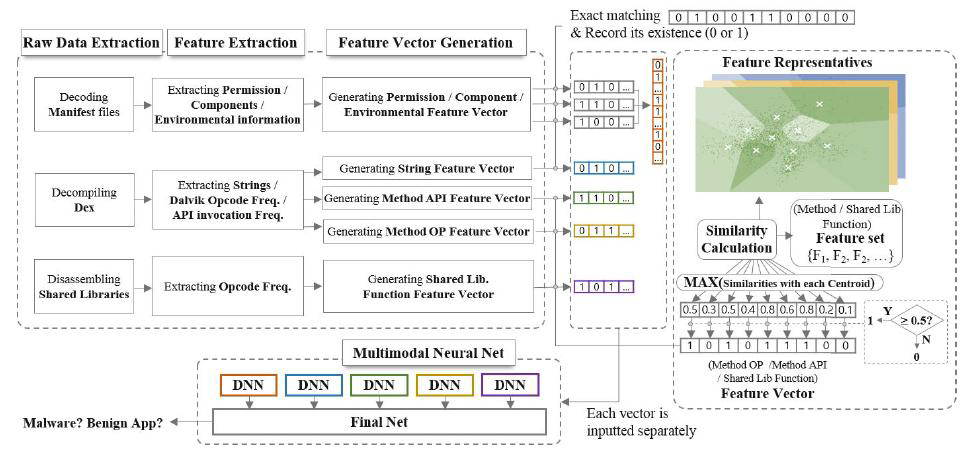
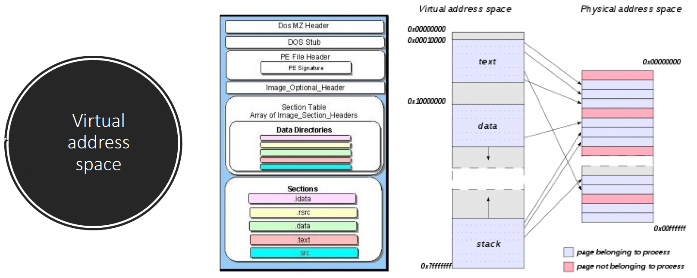
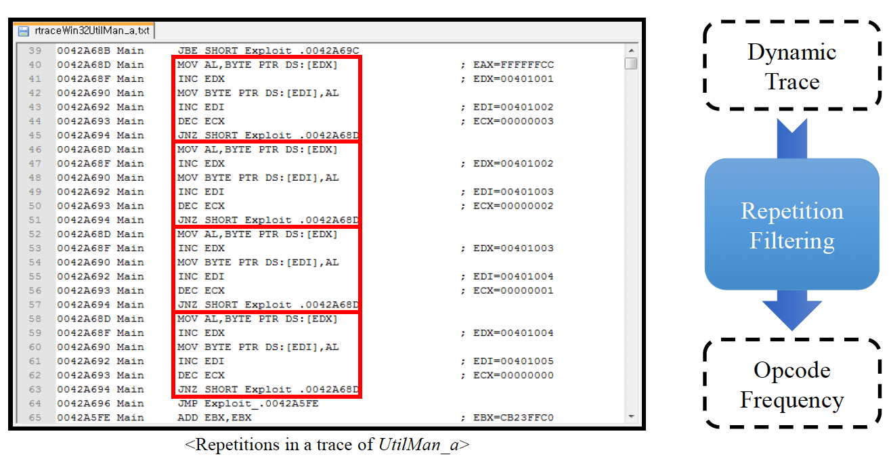
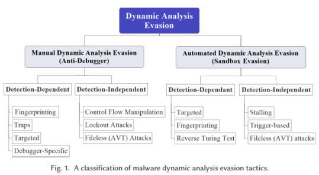
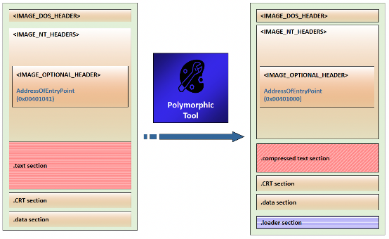

# 07. Malicious Software

## Malware
NIST가 `NIST05`에서 정의한 Malware(악성 소프트웨어)  
> "일반적으로 은밀하게 시스템에 삽입되어, victim의 데이터, 애플리케이션 또는 운영 체제의 confidentiality(기밀성), integrity(무결성), availability(가용성)을 침해하거나, victim를 성가시게 하거나 방해하려는 의도를 가진 프로그램"

## Malware Terminology
| 용어 | 설명 |
| :--- | :--- |
| **Adware** | 광고를 표시하는 소프트웨어 |
| Attack kit | 공격을 생성하는 데 사용되는 도구 집합 |
| Auto-rooter | 시스템에 침입하여 rootkit을 설치하는 데 사용되는 악의적인 해커 도구 |
| **Backdoor** (trapdoor) | 정상적인 접근 절차를 우회하는 프로그램의 비밀 진입 지점 |
| **Downloader** | 다른 악성 소프트웨어를 다운로드하여 설치하는 프로그램, 정상 프로그램과 구분이 어려움 |
| **Drive-by-download** | 사용자가 악성 웹 페이지를 방문할 때 악성 코드를 다운로드하고 설치하는 공격 |
| **Exploits** | 시스템 취약점을 이용하는 코드 |
| Flooders (DoS client) | DoS(서비스 거부) 공격을 생성하는 데 사용됨 |
| Keyloggers | 사용자의 키 입력을 캡처 |
| **Logic bomb** | 특정 조건이 충족될 때 폭발하도록 설정된 악성 코드 |
| Macro virus | 마이크로소프트 워드나 유사한 애플리케이션의 macro(매크로) 스크립트에 포함된 바이러스 유형 |
| Mobile code | 다양한 플랫폼으로 전송되어 실행될 수 있는 소프트웨어 |
| **Rootkit** | 시스템에 대한 은밀한 접근을 유지하기 위해 설치된 숨겨진 프로그램 집합, 공격자의 공격 행위를 숨기기 위한 목적으로 사용 |
| Spammer programs | 대량의 스팸 이메일을 보내는 데 사용됨 |
| Spyware | 시스템에서 다양한 활동을 모니터링하는 소프트웨어 |
| Trojan horse | 유용한 기능을 수행하는 것처럼 보이지만 악의적인 코드를 포함하는 프로그램 |
| **Virus** | 다른 실행 가능한 콘텐츠에 자신을 삽입하여 복제하는 악성 코드 |
| Worm | 네트워크를 통해 복제하고 다른 시스템으로 확산되는 컴퓨터 프로그램 |
| Zombie, **bot** | 공격자가 원격으로 제어할 수 있는 감염된 컴퓨터 |

## Features of Malicious Software (Malware)
- 전파 메커니즘
  - 바이러스에 의한 기존 콘텐츠 감염 후 다른 시스템으로 확산
  - Worm이나 *drive-by-download*에 의한 소프트웨어 취약점 악용을 통해 악성 소프트웨어가 복제되도록 허용
  - 사용자를 속여 보안 메커니즘을 우회하고 트로이 목마를 설치하게 하거나 피싱 공격에 응답하게 하는 social engineering(사회 공학적) 공격
- Payload action
  - 시스템 또는 데이터 파일 손상
  - 서비스 도용 / 시스템을 botnet의 일부인 좀비 공격 에이전트로 만듦.
  - 시스템으로부터 정보 도용 / keylogging(키로깅)
  - 시스템에서 자신의 존재를 숨김 (stealthing, 스텔싱)

## Viruses
- (정상) 프로그램을 감염시키는 소프트웨어 조각
- 바이러스의 복사본을 포함하도록 프로그램을 수정
- 복제하여 다른 콘텐츠를 계속 감염시킴.
- 네트워크 환경을 통해 쉽게 확산됨.
- 실행 프로그램에 첨부될 때, 바이러스는 해당 프로그램이 허용하는 모든 작업을 수행할 수 있음.
- 숙주(Host, 호스트) 프로그램이 실행될 때 비밀리에 실행됨.
- 특정 운영 체제와 하드웨어에 종속적
- 그들의 세부 사항과 약점을 이용함.

## Virus Components
- Infection mechanism(감염 메커니즘)
  - 바이러스가 확산되거나 전파되는 수단
  - infection vector라고도 함.
- Trigger
  - Payload가 활성화되거나 전달되는 시점을 결정하는 이벤트 또는 조건
  - logic bomb으로도 알려져 있음.
- Payload
  - 바이러스가 (확산 외에) 수행하는 작업
  - 손상을 입히거나, 무해하지만 눈에 띄는 활동을 포함할 수 있음.

## Virus Phases
1. Dormant phase(잠복 단계)
  - 바이러스가 비활성 상태
  - 특정 이벤트에 의해 결국 활성화됨.
  - 모든 바이러스가 이 단계를 갖는 것은 아님.
2. Propagation phase(전파 단계)
  - 바이러스가 자신의 복사본을 다른 프로그램이나 디스크의 특정 시스템 영역에 삽입
  - 전파되는 버전과 동일하지 않을 수 있음.
  - 각 감염된 프로그램은 이제 바이러스의 복제본을 포함하게 되며, 이 복제본 자체도 전파 단계에 들어감.
3. Triggering phase(발동 단계)
  - 바이러스가 의도된 기능을 수행하기 위해 활성화됨.
  - 다양한 시스템 이벤트에 의해 유발될 수 있음.
4. Execution phase(실행 단계)
  - 기능이 수행됨.
  - 무해할 수도 있고 손상을 입힐 수도 있음.

## Propagation
- 전파 전략
  - 기기가 블랙리스트에 없는지 check
  - 하드코딩된 list 사용
  - 3단계
    1. 디버깅 소프트웨어가 있는지 check
    2. 마이크로소프트 홈페이지 연결 시도
    3. 그 후 C&C 서버에 연결
- 기타 방법
  - VM(가상 머신, Virtual machine) 탐지하기 위해
    - MS Office가 설치되어 있고, 설치되어 있으면 Word 문서를 처음 여는지 여부 등을 check
    - 처음 여는 것이라면 VM으로 간주하고 해당 악성 행위를 하지 않도록 함.

## Virus Structure

## Compression Virus(CV) Logic
- Compress된 형태로 감염시키는 것
- 실행할 때는 uncompress하여 실행

## Packing Example
- Packing(패킹)은 실행 파일의 코드를 압축하고 암호화하여 분석을 어렵게 만드는 기술
- Polymorphic Tool(다형성 도구)는 실행 파일(`.text` 섹션)을 압축하고, 압축을 푸는 로더(`.loader` 섹션)를 추가함.
- 파일의 진입점(`AddressOfEntryPoint`)은 원래 코드 대신 loader section을 가리키도록 변경됨.
- 최근에 등장하는 악성 코드들은 대부분 packing 기법을 사용함

## Virus Classifications
- 대상별 분류
  - Encrypted virus(암호화 바이러스): 바이러스의 일부가 임의의 암호화 키를 생성하고 바이러스의 나머지 부분을 암호화함.
  - Stealth virus(스텔스 바이러스): anti-virus 소프트웨어의 탐지를 피하기 위해 명시적으로 설계된 바이러스 형태
  - Polymorphic virus(다형 바이러스): 감염될 때마다 변이하는 바이러스, 압축률을 매번 변경하여 탐지하기 어렵게 함
  - Metamorphic virus(변형 바이러스): 각 반복에서 변이하고 자신을 완전히 재작성하며, 외형뿐만 아니라 disassemble logic도 변경될 수 있는 바이러스
- 은폐 전략별 분류
  - Boot sector infector(부트 섹터 감염 바이러스): 마스터 부트 레코드나 부트 레코드를 감염시키고 바이러스가 포함된 디스크로 시스템을 부팅할 때 확산됨.
  - File infector(파일 감염 바이러스): 운영 체제나 셸이 실행 파일로 간주하는 파일을 감염시킴.
  - Macro virus(매크로 바이러스): 애플리케이션에 의해 해석되는 매크로 또는 스크립팅 코드가 있는 파일을 감염시킴.
  - Multipartite virus(다중 감염 바이러스): 여러 가지 방식으로 파일을 감염시킴.

## Macro/Scripting Code Viruses
- 1990년대 중반에 매우 흔했음.
  - 플랫폼에 독립적
  - 문서 파일을 감염시킴 (코드의 실행 가능한 부분 아닌).
  - 쉽게 확산됨.
- MS 오피스의 매크로 기능을 악용
  - 이후 버전의 제품들에는 보호 기능이 포함됨.
- 다양한 anti-virus 프로그램이 개발되어 더 이상 주요 바이러스 위협은 아님.
- 최근에는 PDF 문서의 javascript 기능을 이용한 공격 발생

## Worms
- 감염시킬 더 많은 머신을 적극적으로 찾아내고, 각 감염된 머신은 다른 기계에 대한 공격을 위한 자동화된 발사대 역할을 하는, 독자적으로 동작 가능한 프로그램
- 클라이언트 또는 서버 프로그램의 소프트웨어 취약점을 악용
- 네트워크 연결을 사용하여 시스템 간에 확산될 수 있음.
- 공유 미디어(USB 드라이브, CD, DVD 데이터 디스크)를 통해 확산
- 이메일 worm은 첨부 파일에 포함된 매크로 또는 스크립트 코드 및 인스턴트 메신저 파일 전송을 통해 확산됨.
- 활성화되면 worm은 다시 자가 복제하고 전파될 수 있음.
- 일반적으로 어떤 형태의 payload를 가지고 있음.
- 최초의 알려진 구현은 1980년대 초 Xerox Paloalto Lab에서 이루어짐.

## Worm Replication
- 이메일 또는 메신저 기능: worm이 자신의 복사본을 다른 시스템에 이메일로 보내거나, 인스턴트 메시지 서비스를 통해 첨부 파일로 자신을 전송.
  - 대응: 의심스러운 첨부파일 열 때 주의하기
- 파일 공유: worm이 이동식 미디어에 자신의 복사본을 만들거나 파일을 바이러스처럼 감염시킴.
  - 대응: 공유 폴더 사용 금지 or 암호 설정
- 원격 실행 기능: worm이 다른 시스템에서 자신의 복사본을 실행.
- 원격 파일 접근 또는 전송 기능: worm이 원격 파일 접근 또는 전송 서비스를 사용하여 한 시스템에서 다른 시스템으로 자신을 복사.
- 원격 로그인 기능: worm이 사용자로 원격 시스템에 로그인한 다음 명령을 사용하여 한 시스템에서 다른 시스템으로 자신을 복사.
  - 대응: 원격 접속 및 원격 서비스 사용 주의

## Morris Worm
- 최초의 중요한, 유명한 worm 감염 사례
- 1988년 로버트 모리스(Robert Morris)에 의해 배포
- UNIX 시스템에서 확산되도록 설계됨.
- 다른 시스템에 로그인하기 위해 로컬 암호 파일을 크랙하려고 시도
- 원격 사용자의 위치를 보고하는 `finger` protocol의 버그를 악용
- 원격 프로세스의 디버그 옵션에 있는 트랩도어를 악용하여 메일을 수신 및 발송
- 공격에 성공하면 운영 체제 명령 인터프리터와의 통신을 달성, 여러 시스템을 사용할 수 있게 됨.
- 인터프리터에 부트스트랩 프로그램을 보내 worm을 복사하도록 함.

## Recent Worm Attacks
- Melissa(1998): 이메일 worm, 바이러스, worm, 트로이 목마를 하나로 합친 최초의 사례
- Code Red(2001): 마이크로소프트 IIS 버그 악용, 임의 IP 주소 탐색
- **Code Red II**(2001): 마이크로소프트 IIS 대상, 접근을 위한 백도어 설치
- **Nimda**(님다, 2001): worm, 바이러스, 모바일 코드 특성 보유, 이메일, 윈도우 공유, 웹 서버 등 다양한 경로로 확산
- **SQL Slammer**(2003년 1월 25일(토), 125 인터넷 대란): SQL 서버의 buffer overflow 취약점 악용, 매우 빠른 확산 속도, 국정원 산하의 국가사이버안전센터 설립의 계기가 됨.
- Sobig.F(2003): 공개 프록시 서버를 악용하여 감염된 기계를 스팸 엔진으로 전환
- Mydoom(2004): 대량 메일링 이메일 worm, 감염된 기계에 백도어 설치
- Warezov(2006): 시스템 디렉터리에 실행 파일 생성, 이메일 첨부 파일로 자신을 전송, 보안 관련 제품 비활성화 가능
- Conficker(2008): 윈도우의 buffer overflow 취약점 악용, SQL 슬래머 이후 가장 광범위한 감염
- **Stuxnet**(2010): 탐지 가능성을 줄이기 위해 확산 속도 제한, 산업 제어 시스템(ICS, Industrial Control System)을 표적으로 함.
  - 한전, 한수원, 가스공사와 같은
  - 폐쇄망을 어떻게 공격했나?
    - 직원의 가정집 PC의 USB에 감염되게 한 후 폐쇄망에 전파되도록 함.
  - 미국에서 만들어졌을 것으로 추정
> *대부분 MS 제품, 추후 MS서 secure code guideline 도입*

## Worm Technology
- Multiplatform(다중 플랫폼)
- Multi-exploit(다중 취약점 공격)
- Ultrafast spreading(초고속 확산)
- Polymorphic(다형)
- Metamorphic(변형)

## Mobile Code
- 다양한 플랫폼에서 code 변경 없이 전송될 수 있는 프로그램 (플랫폼에 독립적)
- 원격 시스템에서 로컬 시스템으로 전송된 후 로컬 시스템에서 실행됨.
- 종종 바이러스, worm 또는 트로이 목마의 메커니즘으로 작동
- 취약점을 이용하여 자체적인 공격을 수행
- 인기 있는 매개체로는 자바 애플릿, ActiveX, 자바스크립트, VBScript가 있음.

## Mobile Phone Worms
- 최초 발견은 2004년 Cabir(카비르) worm.
- 이후 2005년 Lasco(라스코)와 CommWarrior(컴워리어) 등장.
- 블루투스 무선 연결이나 MMS를 통해 통신
- 스마트폰을 표적으로 함.
- 전화를 완전히 비활성화하거나, 전화기의 데이터를 삭제하거나, 장치가 비싼 메시지를 보내도록 강제할 수 있음.
- 컴워리어는 블루투스를 통해 다른 전화기로 복제하고, 연락처에 MMS 파일로 자신을 보내며, 수신 문자 메시지에 자동 회신으로 자신을 보냄.

## Drive-By-Downloads
- 사용자가 공격자에 의해 제어되는 웹 페이지를 볼 때 시스템에 악성 소프트웨어를 다운로드하고 설치하기 위해 브라우저 취약점을 악용
- 대부분의 경우 적극적으로는 전파되지 않음.
- 사용자가 악성 웹 페이지를 방문할 때 확산됨.

## Social Engineering 사회 공학적 공격 방법
- 사용자를 "속여" 스스로의 시스템을 침해하는 데 협조하도록 만드는 것
- Spam(스팸)
  - 원치 않는 대량 이메일
  - Malware의 중요한 매개체
  - 피싱 공격에 사용됨.
- Trojan horse(트로이 목마)
  - 숨겨진 악성 코드를 포함하는 프로그램 또는 유틸리티
  - 공격자가 직접 수행할 수 없는 기능을 수행하는 데 사용됨.
- 모바일 폰 트로이 목마
  - 2004년에 처음 등장 (Skuller, 스컬러)
  - 스마트폰을 표적으로 함.

## Payload - System Corruption
- 데이터 파괴
  - Chernobyl virus(체르노빌 바이러스, 1998): 윈도우 95/98 바이러스
    - 실행 파일을 감염시키고 특정 날짜에 전체 파일 시스템을 손상시킴.
  - Klez: 윈도우 95~XP 시스템을 감염시키는 대량 메일링 worm
    - 특정 날짜에 하드 드라이브의 파일을 비움.
  - Ransomware(랜섬웨어): 사용자의 데이터를 암호화하고, 정보 복구 키에 접근하기 위해 금전적 지불을 요구함.
    - PC Cyborg Trojan (1989)
    - Gpcode Trojan (2006)
- 실제 세계 피해
  - 물리적 장비에 손상을 입힘.
  - 체르노빌 바이러스는 BIOS 코드를 재작성
  - 스턱스넷 worm은 특정 산업 제어 시스템 소프트웨어를 표적으로 함.
  - 산업 사보타주를 위해 정교한 표적 악성 코드를 사용하는 것에 대한 우려가 있음.
- Logic bomb
  - 특정 조건이 충족될 때 폭발하도록 악성 코드에 내장된 코드

## Stuxnet
- Stuxnet(스턱스넷): 발전소, 댐, 조립 라인과 같은 대규모 산업 시설을 모니터링하고 운영하는 데 사용되는 산업 제어 시스템(ICS)을 표적으로 하는 컴퓨터 worm
- 이란은 사이버 공격이 핵 재처리 시설에 타격을 입혔다고 인정
- 이란 대통령이 스턱스넷 worm이 정권의 핵 야망을 방해했다는 추측을 확인
  - 몇몇 우라늄 농축 원심분리기가 바이러스에 의해 손상되었다고 언급
- 해당 worm의 리버스 엔지니어링 결과, 부셰르와 나탄즈의 핵 시설에서 사용되는 Siemens(지멘스) S7 산업 제어 시스템을 감염시킬 수 있음이 밝혀짐.

## Payload – Attack Agents Bots
- 다른 인터넷 연결 컴퓨터를 장악하고 해당 컴퓨터를 사용하여 공격을 시작하거나 관리
- Botnet(봇넷): 조정된 방식으로 행동할 수 있는 봇의 집합
- 용도:
  - DDoS 공격
  - 스팸 발송
  - 트래픽 스니핑
  - Keylogging
  - 새로운 악성 소프트웨어 확산
  - 광고 애드온 및 브라우저 도우미 객체(BHO) 설치
  - IRC 채팅 네트워크 공격
  - 온라인 여론조사/게임 조작

## Botnet 개요
- Botmaster(봇 마스터)는 C&C(Command & Control) 서버를 통해 봇넷을 제어
- 봇넷에 속한 좀비 PC들은 C&C 서버로부터 명령을 받아 피해자(Victims)를 공격

## BotNet – Infection Path
- 브라우저 취약점: 65%
- 이메일 첨부 파일: 13%
- OS 취약점: 11%
- 다운로드된 파일: 9%
- 기타: 2%

## Countermeasures against botnets
- 봇넷 방어가 어려운 이유
  - 탐지가 어려움.
  - 여러 특성을 가짐 (worm/바이러스, 백도어, 스파이웨어, rootkit 등)
  - 변종이 많음.
  - 봇은 일반 사용자 PC에 감염됨.
  - 스푸핑된 IP 주소가 아닌 정상 IP 주소를 사용
  - 적은 수의 공격 패킷을 생성
  - 대부분의 시간 동안 악의적인 활동을 하지 않음.

## Botnet composition and operations
1. 취약점, 이메일 등을 통해 악성 소프트웨어 확산
2. 감염된 봇이 C&C 서버에 접속
3. 봇 마스터가 C&C 서버에 명령 전달
4. C&C 서버가 봇넷에 명령 전달
5. 봇넷이 DDoS, 스팸 메일 발송 등 악의적인 활동 수행

## BotNet composition
- 네트워크 protocol
  - IRC (Internet Relay Chatting)
  - Http
  - P2P 등
- Botmaster는 C&C(Command & Control) 서버를 통해 명령을 전송
  - C&C 서버를 어떻게 설정하는가?
  - 경찰에 의해 C&C 서버가 폐쇄되면 어떻게 되는가?

## Rally Mechanism
- 봇이 C&C 서버를 찾는 방법
- 하드코딩된 IP 주소
  - 봇이 하드코딩된 C&C 서버의 IP 주소로 직접 연결
  - 서버가 차단되면 무용지물
- DDNS(동적 DNS): 봇이 DDNS 서비스에 등록된 도메인 이름(`a.net`)을 조회하여 C&C 서버의 현재 IP 주소를 알아냄. IP 주소가 바뀌어도 도메인만 알면 접속 가능

## CCTV bots
- 봇넷은 PC뿐만 아니라 CCTV와 같은 IoT 장비도 감염시켜 대규모 공격에 악용할 수 있음.
- `mirai` 봇넷: CCTV 봇넷, GitHub에 올라와 있음.
  - Default password들이 hard-coding되어 포함되어 있음.

## Remote Control Facility
- 봇을 worm과 구별하는 특징
  - Worm은 스스로 전파하고 활성화
  - 봇은 초기에 중앙 시설에서 제어
- 원격 제어 기능의 일반적인 구현 방법은 IRC 서버를 이용하는 것
- 최근 봇넷은 HTTP와 같은 protocol을 통해 은밀한 통신 채널을 사용
- 분산 제어 메커니즘은 단일 장애점(single point of failure)을 피하기 위해 P2P protocol을 사용

# Payload – Information
## Theft Keyloggers and Spyware
- 키로거(Keylogger)
  - 공격자가 민감한 정보를 모니터링할 수 있도록 키 입력을 캡처
  - 일반적으로 "login", "password"와 같은 키워드에 가까운 정보만 반환하는 필터링 메커니즘을 사용
- 스파이웨어(Spyware)
  - 침해된 기계를 변조하여 시스템의 광범위한 활동을 모니터링할 수 있도록 함.
  - 브라우징 활동의 이력 및 내용 모니터링
  - 특정 웹 페이지 요청을 가짜 사이트로 리디렉션
  - 브라우저와 특정 웹 사이트 간에 교환되는 데이터를 동적으로 수정

## Theft Phishing
- 신뢰할 수 있는 출처로부터의 통신으로 위장하여 사용자의 신뢰를 이용하는 사회 공학 기법을 악용
- 은행, 게임 또는 유사한 사이트의 로그인 페이지를 모방한 가짜 웹 사이트로 연결되는 URL을 스팸 이메일에 포함
- 사용자가 계정을 인증하기 위해 긴급한 조치가 필요하다고 제안
- 공격자는 캡처된 자격 증명을 사용하여 계정을 악용
- 스피어 피싱(Spear-phishing)
  - 수신자는 공격자에 의해 신중하게 조사됨.
  - 이메일은 수신자에게 특별히 맞게 제작되며, 종종 진위성을 확신시키기 위해 다양한 정보를 인용함.

# Payload – Stealthing
## Backdoor
- Trapdoor(트랩도어)라고도 함.
- 공격자가 보안 접근 절차를 우회하여 접근할 수 있도록 하는 프로그램의 비밀 진입 지점
- Maintenance hook(유지보수 후크)는 프로그래머가 프로그램을 디버깅하고 테스트하는 데 사용하는 백도어임.
- 애플리케이션의 백도어에 대한 운영 체제 제어를 구현하기 어려움.

## Rootkit
- 시스템에 대한 은밀한 접근을 유지하기 위해 시스템에 설치된 숨겨진 프로그램 집합
- 컴퓨터의 프로세스, 파일, 레지스트리를 모니터링하고 보고하는 메커니즘을 변조하여 자신을 숨김.
- 공격자에게 관리자(또는 root) 권한을 부여
- 프로그램과 파일을 추가 또는 변경하고, 프로세스를 모니터링하고, 네트워크 트래픽을 송수신하며, 필요할 때 백도어 접근을 할 수 있음.

## Rootkit Classification Characteristics
- Persistent (지속성)
- Memory based (메모리 기반)
- User mode (사용자 모드)
- Kernel mode (커널 모드)
- Virtual machine based (가상 머신 기반)
- External mode (외부 모드)

## System Call Table Modification
- Rootkit은 운영체제 커널의 system call table을 변조
- 예: 파일 목록을 보여주는 시스템 콜의 주소를 rootkit이 제어하는 악성 함수 주소로 변경
- 사용자가 파일 목록을 요청하면, original 함수 대신 **악성 함수가 호출**되어 rootkit과 관련된 파일이나 프로세스를 목록에서 숨긴 후 결과를 반환

## HW based Rootkit detection
- 하드웨어 기반 rootkit 탐지
- `Vigilare`: 시스템 버스 모니터를 사용하여 커널 무결성을 모니터링하는 연구
  - 하드웨어 수준에서 메모리 접근을 감시하여 커널 코드의 무단 변경을 탐지
- 시스템 버스를 모니터링해야 함.
- 시스템 버스: CPU하고 RAM하고 왔다갔다하는 bus

## Phishing (Privacy + Fishing)
- Voice Phishing(보이스 피싱)
- Messenger Phishing(메신저 피싱)
- Smishing(SMS 피싱)
- Email Phishing(이메일 피싱)
  - 정상적인 사이트처럼 보이는 가짜 피싱 사이트로 유도하여 정보를 탈취

## Cold Boot Attacks
- DRAM에 있는 암호화 키에 대한 공격
- `0`인 경우 5V, `1`인 경우 0V
- DRAM은 전원이 꺼져도 짧은 시간 동안 데이터를 유지하는 특성(데이터 잔존성)이 있음.
- 공격자는 시스템 전원을 껐다가 즉시 재부팅하거나, DRAM 모듈을 냉각시켜 데이터 보존 시간을 늘린 뒤 다른 시스템에 장착하여 메모리에 남아있는 암호화 키와 같은 민감한 정보를 추출함.

## `dll` injection
- `dll`: dynamic link library(동적 연결 라이브러리)
  - 실행 파일에서 필요한 라이브러리를 동적으로 로딩함.
  - 리눅스에서는 `.so` 파일
- `dll injection` 공격
  - 공격자가 제작한 `dll` 파일을 정상적인 프로세스가 로딩하도록 하여, 해당 프로세스의 권한으로 악성 코드를 실행시키는 공격

## Process Injection 공격
- in-memory(인-메모리) 악성 코드 또는 fileless(파일리스) 악성 코드에서 사용되는 공격 방법
- 정상적인 프로세스의 가상 메모리 내 실행 코드 부분을 공격자의 코드로 바꾸어 실행하게 하는 방법
- 예: `svchost.exe`, `dllhost.exe` 등과 같은 정상 프로세스의 실행 코드 부분을 공격자의 코드로 변경

## Web Attacks – Cybercrime 2.0
- 브라우저 관련 공격
  - 브라우저 기능이 향상되고 웹이 풍부해지면서 공격 표면이 넓어짐.
  - 스팸 이메일을 통해 사용자 유인
- 웹 서버 공격
  - `IFRAME`을 이용해 공격 서버로 연결
  - "drive-by-download": 악성 코드 전파의 주요 경로로 사용됨.
  - SQL 인젝션 공격
  - `.htaccess`를 통한 리디렉션: 특정 조건(예: HTTP Referrer 헤더)에 따라 URL을 다른 목적지로 선택적으로 리디렉션

## Web Attacks - Cross Site Scripting (XSS)
- 웹 애플리케이션 보안의 일반적인 문제
- 서버 측 웹 애플리케이션의 결함(공격자가 임의의 HTML을 삽입하도록 허용)의 결과
- 취약한 스크립트를 삽입함으로써,
  - 이상한 데이터를 삽입하거나
  - 다른 위치로 점프(리디렉션)
- 예: 사용자가 입력한 내용을 필터링하지 않고 그대로 페이지에 표시할 때, 공격자는 악성 스크립트를 포함한 `img` 태그 등을 삽입하여 사용자의 쿠키 정보를 탈취하거나 다른 사이트로 리디렉션 시킬 수 있음.

## OWASP TOP 10 (2021)
1. 접근 제어 취약점 (Broken Access Control)
2. 암호화 실패 (Cryptographic Failures)
3. 인젝션 (Injection)
4. 안전하지 않은 설계 (Insecure Design)
5. 보안 설정 오류 (Security Misconfiguration)
6. 오래되고 취약한 구성요소 사용 (Vulnerable and Outdated Components)
7. 식별 및 인증 실패 (Identification and Authentication Failures)
8. 소프트웨어 및 데이터 무결성 실패 (Software and Data Integrity Failures)
9. 보안 로깅 및 모니터링 실패 (Security Logging and Monitoring Failures)
10. 서버 측 요청 위조 (Server-Side Request Forgery, SSRF)

## SNS
- 트위터 스팸
  - 해킹된 계정을 스팸 발송에 이용
  - 성공적인 이유: 많은 청중, URL 단축 서비스, 필터링 메커니즘 부족
- Clickthrough rate(CTR, 클릭률)
  - 스팸 트윗의 0.13%만이 방문을 유도
  - 이는 스팸 이메일의 CTR(0.003%-0.006%)보다 훨씬 높음.
- 스팸 분류
  - 악성 코드 및 피싱 (5%)
  - 사기 (95%)

## Malware Countermeasure Approaches
- 악성 소프트웨어 위협에 대한 이상적인 해결책은 예방임.
- 예방이 실패할 경우, 기술적 메커니즘을 사용하여 다음 위협 완화 옵션을 지원할 수 있음:
  - detection(탐지)
  - identification(식별)
  - removal(제거)
- 예방의 네 가지 주요 요소:
  - policy(정책)
  - awareness(인식)
  - vulnerability mitigation(취약점 완화)
  - Threat mitigation(위협 완화)

## Generations of Anti-Virus Software
- 1세대: 단순 스캐너
  - 악성 소프트웨어를 식별하기 위해 시그니처가 필요
  - 알려진 악성 소프트웨어의 탐지에 국한됨.
- 2세대: 휴리스틱 스캐너
  - 휴리스틱 규칙을 사용하여 의심스러운 악성 소프트웨어 인스턴스를 검색
  - 다른 접근 방식은 무결성 검사
- 3세대: 행위 기반 탐지
  - 감염된 프로그램의 구조가 아닌 행동으로 악성 소프트웨어를 식별하는 메모리 상주 프로그램
- 4세대: 종합 보호
  - 다양한 anti-virus 기술을 함께 사용하는 패키지
  - 스캐닝, 행위 기반 탐지, 접근 제어 기능 포함

## Generic Decryption (GD)
- anti-virus 프로그램이 복잡한 다형성 바이러스 및 기타 악성 소프트웨어를 쉽게 탐지하면서 빠른 스캔 속도를 유지할 수 있게 함.
- 실행 파일은 다음 요소를 포함하는 GD 스캐너를 통해 실행됨.
  - CPU 에뮬레이터
  - 바이러스 시그니처 스캐너
  - 에뮬레이션 제어 모듈
- GD 스캐너의 가장 어려운 설계 문제는 각 해석을 얼마나 오래 실행할지 결정하는 것임.

## Host-Based Behavior-Blocking Software
- 호스트 컴퓨터의 운영 체제와 통합되어 악의적인 행동에 대해 프로그램 행동을 실시간으로 모니터링함.
- 잠재적으로 악의적인 행동이 시스템에 영향을 미치기 전에 차단
- 실시간으로 소프트웨어를 차단하므로 시그니처나 휴리스틱과 같은 anti-virus 탐지 기술보다 장점이 있음.
- 한계점
  - 악성 코드가 모든 행동을 식별하기 전에 대상 기계에서 실행되어야 하므로, 탐지 및 차단되기 전에 피해를 줄 수 있음.

## Perimeter Scanning Approaches
- 일반적으로 조직의 방화벽 및 IDS에서 실행되는 이메일 및 웹 프록시 서비스에 포함된 anti-virus 소프트웨어
- IDS의 트래픽 분석 구성 요소에 포함될 수도 있음.
- 의심스러운 트래픽의 흐름을 차단하는 침입 방지 조치를 포함할 수 있음.
- 이 접근 방식은 악성 소프트웨어 스캔에 국한됨.
- 모니터링 소프트웨어의 두 가지 유형
  - Ingress(인그레스) 모니터: 기업 네트워크와 인터넷 경계에 위치. 사용되지 않는 로컬 IP 주소로 들어오는 트래픽을 찾는 기법.
  - Egress(이그레스) 모니터: 개별 LAN의 출구 지점 및 기업 네트워크와 인터넷 경계에 위치. 스캐닝이나 기타 의심스러운 행동의 징후를 찾기 위해 나가는 트래픽을 모니터링.

## Worm Countermeasures
- 바이러스와 worm을 다루는 기술에는 상당한 중복이 있음.
- Worm이 기계에 상주하면 anti-virus 소프트웨어를 사용하여 탐지하고 제거할 수 있음.
- 경계 네트워크 활동 및 사용량 모니터링은 worm 방어의 기반이 될 수 있음.
- Worm 방어 접근 방식:
  - 시그니처 기반 worm 스캔 필터링
  - 필터 기반 worm 격리
  - payload 분류 기반 worm 격리
  - 임계치 랜덤 워크(TRW) 스캔 탐지
  - 속도 제한(Rate limiting)
  - 속도 중단(Rate halting)

## Digital Immune System
- 디지털 면역 시스템은 인간의 면역 체계와 유사하게 작동하는 포괄적인 anti-virus 방식을 제공
- 작동 원리:
  1. 시스템에서 의심스러운 프로그램이 탐지되면, 분석을 위해 중앙 서버로 전송됨.
  2. 중앙 서버는 프로그램을 분석하여 악성 코드로 확인되면 시그니처와 치료법을 생성
  3. 이 정보는 모든 클라이언트에게 자동으로 전파되어 새로운 위협에 신속하게 대응

## Android Malware Detection
- `DroidAPIMiner`
  - 설치 시 API 수준 분석
  - 악성 코드에서 자주 사용되는 중요한 API 호출에 초점
  - API + 매개변수 조합으로 위험도 판단
  - 정적 분석 기법
- MADAM
  - 안드로이드를 커널 수준과 사용자 수준에서 모니터링
  - 정상 행위와 악성 행위를 구별
  - 다중 수준 모니터링: 1단계(시스템 콜 모니터링), 2단계(사용자 활동 및 SMS 전송 모니터링)
- 머신러닝을 이용한 안드로이드 악성코드 분석

  - 다중 모드 신경망(Multi-modal Neural Networks)과 같은 기법을 사용하여 높은 탐지 정확도(98%)를 달성

## Malware Analysis
- 악성코드 분석의 쟁점
  - 수동 분석은 행동을 이해하고 대응책을 개발하며 시그니처를 생성하는 데 중요함.
  - 하지만 악성코드의 증가 속도를 따라잡기 어려움. (예: 하루에 약 9만 개)

- 정적 분석 대 동적 분석
  - Static Analysis(정적 분석): 실행 없이 바이너리를 분석
    - 모든 코드를 분석할 수 있지만, 패킹(packing)이나 다형성/변형 worm에는 한계가 있음.
  - Dynamic Analysis(동적 분석): 가상 환경에서 악성 코드를 직접 실행하여 행위를 분석
    - 패킹된 코드의 실제 행위를 관찰할 수 있음.
    

## Frequency Analysis 빈도 분석
- 악성 소프트웨어는 정상 소프트웨어와 다른 명령어(opcode) 빈도 분포를 보임.

| Opcode | Goodware | Kernel RK | User RK | Tools | Bot | Trojan | Virus | Worms |
| :--- | :--- | :--- | :--- | :--- | :--- | :--- | :--- | :--- |
| `mov` | 25.3% | 37.0% | 29.0% | 25.4% | 34.6% | 30.5% | 16.1% | 22.2% |
| `push` | 19.5% | 15.6% | 16.6% | 19.0% | 14.1% | 15.4% | 22.7% | 20.7% |
| `call` | 8.7% | 5.5% | 8.9% | 8.2% | 11.0% | 10.0% | 9.1% | 8.7% |
| `pop` | 6.3% | 2.7% | 5.1% | 5.9% | 6.8% | 7.3% | 7.0% | 6.2% |
| `cmp` | 5.1% | 6.4% | 4.9% | 5.3% | 3.6% | 3.6% | 5.9% | 5.0% |
| `jz` | 4.3% | 3.3% | 3.9% | 4.3% | 3.3% | 3.5% | 4.4% | 4.0% |
| `lea` | 3.9% | 1.8% | 3.3% | 3.1% | 2.6% | 2.7% | 5.5% | 4.2% |
| `test` | 3.2% | 1.8% | 3.2% | 3.7% | 2.6% | 3.4% | 3.1% | 3.0% |
| `jmp` | 3.0% | 4.1% | 3.8% | 3.4% | 3.0% | 3.4% | 2.7% | 4.5% |
| `add` | 3.0% | 5.8% | 3.7% | 3.4% | 2.5% | 3.0% | 3.5% | 3.0% |
| `jnz` | 2.6% | 3.7% | 3.1% | 3.4% | 2.2% | 2.6% | 3.2% | 3.2% |
| `retn` | 2.2% | 1.7% | 2.3% | 2.9% | 3.0% | 3.2% | 2.0% | 2.3% |
| `xor` | 1.9% | 1.1% | 2.3% | 2.1% | 3.2% | 2.7% | 2.1% | 2.3% |
| `and` | 1.3% | 1.5% | 1.0% | 1.3% | 0.5% | 0.6% | 1.5% | 1.6% |

## Dynamic Analysis 동적 분석
- Basic blocks와 명령어에서 반복, 중복 찾아내기

## Redundancy Filtering
- Block의 개수를 비교했을 때
  - FM의 비율 평균 = 1.6%

| Traces | Original | RF | Ratio | FM | Ratio |
| :--- | :--- | :--- | :--- | :--- | :--- |
| `rtraceWin32AcidShiver_a` | 615,357 | 34,869 | 5.7% | 19,090 | 3.1% |
| `rtraceWin32Agent_h` | 1,790,730 | 50,987 | 2.8% | 27,467 | 1.5% |
| `rtraceWin32Agobot_1_c` | 2,466,508 | 44,877 | 1.8% | 22,292 | 0.9% |
| `rtraceWin32Bionet_13` | 2,534,095 | 95,647 | 3.8% | 38,306 | 1.5% |
| `rtraceWin32Chiton` | 758,995 | 17,052 | 2.2% | 9,042 | 1.2% |
| `rtraceWin32Deborm_a` | 340,852 | 15,716 | 4.6% | 6,926 | 2.0% |
| `rtraceWin32Nilage_aa` | 885,016 | 10,836 | 1.2% | 5,886 | 0.7% |

- Malware Visualization(악성코드 시각화)
  - 악성코드 바이너리를 이미지로 변환.
  - 변환된 이미지를 ML(머신 러닝) 기법에 적용하여 유사한 악성코드 패밀리를 분류하거나 새로운 변종을 탐지

## Anti-Forensic techniques

## Packing Example
- 악성코드 분석을 방해하기 위해 실행 파일을 압축하거나 암호화하는 기술
- 패킹 도구의 사용은 매우 흔하며, 그 복잡성도 시간이 지남에 따라 증가하고 있음.

## Packing Trends
- Virus Total 파일 분석
  - 각 해마다 2,000개의 샘플
  - PE 파일 대상

## Packing Complexity

| 레벨 | 설명 |
| :--- | :--- |
| 1 | 단일 패킹, 예: `UPX` |
| 2 | 재패킹, 예: 패킹된 `UPX` PE 파일을 `UPX`로 다시 패킹 |
| 3 | 다중 계층 패킹, 예: 동일하거나 다른 패커로 파일을 반복적으로 여러 번 패킹 |
| 4 | 유형 1, 2, 또는 3 + 원본 코드가 가장 깊은 마지막 계층이 아닌 내부 계층 중 한 곳에서 발견됨, 예: `UPolyX` |
| 5 | 유형 1, 2, 또는 3 + 원본 프로그램의 언패킹을 담당하지 않는 외부 패커 코드의 잉여 부분을 가짐. 이는 혼란 및 난독화를 위한 목적. 예: `ACProtect` |
| 6 | 유형 1, 2, 또는 3 + 메인 언패킹 코드가 파일의 여러 다른 부분에 위치한 별도 `sub-unpacker` 집합을 수집하고, 이를 결합하여 원본 프로그램을 언패킹. 언패킹 로직은 메인 언패킹 코드가 아닌 `sub-unpacker`에 위치. 예: `Frankenstein` |
| 7 | 패커 제작자가 미리 결정한 특정 외부 조건 하에서만 원본 프로그램의 단일 `fragment`만 언패킹되는 패커. 예: `Armadillo` |
| 8 | 가상화(`Virtualization`)를 사용한 언패킹, 예: `Themida` |

## Malware Entropy
- 파일의 무작위성(randomness)을 측정하는 척도
- 패킹되거나 암호화된 파일은 일반적으로 엔트로피가 높게 나타나므로, 악성코드 탐지의 한 지표로 사용될 수 있음.

## Malware Analysis Tools
- Virus Total: 웹 기반 서비스로, 여러 anti-virus 엔진을 사용하여 파일을 스캔하고 분석 결과를 제공
- PE View: 윈도우 실행 파일(PE)의 구조를 상세하게 보여주는 도구
- Detect It Easy (DIE): 파일의 종류, 사용된 패커, 엔트로피, 문자열 등 다양한 정보를 분석하는 도구
- IDA Pro: Hex-rays사에서 개발한 강력한 disassembler 도구로, 리버스 엔지니어링 및 악성코드 분석에 널리 사용됨.