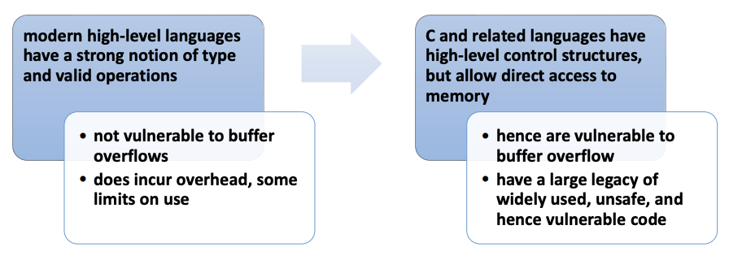
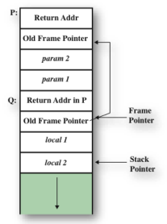
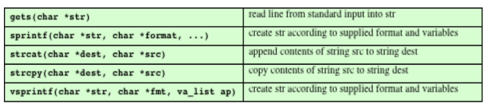

# 09. Buffer Overflow

# OS Overview

## Operating System
- Multiprogramming: 효율성 필요
- Job (code, 데이터) 조직화 -> CPU가 항상 하나를 실행하도록 보장
- Job scheduling: Job 중 하나를 선택하여 실행
- Wait (e.g., I/O) 발생 시, OS가 다른 job으로 전환
- Timesharing (multitasking): CPU가 job을 매우 빈번하게 전환, interactive computing 생성
- Response time 최소화
- 각 사용자는 memory에서 실행 중인 하나 이상의 프로그램 (process) 보유
- CPU scheduling: 여러 job이 동시에 실행 준비될 때
- Swapping: Process가 memory에 맞지 않을 때
- Virtual memory: Process가 memory에 완전히 없어도 실행 허용

## Operating System Operations
- Dual-mode operation: OS가 자신과 다른 시스템 구성 요소 보호
- User mode 및 kernel mode
- Mode bit: Hardware가 제공
- 시스템이 user code 실행 중인지 kernel code 실행 중인지 구별
- Privileged instructions: Kernel mode에서만 실행 가능
- System call: Mode를 kernel로 변경, call로부터 return 시 user로 재설정

## Process Management
- Process: 실행 중인 프로그램 (A 프로그램 in execution)
- 시스템 내 작업 단위 (unit of work)
- Program: 수동적 entity, Process: 능동적 entity
- Process 자원 필요: CPU, memory, I/O, files, initialization 데이터
- Process 종료: 재사용 가능한 자원 회수
- Single-threaded process: 다음 실행할 instruction 위치 지정하는 프로그램 counter 1개
- Multi-threaded process: Thread 당 프로그램 counter 1개

## Memory Management
- 모든 데이터: 처리 전후 memory에 위치
- 모든 instructions: 실행 위해 memory에 위치
- Memory management: CPU utilization 및 response time 최적화
- 활동:
  - Memory 사용 현황 및 사용자 추적
  - Process (또는 그 일부) 및 데이터의 memory 이동 결정
  - Memory 공간 할당 및 해제

## Storage Management
- OS: 정보 저장소에 대한 통일된 논리적 view 제공
- 물리적 속성을 논리적 저장 단위 (file)로 추상화
- File-System management:
- File을 directory로 조직
- Access control: 접근 권한 결정
- OS 활동:
- File, directory 생성 및 삭제
- File, directory 조작 primitive
- File을 secondary storage에 mapping
- File을 stable storage media에 backup

## A View of Operating System Services

## System Calls
- OS가 제공하는 서비스에 대한 programming interface
- 일반적으로 high-level language (C or C++)로 작성
- 직접 system call 사용보다 high-level API (Application 프로그램 Interface) 통해 접근
- open(): system call
- fopen(): API (C language library)
- 3대 API: Win32 (Windows), POSIX (UNIX, Linux, Mac OS X), Java (JVM)
- API 사용 이유: Portability, Ease of use

## System Call Implementation
- 일반적으로 각 system call에 숫자(number) 연관
- System-call interface: 이 숫자에 따라 index된 table 유지
- Interface: OS kernel에서 의도한 system call 호출, system call 상태 및 return 값 반환
- Caller: system call 구현 방식 알 필요 없음
- API 준수 및 OS 결과 이해
- API: OS interface 세부 사항 programmer에게 숨김

## API – System Call – OS Relationship
- Use system call, directly

## Standard C Library Example
- C program: print`f()` (library call) 호출 -> write() (system call) 호출

## Examples of Windows and Unix System Calls

# Buffer Overflow

## Buffer Overflow
- A very common attack mechanism
- 1988년 Morris Worm이 처음 널리 사용
- Prevention techniques 알려짐
- 여전히 주요 관심사:
- Legacy buggy code
- 프로그래머의 부주의한 programming practices 지속

# Brief History of Buffer Overflow Attacks

## Buffer Overflow/Buffer Overrun
- NIST Glossary 정의:
  > *"A condition at an interface under which more input can be placed into a buffer or 데이터 holding area than the capacity allocated, overwriting other information. Attackers exploit such a condition to crash a system or to insert specially crafted code that allows them to gain control of the system.”*
- (요약) Buffer 용량 초과 input -> 다른 정보 덮어쓰기
- Attacker: 시스템 crash 또는 code 삽입 (시스템 제어)

## Buffer Overflow Basics
- Programming error: process가 fixed-sized buffer 한계 초과 데이터 저장 시도
- 인접 memory 위치 덮어쓰기
- 덮어쓰는 위치: 프로그램 variables, parameters, 프로그램 control flow 데이터
- Buffer 위치: stack, heap, 데이터 section
- 결과 (Consequences):
  - 프로그램 데이터 손상
  - 예기치 않은 control 전송
  - Memory access 위반
  - Attacker가 선택한 code 실행

## Basic Buffer Overflow Example

> **Figure 10.1** Basic Buffer Overflow Example

## Basic Buffer Overflow Stack Values

> **Figure 10.2** Basic Buffer Overflow Stack Values

## Buffer Overflow Attacks
- Exploit 필요 조건:
  - Attacker 제어 하의 데이터로 trigger 가능한 buffer overflow 취약점 식별
  - Buffer 저장 방식 이해, 손상 가능성 판단
- 취약 프로그램 식별 방법:
  - 프로그램 source 검사
  - Oversized input 처리 시 프로그램 실행 추적
  - Fuzzing (자동 식별 도구) 사용

## Programming Language History
- Machine level: 데이터는 register 또는 memory에 저장
- Assembly language: 프로그래머가 데이터 해석 책임



## Stack Buffer Overflows
- Buffer가 stack에 위치할 때 발생 (stack smashing)
- Morris Worm이 사용 (unchecked buffer overflow exploit)
- 여전히 널리 exploit 됨
- Stack frame:
  - 함수 호출 시 return address 저장
  - 호출된 함수로 전달될 parameter 저장
  - Register 값 저장

## Stack Frame with Functions P and Q


> **Figure 10.3** Example Stack Frame with Functions P and Q

## Programs and Processes


> **Figure 10.4** Program Loading into Process Memory

## Stack Overflow Example
```
void hello(char *tag) {
  char inp[16];

  printf("Enter value for %s: ", tag);
  gets(inp);
  printf("Hello your %s is %s\n", tag, inp);
}
```
(a) Basic stack overflow C code

```
$ cc -g -o buffer2 buffer2.c

$ ./buffer2

Enter value for name: Bill and Lawrie
Hello your name is Bill and Lawrie
buffer2 done

$ ./buffer2
Enter value for name: XXXXXXXXXXXXXXXXXXXXXXXXXXXXXXXXXXXX
Segmentation fault (core dumped)

$ perl -e 'print pack("H*", "41424344454647485152535455565758616263646566676808fcffbf948304080a4e4e4e0a");' | ./buffer2
Enter value for name:
Hello your Re?ppy\]uEA is ABCDEFAGHQRSTUVWXabcdefguyu
Enter value for Kyyu:
Hello your Kyyu is NNNN
Segmentation fault (core dumped)
```
(b) Basic stack overflow examples runs

> **Figure 10.5** Basic Stack Overflow Example


> **Figure 10.6** Basic Stack Overflow Stack Values


> **Figure 10.7** Another Stack Overflow Example

## Common Unsafe C Standard Library Routines



> **Table 10.2** Some Common Unsafe C Standard Library Routines

## Shellcode
- Attacker가 제공하는 code
  - Overflow된 buffer에 저장
  - 전통적으로 user command-line interpreter (shell)로 제어 전달
- Machine code: 특정 processor, operating system 의존
- Metasploit Project: Exploit 연구, IDS 서명 개발 등에 유용한 정보 제공

## Example Shellcode


> **Figure 10.8** Example UNIX Shellcode

## Common `x86` Assembly Language Instructions

## `x86` Registers

```
$ dir -l buffer4
-rwsr-xr-x    1 root     knoppix      16571 Jul 17 10:49 buffer4

$ whoami
knoppix
$ cat /etc/shadow
cat: /etc/shadow: Permission denied

$ cat attack1
perl -e 'print pack("H*",
"9090909090909090909090909090" .
"9090909090909090999090909090" .
"9090eb1a5ec3084607d81e895e0889" .
"460cb0b89f38d4e08d5d60ecb80ebef" .
"ffffffe276696e742f3862020202020" .
"2020202020202038fcffbfc0bfbbf0a"); 
print "whoami\n";
print "cat /etc/shadow\n";'

$ attack1 | buffer4
Enter value for name: Hello your yyy)DAOApy is e?^1AFF.../bin/sh...
root
root:$1$rNLId4rX$nk­a7JlxH7.4UJT4I9JRLk1:13346:0:99999:7:::
daemon:*:11453:0:99999:7:::
...
nobody:*:11453:0:99999:7:::
knoppix:$1$fV2SBKBu$EdSFvuudJKaCH8YOl dnAv/:13346:0:99999:7:::
...
```

## Stack Overflow Variants

| target program
| -
| a trust system utility
| network service deamon
| commonly used library code

| Shellcode functions:
| -
| Remote shell 실행
| Reverse shell 생성 (hacker에게 연결)
| Local exploit (shell 확보)
| Firewall rules flush (다른 공격 차단 해제)
| chroot (restricted execution) 환경 탈출

## Buffer Overflow Defenses
- Buffer overflow: 널리 exploit 됨
- 2가지 방어 접근:
  - Compile-time: 새 프로그램에서 attack 저항하도록 강화
  - Run-time: 기존 프로그램에서 attack 탐지 및 중단

## Compile-Time Defenses: Programming Language
- Modern high-level language 사용:
  - Buffer overflow attack에 취약하지 않음
  - Compiler가 range checks 및 변수 operation 강제
- 단점:
  - Run time check 위한 추가 code 실행
  - 유연성/안전성 vs resource 사용 비용
  - Hardware resource 접근 제한 (e.g., device drivers 작성)

## Compile-Time Defenses: Safe Coding Techniques
- C: Type safety < space efficiency, performance 중시
- 프로그래머의 주의(due care) 가정
- 해결: Code 검사, unsafe coding 재작성
- 예: OpenBSD project (기존 code base 감사)
- 결과: 가장 안전한 OS 중 하나로 간주

## Examples of Unsafe C Code
```
int copy_buf(char *to, int pos, char *from, int len) {
  int i;
  
  for (i = 0; i < len; i++) {
    to[pos] = from[i];
    pos++;
  }
  return pos;
}
```
(a) Unsafe byte copy

```
short read_chunk(FILE fil, char *to) {
  short len;
  fread(&len, 2, 1, fil);   /* read length of binary data     */
  fread(to, 1, len, fil);   /* read len bytes of binary data  */
  return len;
}
```
(b) Unsafe byte input

> **Figure 10.10** Examples of Unsafe C Code

## Compile-Time Defenses: Language Extensions / Safe Libraries
- Dynamically allocated memory 처리 문제 (compile time size 정보 없음)
- C의 unsafe standard library routines 사용 문제
- 접근: Safer variant로 대체
- 예: Libsafe (dynamic library, 기존 standard library보다 먼저 load)

## Compile-Time Defenses: Stack Protection
- Function entry, exit code 추가 -> stack 손상 징후 check
- Random canary 사용:
  - 예측 불가능해야 함
  - 다양한 시스템들과 달라야 함
- Stackshield, Return Address Defender (RAD):
  - GCC extensions
    - Function entry: return address 복사본 safe region에 저장
    - Function exit: stack frame return address vs 복사본 비교 -> 다르면 프로그램 중단

## Run-Time Defenses: Executable Address Space Protection
- Virtual memory 지원 사용 -> 일부 memory region non-executable 설정
- MMU (Memory Management Unit) 지원 필요
- 이슈:
- Executable stack code 지원
- 특별 조항 필요

## Run-Time Defenses: Address Space Layout Randomization (ASLR)
- Key 데이터 structure (stack, heap, global 데이터) 위치 조작
- Process마다 random shift 사용
- Heap buffer 위치 randomize
- Standard library functions 위치 randomize

## Run-Time Defenses: Guard Pages
- Stack canary랑 비슷한 방법
- Critical memory region 사이에 guard pages 배치
- MMU에서 illegal address로 flag
- 접근 시도 시 process 중단
- 확장: Stack frame, heap buffer 사이에 guard pages 배치 (execution time cost)

## Replacement Stack Frame
- Variant: buffer 및 saved frame pointer address 덮어쓰기
- Saved frame pointer 값 변경 -> dummy stack frame 참조
- Current function return -> replacement dummy frame
- 제어: Shellcode (in overwritten buffer)
- Off-by-one attacks: 1 byte 더 복사 허용
- Defenses:
- Stack protection (modification 탐지)
- Non-executable stacks
- ASLR

## Return to System Call
- Stack overflow variant: Return address를 standard library function으로 교체
- Non-executable stack 대응
- Attacker: Return address 위 stack에 parameter 구성
- Function returns -> library function 실행
- (2 library call chaining 가능)
- Defenses:
- Stack protection
- Non-executable stacks
- ASLR

## Return-to-libc
- Code injection 대신 기존 code (e.g., libc function) 사용
- 예: `system(“/bin/sh”);` `execve (argv[0],~argv,~NULL);`
- Exploit 예: `“A”*80 + “B”*4 + “\xe0\x8a\x05\x40” + “AAAA” + “\xf9\xbf\x0f\x40”`
- `echo()` return 시, `system()`이 new shell 실행
- $W \oplus X$ (W xor X) model Bypass

## Heap Overflow
- Heap에 위치한 buffer attack
- Return address 없음 -> 제어 전달 어려움
- Function pointer exploit 또는 management 데이터 structure 조작
- Defenses:
- Making the heap non-executable
- Randomizing the allocation of memory on the heap

## Heap Overflow Example

## Global 데이터 Overflow
- Global 데이터에 위치한 buffer attack
- Function pointer, vulnerable buffer
- Function pointer 덮어쓰기 (나중에 호출됨)
- Defenses:
- Non-executable or random global 데이터 region
- Move function pointers
- Guard pages

## Global 데이터 Overflow Example

## Return-Oriented Programming
- Concept
- Attack method
- Countermeasures
- (상황) Attacker: `f(“foo”)` 실행 원함, but
- `f()`가 libc에 없음
- `f()` 위치 randomized

## ROP (Return-Oriented Programming)
- Arbitrary (Turing-complete) computation (다음 없이):
- Malicious code injection
- Library function (`system()`, `execve()`) call
- Original code 수정
- (단, stack contents (including return address) 변경 필요)
- 적용 시스템: Intel `x86`, ARM, SPARC, Atmel AVR, Z80, PowerPC
- 사례: Apple iPhone, Desktop PCs, Special-purpose machines

## General Idea of ROP
- Idea: Arbitrary computations (shellcode injection, lib function invocation, code modification 없이)
- Approach:
- 전체 function 대신 small instruction sequences (e.g., libc의) 사용
- Instruction sequence: 2 ~ 5 instructions, ret instruction으로 종료
- Sequences: gadget으로 chaining
- Gadget: 특정 task 수행 (e.g., load, store, xor, branch)
- Adversary: Gadget 조합 -> 원하는 action 강제

## Finding unintended instruction sequences
- libc에 특정 instructions 존재 가정
- `b8` 대신 00 byte stream 해석 시, unintended instruction sequence 획득 가능

## Gadget Example : Memory Load
- Goal: Load `0xDEADBEEF` (pointed by `0x8010ABCD`) into `%eax` register
- 1) Find Gadgets -> BoF attack -> Return -> start Sequence 1
- Input value: `Pattern 1 + Pattern 2 + Ret_addr_1 + “\x8D\xAB\x10\x80” + Ret_addr_2`
- 2) `pop 0x8010AB8D` in register `%eax`
- 3) Control flow: Sequence 1의 ret instruction -> Sequence 2로 이동
- 4) move `0xDEADBEEF` in register `%eax`

## Countermeasures
- Return address 보호 방법
- Compiler based solutions:
- Return address backup (onto shadow stack)
- Hardware facilitated solutions:
- Stack 분리 (data-only, call/return addresses-only)
- Call/return stack access control
- Dynamic binary instrumentation (JIT-compiler 기반):
- JIT: Runtime에 instruction block compile -> instrumentation code 추가
- 프로그램 shepherding:
- Return target이 valid call site인지 check (return -> call instruction 직후)
- ROPdefender:
- Return address vs shadow stack (valid return addresses) check

## ROP without Returns [9]
- Features:
- Return address 보호 countermeasure bypass
- Intel `x86`, ARM 등 적용
- Turing-complete gadget set (without return instruction)
- Approaches:
- Return-like sequences 사용 (Candidates: indirect jumps)
- Intel: jmp *`%eax`
- ARM: blx r3
- Constraints:
- `%eax`, r3 등 register 사전 초기화 필요
- Stack pointer: return 자동 update, indirect jump 아님

## ROP without Returns
- Return-like Sequences:
- Intel: pop `%eax`; jmp *`%eax`
- 1. Target address pop (into `%eax`)
- 2. pop: stack pointer 4 bytes 증가 (return과 유사)
- 3. jmp: `%eax` 저장 address로
- ARM:
- pop-jump sequence 없음
- Update-Load-Branch Sequence 사용
- 1. (Update) { adds r6,#4 }
- 2. (Load) { ldr r5, [r6] }
- 3. (Branch) { blx r5 }
- Problems: Return-like sequences 찾기 어려움