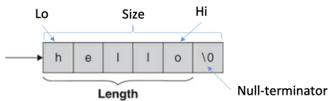
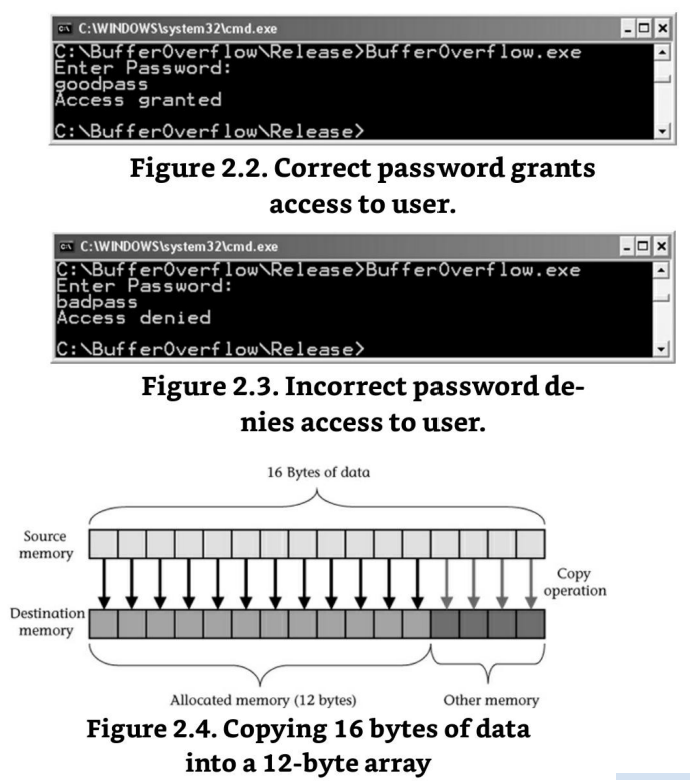
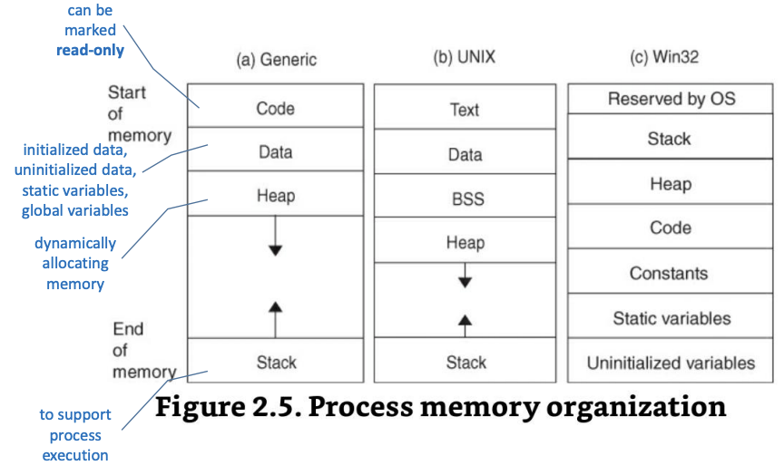
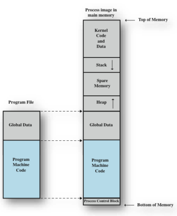
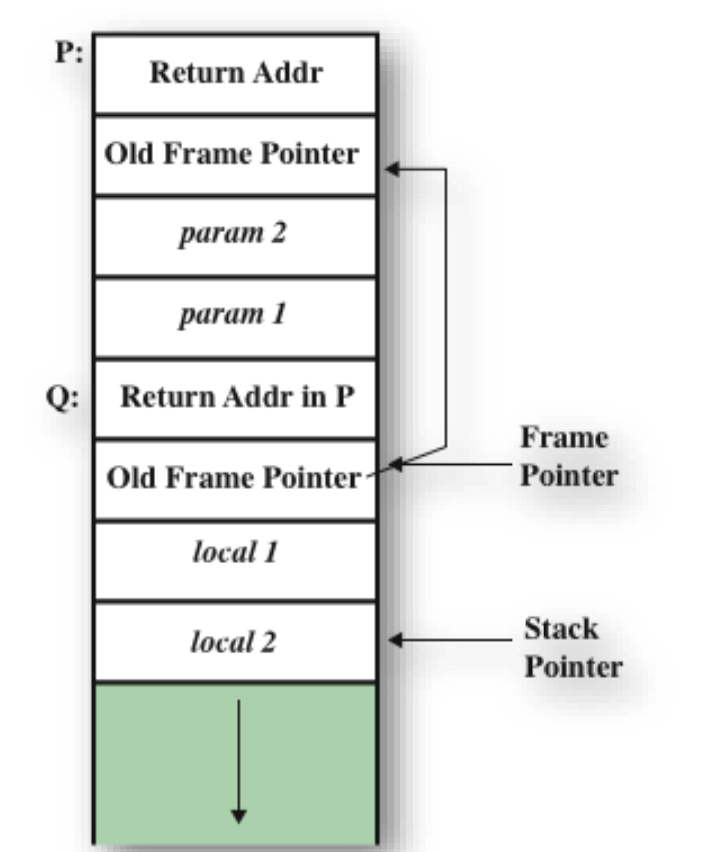
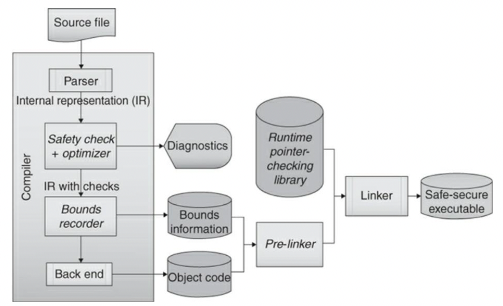

# 10. String Security

# Strings

## Character Strings
- 표준 C 라이브러리 지원
  - `char` 타입의 strings
  - `wchar_t` 타입의 wide strings


> **Figure 2.1.** "hello"의 문자열 표현

## An Example

```c
void clear(int array[]) {
  for (size_t i = 0; i < sizeof(array) / sizeof(array[0]); ++i) {
    array[i] = 0;
  }
}

void dowork(void) {
  int dis[12];

  clear(dis);
  /* ... */
}
```

## multibyte character set
- basic execution character set
  - 26개의 대문자, 26개의 소문자 등
- UTF-8
  - A multibyte character set
  - Backward compatible
  - 1 \~ 4 bytes
- String literals
  - `L"xyz"`
  - Type `wchar_t`

## Strings
- `const char s[3] = "abc";`
  - Array의 크기는 3
  - Trailing null byte는 생략
  - `const char s[ ] = "abc";`

## Strings in C++
- `std::basic_string`
  - Characters의 시퀀스
  - `string`은 template specialization `basic_string<char>`에 대한 typedef
  - `wstring`은 template specialization `basic_string<wchar_t>`에 대한 typedef
- C++ string class
  - 모든 일반적인 implementation은 null-terminated
  - Win32 `LSA_UNICODE_STRING`과 같은 일부 다른 string type은 null-terminated일 필요는 없음

## Character Types

- three types
  - `char`, `signed char`, `unsigned char`
- Philosophy
  - Signed char and unsigned char
    - 작은 정수값에 적합
  - plain char
    - 문자열 리터럴의 각각 요소들의 타입
    - 정수 데이터 대신 문자(character) 데이터를 위해 사용 (부호의 의미가 적은)
- Example
```c
size_t len;
char cstr[] = "char string";
signed char scstr[] = "signed char string";
unsigned char ucstr[] = "unsigned char string";

len = strlen(cstr);
len = strlen(scstr); /* warns when char is unsigned */
len = strlen(ucstr); /* warns when char is signed */
```

## `int`
- `EOF` (음수 값)
- 또는 `unsigned char`로 해석된 `char data`
- `int`를 반환하는 함수
  - `fgetc()`, `getc()`, `getchar()`, `fgetwc()`, `getwc()`, `getwchar()`
- `<ctype.h>`에 선언된 char classification functions
  - `int`를 인수로 허용
  - 예: `isalpha()`

## Example
- Code Example 분석
  ```cpp
  int main() {
      char c = 'a';
      char b[] = “a”;
      wchar_t wc;
      printf(" size of 'a': %d \n", sizeof('a'));
      printf(" size of c: %d \n", sizeof(c));
      printf(" size of wc: %d \n", sizeof(wc));
  }
  ```
- C에서 sizeof('a') → ???, sizeof(c) → ???
- C++에서 sizeof('a') → ???

## unsigned char
- 객체가 어떤 type이든 될 수 있을 때 유용
- `fwrite()`
- Pure binary notation을 사용하여 표현됨이 보장

```cpp
int main() {
    unsigned char buf1[6] = { 0xff, 0x56, 0x78, 0xfa, 0xf1, 0};
    unsigned char buf2[6];
    FILE *stream;
    stream = fopen(“out.dat”, “wb”);
    fwrite(buf1, sizeof(char), 6, stream);
    fclose(stream);
    stream = fopen(“out.dat”, “rb”);
    fread(buf2, sizeof(char), 6, stream); fclose(stream);
    for (int i=0; i<6 && buf2[i] != NULL; i++)
        printf(“%x “, buf2[i]);
    printf(“\n”);
    return 0;
}
```

## Sizing Strings
- Buffer overflows를 예방하기 위해 필수
- The CERT C Secure Coding Standard
  - `STR31-C`. strings용 저장 공간이 character data와 null terminator를 위한 충분한 공간을 갖도록 보장
- 용어
  - Size: array에 할당된 byte 수 (`sizeof(array)`와 동일)
  - Count: array의 element 수 (Visual Studio 2010의 `_countof(array)`와 동일)
  - Length: null terminator 앞의 character 수 (`strlen()` 결과)

## Example

```cpp
wchar_t wide_str1[] = L”0123456789”;
wchar_t *wide_str2 = (wchar_t *) malloc (strlen(wide_str1) +1);
if (wide_str2 == NULL) {
  /* handle error */
}
strcpy(wide_str2, wide_str1);
/* … */
free(wide_str2);
wide_str2 = NULL;
```

## Common String Manipulation Errors
- 4가지 일반적인 오류
  - **unbounded string copies** (무한 string 복사)
  - **off-by-one errors**
  - null-termination errors
  - String truncation

## Improperly Bounded String Copies
- 데이터가 고정된 길이의 문자열로부터 복사될 때
  - 예: 고정된 길이 버퍼에 표준 입력으로 읽어오는 경우
- `gets()` `C99`에 추가되었으나 `C11`에서 제거
- "STR35-C. unbounded source에서부터 고정 길이 배열에 복사하지 마십시오."

```c
#include <stdio.h>
#include <stdlib.h>

void get_y_or_n(void) {
  char response[8];
  puts("Continue? [y] n: ");
  gets(response);
  if (response[0] == 'n')
    exit(0);
  return;
}
```

> **Example 2.1.** Reading from `stdin()`

## `sprintf()` function
- array에 output을 작성
- 작성된 character의 끝에 null character가 작성
- target array에 필요한 최대 크기를 결정하기 어려움
  - 예: `INT_MAX` → 최소 11 characters
  - 음의 정수, floating-point values는 예측이 더 어려움
- `snprintf()` 함수
  - 추가 parameter: `size_t n`
  - null char가 추가되므로 $n-1$ characters가 작성
  - 성공 시 작성된 character 수 (excluding null char) 반환
  - 비교적 안전하지만, format string vulnerabilities에 취약

## C++의 `std::cin`
- 이 또한 문제점 있음
```cpp
#include <iostream>

int main(void) {
  char buf[12];

  std::cin >> buf;
  std::cout << "echo: " << buf << '\n';
}
```
- field width를 `ios_base::width` 또는 `setw()`로 설정 가능
- $n-1$ characters가 추출된 후 null character가 자동으로 추가됨

```cpp
#include <iostream>

int main(void) {
  char buf[12];

  std::cin.width(12);
  std::cin >> buf;
  std::cout << "echo: " << buf << '\n';
}
```

## Off-by-One Errors
- 또 다른 일반적인 문제
- unbounded string copies와 유사
- Example
```c
#include <string.h>
#include <stdio.h>
#include <stdlib.h>

int main(void) {
  char s1[] = "012345678";
  char s2[] = "0123456789";
  char *dest;
  int i;

  strcpy_s(s1, sizeof(s2), s2);
  dest = (char *) malloc (strlen(s1));
  for (i = 1; i <= 11; i++) {
    dest[i] = s1[i];
  }
  dest[i] = '\0';
  printf("dest = %s", dest);
  /* ... */;
}
```

## Null-Termination Errors
- Example
```c
int main(void) {
  char a[16];
  char b[16];
  char c[16];
  strncpy(a, "0123456789abcdef", sizeof(a));
  strncpy(b, "0123456789abcdef", sizeof(b));
  strncpy(c, a);
  /* ... */
}
```
- `strncpy()`는 처음 $n$ characters를 복사
  - Null-termination을 보장하지 않음

## String Vulnerabilities and Exploits
- C 또는 C++에서 String manipulation
  - 외부 source의 untrusted data에서 작동할 때 위험해짐
  - 모든 외부 데이터를 untrusted로 보는 것이 안전
- Example
```c
bool IsPasswordOK(void) {
  char Password[12];

  gets(Password);
  return 0 == strcmp(Password, "goodpass");
}

int main(void) {
  bool PwStatus;

  puts("Enter password: ");
  PwStatus = IsPasswordOK();
  if (PwStatus == false) {
    puts("Access denied");
    exit(-1);
  }
}
```

## Buffer Overflows
- Example

- C 및 C++가 buffer overflows에 취약한 이유
  - Strings를 null-terminated arrays of characters로 정의
  - 암묵적인 bounds checking을 수행하지 않음
  - bounds checking을 강제하지 않는 strings에 대한 표준 라이브러리 호출 제공

## Process Memory Organization


## Programs and Processes

> **Figure 10.4** Program Loading into Process Memory

## Stack Buffer Overflows
- Buffer가 stack에 위치할 때 발생
  - Stack smashing이라고도 함
- Morris Worm에 의해 사용
  - exploits는 unchecked buffer overflow를 포함
- 여전히 널리 악용되고 있음
- Stack frame
  - 한 함수가 다른 함수를 호출할 때 return address를 저장할 공간 필요
  - 호출된 함수에 전달될 parameters와 register values를 저장할 위치도 필요

## Stack Frame with Functions P and Q

> **Figure 10.3** Examples Stack Frame with Functions P and Q

## Stack Management
- Stack은 automatic process-state data를 유지하여 program execution을 지원
  
  > **Figure 2.6.** Stack management
- Stack frame의 정보
  - return address
  - local variables
  - frame pointer
- (Disassembly using Intel Notation)

- `foo()` 함수 prologue
- `foo()` 함수 Epilogue
- `foo()` 호출 후 Stack frame

## Stack Smashing
- Stack smashing
  - Buffer overflow가 execution stack에 할당된 메모리의 데이터를 덮어쓸 때 발생
  - Stack segment의 buffer overflow는 공격자가 arbitrary code를 실행하도록 유도 가능
- Example
- Corrupted program stack
- Carefully crafted input string
  - $j = 0x6A$, $= 0x10$, $* = 0x2A$, $! = 0x21$
- Corrupted program stack

## Code Injection
- Return address가 덮어쓰여질 때
  - 제어 흐름을 새 주소로 전달하는 것은 일반적으로 trap을 유발하고 corrupted stack을 초래
  - 공격자가 악성 code에 대한 pointer를 포함하는 specially crafted string을 생성하는 것이 가능
  - 악성 code는 취약한 program이 가진 권한으로 실행
- Malicious arguments
  - 취약한 program에 의해 legitimate input으로 수용되어야 함
  - 다른 제어 가능한 입력과 함께 인수가 취약한 code path의 실행을 초래해야 함
  - Shellcode로 제어가 전달되기 전에 인수가 program을 비정상적으로 종료시키지 않아야 함

## Code Injection
- Example
  - `./BufferOverflow < exploit.bin`

## Code Injection
- Example (`execve()` system call을 이용한 예시)
    1.  첫 번째 `mov` instruction은 %eax register에 `0xB` 할당
    2.  `execve()` 함수 호출을 위한 세 인수는 후속 세 instructions에서 설정
    3.  `int $0x50` instruction은 `execve()`를 호출하여 Linux calendar program을 실행

## Code Injection
- Modified Example
  - `gets()` 대신 `fgets()` 사용
  - Buffer overflow가 여전히 발생할 수 있음

## Code Injection
- Modified Example
  - Exploit Code
  - Corrupted Stack

## Arc Injection
- Arc injection technique
  - 이미 process memory에 존재하는 code로 제어를 전달
  - 새로운 arc (control-flow transfer) 삽입
  - `system()` 또는 `exec()`을 사용하여 commands 실행 가능
  - 여러 함수를 순차적으로 호출 가능

## Arc Injection
- 공격자가 code injection보다 arc injection을 선호할 수 있는 이유
  - 대상 시스템의 메모리에 이미 code가 존재
  - Footprint를 현저히 작게 유지 가능
  - Memory-based protection schemes로 보호할 수 없음
- Example

## Mitigation Strategies
- 여러 전략을 결합하는 defense-in-depth tactic 채택
  - String handling에 대한 secure technique
  - + 하나 이상의 runtime detection
- String handling
  - Character strings 처리에 대한 단일 접근 방식 선택 권장
  - String-handling functions는 메모리 관리 방식에 따라 분류
    - Caller allocates, caller frees (`C99`, `OpenBSD`, `C11` Annex K)
    - Callee allocates, caller frees (`ISO/IEC TR 24731-2`)
    - Callee allocates, callee frees (C++ `std::basic_string`)

## `C11` Annex K Bounds-Checking
- 첫 번째 메모리 관리 model (caller allocates하고 caller free하는 방법)
- `C11` Annex K
  - 대안적인 라이브러리 함수 제공
  - output buffers가 의도한 결과를 담을 만큼 충분히 큰지 확인
  - 충분하지 않으면 failure indicator 반환
  - 모든 string results는 null-terminated
- 예: `strcpy_s()`, `strcat_s()`, `strncpy_s()`, `strncat_s()`, ... 정의
- `ISO/IEC TR 24731-1`로 게시 → 나중에 `C11`에 optional extensions 세트로 통합
- `__STDC_LIB_EXT1__` macro 정의 필요
- `C11` Annex K는 normative이지만 optimal annex
- `gcc`에서는 implemented되지 않음
- 유효하지 않은 크기가 함수에 전달되면 buffer overflow problems를 겪을 수 있음

## `C11` Annex K
- Example: `gets_s()`
```c
#define __STDC_WANT_LIB_EXT1__ 1
#include <stdio.h>
#include <stdlib.h>

void get_y_or_n(void) {
    char response[8];
    size_t len = sizeof(response);
    puts("Continue? [y] n: ");
    gets_s(response, len);
    if (response[0] == n)
        exit(0);
}
```

## Runtime-constraint-handler function
- 오류 감지 시 특수 runtime-constraint-handler function 호출
  - 오류 메시지 출력 및/또는 program 중단 가능
- `set_constraint_handler_s()` 함수를 통해 호출되는 handler function 제어 가능
- "`ERR03-C`. Use runtime-constraint handlers when calling functions defined by TR24731-1"
  - Implementation-defined behavior를 제거하기 위해 runtime-constraint handler 설치 권장

## `C11` Annex K
- Example 2.6. `gets_s()` (Improved)
```c
#define __STDC_WANT_LIB_EXT1__ 1
#include <stdio.h>
#include <stdlib.h>

void get_y_or_n(void) {
    char response[8];
    size_t len = sizeof(response);

    puts("Continue? [y] n: ");
    if ((gets_s(response, len) == NULL) || (response[0] == 'n')) {
        exit(0);
    }
}

int main(void) {
    constraint_handler_t oconstraint = set_constraint_handler_s(ignore_handler_s);
    get_y_or_n();
}
```

## Runtime-constraint-handler function
- `ignore_handler_s()` 함수로 설정된 경우
  - 모든 위반은 caller에게 반환
- 대부분의 bounds-checking functions는 nonzero `errno_t` 반환
  - `gets_s()` 함수는 null pointer 반환 (compatibility를 위해)
- "`ERR00-C`. 일관되고 포괄적인 오류 처리 정책을 채택하고 시행"
- Original constraint handler
  - 라이브러리 함수가 constraint handler를 설정하는 경우, 함수는 반환 또는 종료 전에 original constraint handler를 복원해줘야 함

## Dynamic Allocation Functions
- 두 번째 메모리 관리 model (callee allocates, caller frees)
  - `ISO/IEC TR 24731-2`
- 이러한 함수 사용은 나중에 buffers를 free하기 위한 추가 호출이 필요
- `ISO/IEC TR 24731-2`에 설명된 함수는 버퍼가 항상 필요한 데이터를 담을 수 있도록 자동 크기 조정 → 더 큰 보장 제공
  - Denial-of-service attacks를 겪을 수 있음

## Dynamic Allocation Functions
```c
#define __STDC_WANT_LIB_EXT1__ 1
#include <stdio.h>
#include <stdlib.h>

void get_y_or_n(void) {
    char response[8];
    size_t len = sizeof(response);

    puts("Continue? [y] n: ");
    if ((getline(&response, &len, stdin) < 0) || (len && response[0] == 'n')) {
        free(response);
        exit(0);
    }
    free(response);
}
```
- Example: `getline()`
  - Buffer를 dynamically allocate
  - Buffer를 free해야 함

## String stream
- `fmemopen()`, `open_memstream()`
- 함수 prototypes
```c
FILE *fmemopen(
    void * restrict buf, size_t size, const char * restrict mode
);
FILE *open_memstream(
    char ** restrict bufp, size_t * restrict sizep
);
)
```
- `open_memstream()`에 의해 열린 stream의 경우
  - write operations를 수용하기 위해 메모리 영역이 dynamically 증가
  - Caller는 할당된 메모리를 free해야 함 (line 16)
- Dynamic allocation은 safety-critical systems에서 종종 허용되지 않음
- Example
```c
#include <stdio.h>

int main(void) {
    char *buf;
    size_t size;
    FILE *stream;

    stream = open_memstream(&buf, &size);
    if (stream == NULL) { /* handle error */ };
    fprintf(stream, "hello");
    fflusth(stream);

    printf("buf = '%s', size = %zu\n", buf, size);
    fprintf(stream, ", world");
    fclose(stream);
    printf("buf = '%s', size = %zu\n", buf, size);
    free(buf);
    return 0;
}
```

## C++ `std::basic_string`
- C++ extraction operator `operator>>`
  - Field width를 설정하여 buffer overflow vulnerability 제거
  - Truncation 문제
  - 예상치 못한 program behavior가 발생할 수 있음
- ISO/IEC 14882에 정의된 표준 `std::string class`
  - type `char`에 대한 `std::basic_string template`의 specialization
- `basic_string class`
  - Strings에 대한 dynamic approach 사용
  - "callee allocates, callee frees" 메모리 관리 전략 → 가장 안전한 접근 방식
- Example

```cpp
string str1 = “hello, “;
string str2 = “world”;
string str3 = str1 + str2;
```

### Example: `std::cin`

```cpp
#include <iostream>
#include <string>
using namepsace std;

int main(void) {
    string str;

    cin >> str;
    cout << "str 1: " << str << '\n';
}
```

## `std::out_of_range`
- Subscript member `std::string::operator[]`
  - Exception을 던지지 않음
  - Example
    ```cpp
    string bs(“01234567”);
    size_t i = 10;
    bs[i] = ‘\0’;
    ```
- `at()` method
  - `operator[]`와 유사하지만, `pos >= size()`이면 out_of_range exception 발생
- Example
```cpp
string bs("01234567");
try {
    size_t i = f();
    bs.at(i) = '\0';
}
catch (out_of_range& oor) {
    cerr << "Out of Range error: " << oor.what() << '\n';
}
```

## `c_str()`
- `string`을 null-terminated byte string으로 변환
  - `c_str()` method
  - Example
    ```cpp
    string str(“abcd”);
    cout << strlen(str.c_str());
    ```

## String-Handling Functions
- `gets()`
  - 절대 `gets()` 함수 호출 금지
  - 종료 newline 또는 `EOF`가 발견될 때까지 표준 입력에서 buffer로 한 줄을 읽음
  - `C11`에서 제거
- 대체 함수
  - `C99`
    - `fgets()`
    - `getchar()`
- Example 2.9. `fgets()`
```c
char buf[LINE_MAX];
int ch;
char *p;

if (fgets(buf, sizeof(buf), stdin)) {
    /* fgets succeeds, scan for newline character */
    p = strchr(buf, '\n');
    if (p) {
        *p = '\0';
    }
    else {
        /* newline not found, flush stdin to end of line */
        while (((ch = getchar()) != '\n')
            && !feof(stdin)
            && !ferror(stdin)
        );
    }
}
else {
    /* fgets failed, handle error */
}
```

## `fgets()` and `getchar()`
- `fgets()`
  - Newline character를 유지
  - Truncation: 사용자 입력이 잘릴 수 있음
  - 입력할 character 수가 destination buffer의 길이보다 크면 buffer overflow 발생 가능
- `getchar()`
  - `stdin`이 가리키는 입력 stream에서 다음 character 반환
  - Stream이 `EOF`에 있거나 read error 발생 시 `EOF` 반환

## `getchar()`
- Example 2.10. `getchar()`
```c
char buf[BUFSIZ];
int ch;
int index = 0;
int chars_read = 0;

while (((ch = getchar()) != '\n')
    && !feof(stdin)
    && !ferror(stdin)) 
{
    if (index < BUFSIZ - 1) {
        buf[index++] = (unsigned char)ch;
    }
    chars_read++;
} /* end while */

buf[index] = '\0'; /* null-terminate */

if (feof(stdin)) {
    /* handle EOF */
}
if (ferror(stdin)) {
    /* handle error */
}
if (chars_read > index) {
    /* handle truncation */
}
```

## `C11` Annext K gets_s()
- `C11` `gets_s()` 함수
  - `gets()`와 호환
  - 더 안전한 version
  - `stdin`에서 읽음
  - Newline character를 유지하지 않음
- 오류 발생 시
  - 입력 수행 안 함
  - Char array 수정 안 함
- 그 외의 경우
  - 지정된 char 수보다 최대 하나 적게 읽음
  - 마지막 char 다음에 null char 작성
- `gets_s()` 함수
  - 완전한 한 줄을 읽을 때만 성공
  - 완전한 줄을 읽을 수 없으면 `NULL` 반환, buffer를 null string으로 설정, 입력 stream을 다음 newline char까지 정리

## Dynamic Allocation Functions
- `getline()` 함수
  - `ISO/IEC TR 24731-2`에 설명
  - `fgets()`와 유사하지만 추가 기능 포함
    - Destination buffer를 dynamically resize
    - 읽은 character 수 반환
  - Destination buffer가 `malloc()`으로 할당된 경우에만 작동
  - 사용자는 나중에 buffer를 명시적으로 `free()`해야 함

## String-Handling Functions
- Example 2.12. `getline()`
```c
int ch;
char *p;
size_t buffer_size = 10;
char *buffer = malloc(buffer_size);
ssize_t size;

if ((size = getline(&buffer, &buffer_size, stdin)) == -1) {
    /* handle error */
} else {
    p = strchr(buffer, '\n');
    if (p) {
        *p = '\0';
    } else {
        /* newline not found, flush stdin to end of line */
        while (((ch = getchar()) != '\n')
            && !feof(stdin)
            && !ferror(stdin)
        );
    }
}

/* ... work with buffer ... */

free(buffer);
```

## Alternative functions for `gets()`
### Table 2.4. Alternative Functions for `gets()`

| | Standard/TR | Retains Newline Character | Dynamically Allocates Memory
| - | - | - | -
| `fgets()` | `C99` | Yes | No
| `getline()` | `TR 24731-2` | Yes | Yes
| `gets_s()` | `C11` | No | No

## `strcpy()` and `strcat()`
- `C99`
  - C 표준 `strncpy()` 함수가 종종 대안으로 권장
    - `strncpy()`는 null-termination errors 및 기타 문제에 취약
- `OpenBSD`
  - `strlcpy()` 및 `strlcat()`
  - Size parameter로 destination string의 전체 크기 사용
  - Destination string이 null-terminated임을 보장
  - 생성하려고 시도한 string의 총 길이 반환

## `C11` Annex K Bounds-Checking interfaces
- `strcpy_s()` 및 `strcat_s()`
  - 성공 시 `0` 반환
  - 그 외의 경우 nonzero value 반환
  - 다양한 runtime constraints 강제
    - s1 또는 s2가 null pointer인 경우
    - Destination buffer의 크기가 `0`, `RSIZE_MAX`보다 크거나, source string의 길이보다 작거나 같은 경우

## String copy functions
### Table 2.5. String Copy Functions

| | Standard/TR | Buffer Overflow Protection | Guarantees Null Termination | May Truncate String | Allocates Dynamic Memory
| - | - | - | - | - | -
| `strcpy()` | C99 | No | No | No | No
| `strncpy()` | C99 | Yes | No | Yes | No
| `strlcpy()` | `OpenBSD` | Yes | Yes | Yes | No
| `strdup()` | TR 24731-2 | Yes | Yes | No | Yes
| `strcpy_s()` | C11 | Yes | Yes | No | No

### Table 2.6. String Concatenation Functions

| | Standard/TR | Buffer Overflow Protection | Guarantees Null Termination | May Truncate String | Allocates Dynamic Memory
| - | - | - | - | - | -
| `strcat()` | C99 | No | No | No | No
| `strncat()` | C99 | Yes | No | Yes | No
| `strlcat()` | `OpenBSD` | Yes | Yes | Yes | No
| `strcat_s()` | C11 | Yes | Yes | No | No

## `strncpy()` and `strncat()`
- `size_t parameter n` 추가
- `strncpy()`
  - Destination string의 null-terminate를 보장하지 않음
  - String termination errors에 취약
- `strncat(s1, s2, n)`
  - S1 buffer의 최소 크기는 `strlen(s1) + n + 1`이어야 함
  - `strncat()`의 마지막 인수는 총 buffer length가 아니어야 함
  - `strncat(dest, source, dest_size – strlen(dest) – 1)`
- 결과 string이 잘릴 때 status code 없음

## `strncpy_s()`

```c
errno_t strncpy_s (
    char * restrict s1,
    rsize_t s1max,
    const char * restrict s2,
    rsize_t n
);
```
- Runtime-constraint violation 발생 시 destination array는 empty string으로 설정
- Null terminator 추가됨
- 성공을 나타내기 위해 `0` 반환
- 입력 인수가 유효하지 않으면 nonzero value 반환
- No truncation!
- Example
```c
char src1[100] = "hello";
char src2[7] = { 'g', 'o', 'o', 'd', 'b', 'y', 'e' };
char dst1[6], dst2[5], dst3[5];
errno t r1, r2, r3;
```
  - `r1 = strncpy_s(dst1, sizeof(dst1), src1, sizeof(src1));`
    - `r1 = 0, dst1 = “hello\0”`
  - `r2 = strncpy_s(dst2, sizeof(dst2), src2, 4);`
    - `r2 = 0, dst2 = “good\0”`
  - `r3 = strncpy_s(dst3, sizeof(dst3), src1, sizeof(src1));`
    - `r3 = nonzero value, dst3[0] = ‘\0’`

## Summary of `strcpy()` and `strcat()`

### Table 2.7. Truncating Copy Functions

| | Standard/TR | Buffer Overflow Protection | Guarantees Null Termination | May Truncate String | Allocates Dynamic Memory | Checks Runtime Constraints
| - | - | - | - | - | - | -
| `strncpy()` | `C99` | Yes | No | Yes | No | No
| `strlcpy()` | `OpenBSD` | Yes | Yes | Yes | No | No
| `strndup()` | `TR 24731-2` | Yes | Yes | Yes | Yes | No
| `strncpy_s()` | `C11` | Yes | Yes | No | No | Yes

| | Standard/TR | Buffer Overflow Protection | Guarantees Null Termination | May Truncate String | Allocates Dynamic Memory | Checks Runtime Constraints
| - | - | - | - | - | - | -
| `strncat()` | `C99` | Yes | No | Yes | No | No
| `strlcat()` | `OpenBSD` | Yes | Yes | Yes | No | No
| `strncat_s()` | `C11` | Yes | Yes | No | No | Yes

## Runtime Protection Strategies
- Programmer가 불완전한 detection and recovery strategy를 사용하여 문제를 해결했다고 잘못된 확신을 가질 위험
- Buffer overflow mitigation strategies
  - Mitigation mechanism을 제공하는 시스템의 component에 따라 분류 가능
    - 개발자 (입력 validation을 통해)
    - Compiler 및 관련 runtime system
    - Operating system

## Input validation
- Buffer overflows를 완화하는 가장 좋은 방법
```c
void f(const char *arg) {
    char buff[100];
    if (strlen(arg) >= sizeof(buff)) {
        abort();
    }
    strncpy(buff, arg);
    /* ... */
}
```
- Trust boundary를 넘어 program interface에 도달하는 모든 데이터는 validation 필요
  - 예: `argv` 및 `argc`, environment variables, `sockets/files/devices`에서 읽은 데이터

## Object Size Checking
- GCC
  - Pointer가 가리키는 객체의 크기에 접근하기 위한 제한된 기능 제공
  - GCC 4.1: `size_t __builtin_object_size(void *ptr, int type)`
    - `ptr`: 객체의 시작 부분을 가리켜야 함
    - `type`: $0 \sim 3$
      - $0$ 또는 $2$: 참조된 객체는 가리키는 byte를 포함하는 가장 큰 객체
      - 그 외: 객체는 가장 작은 객체
    - Byte 수 반환
- Example
```c
struct V { char buf1[10]; int b; char buf2[10]; } var;
void *ptr = &var.b;
```

- `__builtin_object_size(ptr, 0)`
- `__builtin_object_size(ptr, 1)`

- `__builtin_object_size()` 함수
  - `_FORTIFY_SOURCE`가 정의될 때 사용

## Object Size Checking
| Value of type Argument | Operates on | If Unknown, Returns
| - | - | -
| 0 | Maximum object | (size\_t) -1
| 1 | Minimum object | (size\_t) -1
| 2 | Maximum object | (size\_t) 0
| 3 | Minimum object | (size\_t) 0

  - 크기 결정 불가
  - `src_end` = `‘\0’`를 포함한 byte 수

## Visual Studio Compiler-Generated Runtime Checks
- Visual C++ 2010
  - `/RTCs` compiler flag
    - Arrays와 같은 local variables의 overflows
    - 초기화되지 않은 variables 사용
    - Stack pointer corruption
    - 등의 runtime checks 활성화
  - `/GS`
  - pragma를 사용하여 flags 조정 가능

## Stack-Smashing Protector (ProPolice)
- `GCC 4.1`
  - Stack-Smashing Protector (SSP) 기능 도입
  - Buffers 뒤에 pointers를 배치하도록 local variables 재정렬
  - 함수 인수의 pointers를 local variable buffers 앞 영역으로 복사
- SSP
  - Canary를 도입하여 변경 사항 감지
- SSP stack structure
```
                  ┌────────────────────────────┐ ▲
Stack pointer ──► │            ...             │ │
                  ├────────────────────────────┤ │
                  │    local variables (C)     │ │
                  ├────────────────────────────┤ │
                  │         arrays (B)         │ │
                  ├────────────────────────────┤ │
                  │           guard            │ ├─── stack
Frame pointer ──► ├────────────────────────────┤ │    guard
                  │   previous frame pointer   │ │
                  ├────────────────────────────┤ │
                  │       return address       │ │
                  ├────────────────────────────┤
                  │       arguments (A)        │
                  ├────────────────────────────┤
                  │            ...             │
                  └────────────────────────────┘
```
  - 위치 (A): array 또는 pointer variables 없음
  - 위치 (B): arrays를 포함하는 arrays 또는 structures
  - 위치 (B) 뒤에 guard 배치
  - 위치 (C): arrays 없음
  - Stack guard

## Operating System Strategies
- Address space layout randomization (ASLR)
  - Arbitrary code execution 방지
  - Linux, Windows Vista 이후 사용 가능
  - 개발자는 `/DYNAMICBASE` linker option을 사용하여 ASLR 지원에 opt in 해야 함
- Nonexecutable stacks
  - 공격자가 stack에서 executable code를 실행하는 것을 허용하지 않음
- W ^ X (W xor X)
  - Process address space의 어떤 부분도 writable이면서 executable이지 않음
  - 여러 CPU에서 No eXecute (NX) bit 사용으로 지원
- Data Execution Prevention (DEP)
  - Microsoft Visual Studio용 W ^ X 정책의 implementation
  - NX technology를 사용하여 data segments에 저장된 instructions의 실행 방지
  - `/NXCOMPACT`로 code를 link하거나 `SetProcessDEPPolicy()` 호출로 DEP 활성화
- PaX
  - Linux kernel security patch
  - Nonexecutable stack, ASLR 등
  - Denial of Service (DoS) 유발 가능
  - 현재 grsecurity project의 일부
- StackGap
  - Stack memory 할당 시 randomly sized gap 도입

## Future Direction
> Figure 2.19. A possible Safe-Secure C/C++(SSCC) implementation

- 가능한 Safe-Secure C/C++ (SSCC) implementation

## Notable Vulnerabilities
- Remote Login (rlogin)
  - Buffer overflow: `TERM environment variable`을 local stack variable로 선언된 1,024 characters array로 복사
- Kerberos
  - Network authentication protocol
  - [http://web.mit.edu/Kerberos/](http://web.mit.edu/Kerberos/)
  - `krb_rd_req()` 함수에서 buffer overflow
    - 공격자가 네트워크를 통해 root access 얻을 수 있음

## Summary
- C 및 C++에서 buffer overflows가 자주 발생하는 이유
  1.  Strings를 null-terminated arrays of characters로 정의
  2.  암묵적인 bounds checking을 수행하지 않음
  3.  Bounds checking을 강제하지 않는 표준 라이브러리 호출 제공
- 일반적인 완화 전략은 새로운 라이브러리 채택
- 실용적인 완화 전략은 static analysis 및 dynamic analysis 포함
- Runtime solutions
  - Bounds checkers, canaries, safe libraries
- Defense-in-depth strategy

# 시험 정보
장소: 501호