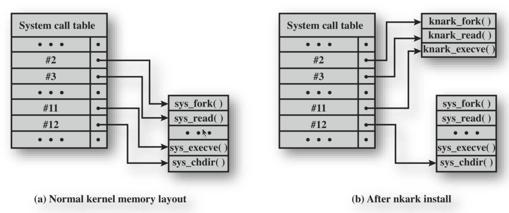
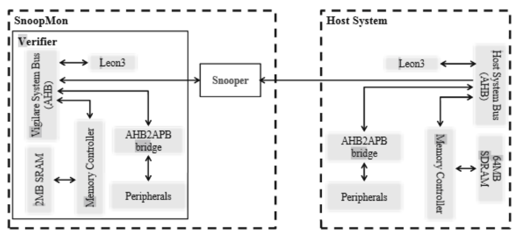
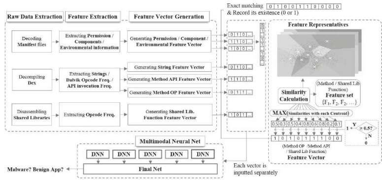
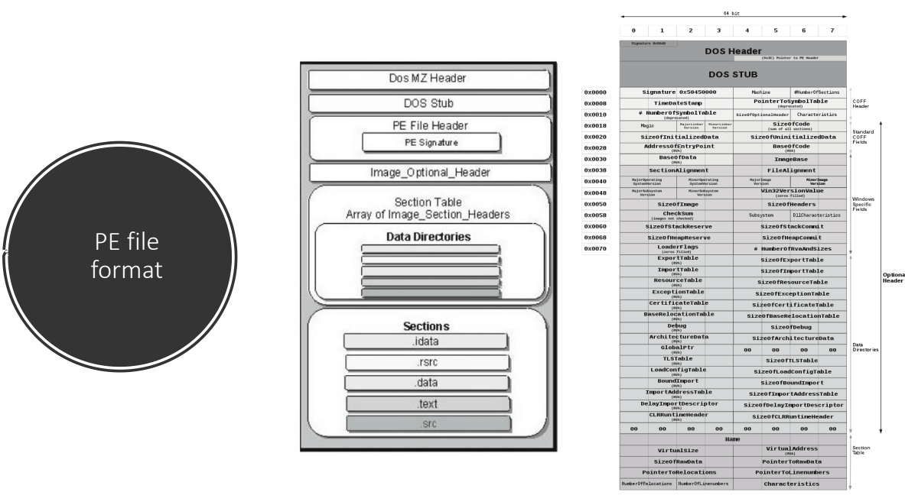

# 07. Malicious Software

## Botnet Overview
- **botmaster**
  - 다양한 malware를 사용하여 botnet 구축
  - 악의적인 활동을 위한 명령 전송
- **bot**
  - Bot master가 사용하는 악성 코드
  - 취약한 개인 PC 또는 기타 device 감염
  - Bot master의 명령에 기반하여 악의적인 활동 수행
- **botnet**
  - 다수의 bot과 하나 이상의 bot master로 구성된 network
- **C&C** (Command & Control) servers
  - Bot들에게 명령을 중계(relay)하는 데 사용되는 server
  - Bot master를 추적하기 어렵게 만듦

## BotNet – Infection Path
- 브라우저 취약점: 65%
- 이메일 첨부 파일: 13%
- OS 취약점: 11%
- 다운로드된 파일: 9%
- 기타: 2%

## Countermeasures against botnets
- BotNet의 방어가 어려운 이유
  - 탐지의 어려움
  - 다중 특징
    - Worm/virus, backdoor, spyware, rootkit 등의 다양한 기능 보유
  - 많은 변종
  - 일반 사용자 PC의 bot 감염
  - 정상 IP address 사용 (Spoofed IP address 아님)
  - 소수의 attack packet 생성
  - 대부분의 시간 동안 악성 행위 없음

## Botnet composition and operations
1. 취약점, email 등을 통한 malware 전파
2. C\&C server 접속
3. 명령/제어
4. 명령/제어
5. 악성 행위 수행 (DDoS, spam email 등)

- C\&C server
- Botnet
- Botmaster
- Victim

## BotNet composition
- Network protocol
  - IRC (Internet Relay Chatting)
  - Http
  - P2P
  - …
- Bot master가 C\&C(Command & Control) server를 통해 명령/제어 전송
- C\&C server 구축 방법
- 경찰에 의해 C\&C server가 폐쇄될 경우의 대처

## Rally Mechanism
- Hard-coded IP address vs Dynamic DNS (DDNS)
- Hard-coded IP address 사용
    1. `x.x.x.x` 연결
- DNS
  - C\&C : `x.x.x.x`
  - C\&C : `a.net`

## CCTV bots

## Remote Control Facility
- Bot과 worm의 구별
  - Worm은 스스로 전파 및 활성화
  - Bot은 초기에 중앙 시설로부터 제어됨
- Remote control facility 구현의 일반적인 수단은 IRC server
  - Bot이 서버의 특정 채널에 참여하여 수신 메시지를 명령으로 처리
- 최신 botnet은 HTTP와 같은 protocol을 통한 은밀한 통신 채널 사용
- 분산 제어 메커니즘은 단일 실패 지점을 피하기 위해 peer-to-peer protocol 사용

## Keylogger 및 spyware
- **Keylogger**
  - 공격자가 민감 정보를 모니터링할 수 있도록 keystroke 캡처
  - 일반적으로 keyword(“login”, “password”) 주변 정보만 반환하는 필터링 메커니즘 사용
- **Spyware**
  - 시스템의 광범위한 활동을 모니터링하기 위해 침해된 머신을 장악
  - Browsing 활동의 기록 및 콘텐츠 모니터링
  - 특정 web page 요청을 가짜 사이트로 redirection
  - Browser와 특정 관심 web site 간 교환되는 데이터의 동적 수정

## Phising
- **Spear-phishing**
  - 공격자가 수신자를 면밀히 조사함.
  - 수신자에게 특별히 맞춰진 e-mail 제작, 진위 확신을 위해 다양한 정보 인용
- **Phishing**
  - 신뢰할 수 있는 소스의 통신으로 위장하여 사용자의 신뢰를 이용하는 social engineering 악용
  - 뱅킹, 게임 등 유사 사이트의 로그인 페이지를 모방한 가짜 web site로 연결되는 URL을 spam e-mail에 포함
  - 계정 인증을 위해 사용자의 긴급한 조치가 필요함을 암시
  - 캡처된 자격 증명을 사용하여 공격자가 계정 도용

## Backdoor
- Trapdoor라고도 함.
- 공격자가 보안 접근 절차를 우회하여 접근 권한을 얻을 수 있도록 하는 프로그램의 비밀 진입점
- Maintenance hook은 프로그래머가 디버깅 및 테스트를 위해 사용하는 backdoor
- 애플리케이션 내 backdoor에 대한 운영 체제 제어 구현의 어려움

## Rootkit
- 시스템에 대한 은밀한 접근을 유지하기 위해 설치된 숨겨진 프로그램 집합
- 컴퓨터의 process, file, registry를 모니터링하고 보고하는 메커니즘을 조작하여 은폐
- 공격자에게 관리자(또는 root) 권한 부여
- 프로그램 및 파일 추가/변경, process 모니터링, network traffic 송수신, 필요 시 backdoor 접근 가능

## Rootkit Classification Characteristics
- Persistent
- Memory based
- User mode
- Kernel mode
- Virtual machine based
- External mode

## System Call Table Modification


## HW based Rootkit detection
- System bus monitor를 사용한 kernel 무결성 모니터링


## Phishing
- Voice phishing
- Messenger phishing
- SMS phishing (Smishing)
- Email phishing
- Phishing site

## Cold Boot Attacks
- DRAM 내 encryption key에 대한 공격

## `dll` injection
- Dll : dynamic link library
  - 실행 파일에서 필요한 library를 동적으로 loading함.
  - Linux에서는 `.so` 파일
- Dll injection 공격
  - 공격자가 제작한 `dll` 파일을 정상 파일인 것처럼 loading하도록 하는 공격

## Process Injection 공격
- In-memory malware 또는 fileless malware에서 사용되는 공격 방법
- Process의 가상 메모리 실행 코드 부분을 공격자의 코드로 바꾸어 실행하게 하는 방법
- 예: svchost.exe, dllhost.exe 등과 같은 process의 실행 코드 부분을 공격자의 코드로 변경

## Web Attacks – Cybercrime 2.0
- Browser 관련 공격
  - Browser 성능 향상 및 web 기능 풍부화
  - Spam email을 통해 사용자 유인
- Web server 공격
  - Exploit server를 가리키는 IFRAME
  - “Drive-by download” : malware 전파의 주요 경로로 사용됨
  - SQL injection 공격
    - `SELECT * FROM users WHERE username = ‘admin’--‘ and password = ‘1234’`
  - .htaccess를 통한 redirection
    - URL을 다른 목적지로 선택적 redirection 허용 (예: HTTP Referrer header 이용)

## Web Attacks - Cross Site Scripting (XSS)
- Web application 보안의 일반적인 문제
  - Server-side web application의 결함으로 발생 (공격자가 임의의 HTML 삽입 허용)
- 취약한 script 삽입
  - 엉뚱한 데이터 삽입 또는 다른 위치로 이동
- 예시
  ```php
  <?php
  $f = fopen(“log.txt”,”a”);
  fwrite($f, “IP: {$_SERVER[‘REMOVE_ADDR’]} Ref: {$_SERVER[‘HTTP_REFERER’]} Cookie
  {$HTTP_GET_VARS[‘cookie_name’]\n”);
  fclose($f); ?>
  ```

## Web Attacks - Cross Site Scripting (XSS)

```html
<div id='test'></div>


```
$$↓$$
```
<div id="test"></div>
</iframe>"; ...>

```

## OWASP TOP 10 (2021)
1. 접근 제어 취약점 (Broken Access Control)
2. 암호화 실패 (Cryptographic Failures)
3. 인젝션 (Injection)
4. 안전하지 않은 설계 (Insecure Design)
5. 보안 설정 오류 (Security Misconfiguration)
6. 오래되고 취약한 구성요소 사용 (Vulnerable and Outdated Components)
7. 식별 및 인증 실패 (Identification and Authentication Failures)
8. 소프트웨어 및 데이터 무결성 실패 (Software and Data Integrity Failures)
9. 보안 로깅 및 모니터링 실패 (Security Logging and Monitoring Failures)
10. 서버 측 요청 위조 (Server-Side Request Forgery, SSRF)

## SNS

- Twitter
  - 1억 600만 사용자
  - 월 10억 tweet
- Twitter 상의 spam
  - Spamming을 위해 침해된 계정
  - 성공 요인
    - 대규모 사용자
    - URL 단축 서비스
    - 방지를 위한 필터링 메커니즘 부재

## Spam Classification
- Clickthrough rate (CTR)
  - 총 245,000 URL
  - 97.7%의 URL은 click 없음
  - Traffic을 발생시키는 link 중 (URL의 2.3%)
    - URL의 50%는 10회 미만 click
    - 상위 10% URL이 160만 click 획득
  - Spam tweet의 0.13%가 방문 발생시킴
    - Spam email의 CTR(0.003%-0.006%)보다 훨씬 높음

## Malware Countermeasure Approaches
- Malware 위협에 대한 이상적인 해결책은 예방
  - 예방의 4가지 주요 요소
    - 정책
    - 인식
    - 취약점 완화
    - 위협 완화
- 예방 실패 시, 다음 위협 완화 옵션을 지원하기 위해 기술적 메커니즘 사용 가능
  - 탐지
  - 식별
  - 제거

## Generations of Anti-Virus Software
- 1세대: 단순 스캐너
  - 악성 소프트웨어를 식별하기 위해 시그니처가 필요
  - 알려진 악성 소프트웨어의 탐지에 국한됨.
- 2세대: 휴리스틱 스캐너
  - 휴리스틱 규칙을 사용하여 의심스러운 악성 소프트웨어 인스턴스를 검색
  - 다른 접근 방식은 무결성 검사
- 3세대: 행위 기반 탐지
  - 감염된 프로그램의 구조가 아닌 행동으로 악성 소프트웨어를 식별하는 메모리 상주 프로그램
- 4세대: 종합 보호
  - 다양한 anti-virus 기술을 함께 사용하는 패키지
  - 스캐닝, 행위 기반 탐지, 접근 제어 기능 포함

## Generic Decryption (GD)
- Anti-virus 프로그램이 빠른 scanning 속도를 유지하면서 복잡한 polymorphic virus 및 기타 malware를 쉽게 탐지 가능
- 실행 파일은 다음 요소를 포함하는 GD scanner를 통해 실행됨
  - CPU emulator
  - Virus signature scanner
  - Emulation control module
- GD scanner의 가장 어려운 설계 문제는 각 해석을 얼마나 오래 실행할지 결정하는 것임.

## Host-Based Behavior-Blocking Software
- Host 컴퓨터의 OS와 통합되어 악성 행위에 대해 프로그램 동작을 실시간 모니터링
- 시스템에 영향을 미치기 전에 잠재적 악성 행위 차단
- 실시간으로 소프트웨어를 차단하므로 fingerprinting이나 heuristic과 같은 anti-virus 탐지 기술보다 이점 보유
- 한계
  - 모든 동작이 식별되기 전에 악성 코드가 대상 머신에서 실행되어야 하므로, 탐지 및 차단 전에 해를 끼칠 수 있음

## Perimeter Scanning Approaches
- 조직의 firewall 및 IDS에서 실행되는 email 및 web proxy 서비스에 일반적으로 anti-virus 소프트웨어 포함
- IDS의 traffic 분석 구성 요소에도 포함될 수 있음
- 의심스러운 traffic 흐름을 차단하는 침입 방지 조치 포함 가능
- Malware scanning으로 접근 제한
- Two types of monitoring software
  - Ingress monitor
    - 기업 network와 internet 경계에 위치
    - 한 가지 기술은 사용되지 않는 로컬 IP address로의 수신 traffic을 찾는 것임.
  - Egress monitor
    - 기업 network와 internet 경계뿐만 아니라 개별 LAN의 egress 지점에 위치
    - Scanning 또는 기타 의심스러운 동작의 징후에 대해 발신 traffic 모니터링

## Worm Countermeasures
- Virus와 worm 대응 기술에 상당한 중복 존재
- Worm이 머신에 상주하면 anti-virus 소프트웨어를 사용하여 탐지 및 제거 가능
- 경계 network 활동 및 사용량 모니터링이 worm 방어의 기초가 될 수 있음
- Worm 방어 접근 방식 포함 사항
  - Signature 기반 worm scan 필터링
  - Filter 기반 worm 억제
  - Payload 분류 기반 worm 억제
  - Threshold Random Walk (TRW) scan 탐지
  - Rate limiting
  - Rate halting

## Digital Immune System

- 디지털 면역 시스템은 인간의 면역 체계와 유사하게 작동하는 포괄적인 anti-virus 방식을 제공
- 작동 원리:
  1. 시스템에서 의심스러운 프로그램이 탐지되면, 분석을 위해 중앙 서버로 전송됨.
  2. 중앙 서버는 프로그램을 분석하여 악성 코드로 확인되면 시그니처와 치료법을 생성
  3. 이 정보는 모든 클라이언트에게 자동으로 전파되어 새로운 위협에 신속하게 대응

# Android Malware Detection

## `DroidAPIMiner`
- 설치 시점의 API level 분석
  - Malware에서 자주 사용되는 중요한 API call에 집중  Dangerous API
  - API + parameters  위험
- 정적 분석


## MADAM

- 정상 동작과 악성 동작을 구별하기 위해 kernel-level 및 user-level에서 Android 모니터링
- 다중 레벨 모니터링
  - 1단계: System call 모니터링 (open, ioctl, brk, read, write, exit, close, sendto, sendmsg, recvfrom, recvmsg)
  - 2단계: 사용자 유휴 상태 여부 (Activity monitor) / 전송된 SMS 수 (SMS monitor)
- 실험
  - 의심스러운 요소를 수동으로 정의

## Android Malware Analysis with Machine Learning

- Multi-modal Neural Networks
- 2019년 3월 발표
- Google Scholar 인용: 193
- 탐지 정확도: 98%

# Malware Analysis

## Issues on Malware Analysis
- Malware 방어
  - 수동 분석 중요
  - 동작 이해, 대응책 개발 및 signature 생성
  - Malware 증가 속도를 따라잡기 어려움
  - 8,000,000 / 3 / 30 = 88,889 ≒ 90,000 per day
  

## PE file format


## Virtual address space


## Static Analysis vs. Dynamic Analysis
- 정적 분석
  - 실행 없이 malware binary 분석
  - 다양한 분석 접근 방식
    - Instruction 빈도 분석
    - Control flow graph (CFG) 분석
    - System call 호출 순서 분석
    - Block 기반 유사성 분석
    - Malware 시각화
  - 장점
    - 모든 binary code 분석 가능
  - 문제점
    - 다양한 packing 기술
    - Polymorphic & Metamorphic worm
    - 대부분의 worm에 packing 기술 적용됨
- 동적 분석 기술을 이용한 분석 필요!

## Dynamic Analysis

- 분석 환경
  - FTP Server
  - Malware sample 및 실행 추적
  - 분석 서버
    - Pin 도구를 사용하여 실행 추적 추출
  - 모니터링 머신
    - 원격 명령 인터페이스
- Windows OS
- VMware vSphere ESXi 5.1
- PIN Visual Studio 2010
- PowerCLI

## Frequency Analysis - Opcode Frequency
| Opcode | Goodware | Kernel RK | User RK | Tools | Bot | Trojan | Virus | Worms
| - | - | - | - | - | - | - | - | -
| `mov` | 25.3% | 37.0% | 29.0% | 25.4% | 34.6% | 30.5% | 16.1% | 22.2%
| `push` | 19.5% | 15.6% | 16.6% | 19.0% | 14.1% | 15.4% | 22.7% | 20.7%
| `call` | 8.7% | 5.5% | 8.9% | 8.2% | 11.0% | 10.0% | 9.1% | 8.7%
| `pop` | 6.3% | 2.7% | 5.1% | 5.9% | 6.8% | 7.3% | 7.0% | 6.2%
| `cmp` | 5.1% | 6.4% | 4.9% | 5.3% | 3.6% | 3.6% | 5.9% | 5.0%
| `jz` | 4.3% | 3.3% | 3.9% | 4.3% | 3.3% | 3.5% | 4.4% | 4.0%
| `lea` | 3.9% | 1.8% | 3.3% | 3.1% | 2.6% | 2.7% | 5.5% | 4.2%
| `test` | 3.2% | 1.8% | 3.2% | 3.7% | 2.6% | 3.4% | 3.1% | 3.0%
| `jmp` | 3.0% | 4.1% | 3.8% | 3.4% | 3.0% | 3.4% | 2.7% | 4.5%
| `add` | 3.0% | 5.8% | 3.7% | 3.4% | 2.5% | 3.0% | 3.5% | 3.0%
| `jnz` | 2.6% | 3.7% | 3.1% | 3.4% | 2.2% | 2.6% | 3.2% | 3.2%
| `retn` | 2.2% | 1.7% | 2.3% | 2.9% | 3.0% | 3.2% | 2.0% | 2.3%
| `xor` | 1.9% | 1.1% | 2.3% | 2.1% | 3.2% | 2.7% | 2.1% | 2.3%
| `and` | 1.3% | 1.5% | 1.0% | 1.3% | 0.5% | 0.6% | 1.5% | 1.6%
- Malware의 빈도 분포는 정상 소프트웨어와 다름
- 특징
  - Opcode 빈도 (정적 분석)
  - \<Daniel Bilar, “Statistical Structures: Fingerprinting Malware for Classification and Analysis”, Black Hat, 2006\>

- Dynamic Opcode Frequency
  - Instruction 및 basic block의 반복 발견
  - 문제점?


## Redundancy Filtering - Experiment
- Block 수 비교
- Ratio(FM) 평균 = 1.6%

| Traces | Original | RF | Ratio | FM | Ratio
| - | - | - | - | - | -
| `rtraceWin32AcidShiver_a` | 615,357 | 34,869 | 5.7% | 19,090 | 3.1%
| `rtraceWin32Agent_h` | 1,790,730 | 50,987 | 2.8% | 27,467 | 1.5%
| `rtraceWin32Agobot_1_c` | 2,466,508 | 44,877 | 1.8% | 22,292 | 0.9%
| `rtraceWin32Bionet_13` | 2,534,095 | 95,647 | 3.8% | 38,306 | 1.5%
| `rtraceWin32Chiton` | 758,995 | 17,052 | 2.2% | 9,042 | 1.2%
| `rtraceWin32Deborm_a` | 340,852 | 15,716 | 4.6% | 6,926 | 2.0%
| `rtraceWin32Nilage_aa` | 885,016 | 10,836 | 1.2% | 5,886 | 0.7%

## Malware Visualization
- Malware 이미지
  - ACM RACS 2013
    - Google citations: 60
  - IJIS journal, Feb. 2015
    - Google citations: 99
- ML 기술 적용 시도

## Anti-Forensic techniques


## Packing Example


## Packing Trends

- Virus Total 파일 분석
- 각 해마다 2,000개의 샘플
- PE 파일 대상
- Packer

## Packing Complexity
| 레벨 | 설명
| - | -
| 1 | 단일 패킹, 예: `UPX`
| 2 | 재패킹, 예: 패킹된 `UPX` PE 파일을 `UPX`로 다시 패킹
| 3 | 다중 계층 패킹, 예: 동일하거나 다른 패커로 파일을 반복적으로 여러 번 패킹
| 4 | 유형 1, 2, 또는 3 + 원본 코드가 가장 깊은 마지막 계층이 아닌 내부 계층 중 한 곳에서 발견됨, 예: `UPolyX`
| 5 | 유형 1, 2, 또는 3 + 원본 프로그램의 언패킹을 담당하지 않는 외부 패커 코드의 잉여 부분을 가짐. 이는 혼란 및 난독화를 위한 목적. 예: `ACProtect`
| 6 | 유형 1, 2, 또는 3 + 메인 언패킹 코드가 파일의 여러 다른 부분에 위치한 별도 `sub-unpacker` 집합을 수집하고, 이를 결합하여 원본 프로그램을 언패킹. 언패킹 로직은 메인 언패킹 코드가 아닌 `sub-unpacker`에 위치. 예: `Frankenstein`
| 7 | 패커 제작자가 미리 결정한 특정 외부 조건 하에서만 원본 프로그램의 단일 `fragment`만 언패킹되는 패커. 예: `Armadillo`
| 8 | 가상화(`Virtualization`)를 사용한 언패킹, 예: `Themida`

## Malware Entropy

- 파일의 무작위성(randomness)을 측정하는 척도
- 패킹되거나 암호화된 파일은 일반적으로 엔트로피가 높게 나타나므로, 악성코드 탐지의 한 지표로 사용될 수 있음.

## Malware Analysis Tools
- Virus Total: 웹 기반 서비스로, 여러 anti-virus 엔진을 사용하여 파일을 스캔하고 분석 결과를 제공
- PE View: 윈도우 실행 파일(PE)의 구조를 상세하게 보여주는 도구
- Detect It Easy (DIE): 파일의 종류, 사용된 패커, 엔트로피, 문자열 등 다양한 정보를 분석하는 도구
- IDA Pro: Hex-rays사에서 개발한 강력한 disassembler 도구로, 리버스 엔지니어링 및 악성코드 분석에 널리 사용