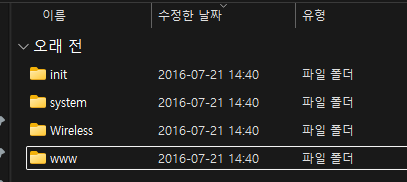

# Firmware Analysis Report

- 분석 대상: 국내 중소기업(SyncView) IP 카메라 펌웨어 (`74.2.64.31-libPPPP_API_20160721.bin`)
- 모델명: `SVR-700A`
- 이름: 김병준
- 학번: 2021024057
- 작성일: 2025년 11월 23일

## 1. 분석 대상 펌웨어 및 다운로드 경로

본 보고서에서는 국내 중소기업(SyncView)에서 판매된 IP 카메라 모델(`SVR-700A`)의 공식 업데이트 파일인
`74.2.64.31-libPPPP_API_20160721.bin`을 분석 대상으로 선정하였다.
해당 파일은 제작사 자료실/다운로드/프로그램 페이지에서 다운로드할 수 있었으며,  
[http://syncview.co.kr/atboard.php?lm=64&grp1=support&grp2=download&sch_tab_option=2&page_uid=67](http://syncview.co.kr/atboard.php?lm=64&grp1=support&grp2=download&sch_tab_option=2&page_uid=67)  
확장자는 `.bin`이지만 실제로는 `ZIP` 기반의 압축 파일임을 확인할 수 있었다.

## 2. 분석 절차 (Procedure)

### 2.1 파일 식별 (File Identification)

처음에는 확장자가 `.bin`이었으나, 내부 헤더에 `PK\x03\x04` 시그니처가 존재해 `ZIP` 구조로 되어있음을 판단하였다.

[스크린샷 첨부 1: binwalk 또는 file 명령 결과]

이후 확장자를 `.zip`으로 변경한 뒤 압축 해제를 시도하는 방식으로 file system을 추출할 수 있었다.

### 2.2 파일 시스템 추출 (Filesystem Extraction)

펌웨어 압축 해제 결과, 다음과 같은 디렉토리 구조를 확인할 수 있었다.

```
/init
    └─ ipcam.sh

/system
    ├─ bin
    │    ├─ encoder
    │    ├─ gmail_thread
    │    ├─ jpeg
    │    └─ daemon.v5.14
    ├─ drivers (비어 있음)
    └─ lib (비어 있음)

/www        (비어 있음)
/Wireless   (비어 있음)
```

이는 linux 기반 IP 카메라 펌웨어에서 흔히 발견되는 구조이며,
웹 UI, 설정 파일, 초기화 스크립트 등이 포함되어 있었다.



- 펌웨어가 최종적으로 편집된 날짜가 `2016년 7월 21일`로 확인되어, 해당 제품은 현재는 더이상 판매되지 않는 단종된 제품으로 추정된다.

## 3. 디렉토리 구조 분석 (Directory Hierarchy Analysis)

### 3.1 `/init/`

`ipcam.sh` 하나만 존재하며, 카메라 부팅 시 실행되는 초기화 스크립트로 추정된다.
부팅 과정에서 네트워크 설정, 프로세스 시작, 장치 초기화 등을 담당했을 것으로 판단된다.

### 3.2 `/system/bin/`

실질적으로 장치의 기능을 담당하는 핵심 실행파일들이 이 디렉토리에 집중되어 있다고 할 수 있다.

- `encoder`: 영상 인코딩 + 웹 서버 + 계정 인증 루틴까지 통합된 메인 바이너리
- `daemon.v5.14`: 백그라운드 서비스 관리
- `jpeg`: `JPEG` 코덱 기능
- `gmail_thread`: 이메일 알림 기능

이 디렉토리 내부의 encoder가 분석의 핵심이며, 실제로 문자열 분석 결과 하드코딩된 `root` 계정 정보가 존재하였다.

### 3.3 `/system/drivers`, `/system/lib`

두 폴더는 존재만 하고 파일이 비어 있음.
이는 해당 장치 커널이나 드라이버가 별도의 파티션에 존재하거나 ROM에 내장된 형태임을 의미한다.

### 3.4 `/www/`, `/Wireless/`

두 디렉토리는 비어 있었다.
보통 IP 카메라 펌웨어에서는 `/www/` 내부에 HTML/JS/CGI 웹 UI가 존재할 수 있지만,
본 펌웨어에서는 이러한 웹 UI 요소가 전부 encoder 바이너리 내부에 통합된 형태로 구성되어 있음이 확인되었다.

이는 제조사가 저장 공간을 줄이기 위해 웹 UI를 개별 파일이 아닌
내장된 웹서버 코드(embedded web server)로 처리한 구조이다.

## 4. 하드코딩된 정보 분석 (Hardcoded Credentials Analysis)

본 분석의 핵심은 펌웨어 내부에 하드코딩된 계정·패스워드·그 해시값이 존재하는지 확인하는 것이다.

이를 위해 `strings` 명령으로 실행 바이너리 내부 문자열을 추출하였다.

### 4.1 `/system/system/bin/encoder` 문자열 분석

문자열 추출 결과, 명백한 `root` 계정 정보가 포함되어 있음을 확인하였다.

#### 발견된 hard-coded된 `/etc/passwd` 정보

```
/etc/passwd
root:vRNT.4lCplkng:0:0:Adminstrator:/:/bin/sh
```

- 이는 장치의 root 계정이 고정된 값으로 펌웨어에 포함되어 있음을 의미하며,  
패스워드 해시(`vRNT.4lCplkng`)는 특정 해시 알고리즘(주로 DES 기반 `crypt()` 함수)으로 암호화된 값이다.  
- 여기서 앞의 두 글자(`vR`)은 salt값에 해당한다.  
- 단방향 알고리즘에 의해 hash된 값이기 때문에 복호화하여 원래 password를 직접 얻어내기에는 어려움이 있었다.
    - 4자리 숫자(`0000` ~ `9999`)를 Brute-force 방식으로 시도해봤으나 실패하였다.
    - 6자리 숫자(`000000` ~ `999999`)를 Brute-force 방식으로 시도해봤으나 실패하였다.
    - 다만, 해당 암호화 알고리즘이 현재는 더 이상 사용되지 않는 오래된 방식의 취약한 알고리즘으로 알려져 있기 때문에, 유출된 password 기반의 dictionary attack을 시도한다면 원래 password를 알아낼 가능성도 있다.

### 4.2 외부 서버로 `username/password`를 평문 전송하는 코드 발견

`encoder` 바이너리에는 아래와 같은 문자열이 포함되어 있었다.

```
GET /api/userip.asp?username=%s&userpwd=%s&vertype=924 ...
GET /api/v2/ddns?ddnsname=%s&ddnspwd=%s ...
```

이는 사용자 계정 정보(`username/password`)를 평문으로 외부 서버로 전송하는 코드이며,
보안적으로 매우 위험한 설계이다.

- HTTPS가 아닌 HTTP 사용 → **중간자 공격**에 취약
- 인증 정보 탈취 가능
- DDNS 서버 문제가 발생할 경우, 전 세계 IP캠 계정의 유출 위험

### 4.3 admin 문자열 존재

encoder.txt에는 `admin` 문자열이 다수 등장한다.
이는 웹 UI 기본 계정이 `admin`일 가능성이 높음을 시사한다.

## 5. 보안적 함의 (Security Implications)

본 펌웨어가 가지는 보안 취약성들은 다음과 같다.

### 5.1. 루트 계정이 펌웨어에 고정

펌웨어 내부에 root 계정 정보가 포함되어 있어, 펌웨어 유출 시 누구나 해시를 cracking해
장치 관리자 권한을 탈취할 가능성이 있다.

### 5.2. 사용자 인증 정보가 평문으로 전송됨

`username/password`가 `HTTP` `GET` 요청에 직접 포함되어 있어, 암호화되지 않은 채 외부로 유출된다.

### 5.3. 기본 admin 계정이 제거되지 않음

웹 UI 내부에서 기본 계정(admin)이 존재하는 것으로 확인되며, 기본 비밀번호 변경 강제 기능도 존재하지 않는다.

### 5.4. 바이너리 내부에 인증 관련 문자열이 노출

문자열 분석만으로 계정 관리 구조, CGI 호출 방식, DDNS 인증 루틴이 모두 노출되는 구조로
reverse engineering에 지나치게 취약하다.

## 6. 결론 (Conclusion)

이번 분석을 통해 확인한 바,

- 펌웨어는 `ZIP` 기반으로 패키징되어 있어 압축 프로그램만으로 file system을 추출할 수 있었음.
- encoder 바이너리 안에 `root` 하드코딩 계정이 존재하였음.
- `username/password`를 평문으로 외부 서버로 전송하는 취약 설계가 존재하였음.
- 웹 UI 기반 admin 계정 흔적이 다수 포착됨.
- 종합적으로, 보안 수준이 낮고 **사용자 정보 보호 측면에서도 위험성**이 있다.

이상으로, 본 펌웨어는 보안적으로 취약하며
하드코딩 계정·평문 인증 정보 전송 등 심각한 구조적 문제가 존재함을 확인할 수 있었다.