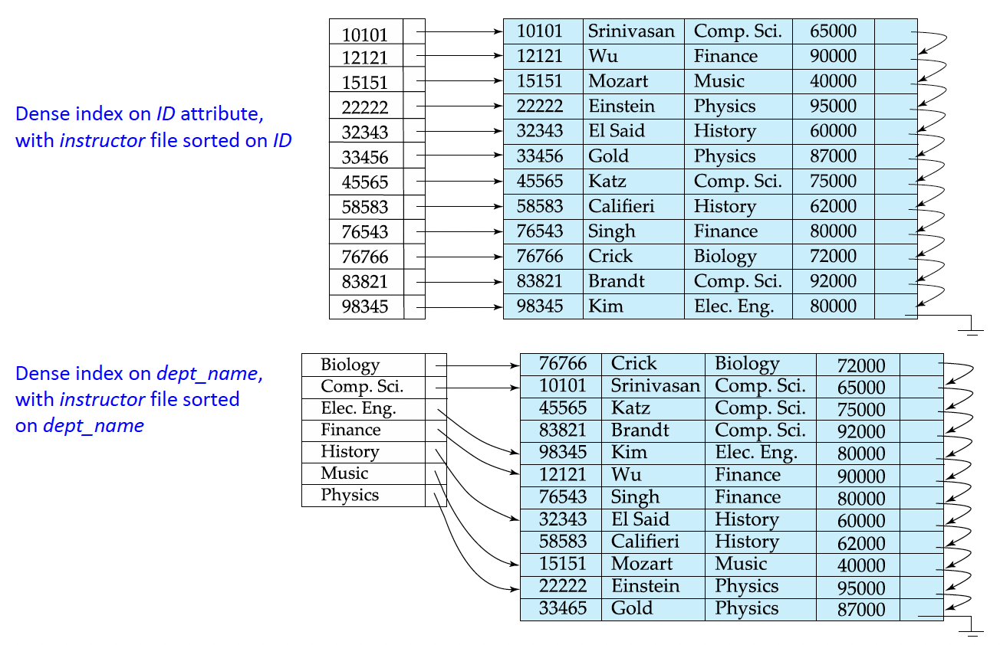
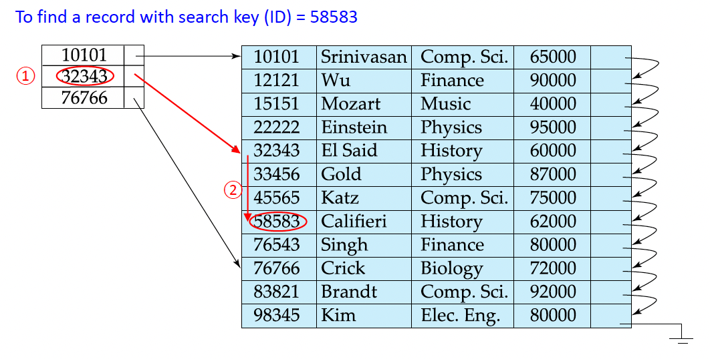
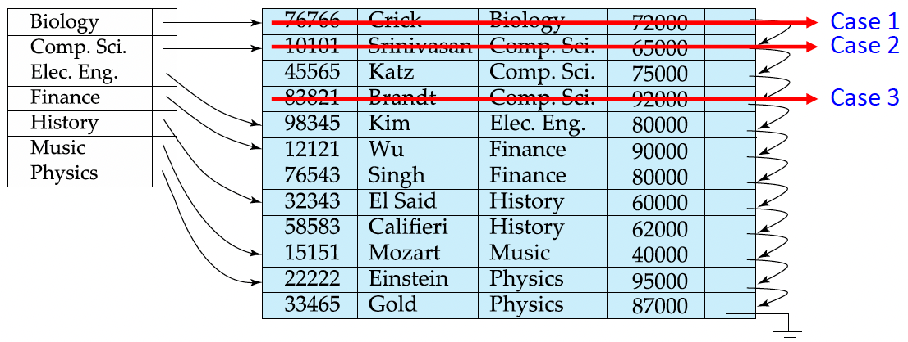
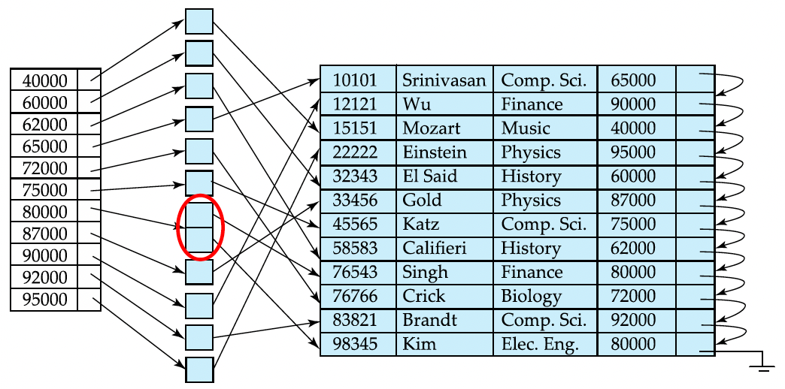
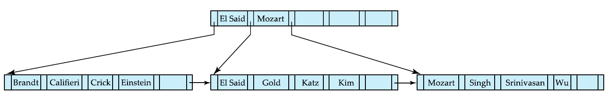
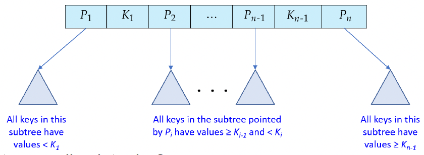
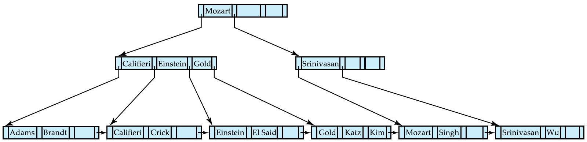

# 14. Indexing
- **Indexing**: 원하는 데이터에 대한 접근 속도를 높이는 데 사용되는 메커니즘
- Search Key: 파일에서 레코드를 찾는 데 사용되는 속성 또는 속성 집합
- 인덱스 파일은 search-key와 pointer(s)($\text{Block pointer, offset}$) 형태의 레코드라 불림)로 구성

  | search-key | pointer(s)
  | - | -
  - 인덱스 파일은 일반적으로 원본 데이터 파일보다 훨씬 작음.
- 두 가지 기본 인덱스 종류
  - **Ordered indices**: Search key가 정렬된 순서로 저장
  - **Hash indices**: Search key가 해시 함수를 사용하여 "buckets"에 균일하게 분산
- Index evaluation metrics
  - 효율적으로 지원되는 access types
    - **Point queries**: Search key에 대해 지정된 값을 갖는 레코드
    - **Range queries**: Search key값이 지정된 범위 내에 있는 레코드
  - 데이터 레코드에 대한 access/insertion/deletion times
  - 공간 overhead

# Ordered Indices
- Ordered index: 인덱스 엔트리에 search key값에 따라 정렬되어 저장
- Clustering index
  - Sequentially ordered data file에서, search key가 데이터 파일의 순차적 순서도 정의하는 인덱스
  - Primary index라고도 함.
  - 기본 인덱스의 search key는 일반적으로 primary key이지만, 필수는 아님
- 2차 인덱스
  - Search key가 데이터 파일의 순차적 순서와 다른 순서를 지정하는 인덱스
  - **Nonclustering index**라고도 함.
- Index-sequential file
  - Search key를 기준으로 정렬된 sequential data file에, search key에 대한 clustering 인덱스가 있는 파일

## Dense Index
- **Dense index**: 데이터 파일의 모든 search-key값에 대해 index entry가 나타남


## Sparse Index

- **Sparse Index**: 일부 search-key값에 대해서만 인덱스 엔트리를 포함.
  - 레코드가 search key를 기준으로 순차적으로 정렬되어 있을 때 적용 가능
- Search-key값 $K$를 가진 레코드를 찾으려면
  - $K$보다 작거나 같은 search-key값 중 가장 큰 값을 가진 index entry를 찾음.
  - 해당 index 레코드가 가리키는 레코드에서부터 파일 순차 검색
- Dense indices와 비교
  - 데이터 레코드의 삽입/삭제에 대해 less space and less maintenance overhead
  - 일반적으로 레코드를 찾는 데 dense index보다 느림.
- Access time과 space overhead 사이의 trade-off 존재
- Good compromise
  - Clustering 인덱스의 경우: 파일의 모든 block에 대해 index entry를 가진 sparse index. 해당 block에서 least search-key값에 해당
    - 참고: Query processing의 주요 비용은 block I/O time
    - 메모리 내 블록 scanning 시간은 사소함.
    - 이 방식은 dense index와 동일한 수의 block I/O를 가지면서도 space overhead가 훨씬 적음.


## Multilevel Index
- 인덱스가 메모리에 맞지 않으면, access가 expensive
- 해결책: Multilevel Index
  - 디스크에 보관된 인덱스를 sequential file로 취급하고 그 위에 sparse 인덱스를 구축
  - Outer index: Basic 인덱스의 sparse index
  - Inner index: Basic 인덱스 파일
  - Outer index조차 너무 커서 메인 메모리에 맞지 않으면, 또 다른 level의 index 생성 가능
- 모든 level의 인덱스는 파일에서의 삽입 또는 삭제 시에 업데이트되어야 함.


## Index Update: Insertion


- Index는 database modification에 overhead를 부과
  - 레코드가 삽입 또는 삭제될 때, 관계형의 모든 인덱스가 갱신되어야 함.
  - 레코드가 갱신될 때, 갱신된 속성에 대한 모든 인덱스가 갱신되어야 함.
- Index update upon insertion: 1) Dense indices
  - 삽입되는 레코드의 search-key값을 사용하여 lookup 수행
  - Search-key값이 인덱스에 나타나지 않으면, insert
  - Search-key값이 인덱스에 나타나면
    - 인덱스 엔트리가 동일한 search-key값을 가진 모든 레코드에 대한 포인터를 저장하는 경우, 새로운 레코드에 대한 포인터를 추가
    - 그렇지 않은 경우, 인덱스 엔트리가 해당 search-key값을 가진 첫 번째 레코드에 대한 포인터만 저장. 새로운 레코드를 동일한 search-key값을 가진 다른 레코드들 뒤에 배치
  - 인덱스는 sequential files로 유지 관리됨 → 새로운 엔트리를 위한 space를 생성해야 하며, overflow blocks이 필요할 수 있음.
- Index update upon insertion: 2) Sparse indices
  - 삽입되는 레코드의 search-key값을 사용하여 lookup 수행
  - 인덱스가 파일의 각 블록에 대한 엔트리를 저장하는 경우, 인덱스를 수정할 필요가 없음.
    - 새로운 block이 생성되는 경우: 새로운 블록의 첫 번째 search-key값이 인덱스에 삽입됨.
    - 새로운 레코드가 블록에서 가장 작은 search-key값을 가지는 경우: 블록을 가리키는 인덱스 엔트리를 업데이트


## Index Update: Deletion


- Index update upon deletion: 1) Dense indices
  - (Case 1) 삭제된 레코드가 해당 search-key값을 가진 파일 내 유일한 레코드인 경우, 인덱스에서도 search-key가 삭제됨.
  - 그렇지 않은 경우
    - 인덱스 엔트리가 동일한 search-key값을 가진 모든 레코드에 대한 포인터를 저장하는 경우, 삭제된 레코드에 대한 포인터 삭제
    - 그렇지 않은 경우, 인덱스 엔트리가 해당 search-key값을 가진 첫 번째 레코드에 대한 포인터만 저장
      - (Case 2) 삭제된 레코드가 해당 search-key값을 가진 첫 번째 레코드인 경우, 인덱스 엔트리를 업데이트하여 다음 레코드를 가리키도록 함.
      - (Case 3) 그렇지 않은 경우, 인덱스 갱신은 required되지 않음.
- Index update upon deletion: 2) Sparse indices
  - (Case 1) 인덱스가 삭제된 레코드의 search-key값과 일치하는 index entry를 포함하지 않는 경우, 아무것도 하지 않음.
  - 그렇지 않은 경우
    - (Case 2) 삭제된 레코드가 해당 search-key를 가진 유일한 레코드인 경우, index entry를 파일에서 다음 search-key값으로 대체
      - 다음 search-key값이 이미 index entry를 가지고 있다면, 해당 엔트리는 삭제됨.
    -) 그렇지 않은 경우, search-key값에 대한 index entry가 삭제된 레코드를 가리키는 경우, 인덱스 엔트리를 업데이트하여 동일한 search-key값을 가진 다음 레코드를 가리키도록 함.

## 2차 인덱스: An example
- `instructor` 파일의 `salary` 필드에 대한 2차 인덱스
  
- 인덱스 레코드는 해당 특정 search-key값을 가진 모든 실제 레코드에 대한 포인터를 포함하는 bucket을 가리킴
- 2차 인덱스는 dense해야 함.
  - Index 업데이트 과정은 clustering 인덱스의 dense index 경우와 동일
- 2차(nonclustering) 인덱스를 사용한 순차적 스캔 HDD에서 expensive
  - 각 레코드 접근 시 디스크에서 새로운 block을 가져와야 할 수 있음.

## Indices on Multiple Keys
- Composite search key
  - 두 개 이상의 속성을 포함하는 search key
  - 예: `instructor` relation의 속성 `(name, ID)`에 대한 인덱스
  - 값은 사전순으로(lexicographically) 정렬됨.
    - E.g. $(\text{John}, 12121) < (\text{John}, 13514)$ 및 $(\text{John}, 13514) <(\text{Peter}, 11223)$
- `name`만으로 query하거나, `(name, ID)`로 query 가능

# B $^+$-Tree(and B-Tree) Index Files

## B $^+$-Tree Index Files
- Index-sequential file organization의 단점
  - 파일이 커짐에 따라 overflow blocks이 많이 생성되어 성능 저하
  - 비용이 많이 들고 주기적인 전체 파일 reorganization 필요
- B $^+$-tree index 구조의 이점
  - 삽입/삭제 시 작고 local한 변화만으로 자동으로 self-reorganizes
  - 성능 유지를 위해 전체 파일의 reorganization이 필요하지 않음.
- B $^+$-trees의 (사소한) 단점
  - 추가적인 삽입/삭제 overhead, 공간 overhead
- B $^+$-trees의 장점이 단점보다 크기 때문에 널리 사용됨.
- B $^+$-tree는 다음 속성을 만족하는 rooted tree
  - Root에서 leaf까지의 모든 경로는 길이가 같음: **Balanced tree**
  - Root나 leaf가 아닌 각 node는 $\lceil n/2 \rceil$와 $n$ 사이의 children을 가짐.
    - 최소 $\lceil n/2 \rceil$, 최대 $n$개의 children(pointers)
  - Leaf node는 $\lceil(n-1)/2 \rceil$와 $n-1$ 사이의 값을 가짐.
    - 최소 $\lceil(n-1)/2 \rceil$, 최대 $n-1$의 값(not pointers)
  - 특수한 경우들
    - Root가 leaf가 아닌 경우, 최소 2개의 children을 가짐.
    - Root가 leaf인 경우, 0과 $(n-1)$ 사이의 값을 가질 수 있음.
- B $^+$-tree는 multilevel 인덱스이지만, multilevel index-sequential 파일과는 다른 구조를 가짐.

## B $^+$-Tree Node Structure
- Typical node
    | $P_1$ | $K_1$ | $P_2$ | ... | $P_{n+1}$ | $K_{n + 1}$ | $P_n$
    | - | - | - | - | - | - | -
  - $K_i$는 search-key값
  - $P_i$는 children 또는 records/buckets of 레코드에 대한 포인터
  - 참고: 최대 $n$개의 pointers와 $n-1$개의 key값이 있을 수 있음.
  - 노드 내의 search-keys는 정렬됨.
    - $K_1 < K_2 < K_3 < \dots < K_{n-1}$
    - (처음엔 중복된 keys가 없다고 가정, 이후에 중복을 다룰 것)

## Leaf Nodes in B $^+$-Trees
- Leaf node의 속성
  - $i =1,~2,~\dots,~n-1$에 대해, 포인터 $P_i$는 search-key값 $K_i$를 가진 파일 레코드를 가리킴
  - $L_i$와 $L_j$가 leaf nodes이고 $i < j$인 경우, $L_i$의 search-key값은 $L_j$의 search-key값보다 작음.
  - $P_n$은 search-key 순서로 다음 leaf node를 가리킴
  - 순차 처리를 신속하게 하기 위해 모든 leaf nodes를 search-key 순서로 chain together
  - B $^+$-tree 인덱스가 dense index로 사용되는 경우(전형적인 경우, 모든 search-key값이 일부 leaf node에 나타나야 함. 그러나, non-leaf node에 나타나는 search-key는 레코드 삭제로 인해 leaf node에 나타나지 않을 수 있음.

## Non-Leaf Nodes in B $^+$-Trees
- Non-leaf nodes는 leaf nodes에 대한 multi-level sparse 인덱스를 형성
- $n$개의 포인터를 가진 non-leaf node의 경우
  - $P_1$이 가리키는 subtree의 모든 search-keys는 $K_1$보다 작음.
  - $2 \leq i \leq n-1$에 대해, $P_i$가 가리키는 subtree의 모든 search-keys는 $K_{i-1}$보다 크거나 같고 $K_i$보다 작음.
  - $P_n$이 가리키는 subtree의 모든 search-keys는 $K_{n-1}$보다 크거나 같음.
- 참고: Non-leaf nodes는 그들 사이에 중복된 search-key값을 가지지 않음.
- 일반적인 구조
  

## Example of B $^+$-Tree index for `instructor` ($n=4$, search key: `name`)


## Example of B $^+$-Tree index for `instructor` ($n=6$)

- Root는 최소 2개의 children을 가져야 함.
- Interal nodes는 3에서 6 사이의 children을 가져야 함. ($\lceil n / 2 \rceil$과 $n$ 사이)
- Leaf nodes는 3과 5 사이의 값을 가져야 함. ($\lceil (n-1) / 2 \rceil$과 $n-1$ 사이)
- 트리의 높이가 이전($n=4$)에 비해 **낮아졌음에 주목**할 것

## Observations about B $^+$-trees
- Node 간의 연결이 포인터로 이루어지기 때문에, "논리적으로" 가까운 blocks이 "물리적으로" 가까울 필요는 없음.
- B $^+$-tree의 non-leaf levels은 hierarchy of sparse 인덱스를 형성
- B $^+$-tree는 상대적으로 작은 수의 계층을 포함.
  - Root 아래 레벨은 최소 $2 \cdot \lceil n/2 \rceil$의 값
  - 다음 레벨은 최소 $2 \cdot \lceil n/2 \rceil \cdot \lceil n/2 \rceil$의 값
- 파일에 $K$개의 search-key값이 있는 경우, tree 높이는 $\lceil \log_{\lceil n/2 \rceil}(K) \rceil$를 초과하지 않음.
- 따라서 search가 효율적으로 수행될 수 있음.
- 인덱스가 logarithmic time으로 재구성될 수 있으므로, main file에 대한 삽입/삭제 또한 효율적으로 처리될 수 있음.

## Queries on B $^+$-Trees: Point Query

```
function find(v)
1. Set C = root node
2. while(C is not a leaf node) begin
   Let i = smallest number s.t. v ≤ C.Ki
   if there is no such number i then
      /* v is larger than every key in C */
      Set C = the node pointed by the last non-null 포인터 in C
   else if(v = C.Ki ) Set C = C.Pi +1
   else set C = C.Pi /* v < C.Ki */
   end
   /* Now, C is a leaf node */
3. if for some i, Ki = v then return C.Pi
4. else return null /* no record with search-key값 v exists */
```



## Queries on B $^+$-Trees: Range Query
- Range queries: 주어진 범위 내의 search key값을 가진 모든 레코드를 찾음.
- `function findRange(lb, ub)`는 $lb \le V \le ub$인 search key값 $V$를 가진 모든 레코드 집합을 반환
  1.  $C=lb $가 나타날 leaf node를 찾음( `find(v)`에서 $C$를 찾는 것과 동일).
  2.  $i~=~C$ 에서 $K_i \ge lb$인 최솟값
  3.  `while`($K_i \le ub$)
    - $C.P_i$를 results에 add
    - $i=i+1$ ($C$에 레코드가 더 있다면) 또는 $i = 1$하며 다음 leaf node로 이동 
- 실제 구현은 일반적으로 `next()` 함수를 사용하여 일치하는 레코드를 한 번에 가져오는 iterator 인터페이스를 제공

## Queries on B $^+$-Trees: Cost Analysis
- 파일에 $K$개의 search-key값이 있는 경우, 트리의 높이는 $\lceil \log_{\lceil n/2 \rceil}(K) \rceil$를 초과하지 않음.
- Node는 일반적으로 disk block과 같은 크기, 일반적으로 4KB
  - $n$은 일반적으로 약 100
  - Search-key size가 12바이트인 경우, $n$은 약 200
- 100만개의 search key값 및 $n=100$인 경우
  - Root에서 leaf까지의 index lookup에 대해 최대 $\lceil \log_{50}(1,000,000) \rceil = 4$ nodes 접근됨.
  - 100만개의 search key값을 가진 balanced binary tree와 비교: 조회 시 약 20 nodes 접근됨.
  - 모든 node access는 disk I/O를 필요로 할 수 있으며, 약 20ms의 비용이 들기 때문에 위의 차이는 유의미함.
- 인덱스를 traverse한 후, 일치하는 레코드를 fetch하기 위해 한 번의 random I/O가 더 필요

## Non-Unique Keys
- Search key $a_i$가 not unique, 대신 unique한 composite key $(a_i, A_p)$에 대한 인덱스를 생성
  - $A_p$는 primary key, record ID 또는 uniqueness를 보장하는 기타 속성일 수 있음.
- $a_i = v$에 대한 search는 composite key에 대한 range search으로 구현 가능
  - Range $(v, -\infty)$ to $(v, +\infty)$
- 그러나 추가적인 I/O 연산이 실제 레코드를 fetch하는 데 필요
  - 인덱스가 clustering인 경우, 모든 access는 sequential
  - 인덱스가 non-clustering인 경우, 각 레코드 access는 I/O 연산을 필요로 할 수 있음.

## Updates on B $^+$-Trees: Insertion
- 레코드가 데이터 파일에 이미 추가되었다고 가정
  - $P_r$ 및 $v$는 각각 record에 대한 포인터 및 search key값
- Search-key값이 나타날 leaf node $L$을 탐색
  1. $L$에 room이 있는 경우, $(v,~P_r)$ 쌍을 $L$에 삽입
  2. 그렇지 않은 경우, node를 split 엔트리를 포함하여
- Splitting a leaf node $L$
  - 정렬된 순서로 $n$개의(search-key, pointer) 쌍을 취함. 첫 번째 $\lceil n/2 \rceil$를 기존의 node $(L)$에 배치하고, 나머지를 새 node $(L')$에 배치
  - $k$를 $L'$의 least key값이라고 함. $(k, L')$를 split되는 node의 parent에 삽입
  - Parent가 가득 찼다면, parent를 분할하고 분할을 더 위로 propagate
- Node 분할은 full이 아닌 node를 찾을 때까지 위로 진행
  - 최악의 경우 root node가 split되어 트리의 높이가 1 증가할 수 있음.
- Splitting a non-leaf node: 이미 full인 internal node $N$에 $(k, L')$를 삽입할 때
  - $N$을 $n+1$ pointers와 $n$ keys를 위한 공간이 있는 in-memory area $M$으로 Copy
  - $(k,~L')$를 $M$에 삽입
  - $M$에서 $P_1, K_1, \dots, K_{\lceil(n+1)/2 \rceil-1}, P_{\lceil(n+1)/2 \rceil}$를 다시 node $N$으로 Copy
  - $M$에서 $P_{\lceil(n+1)/2 \rceil+1}, K_{\lceil(n+1)/2 \rceil+1}, \dots, K_n, P_{n+1}$를 새로 할당된 node $N'$으로 Copy
  - $(K_{\lceil(n+1)/2 \rceil}, N')$를 $N$의 parent에 삽입
  - 참고: leaf node를 분할하는 것과는 달리, search-key는 'copied'되지 않고 parent node로 'moved'됨(즉, no duplication\!)

## Updates on B $^+$-Trees: Deletion
- 레코드가 file에서 이미 삭제되었다고 가정. $v$는 record의 search key값이고, $P_r$은 record에 대한 포인터
- $(P_r, v)$를 leaf node에서 제거
- Leaf node가 제거로 인해 too few entries($< \lceil(n-1)/2 \rceil$)를 가지고, node의 엔트리와 sibling의 엔트리에 단일 node($\le n-1$)에 fit한다면 siblings를 병합
  - 두 node의 모든 엔트리를 left node에 삽입하고 다른 node를 삭제
  - 삭제된 node를 가리키는 포인터가 $P_i$인 경우, 쌍 $(K_{i-1}, P_i)$를 그 parent로부터 재귀적으로 삭제
- 그렇지 않다면, node가 제거로 인해 너무 적은 엔트리를 가지고, node의 엔트리와 sibling의 엔트리에 단일 node에 fit하지 않는 경우, 포인터를 재분배
  - Node와 sibling 사이에 포인터를 재분배하여 둘 다 minimum number of entries($\ge \lceil(n-1)/2 \rceil$)보다 더 가지도록 함.
  - Node의 parent에서 일치하는 search-key값을 업데이트
- Node 삭제는 삭제 후 $\lceil n/2 \rceil$개 이상의 포인터를 가진 node를 찾을 때까지 cascade upwards될 수 있음.
- Root node가 삭제 후 단 하나의 포인터만 가지는 경우, 삭제되고 유일한 child가 root가 됨.

## Complexity of B $^+$-Tree Updates
- 단일 엔트리의 삽입/삭제 비용은 트리의 높이에 비례
- $K$개의 엔트리와 최대 fanout $n$이 있는 경우, 엔트리의 삽입/삭제의 worst-case 복잡도는 $O(\log_{\lceil n/2 \rceil}(K))$
- 실제로 I/O 작업의 수는 더 적음.
  - Internal nodes는 buffer에 있는 경향이 있음.
  - Splits/merges는 드물고, 대부분의 삽입/삭제 작업은 leaf node에만 영향을 줌.
- 평균적인 node occupancy는 삽입 순서에 의존
  - Random insertion 시 $\ge 2/3$
  - Sorted 순서로 삽입 시 $1/2$

## B $^+$-Tree File Organization
- B $^+$-Tree 'File' Organization
  - B $^+$-tree file organization의 Leaf nodes는 포인터 대신 레코드를 저장
  - Insertion/deletion/updates가 있을 때도 데이터 레코드를 클러스터된 상태로 유지하는 데 도움 → 데이터 파일 degradation 문제(overflow blocks) 해결
  - Leaf nodes는 여전히 half full 상태가 요구됨.
  - 레코드가 포인터보다 크기 때문에, leaf node에 저장할 수 있는 레코드의 최대 수는 non-leaf node의 포인터 수보다 적음.
  - 좋은 공간 utilization이 중요
    - 합병/분할 동안 redistribution에 추가적인 sibling nodes를 포함시킴
    - Redistribution에 2 siblings를 포함시키면, 각 node는 최소 $\lfloor 3n/4 \rfloor$의 엔트리를 가지게 됨.
  - 삽입/삭제는 B $^+$-tree index에서 엔트리의 삽입/삭제와 동일한 방식으로 처리

## B-Tree Index Files
- B $^+$-tree와 유사하지만, B-tree는 search-key값이 단 한 번만 나타나도록 허용.
  - Search keys의 redundant storage를 제거
- Non-leaf nodes의 search keys는 B-tree의 어디에도 나타나지 않음.
  - Non-leaf node의 각 search key에 대해 추가적인 포인터 field가 포함되어야 함.
- Generalized B-tree leaf node
  
- Non-leaf node: 포인터 $B_i$는 bucket 또는 파일 레코드 포인터
- B-Tree 인덱스의 이점
  - 일치하는 B $^+$-Tree보다 더 적은 tree nodes가 사용될 수 있음.
  - 때때로 leaf node에 도달하기 전에 search-key값을 발견.
- B-Tree indices의 단점
  - Small fraction의 search-key값만 일찍 발견됨.
  - Non-leaf nodes는 증가, fan-out이 감소 → B-Trees는 일반적으로 일치하는 B $^+$-Tree보다 큰 깊이를 가짐.
  - 삽입/삭제가 B $^+$-Trees보다 더 복잡
  - 구현이 B $^+$-Trees보다 어려움.
  - 일반적으로, B-Trees의 장점이 단점을 뛰어넘지 못함.

## Other Issues in Indexing
- Record relocation and 2차 인덱스
  - 레코드가 이동하면, 레코드 포인터를 저장하는 모든 2차 인덱스가 업데이트되어야 함.
  - → B $^+$-tree file organizations에서 leaf node splits가 매우 expensive함.
  - 해결책: 2차 인덱스에서 레코드 포인터 대신 B $^+$-tree file organization의 search key를 사용
    - 레코드를 찾기 위해 file organization의 추가적인 탐색
    - Queries에 대한 높은 비용, 그러나 node 분할의 비용이 저렴
- Indexing strings
  - Variable length strings as keys
    - Variable fanout
    - Pointers의 수가 아닌 space utilization을 splitting의 기준으로 사용
    - Prefix 압축
      - Internal nodes의 key값은 prefixes of full key일 수 있음 → fanout 증가
      - Key값으로 분리된 subtrees의 엔트리를 구분하기에 충분한 문자를 유지
        - 예: "Silas"와 "Silberschatz"는 "Silb"로 분리될 수 있음.

## Other Issues in Indexing: Bulk Loading & Bottom-Up Build
- 엔트리를 한 번에 B $^+$-tree에 삽입하면 엔트리 당 $\ge 1$의 I/O가 필요할 수 있음.
  - 최악의 경우, 트리의 높이에 비례
  - 많은 수의 엔트리를 한 번에 삽입하는 경우 매우 비효율적
    - B $^+$-tree 인덱스가 큰 relation에 구축될 때 bulk loading이 필요
- 효과적인 대안 1
  - 효율적인 external sorting 알고리즘을 사용하여 인덱스 엔트리를 정렬
  - 정렬된 순서로 삽입
    - 특정 leaf node로 가는 모든 엔트리는 연속적으로 나타남 → leaf node는 1번만 출력되면 됨.
    - 더 향상된 I/O 성능, 그러나 대부분의 leaf nodes가 half full
- 효과적인 대안 2: Bottom-up B $^+$-tree 구성
  - 이전처럼 엔트리를 정렬
  - 그리고 leaf level부터 시작하여 layer-by-layer tree를 생성
  - 정렬된 엔트리를 block에 fit할 수 있는 만큼 많은 엔트리를 유지하면서 blocks로 Break up → 결과 block이 leaf level을 형성
  - 각 block의 최솟값과 block에 대한 포인터는 다음 level의 엔트리를 생성하는 데 사용
  - 대부분의 데이터베이스 시스템에서 bulk-load utility의 일부로 구현

# Hash Indices
## Static Hashing
- **Bucket**: $\ge 1$ 인덱스 엔트리를 포함하는 저장 단위
- 엔트리의 search-key값에서 해시 함수를 사용하여 엔트리의 bucket을 획득
- 해시 함수 $h$: 모든 search-key값 집합 $K$에서 모든 bucket 주소들의 집합 $B$로의 함수
- 해시 함수는 access, insertion, deletion을 위한 엔트리를 locate하는 데 사용
- 다른 search-key값을 가진 엔트리가 같은 bucket에 매핑될 수 있음. 따라서 entry를 찾기 위해 전체 bucket을 순차적으로 탐색해야 함.

## Static Hashing
- 해시 인덱스에서, buckets은 레코드에 대한 포인터를 가진 엔트리를 저장(즉, buckets이 index entries를 저장)
- In a hash file-organization, buckets은 레코드를 저장
- Bucket overflow는 다음으로 인해 발생할 수 있음.
  - 불충분한 buckets
  - 레코드 분배에서의 Skew. 두 가지 이유로 발생 가능
    - 다중 레코드가 같은 search-key값을 가짐.
    - 선택된 hash 함수가 key값의 non-uniform 분포를 생성
- Bucket overflow의 확률은 줄일 수 있지만, 완전히 제거할 수 없음.
  - Overflow buckets을 사용하여 처리

## Hash Functions
- 해시 함수는 uniform + random이 요구됨.
- **Uniform(균일)**: 각 bucket에 모든 이론적으로 가능한 값들의 집합에서 같은 수의 search-key값이 할당됨.
- **Random(무작위)**: 각 bucket은 파일 내 search-key값의 실제 분포에 irrespective, 같은 수의 엔트리에 할당됨.
- 전형적인 해시 함수는 search-key의 internal binary 표현에 대한 연산을 수행
  - 예: 문자열 search-key의 경우, 문자열의 모든 문자들의 이진 표현을 추가하고, sum modulo the number of buckets를 반환

## Handling of Bucket Overflows
- **Overflow chaining**: 주어진 bucket의 overflow buckets은 linked list로 chained together
- Overflow chaining을 사용하는 해시 인덱싱: closed addressing (또는 closed hasing)
  - Overflow buckets을 사용하지 않는 대안적인 open addressing은 데이터베이스 애플리케이션에 적합하지 않음.

## Deficiencies of Static Hashing
- Static hashing에서, 함수 $h$는 search-key값을 fixed set($B$)의 bucket 주소로 매핑. 데이터베이스는 시간이 지남에 따라 grow or shrink
  - Initial number of buckets가 너무 적고, 파일이 커짐에 따라 너무 많은 overflows로 인해 성능 감소
  - 예측된 증가분을 위해 공간이 할당되면, 초기에 상당한 양의 공간이 낭비됨.)
  - Database가 축소되면, 다시 공간이 낭비됨.
- One solution
  - 새로운 해시 함수로 파일을 주기적으로 reorganize
  - Expensive, normal 연산을 혼란시킴.
- 더 나은 해결책: Dynamic Hashing
  - Buckets의 number를 동적으로 수정할 수 있는 기법
  - 사이즈가 성장하고 축소되는 데이터베이스에 적합
  - 해시 함수를 동적으로 수정할 수 있도록 허용
  - Extendable hashing: dynamic hashing의 한 형태

## Comparison of Ordered Indexing and Hashing
- 주기적 re-organization의 비용
- 삽입/삭제의 상대적 빈도
- Is it desirable to optimize average access time at the expense of worst-case access time?
- 
- Expected type of queries
  - Hashing은 일반적으로 key의 구체적인 값을 가진 레코드를 retrieving하는 데 적합
  - Range queries가 common, 정렬된 인덱스가 선호됨.
- 실제로는
  - `PostgreSQL`은 hash 인덱스를 지원하지만, 낮은 성능으로 인해 잘 사용되지 않음.
  - `Oracle`은 static hash organization을 지원하지만, not hash indices
  - `SQLServer`는 B $^+$-trees만을 지원