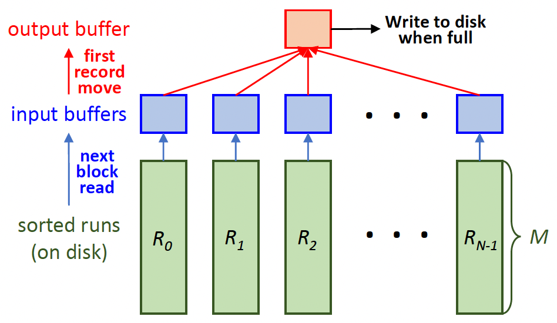
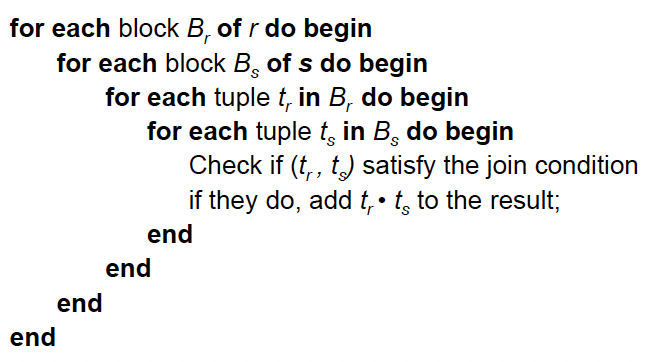

# 15. Query Processing

## Basic Steps in Query Processing
1. Parsing and translation
    - Parser가 query (SQL) 구문 확인, relation 검증
    - Query를 관계 대수(relational algebra) 표현식으로 변환
    - 비절차적 query → 절차적 query
2. Optimization: 최적의 evaluate 계획(evaluation plan) 생성
3. Evaluation
    - Query-execution engine이 query-evaluation plan을 받아 실행하고 query에 대한 답변 반환

## Basic Steps in Query Processing: Optimization
- 하나의 relational algebra 표현식은 여러 동등한 표현식을 가질 수 있음
- 예: $\sigma_{\text{salary} \lt 75000}(\Pi_{\text{salary}}(\text{instructor}))$는 $\Pi_{\text{salary}}(\sigma_{\text{salary} \lt 75000}(\text{instructor}))$와 동일
- 각 relational algebra 연산은 여러 다른 알고리즘 중 하나를 사용해 evaluate 가능
- 따라서 relational algebra 표현식은 여러 방식으로 evaluate될 수 있음
- 예: $\sigma_{\text{salary} > 75000}(\text{instructor})$
    - Table scan 또는
    - Salary에 대한 index scan (만약 salary에 $B^+$-tree 인덱스가 사용 가능하다면)
- 상세한 evaluate 전략을 명시하는 주석이 달린 표현식을 evaluation primitive라 함
- 예: $\sigma_{\text{salary} > 75000}(\text{instructor})$: salary에 인덱스 사용
- Query-execution plan (또는 query-evaluation plan)
    - Query를 evaluate하기 위한 primitive 연산들의 시퀀스
- Query Optimization
    - 모든 동등한 evaluation plan 중에서 **가장 비용이 낮은** 것을 선택
    - 비용은 database catalog의 통계 정보를 사용해 추정
    - 예: 각 relation의 tuple 수, tuple의 크기 등
- 이 장에서 다루는 내용
    - Query 비용 측정 방법
    - Relational algebra 연산 evaluate를 위한 algorithm
    - 완전한 표현식을 evaluate하기 위해 개별 연산 algorithm을 결합하는 방법
- 16장 관련
    - Query 최적화 방법, 즉 가장 낮은 추정 비용을 가진 evaluation plan을 찾는 방법 연구

# Measures of Query Cost
- 시간 비용에 기여하는 많은 요인
    - Disk access, CPU, network communication
- 비용 측정 기준
    - 응답 시간(response time), 즉 query 응답에 걸린 총 경과 시간
    - **총 자원 소비(total resource consumption)**
- 총 자원 소비를 비용 metric으로 사용
- 응답 시간은 추정하기 더 어렵고, 공유 데이터베이스에서는 자원 소비 최소화가 좋음
- 단순화를 위해 CPU 비용은 무시
- 실제 시스템은 CPU 비용을 고려함
- 병렬 시스템에서는 네트워크 비용 고려 필요
- 각 연산의 비용 추정 방법 설명
- 출력을 디스크에 쓰는 비용은 포함하지 않음 (연산의 출력이 디스크에 쓰이지 않고 다음 연산으로 전송될 수 있으므로)
- Disk 비용 추정
    - Number of seeks $\times$ average-seek-cost
    - Number of blocks read $\times$ average-block-read-cost
    - Number of blocks written $\times$ average-block-write-cost
- 단순화를 위해 디스크로부터의 block 전송 횟수와 seek 횟수만 비용 척도로 사용
- $t_T$ – 하나의 block을 전송하는 시간
    - 단순화를 위해 write 비용은 read 비용과 같다고 가정
- $t_S$ – 한 번의 seek에 걸리는 시간
- $b$ block 전송과 $S$ seek에 대한 비용: $b * t_T + S * t_S$
- $t_S$와 $t_T$는 데이터 저장 위치에 따라 다름; 4 KB block 기준,
    - High end magnetic disk: $t_S = 4~ \text{msec}$ 이고 $t_T = 0.1~ \text{msec}$
    - SSD: $t_S = 20 \sim 90~ \text{microsec}$ 이고 $t_T = 2 \sim 10~ \text{microsec}$
- 필요한 데이터가 이미 buffer resident일 수 있어 disk I/O를 피할 수 있음
- 그러나 비용 추정 시 고려하기 어려움
- 여러 알고리즘은 추가 buffer 공간을 사용해 disk IO를 줄일 수 있음
- Buffer에 사용 가능한 실제 메모리 양은 다른 동시 query 및 OS 프로세스에 따라 다르며, 실행 중에만 알 수 있음
- 최악의 경우(Worst case) 추정은 초기에 buffer에 데이터가 없고 연산에 필요한 최소 메모리만 사용 가능하다고 가정
- 그러나 실제로는 더 낙관적인 추정이 사용됨.

# Selection Operation
- File scan (또는 table scan)
    - 선택 조건을 만족하는 레코드를 찾아 검색
    - Full file scan: file (relation)의 모든 레코드 검색
- Algorithm **A1** (linear search)
    - 각 file block을 scan하고 모든 레코드가 선택 조건을 만족하는지 테스트
    - 비용 추정 = $b_r$ block 전송 + 1 seek = $b_r * t_T + t_S$
    - $b_r$은 relation $r$의 레코드를 포함하는 block 수
    - 만약 key 속성에 대한 선택이고 선택 조건이 동등 비교(equality comparison)라면
        - 레코드를 찾는 즉시 중단 가능
        - 비용 = $(b_r / 2)$ block 전송 + 1 seek = $(b_r / 2) * t_T + t_S$
    - Linear search는 다음에 관계없이 적용 가능
        - 선택 조건,
        - File 내 레코드의 순서, 또는
        - 인덱스 가용성
    - 참고: Binary search는?
        - 데이터가 연속적으로 저장되지 않으므로 **일반적으로 의미 없음**
        - 또한, binary search는 index search보다 더 많은 seek를 요구
- Index scan
    - 인덱스를 사용하는 검색 알고리즘
    - 선택 조건은 인덱스의 search-key에 있어야 함
- Algorithm **A2** (clustering $B^+$-tree index, equality on key)
    - 해당 동등 조건을 만족하는 단일 레코드 검색
    - 비용 = $(h_i + 1) * (t_T + t_S)$, 여기서 $h_i$는 인덱스의 높이
- Algorithm **A3** (clustering $B^+$-tree index, equality on non-key)
    - 해당 동등 조건을 만족하는 여러 레코드 검색
    - Record들은 연속적인 block에 있을 것 (참고: clustering index)
    - 비용 = $h_i * (t_T + t_S) + t_S + t_T * b$, ($b$ = 일치하는 레코드를 포함하는 block 수)
- Algorithm **A4** (secondary $B^+$-tree index, equality on key/non-key)
    - Search-key가 candidate key인 경우 단일 레코드 검색
    - 비용 = $(h_i + 1) * (t_T + t_S)$
    - Search-key가 candidate key가 아닌 경우 여러 레코드 검색
    - 일치하는 $n$개의 record 각각이 다른 block에 있을 수 있음 (참고: 2차 인덱스)
    - 비용 = $(h_i + n) * (t_T + t_S)$ : 매우 클 수 있음!

## Selection Involving Comparisons
- $\sigma_{A \le V} (r)$ 또는 $\sigma_{A \ge V} (r)$ 형태의 selection 구현 방법
    - linear file scan 사용,
    - 또는 인덱스를 다음 방식으로 사용
- Algorithm **A5** (clustering $B^+$-tree index, comparison)
    - Relation이 $A$에 대해 정렬됨.
    - $\sigma_{A \ge V} (r)$의 경우, 인덱스를 사용해 $\ge v$인 첫 tuple을 찾고 거기서부터 relation을 순차적 scan
    - 비용 = $h_i * (t_T + t_S) + t_S + t_T * b$ (A3 경우와 동일)
    - $\sigma_{A \le V} (r)$의 경우, 첫 tuple $> v$를 만날 때까지 relation을 순차적 scan; index 미사용
    - 비용 = $t_S + t_T * b$
- Algorithm **A6** (secondary $B^+$-tree index, comparison)
    - $\sigma_{A \ge V} (r)$의 경우, 인덱스를 사용해 $\ge v$인 첫 index entry를 찾고 거기서부터 인덱스를 순차적 scan하여 record pointer 찾기
    - $\sigma_{A \le V} (r)$의 경우, 첫 entry $> v$를 만날 때까지 인덱스의 leaf page를 scan하며 record pointer 찾기
    - 두 경우 모두, 포인터가 가리키는 레코드를 검색
    - Record 당 random I/O 필요
    - 가져올 레코드가 많다면 Linear file scan이 더 저렴할 수 있음!
- Algorithm **A6**에서,
    - 2차 인덱스와 linear file scan 중 어느 것을 선택하든, 일치하는 레코드 수를 미리 알지 못하면 성능이 저하될 수 있음
- `PostgreSQL`의 비트맵 인덱스 scan 알고리즘
    - 일치하는 레코드 수를 실행 전에 알 수 없을 때 2차 인덱스 scan과 linear file scan 간의 격차를 해소
- Relation의 block 당 1비트를 가진 bitmap 생성 (모든 bit는 0으로 초기화)
- 단계
    - 2차 인덱스를 사용해 일치하는 레코드의 포인터 찾기
    - 레코드를 가져오는 대신, bitmap에서 해당 비트를 `1`로 설정
    - 비트가 `1`로 설정되지 않은 block은 건너뛰면서 linear file scan 수행, 가져온 block 내 모든 일치 레코드 검색
- 성능
    - 비트가 몇 개만 설정된 경우 index scan과 유사
    - 대부분의 비트가 설정된 경우 linear file scan과 유사
    - 최상의 plan에 비해 결코 매우 나쁘게 동작하지 않음

## Implementation of Complex Selections
- Conjunction: $\sigma_{\theta_1 \land \theta_2 \land ... \land \theta_n} (r)$
- Algorithm **A7** (conjunctive selection using one index)
    - $\sigma_{\theta_i} (r)$에 대해 최소 비용을 초래하는 '하나의 $\theta_i$ ($1 \le i \le n$)와 알고리즘 (A1 ~ A6)의 조합'을 선택
    - 검색된 각 레코드가 나머지 조건 $\theta_j$ ($j \ne i$)를 만족하는지 메모리 buffer에서 테스트하여 연산 완료
    - 비용은 선택된 알고리즘의 비용
- Algorithm **A8** (conjunctive selection using composite index)
    - 일부 conjunctive selection에 대해 사용 가능한 적절한 composite (multiple-key) 인덱스 사용
- Algorithm **A9** (conjunctive selection by intersection of `id`entifiers)
    - 레코드 포인터가 있는 인덱스 필요
    - 각 조건에 대해 해당하는 인덱스를 사용하고, 얻어진 모든 레코드 포인터 집합의 교집합을 구함
    - 그 다음 파일에서 레코드를 가져옴
    - 일부 조건에 적절한 인덱스가 없다면, 메모리에서 테스트 적용
- Disjunction: $\sigma_{\theta_1 \lor \theta_2 \lor ... \lor \theta_n} (r)$
- Algorithm **A10** (disjunctive selection by union of `id`entifiers)
    - 모든 조건에 사용 가능한 인덱스가 있는 경우 적용 가능
    - 그렇지 않으면 linear scan 사용
    - 각 조건에 해당하는 인덱스를 사용하고, 얻어진 모든 레코드 포인터 집합의 합집합(union)을 구함
    - 그 다음 파일에서 레코드를 가져옴
- Negation: $\sigma_{\neg \theta} (r)$
    - Comparison(비교 연산)에 쓰지 않을 것. equality(동등 연산)에 사용
    - 파일에 linear scan 사용
    - 일반적으로 레코드의 상당 부분이 $\neg \theta$를 만족 (즉, $\theta$를 만족하지 않음)
    - 만약 $\neg \theta$를 만족하는 레코드가 매우 적고, $\theta$에 index 적용 가능하다면
        - 인덱스를 사용해 $\theta$를 만족하는 레코드를 찾고 파일에서 가져옴

# Sorting
- Sorting(정렬)은 데이터베이스 시스템에서 중요한 역할 수행
- SQL query는 출력이 정렬되도록 지정할 수 있음
- Join과 같은 여러 relational 연산은 입력 relation이 먼저 정렬되면 효율적으로 구현 가능
- 단순 인덱스-기반 정렬
    - Relation에 인덱스를 구축하고, 인덱스를 사용해 정렬된 순서로 relation 읽기
    - 각 tuple에 대해 disk block 접근이 발생할 수 있음 (물리적이 아닌 인덱스를 통해 논리적으로만 relation을 정렬하기 때문)
        - 레코드를 물리적으로 정렬하는 효율적인 알고리즘 필요
- 메모리에 맞는 relation의 경우, quick sort 같은 기법 사용 가능
- 메모리에 맞지 않는 relation 정렬을 external sorting이라 함
- External sort-merge: 가장 일반적으로 사용되는 external 정렬 알고리즘

## External Sort-Merge
- $M$을 메모리 크기 (block 단위)라 가정
1. 정렬된 run 생성
    i = 0;
    Repeat
    relation의 $M$ block을 메모리로 읽기;
    in-memory block 정렬;
    정렬된 데이터를 run file $R_i$에 쓰기;
    i = i + 1;
    Until relation의 끝까지 총 run의 수를 $N$이라 하고, (지금은) $N < M$이라 가정
2. Run 병합 (N-way merge)
```
/* N개의 메모리 block을 입력 run buffer로, 1 block을 output buffer로 사용 */
각 run의 첫 block을 해당 buffer block으로 읽기;
repeat
    모든 buffer block 중에서 첫 번째 record (정렬 순서 기준) 선택;
    레코드를 output buffer에 쓰기; /* output buffer가 찼다면, 디스크에 쓰기 */
    해당 input buffer block에서 record 삭제;
    If buffer block이 비게 되면 then
        run의 다음 block (있다면)을 buffer로 읽기;
until 모든 input buffer block이 빌 때까지
```


- 만약 $N \ge M$인 경우
    - $N+1 > M$, 즉 사용 가능한 메모리 크기($M$)가 필요한 buffer 수($N$개의 input buffer + 1개의 output buffer)보다 작음
    - 여러 merge pass가 필요
    - 각 pass에서, $M - 1$개 run의 연속 그룹이 병합됨.
    - 한 pass는 run의 수를 $M-1$ factor로 줄이고, run 길이를 같은 factor만큼 늘림
    - 예: $M = 11$이고 90개의 run이 있다면, 한 pass는 run 수를 9개로 줄임 ($90 / (M-1) = 90/10 = 9$). 각 run의 크기는 초기 run의 10배($= M-1$)가 됨.
    - 모든 run이 하나로 병합될 때까지 pass 반복 수행
- 비용 분석
    - $b_r$을 relation $r$의 레코드를 포함하는 block 수라 함
    - 필요한 총 merge pass 수: $\lceil \log_{M-1} (b_r / M) \rceil$ ($b_r / M$ : 초기 run의 수)
    - 초기 run 생성 또는 각 pass에서의 block 전송 수
        - $2b_r$ ($b_r$ read 및 $b_r$ write)
    - 마지막 pass에서는 write 비용 미포함
    - 따라서 external sorting의 총 block 전송 수
        $2b_r + 2b_r \lceil \log_{M-1} (b_r / M) \rceil - B_r = b_r (2 \lceil \log_{M-1} (b_r / M) \rceil + 1)$
    - Merge pass 동안, 각 run을 한 번에 1 block씩 읽으면 많은 seek 발생
    - 대신, run 당 $b_b$ buffer block 사용 ➔ 한 번에 $b_b$ block read/write
    - 한 pass에서 $\lfloor M / b_b \rfloor - 1$개의 run 병합 가능
    - 필요한 총 merge pass 수: $\lceil \log_{\lfloor M/b_b \rfloor - 1} (b_r / M) \rceil$
    - 따라서 external sorting의 총 block 전송 수
        $b_r (2 \lceil \log_{\lfloor M/b_b \rfloor - 1} (b_r / M) \rceil + 1)$
- Seek 비용
    - Run 생성 동안
        - 전체 relation read에 $\lceil b_r / M \rceil$ seek
        - 각 run에 write하기 위해 $\lceil b_r / M \rceil$ seek
        - 총 seek = $2 \lceil b_r / M \rceil$
    - Merge 단계 동안
        - 각 run 파일에서 $b_b$ block read: read에 대한 총 seek $\approx \lceil b_r / b_b \rceil$
        - Output 파일에 write하는 것은 순차적이지만, write가 read를 방해할 수 있음
        - 모든 read 연산은 head를 움직이므로 write 연산에 대한 seek 발생
        - Output write에 $\lceil b_r / b_b \rceil$ seek 추가 필요
        - 따라서, write 비용을 무시하는 마지막 pass를 제외하고 각 merge pass마다 $2 \lceil b_r / b_b \rceil$ seek 필요
    - 총 seek 수
        $2 \lceil b_r / M \rceil + 2 \lceil b_r / b_b \rceil (\lceil \log_{\lfloor M/b_b \rfloor - 1} (b_r / M) \rceil) - \lceil b_r / b_b \rceil$
        $= 2 \lceil b_r / M \rceil + \lceil b_r / b_b \rceil (2 \lceil \log_{\lfloor M/b_b \rfloor - 1} (b_r / M) \rceil - 1)$

# Join Operation
- Join을 구현하는 여러 다른 알고리즘
    - Nested-loop join
    - Block nested-loop join
    - Indexed nested-loop join
    - Merge-join
    - Hash-join
- 비용 추정에 기반한 선택
- 예제는 다음 정보 사용
    - Studen$t_r$ecord 수: 5,000 / `takes` 레코드 수: 10,000
    - Student block 수: 100 / `takes` block 수: 400

## Nested-Loop Join

- Theta join $r \Join_{\theta} s$ 계산
- $r$을 outer relation, $s$를 inner relation이라 함
- $t_r \cdot t_s$는 두 tuple의 속성 값을 연결(concatenating)하여 구성된 tuple
- 인덱스가 필요 없으며 어떤 종류의 join 조건과도 사용 가능
- 두 relation의 모든 tuple pair를 검사하므로 비쌈
- $n_r$과 $n_s$를 각각 relation $r$과 $s$의 레코드 수라 함
- 비용 추정
    - 최악의 경우(Worst case): 각 relation의 block 하나만 메모리에 유지 가능
        - 추정 비용: $(n_r * b_s + b_r)$ block 전송 및 $(n_r + b_r)$ seek
    - 최상의 경우(Best case): 두 relation이 동시에 메모리에 맞을 만큼 충분한 메모리 공간
        - 추정 비용: $b_r + b_s$ block 전송 및 2 seek
    - 더 작은 relation만 메모리에 맞는다면, 그것을 inner relation으로 사용
        - 추정 비용: $b_r + b_s$ block 전송 및 2 seek (최상의 경우와 동일)
- 최악의 메모리 가용성을 가정할 때, 비용 추정은
    - Student를 outer relation으로
        - `5000 * 400 + 100 = 2,000,100 block` 전송,
        - `5000 + 100 = 5100 seek`
    - `Takes`를 outer relation으로
        - `10000 * 100 + 400 = 1,000,400 block` 전송 및 `10,400 seek`
- 더 작은 relation (`Student`)이 메모리에 완전히 맞는다면, 비용 추정은 `500 block` 전송
- Block nested-loops 알고리즘이 선호됨.

## Block Nested-Loop Join
- Inner relation의 모든 block이 outer relation의 모든 block과 pair를 이루는 nested-loop join의 변형


- 비용 추정
    - 최악의 경우: $b_r * b_s + b_r$ block 전송, $2b_r$ seek
    - Inner relation $s$의 각 block은 outer relation의 각 block에 대해 한 번씩 읽힘
    - Student $\Join$ `takes`의 경우, 40100 block 전송 및 200 seek
    - 최상의 경우: $b_r + b_s$ block 전송 + 2 seek
- Nested loop 및 block nested loop 알고리즘 개선
    - Block nested-loop에서,
    - Outer relation을 위한 blocking unit으로 $M - 2$ ($M$ = 메모리 크기 block 수) 사용
    - 나머지 두 block은 inner relation과 출력을 buffer하는 데 사용
    - 한 번에 outer relation의 $M - 2$ block 읽기
    - 각 inner relation block에 대해, outer relation의 $M - 2$ block 모두와 join
    - 비용 = $(\lceil b_r / (M-2) \rceil * b_s + b_r)$ block 전송 + $2 \lceil b_r / (M-2) \rceil$ seek
    - Equi-join attribute가 inner relation의 key를 형성하면, 첫 번째 일치에서 inner loop 중단
    - Buffer에 남아있는 block을 활용하기 위해 inner loop를 앞뒤로 번갈아 scan (LRU 교체 방식)
    - 사용 가능하다면 inner relation의 인덱스 사용

## Indexed Nested-Loop Join
- Nested-loop join에서, 다음 조건 만족 시 index lookup이 file scan을 대체 가능
    - Join이 equi-join 또는 natural join이고,
    - Inner relation의 join 속성에 인덱스가 사용 가능한 경우
- Join 계산만을 위해 인덱스 구축 가능
- Outer relation $r$의 각 tuple $t_r$에 대해, 인덱스를 사용해 $t_r$ tuple과 join 조건을 만족하는 $s$의 tuple lookup
- 최악의 경우
    - Buffer는 $r$의 block 하나 공간만 있고, $r$의 각 tuple에 대해 $s$에서 index lookup 수행
    - Join 비용: $b_r (t_T + t_S) + n_r * c$
    - $c$는 $r$의 한 tuple에 대해 인덱스를 순회하고 모든 일치하는 $s$ tuple을 가져오는 비용
    - $c$는 join 조건을 사용한 $s$에 대한 단일 selection 비용으로 추정 가능
- $r$과 $s$ 모두의 join 속성에 인덱스가 있다면, tuple이 더 적은 relation을 outer relation으로 사용

## Example of Nested-Loop Join Costs
- `Student` $\Join$ `takes` 계산, `Student`를 outer relation으로
- 공통 attribute: `ID`
- `Takes`가 `ID` 속성에 primary $B^+$-tree 인덱스를 가진다고 가정, 각 인덱스 node는 20개 엔트리 포함
- `Takes`는 10,000개 tuple을 가지므로, tree 높이는 4, 실제 데이터 찾는 데 1번의 access 추가 필요
- Block nested-loop join 비용
    - `400 * 100 + 100 = 40,100 block 전송 + 2 * 100 = 200 seek`
    - 최악의 메모리 가정
    - Memory가 더 많으면 훨씬 적을 수 있음
- Indexed nested loops join 비용
    - `100 + 5000 * 5 = 25,100 block 전송 + 25,100 seek`
    - (일치하는 모든 `takes` tuple이 단일 block에 저장된다고 가정 (takes relation은 `ID`로 정렬되어 있고, 각 student tuple에 대해 평균 2개의 일치하는 `takes` tuple 존재))
- CPU 비용은 block nested loops join보다 적을 가능성 높음

## Merge Join
- Merge-join (sort-merge-join이라고도 함) 알고리즘은 natural join과 equi-join 계산에 사용 가능
1. (이미 정렬되지 않았다면) 두 relation을 join 속성 기준으로 정렬
2. 정렬된 relation을 병합하여 join
    - 2-1. Join 단계는 sort-merge 알고리즘의 merge 단계와 유사
    - 2-2. 주요 차이점은 join attribute의 중복 값 처리: join 속성에서 동일한 값을 가진 모든 pair가 일치해야 함
- Join 단계: 실제 merge-join algorithm
    - Join 속성에서 동일한 값을 가진 한 relation의 tuple 그룹을 메모리로 읽음
    - 그 다음, 다른 relation의 해당 tuple (있다면)을 읽어 들이고, 읽으면서 처리
    - 상세 알고리즘은 책 (Figure 15.7) 참조
- 각 block은 한 번만 읽으면 됨 (특정 join 속성 값에 대한 모든 tuple이 메모리에 맞는다고 가정)
- 각 relation에 $b_b$ buffer block이 할당된다고 가정할 때, merge join 비용
    $(b_r + b_s)$ block 전송 + $(\lceil b_r / b_b \rceil + \lceil b_s / b_b \rceil)$ seek
    + Relation이 정렬되지 않은 경우 정렬 비용
- Hybrid merge-join
    - 한 relation은 정렬되어 있고, 다른 relation은 join 속성에 2차 $B^+$-tree 인덱스가 있을 때 적용 가능
    - 정렬된 relation을 $B^+$-tree의 leaf entry (join attribute, pointer)와 병합
    - 결과 file은 정렬된 relation의 tuple과 정렬되지 않은 relation의 tuple 주소를 포함
    - 정렬되지 않은 relation의 tuple 주소 기준으로 결과 정렬
    - 정렬되지 않은 relation을 물리적 주소 순서로 scan하고 이전 결과와 병합하여 주소를 실제 tuple로 교체
    - 순차 scan이 random lookup보다 효율적

## Hash Join
- Relation $r$과 $s$ 간의 equi-join 및 natural join에 적용 가능
- 해시 함수 $h$가 두 relation의 tuple을 partition하는 데 사용됨.
- $h$는 JoinAttrs ( $r$과 $s$의 공통 attribute) 값을 $\{0, ~ 1, ~ ..., ~ n\}$에 mapping
- $r_0, ~ r_1, ~ ..., ~ r_n$은 $r$ tuple의 partition을 나타냄
    - 각 tuple $t_r \in r$은 $i = h(t_r[\text{JoinAttrs}])$인 partition $r_i$에 배치됨.
- $s_0, ~ s_1, ~ ..., ~ s_n$은 $s$ tuple의 partition을 나타냄
    - 각 tuple $t_s \in s$는 $i = h(t_s[\text{JoinAttrs}])$인 partition $s_i$에 배치됨.
- 책 (Figure 15.10)에서 $r_i$와 $s_i$는 $H_{ri}$와 $H_{si}$로, $n$은 $n_h$로 표기됨.
- 기본 아이디어
    - 각 relation의 tuple을 동일한 hash 값을 갖는 집합으로 partition
    - 그러면 $r_i$의 tuple은 $s_i$의 tuple과만 비교하면 됨.
    - $r_i$의 tuple은 $s_j$ ($i \ne j$)의 tuple과 비교할 필요가 없으며, 그 반대도 마찬가지

## Hash Join Algorithm
- $r$과 $s$의 hash-join은 다음과 같이 계산됨.
1. Hashing function $h$를 사용해 relation $s$를 partition: $s = \{s_0, ~ s_1, ~ \dots, ~ s_n\}$
2. $r$도 유사하게 partition: $r = \{r_0, ~ r_1, ~ \dots, ~ r_n\}$
3. 각 $i$에 대해 $r_i$와 $s_i$에 대해 별도의 indexed nested-loop join 수행, 방식은 다음과 같음
    - (a) $s_i$를 메모리에 load하고 join attribute를 사용해 in-memory hash index 구축. 이 hash index는 이전의 $h$와 다른 해시 함수 사용
    - (b) $r_i$의 tuple을 디스크에서 하나씩 읽음
    - (c) 각 tuple $t_r$에 대해, hash 인덱스를 사용해 $s_i$에서 일치하는 각 tuple $t_s$를 찾음. attribute들의 연결(concatenation)을 output
- Relation $s$는 build input, $r$은 probe 입력이라 불림
- $n$ 값은 각 $s_i$ (와 그 hash index)가 메모리에 맞도록 선택됨.
- $n$은 $\lceil b_s / M \rceil * f$로 선택되며, $f$는 "fudge factor", (일반적으로 약 1.2)

## Handling of Overflows
- Partitioning이 skewed 되었다는 것은 일부 partition이 다른 것보다 훨씬 많은 tuple을 갖는 경우
- Hash-table overflow는 $s_i$의 hash 인덱스가 메모리에 맞지 않을 때 $s_i$ partition에서 발생
- 원인
    - Join 속성에 동일한 값을 가진 $s$ tuple이 많음
    - 나쁜 해시 함수 (무작위성, 균일성 속성 부족)
- Overflow resolution은 build 단계에서 수행 가능
    - Partition $s_i$를 다른 해시 함수를 사용해 추가 partition
    - Partition $r_i$도 유사하게 partition되어야 함
- Overflow avoidance는 build 단계 중 overflow를 피하기 위해 partitioning을 신중하게 수행
    - 예: build relation을 많은 작은 partition으로 나눈 다음, 일부 partition을 결합하여 각 결합된 partition이 메모리에 맞도록 함
- 두 접근 방식 모두 join 속성에 중복이 많으면 실패
- Fallback option: overflow가 발생한 partition에 (indexed nested-loop join 대신) block nested-loop join 사용

## Complex Joins
- Conjunctive condition을 사용한 Join: $r \Join_{\theta_1 \land \theta_2 \land ... \land \theta_n} s$
    - Nested-loop / block nested-loop join 사용, 또는
    - 더 효율적인 algorithm을 사용해 더 간단한 join ($r \Join_{\theta_i} s$ 등) 중 하나의 결과 계산
    - 최종 결과는 남은 조건 $\theta_1 \land ... \land \theta_{i-1} \land \theta_{i+1} \land ... \land \theta_n$을 만족하는 중간 결과의 tuple로 구성
    - 위 조건들은 $r \Join_{\theta_i} s$의 tuple이 생성될 때 테스트 가능
- Disjunctive condition을 사용한 Join: $r \Join_{\theta_1 \lor \theta_2 \lor ... \lor \theta_n} s$
    - Nested-loop / block nested-loop join 사용, 또는
    - 개별 join $r \Join_{\theta_i} s$의 record들의 합집합(union)으로 계산
    $(r \Join_{\theta_1} s) \cup (r \Join_{\theta_2} s) \cup ... \cup (r \Join_{\theta_n} s)$

# Evaluation of Expressions
- 지금까지 개별 연산을 위한 알고리즘 학습
- 전체 expression tree evaluate를 위한 대안
    - Materialization(실체화): 입력이 relation이거나 이미 계산된 표현식의 결과를 생성하고, 디스크에 materialize (저장). 반복
    - Pipelining: 연산이 실행되는 중에도 tuple을 상위(parent) 연산으로 전달

## Materialization
- Materialized evaluation
    - 가장 낮은 수준(lowest-level)에서 시작하여 한 번에 하나의 연산 evaluate
    - 중간 결과를 임시 relation에 실체화하여 다음 수준(next-level) 연산 evaluate에 사용
- 예: 아래 그림에서, $\sigma_{\text{building} = \text{"Watson"}} (\text{department})$를 계산 및 저장
    - 그 다음 `instructor`와의 join을 계산 및 저장, 마지막으로 `name`에 대한 projection 계산
- Materialized evaluation은 항상 적용 가능
- 결과를 디스크에 쓰고 다시 읽는 비용은 상당히 높을 수 있음
- 연산에 대한 비용 공식은 결과를 디스크에 쓰는 비용을 무시하므로,
    - 전체 비용 = 개별 연산 비용의 합 + 중간 결과를 디스크에 쓰는 비용
- **Double buffering**: 각 연산에 두 개의 output buffer 사용, 하나가 차면 디스크에 쓰는 동안 다른 하나 채우기
    - Disk write와 계산의 overlap 허용, 실행 시간 단축

## Pipelining
- Pipelined evaluation
    - 여러 연산을 동시에 evaluate,
    - 한 연산의 결과를 다음 연산으로 전달
- 예: 이전 expression tree에서, $\sigma_{\text{building} = \text{"Watson"}} (\text{department})$의 결과를 저장하지 않음
    - 대신, tuple을 join으로 직접 전달
    - 유사하게, join의 결과를 저장하지 않고, tuple을 projection으로 직접 전달
- Materialization보다 훨씬 저렴
    - 임시 relation을 디스크에 저장할 필요 없음
- Pipelining이 효과적이려면, tuple이 상위(upper) 연산에 삽입될 때 output tuple을 생성하는 하위(lower) 연산 evaluation 알고리즘 사용
- Pipeline은 두 가지 방식으로 실행 가능
    - Demand-driven pipeline
    - Producer-driven pipeline
- Demand-driven pipeline (또는 lazy evaluation)
    - 시스템이 최상위 연산에 다음 tuple을 반복적으로 요청
    - 각 연산은 다음 output tuple을 출력하기 위해 필요에 따라 하위(children) 연산에 다음 tuple 요청
    - 호출 사이에, 연산은 다음에 반환할 것을 알 수 있도록 state 유지 필요
- Producer-driven pipeline (또는 eager pipelining)
    - 연산자가 tuple을 적극적으로(eagerly) 생성하고 상위(parent)로 전달
    - 연산자 사이에 buffer 유지: 하위 연산자는 buffer에 tuple을 넣고, 상위 연산자는 buffer에서 tuple 제거
    - Buffer가 가득 차면, 하위 연산자는 buffer 공간이 생길 때까지 기다렸다가 더 많은 tuple 생성
    - 시스템은 output buffer에 공간이 있어 더 많은 input tuple을 처리할 수 있는 연산들을 schedule (실행)
- 대안적 명칭: pull 및 push model의 pipelining
- Demand-driven pipelining 구현
    - 각 연산은 다음 연산을 구현하는 iterator로 구현됨.
    - `open()`
        - 예: file scan의 경우: file scan 초기화
        - State: file 시작 포인터
        - 예: merge join의 경우: relation 정렬;
        - State: 정렬된 relation 시작 포인터
    - `next()`
        - 예: file scan의 경우: 다음 tuple output, 파일 포인터 이동 및 저장
        - 예: merge join의 경우: 다음 output tuple이 발견될 때까지 이전 state에서 merge 계속. 포인터를 iterator state로 저장
    - `close()`

## Pipelining: Blocking Operations
- Blocking 연산: 모든 입력이 소비될 때까지 출력을 생성할 수 없는 연산
- 예: sorting(정렬), aggregation(집계), ...
- 그러나 종종 tuple이 생성될 때 소비할 수 있으며, tuple이 생성될 때 consumer에게 출력할 수 있음
- 핵심 아이디어
    - Blocking operation은 종종 두 개의 하위 연산 (단계)을 가짐, 예
    - Sort-merge: run generation과 merge
    - Hash join: partitioning과 build-probe
    - Blocking은 실제로 두 단계 사이에서 발생 ➔ 이들을 별도 연산으로 취급
- 한 stage의 모든 연산은 동시에 실행
- 한 단계는 이전 stage가 실행을 완료한 후에만 시작 가능