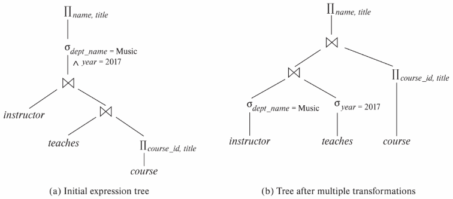
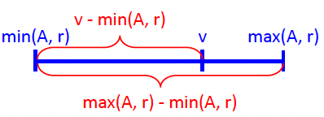

# 16. Query Optimization

## Introduction
- 주어진 query 평가를 위한 대안적 방법들
- 동등한(Equivalent) 표현식
- 각 연산을 위한 다른 알고리즘
- Query 예시: Music 학부 강사의 이름과 그들이 가르치는 과목의 제목 검색
- $\Pi_{\text{name,~title}}(\sigma_{\text{dept\_name= 'Music'}}(\text{instructor} \bowtie (\text{teaches} \bowtie \Pi_{\text{course\_id,~title}} (\text{course}))))$
- Evaluation plan: 각 연산에 사용되는 알고리즘 및 연산 실행 방식 (materialized/pipelined) 정의
- Query에 대한 evaluation plan 간의 비용 차이는 막대할 수 있음 (예: 초 vs. 일)
- 비용 기반 query 최적화 단계
  1. 논리적으로 동등한(equivalent) 표현식 생성 (동등성 규칙(equivalence rules) 사용)
  2. 대안적 query plan을 얻기 위해 결과 표현식에 주석(annotate) 추가
  3. 추정된 비용에 기반하여 가장 저렴한 plan 선택
- Plan 비용 추정 기반
  - Relation에 대한 통계 정보 (예: tuple 수, 속성의 distinct 값 수)
  - 중간 결과에 대한 통계 추정 (복잡한 표현식 비용 계산용)
  - 알고리즘에 대한 비용 공식 (통계 사용)

# Transformation of Relational Expressions
- 두 관계 대수(relational algebra) 표현식이 모든 legal한 데이터베이스 instance에서 동일한 tuple 집합을 생성하면 동등(equivalent)하다고 함 (Tuple 순서 무관)
- SQL에서 입출력은 tuple의 multiset (중복 허용 집합)
- Multiset 버전의 관계 대수에서 두 표현식이 모든 legal한 데이터베이스 instance에서 동일한 multiset을 생성하면 동등하다고 함
- Equivalence rule: 두 형태의 표현식이 동등함을 의미 (상호 교체 가능)

## Equivalence Rules
1. Conjunctive selection 연산은 개별 selection의 sequence로 분해 가능 (cascade of $\sigma$)
  - $\sigma_{\theta_1 \land \theta_2}(E) \equiv \sigma_{\theta_1}(\sigma_{\theta_2}(E))$
2. Selection 연산은 교환 가능(commutative, 교환법칙)
  - $\sigma_{\theta_1}(\sigma_{\theta_2}(E)) \equiv \sigma_{\theta_2}(\sigma_{\theta_1}(E))$
3. Projection 연산 sequence에서는 마지막 하나만 필요
  - $\Pi_{L1}(\Pi_{L2}(\dots(\Pi_{Ln}(E))\dots)) \equiv \Pi_{L1}(E)$, (단, $L_1 \subseteq L_2 \dots \subseteq L_n$)
4. Selection은 Cartesian product 및 theta join과 결합 가능
  - a. $\sigma_{\theta}(E_1 \times E_2) \equiv E_1 \bowtie_{\theta} E_2$
  - b. $\sigma_{\theta_1}(E_1 \bowtie_{\theta_2} E_2) \equiv E_1 \bowtie_{\theta_1 \land \theta_2} E_2$
5. Theta join (및 natural join)은 교환 가능
  - $E_1 \bowtie_{\theta} E_2 \equiv E_2 \bowtie_{\theta} E_1$
6. (a) Natural join은 결합 가능(associative, 결합법칙)
  - $(E_1 \bowtie E_2) \bowtie E_3 \equiv E_1 \bowtie (E_2 \bowtie E_3)$
  - (b) Theta join의 결합 법칙
    - $(E_1 \bowtie_{\theta_1} E_2) \bowtie_{\theta_2 \land \theta_3} E_3 \equiv E_1 \bowtie_{\theta_1 \land \theta_3} (E_2 \bowtie_{\theta_2} E_3)$ (단, $\theta_2$는 $E_2, E_3$의 속성만 포함)
7. Selection 연산은 다음 두 조건 하에 theta join에 분배 가능
  - (a) $\theta_0$의 모든 attribute가 join 되는 표현식 중 하나($E_1$)의 속성만 포함
    - $\sigma_{\theta_0}(E_1 \bowtie_{\theta} E_2) \equiv (\sigma_{\theta_0}(E_1)) \bowtie_{\theta} E_2$
  - (b) $\theta_1$이 $E_1$의 속성만, $\theta_2$가 $E_2$의 속성만 포함
    - $\sigma_{\theta_1 \land \theta_2}(E_1 \bowtie_{\theta} E_2) \equiv (\sigma_{\theta_1}(E_1)) \bowtie_{\theta} (\sigma_{\theta_2}(E_2))$
8. Projection 연산은 theta join에 다음과 같이 분배 가능
  - (a) $L_1, L_2$가 각각 $E_1, E_2$의 attribute이고 $\theta$가 $L_1 \cup L_2$의 속성만 포함
    - $\Pi_{L_1 \cup L_2}(E_1 \bowtie_{\theta} E_2) \equiv \Pi_{L_1}(E_1) \bowtie_{\theta} \Pi_{L_2}(E_2)$
  - (b) 일반적인 경우 ($E_1 \bowtie_{\theta} E_2$), $L_1 \subseteq E_1, L_2 \subseteq E_2$. $L_3$는 $E_1$의 attribute (join 조건 $\theta$에 포함되지만 $L_1 \cup L_2$에는 미포함), $L_4$는 $E_2$의 attribute (join 조건 $\theta$에 포함되지만 $L_1 \cup L_2$에는 미포함)
    - $\Pi_{L_1 \cup L_2}(E_1 \bowtie_{\theta} E_2) \equiv \Pi_{L_1 \cup L_2}(\Pi_{L_1 \cup L_3}(E_1) \bowtie_{\theta} \Pi_{L_2 \cup L_4}(E_2))$
9. 집합 연산 union($\cup$)과 intersection($\cap$)은 교환 가능 (Set difference($-$)는 아님)
10. Set union과 intersection은 결합 가능
11. Selection 연산은 $\cup$, $\cap$, $-$ 에 분배 가능
  - a. $\sigma_{\theta}(E_1 \cup E_2) \equiv \sigma_{\theta}(E_1) \cup \sigma_{\theta}(E_2)$
  - b. $\sigma_{\theta}(E_1 \cap E_2) \equiv \sigma_{\theta}(E_1) \cap \sigma_{\theta}(E_2)$
  - c. $\sigma_{\theta}(E_1 - E_2) \equiv \sigma_{\theta}(E_1) - \sigma_{\theta}(E_2)$
  - d. $\sigma_{\theta}(E_1 \cap E_2) \equiv \sigma_{\theta}(E_1) \cap E_2$ ($\cup$ 에는 성립 안 함)
  - e. $\sigma_{\theta}(E_1 - E_2) \equiv \sigma_{\theta}(E_1) - E_2$
12. Projection 연산은 union에 분배 가능 (단, $E_1, E_2$ schema 동일)
  - $\Pi_L(E_1 \cup E_2) \equiv (\Pi_L(E_1)) \cup (\Pi_L(E_2))$

# Pictorial Depiction of Equivalence Rules

## Transformation Example: Pushing Selections
- Selection을 가능한 한 빨리 수행하면 join할 relation의 크기 감소
- Query 예
  - $\Pi_{\text{name,~title}}(\sigma_{\text{dept\_name= 'Music'}}(\text{instructor} \bowtie (\text{teaches} \bowtie \Pi_{\text{course\_id,~title}} (\text{course}))))$
- 규칙 7a를 이용한 변환
  - $\Pi_{\text{name,~title}}(\sigma_{\text{dept\_name= 'Music'}} (\text{instructor}) \bowtie (\text{teaches} \bowtie \Pi_{\text{course\_id,~title}} (\text{course})))$

## Example with Multiple Transformations
- Query: *"2017년에 강의를 담당한 음악학과 소속 모든 교수진의 성명을 해당 교수진이 담당한 강의 제목과 함께 찾아주세요."*
  - $\Pi_{\text{name,~title}}(\sigma_{\text{dept\_name= 'Music'} \land {year = 2017}} (\text{instructor} \bowtie (\text{teaches} \bowtie \Pi_{\text{course\_id,~title}} (\text{course}))))$
- Join associatively (규칙 6a) 변환
  - $\Pi_{\text{name,~title}}(\sigma_{\text{dept\_name= “Music”} \land {year = 2017}} ((\text{instructor} \bowtie \text{teaches}) \bowtie \Pi_{\text{course\_id,~title}} (\text{course})))$
- 두 번째 형태는 'selection 조기 수행' 규칙 적용 기회 제공 (규칙 7a, 7b)
- $\sigma_{\text{dept\_name = “Music”}}(\text{instructor}) \bowtie \sigma_{\text{year = 2017}}(\text{teaches})$

## Transformation Example: Pushing Projections
- Projection을 가능한 한 빨리 수행하면 join할 relation의 크기 감소
- $\Pi_{\text{name,~title}}((\sigma_{\text{dept\_name= “Music”}}(\text{instructor}) \bowtie \text{teaches}) \bowtie \Pi_{\text{course\_id,~title}} (\text{course}))$
- $(\sigma_{\text{dept\_name = “Music”}}(\text{instructor}) \bowtie \text{teaches})$ 계산 시,
  - schema는 `(ID, name, dept_name, salary, course_id, sec_id, semester, year)`
- 이 중 `course_id` (join용)와 `name` (output용)만 필요
- 동등성 규칙 8a, 8b를 사용한 projection push
  - $\Pi_{\text{name,~title}}(\Pi_{\text{name,~course\_id}} (\sigma_{\text{dept\_name= “Music”}}(\text{instructor}) \bowtie \text{teaches})) \bowtie \Pi_{\text{course\_id,~title}} (\text{course}))$

## Join Ordering
- 모든 relation $r_1, r_2, r_3$에 대해 $(r_1 \bowtie r_2) \bowtie r_3 = r_1 \bowtie (r_2 \bowtie r_3)$ (Join Associativity)
- 만약 $r_2 \bowtie r_3$이 매우 크고 $r_1 \bowtie r_2$가 작다면, $(r_1 \bowtie r_2) \bowtie r_3$를 선택하여 더 작은 임시 relation 계산 및 저장
- 예: $\Pi_{\text{name,~title}}((\sigma_{\text{dept\_name= “Music”}}(\text{instructor}) \bowtie \text{teaches}) \bowtie \Pi_{\text{course\_id,~title}} (\text{course}))$
- $\text{teaches} \bowtie \Pi_{\text{course\_id,~title}}(\text{course})$를 먼저 계산할 수 있으나, 첫 join 결과가 큰 relation일 가능성 높음
- Music 학부 강사 비율은 낮을 것이므로, $\sigma_{\text{dept\_name= “Music”}}(\text{instructor}) \bowtie \text{teaches}$를 먼저 계산하는 것이 더 좋음

# Estimating Statistics of (Sub)Expression Results

## Statistical Information for Cost Estimation
- Database system catalog는 다음 통계 정보 저장
  - $n_r$: relation $r$의 tuple 수
  - $b_r$: $r$의 tuple을 포함하는 block 수
  - $l_r$: $r$의 tuple 크기
  - $f_r$: $r$의 blocking factor (한 block에 맞는 $r$의 tuple 수)
    - 물리적으로 $r$의 tuple이 파일에 함께 저장되면
      - $b_r = \lceil n_r / f_r \rceil$
  - $V(A,~r)$: 속성 $A$에 대해 $r$에 나타나는 distinct 값의 수 ($\Pi_A(r)$의 크기와 동일)
- 인덱스에 대한 통계도 catalog에 유지
  - $f_i$: B+-tree 같은 tree 구조 인덱스 $i$의 internal node의 평균 fan-out
  - $HT_i$: 인덱스 $i$의 level 수 (높이). B+-tree의 경우 $HT_i = \lceil \log_{f_i} (V(A,r)) \rceil$. Hash 인덱스는 $HT_i = 1$
  - $LB_i$: $i$의 가장 낮은 level의 인덱스 block 수 (leaf level block 수)

## Histograms
- 실제 optimizer는 종종 추가적인 통계 정보를 유지
- 대부분의 데이터베이스는 각 속성의 값 분포를 히스토그램으로 저장
  - Equi-width histograms: 값의 범위를 동일한 크기의 범위로 분할
  - Equi-depth histograms: 각 범위가 (거의) 동일한 수의 tuple을 갖도록 범위 분할 (더 선호됨)
- 많은 데이터베이스는 $n$개의 가장 빈번한 값(most-frequent values)과 그 개수를 저장
- Histogram 및 기타 통계는 보통 random sample 기반으로 계산
- 통계가 최신이 아닐 수 있음 (`analyze` 명령 필요 또는 자동 재계산)
  - 예: relation 안의 tuple의 개수가 몇 % 변화하는 경우

## Problem
- 이전 연산의 출력을 입력으로 받는 중간 연산의 비용 추정 방법?
- $E_1, E_2, E_3$ 통계는 있지만 $E_1 \bowtie E_2$ 통계는 없음
- 각 연산 출력에 대한 통계 값 '추정' 필요

## Selection Size Estimation
- $\sigma_{A=v} (r)$
  - $n_r / V(A,r)$: selection을 만족할 것으로 추정되는 레코드 수 ($A$ 값이 동일한 tuple의 평균 수)
  - Key 속성에 대한 동등 조건: 크기 추정 = 1
- $\sigma_{A \le v} (r)$ ( $\sigma_{A \ge v} (r)$도 대칭)
  - 속성 값의 '균일한' 분포 가정
  - $c$ = 조건을 만족하는 추정 tuple 수
  - $\text{min}(A,~r)$과 $\text{max}(A,~r)$을 catalog에서 사용 가능하면
    - $c = 0$, (if $v < \text{min}(A,~r)$)
    - $c = n_r$, (if $v \ge \text{max}(A,~r)$)
    - $c = n_r \cdot \frac{v - \text{min}(A,~r)}{\text{max}(A,~r) - \text{min}(A,~r)}$, (otherwise)
  - 히스토그램 사용 가능하면 위 추정치 개선 가능
  - 통계 정보 부재 시, $c = \frac{n_r} {2}$로 가정

## Size Estimation of Complex Selections
- 조건 $\theta_i$의 **Selectivity**: relation $r$의 tuple이 $\theta_i$를 만족할 확률
  - $s_i$가 $r$에서 만족하는 tuple 수 (이전 슬라이드에서 추정)이면, $\theta_i$의 selectivity는 $s_i / n_r$
- Conjunction
  - $\sigma_{\theta_1 \land \theta_2 \land \dots \land \theta_n} (r)$
  - 결과 tuple 추정치 (독립성 가정)
    - $n_r \cdot (\frac{s_1}{n_r}) \cdot (\frac{s_2}{n_r}) \cdots (\frac{s_n}{n_r})$
- Disjunction
  - $\sigma_{\theta_1 \lor \theta_2 \lor \dots \lor \theta_n} (r)$
  - 추정 tuple 수
    - $n_r \left( 1 - (1 - \frac{s_1}{n_r})(1 - \frac{s_2}{n_r}) \dots (1 - \frac{s_n}{n_r}) \right)$
- Negation
  - $\sigma_{\neg \theta} (r)$
  - 추정 tuple 수
    - $n_r$ – ($\sigma_{\theta} (r)$의 추정 tuple 수)

## Join Size Estimation: A Running Example
- 예제 Query: `student` $\bowtie$ `takes`
- Catalog 정보
  - $n_{\text{student}} = 5000$
  - $f_{\text{student}} = 50$, $b_{\text{student}} = 100$
  - $n_{\text{takes}} = 10000$
  - $f_{\text{takes}} = 25$, $b_{\text{takes}} = 400$
  - $V(\text{ID,~takes}) = 2500$ (과목을 수강한 학생은 평균 4과목 수강)
  - `takes`의 `ID`는 `student`를 참조하는 foreign key
  - $V(\text{ID,~student}) = 5000$ (primary key)

## Join Size Estimation
- Cartesian 곱 $r \times s$는 $n_r \cdot n_s$ 개의 tuple 포함. 각 tuple은 $l_r + l_s$바이트
- $r \bowtie s = r \times s$, (if $R \cap S = \emptyset$)
- $R \cap S$가 $R$의 key인 경우
  - $s$의 tuple은 $r$의 최대 1개 tuple과 join. ( $r \bowtie s$의 tuple 수) $\le n_s$
- $R \cap S$가 $S$에서 $R$을 참조하는 foreign key인 경우: ($r \bowtie s$의 tuple 수) $= n_s$ (foreign key 제약조건 때문)
- `student` $\bowtie$ `takes` 예제: `takes`의 `ID`는 `student`를 참조하는 foreign key, 따라서 결과는 $n_{\text{takes}}$ (10000)개의 tuple 가짐
- $R \cap S = \{A\}$가 $R$ 또는 $S$의 key가 아닌 경우
  - $R$의 모든 tuple $t$가 $R \bowtie S$에서 tuple을 생성한다고 가정하면, $R \bowtie S$의 tuple 수 추정
    - $\frac{n_r \cdot n_s}{V(A,~s)}$
  - 반대의 경우 (S 기준) 추정
    - $\frac{n_r \cdot n_s}{V(A,~r)}$
  - 이 두 추정치 중 낮은 값이 아마도 더 정확 (join에 참여하지 않는 dangling tuple이 존재 가능하므로)
- Foreign key 정보 없이 `student` $\bowtie$ `takes` 크기 추정
  - $V(\text{ID,~takes}) = 2500$, $V(\text{ID,~student}) = 5000$
  - 두 추정치
    - $(5000 \cdot 10000) / 2500 = 20000$ 및 $(5000 \cdot 10000) / 5000 = 10000$
  - 더 낮은 추정치인 $10000$을 선택 (foreign key 사용한 이전 계산과 동일)

## Size Estimation for Other Operations
- Projection
  - $\Pi_A (r)$의 추정 크기 = $V(A,~r)$
- Set operations
  - 동일 relation에 대한 selection의 union/intersection: 재작성 후 selection 크기 추정 사용 (예: $\sigma_{\theta_1} (r) \cup \sigma_{\theta_2} (r) \rightarrow \sigma_{\theta_1 \lor \theta_2} (r)$)
  - 다른 relation에 대한 연산
    - $r \cup s$ 추정 크기 = $n_r + n_s$
    - $r \cap s$ 추정 크기 = $\min(n_r,~n_s)$
    - $r - s$ 추정 크기 = $n_r$
  - (세 추정치 모두 부정확할 수 있으나 upper bound를 제공)

## Estimation of Number of Distinct Values
- 각 연산 결과의 attribute $A$에 대한 distinct 값의 수 $V(A, \dots)$ 추정 필요
- Selections: $\sigma_{\theta} (r)$
  - $\theta$가 $A$를 특정 값(예: $A=3$)으로 강제
    - $V(A,~\sigma_{\theta} (r)) = 1$
  - $\theta$가 $A$를 특정 값 집합 중 하나(예: $A=1 \lor A=3 \lor A=4$)로 강제
    - $V(A,~\sigma_{\theta} (r)) =$ (명시된 값의 수)
  - $\theta$가 $A \text{ (op) } v$ 형태
    - $V(A,~\sigma_{\theta} (r)) \approx V(A,~r) \cdot s$ ($s$는 selection의 selectivity)
  - 그 외
    - $\min(V(A,~r),~n_{\sigma_{\theta}(r)})$ (upper bound)
- Joins: $r \bowtie s$
  - $A$가 $r$의 attribute인 경우
    - $V(A,~r \bowtie s) \approx \min(V(A,~r),~n_{r \bowtie s})$
- Projections: $\Pi_A (r)$
  - $V(A,~\Pi_A (r)) = V(A,~r)$

# Choice of Evaluation Plans
- 비용 기반 optimizer: 주어진 query와 동등한 모든 query-evaluation plan 탐색, 최소 추정 비용 plan 선택
- Plan 선택 시 evaluation 기법 간 상호작용 고려 필요
- 각 연산에 대해 독립적으로 가장 저렴한 알고리즘 선택이 최적의 전체 알고리즘을 보장하지 않음
  - 예: Merge-join이 hash-join보다 비싸지만, 정렬된 output 제공하여 외부 집계 비용 줄일 수 있음
  - (Block) nested-loop join은 pipelining 기회 제공 가능
- 실제 query optimizer는 다음 두 접근 방식 요소 통합
  1. 모든 plan 탐색 후 비용 기반 방식으로 최선의 plan을 선택
  2. Heuristics를 사용하여 plan을 선택

## Cost-based Join Order Selection
- $r_1 \bowtie r_2 \bowtie \dots \bowtie r_n$에 대한 최적 join-order 찾기
- $(2(n-1))! / (n-1)!$ 개의 다른 join order 존재
- $n=3$일 때 12개
$$
\begin{array}{cccc}
r_1 \bowtie (r_2 \bowtie r_3) & r_1 \bowtie (r_3 \bowtie r_2) & (r_2 \bowtie r_3) \bowtie r_1 & (r_3 \bowtie r_2) \bowtie r_1 \\
r_2 \bowtie (r_1 \bowtie r_3) & r_2 \bowtie (r_3 \bowtie r_1) & (r_1 \bowtie r_3) \bowtie r_2 & (r_3 \bowtie r_1) \bowtie r_2 \\
r_3 \bowtie (r_1 \bowtie r_2) & r_3 \bowtie (r_2 \bowtie r_1) & (r_1 \bowtie r_2) \bowtie r_3 & (r_2 \bowtie r_1) \bowtie r_3
\end{array}
$$
- $n=7$일 때 665,280개, $n=10$일 때 1760억 개 이상
- 모든 join order 생성 불필요
- Dynamic programming 사용
  - $\{r_1,~r_2,~\dots,~r_n\}$의 모든 부분집합(subset)에 대한 최소 비용 join order를 한 번만 계산하고 향후 사용 위해 저장
- 예: $(r_1 \bowtie r_2 \bowtie r_3) \bowtie r_4 \bowtie r_5$
- $\{r_1,~r_2,~r_3\}$에 대한 최적 join order 찾으면, $r_4, r_5$와의 추가 join에 해당 order 사용

## Left-Deep Join Trees
- Left-deep join tree에서 각 join의 오른쪽 입력(right-hand-side input)은 (중간 join 결과가 아닌) relation
- Pipelined evaluation에 특히 편리 (오른쪽 피연산자가 저장된 relation이므로 각 join의 입력 중 하나만 pipelined)
- System R optimizer는 left-deep join order만 고려
- 총 $n!$ 개의 join order ( $(2(n-1))! / (n-1)!$ 보다 훨씬 적음)

## Heuristic Optimization
- 비용 기반 최적화는 dynamic programming 사용하더라도 비용 높음
- 시스템은 비용 기반 방식으로 선택해야 하는 대안 수를 줄이기 위해 heuristics 사용 가능
- Heuristic 최적화: 실행 성능을 (항상은 아니지만) 일반적으로 향상시키는 규칙 집합을 사용하여 query-tree 변환
  - Selection 조기 수행 (tuple 수 감소)
  - Projection 조기 수행 (속성 수 감소)
  - 다른 유사 연산보다 가장 제한적인(가장 작은 결과 크기) selection 및 join 연산 먼저 수행
- 일부 시스템은 휴리스틱만 사용, 다른 시스템은 휴리스틱과 부분적 cost-based optimization 결합