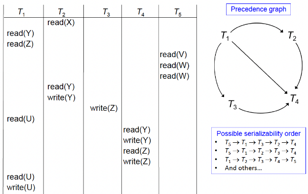

# 17. Transactions
- Transaction
  - System's view: 다양한 데이터 항목(Data items)에 접근하고 갱신할 수 있는 프로그램 실행 단위
  - User's view: 논리적인 작업 단위(Logical unit of work)
  - 예시
    - 은행: 계좌 `A`에서 `B`로 $50 이체
    - 학교: 학생 `#4321`에 대해 강좌 `#409.433` 등록
    - 회사: 모든 직원의 급여를 5% 인상
- Transaction 예시: "계좌 `A`에서 계좌 `B`로 $50 이체"
  1. `read(A)`
  2. `A := A – 50`
  3. `write(A)`
  4. `read(B)`
  5. `B := B + 50`
  6. `write(B)`
- 다루어야 할 두 가지 주요 이슈
  - Hardware failure 및 system crash와 같은 다양한 종류의 Failures
  - 다수 transaction의 concurrent execution(동시 실행)

## Transaction concept
- 계좌 `A`에서 계좌 `B`로 $50를 이체하는 transaction
  1. `read(A)`
  2. `A := A – 50`
  3. `write(A)`
  4. `read(B)`
  5. `B := B + 50`
  6. `write(B)`
- Atomicity requirement (원자성 요구사항)
  - 만약 transaction이 3단계 이후, 6단계 이전에 실패할 경우, 돈이 "소실"되어 Inconsistent 한 database 상태가 됨
  - Failure는 software 또는 Hardware로 인해 발생 가능
  - System은 부분적으로 실행된 transaction의 업데이트가 database에 반영되지 않도록 보장해야 함 (Transaction roll back)
- Durability requirement (지속성 요구사항)
  - 사용자가 transaction이 완료되었다는 통지(즉, $50 이체 발생)를 받은 후에는, software 또는 Hardware failure가 발생하더라도 transaction에 의한 database 업데이트가 지속(Persist)되어야 함.

## Example of Fund transfer
- Consistency requirement (일관성 요구사항)
  - Transaction 실행에 의해 `A`와 `B`의 합계가 변하지 않아야 함.
  - 일반적인 consistency requirement 포함 사항
    - Primary keys 및 Foreign keys와 같이 명시적으로 지정된 Integrity constraints
    - 암묵적인 Integrity constraints
    - 예: 모든 계좌 잔액의 합에서 대출 금액의 합을 뺀 값은 보유 현금 가치와 같아야 함.
  - Transaction은 consistent 한 database를 확인해야 함 (Transaction 실행 중에는 database가 일시적으로 Inconsistent 할 수 있음)
  - Transaction이 성공적으로 완료되면 database는 consistent 해야 함.
  - 잘못된 transaction 로직은 Inconsistency를 초래할 수 있음.
  - 개별 transaction에 대한 consistency 보장은 transaction을 작성하는 어플리케이션 프로그래머의 책임
  - Integrity constraints에 대한 자동 테스트(4.4절)가 이 작업을 용이하게 함.
- Isolation requirement (고립성 요구사항)
  - 만약 3단계와 6단계 사이에, 다른 transaction $T_2$가 부분적으로 업데이트된 database에 접근하도록 허용된다면, $T_2$는 Inconsistent 한 database를 보게 됨 (`A + B`의 합이 원래보다 적게 됨)
  - 예시 흐름
    - $T_1$: `read(A)` → `A := a – 50` → `write(A)`
    - $T_2$: `read(A)` → `read(B)` → `print(A + B)` (이 시점의 문제)
    - $T_1$: `read(B)` → `B := B + 50` → `write(B)`
  - Isolation은 transaction을 순차적으로(Serially, 하나씩 차례로) 실행함으로써 간단히 보장 가능
  - 그러나 다수의 transaction을 concurrent 하게(동시에) 실행하는 것은 상당한 이점이 있음(나중에 확인)

## ACID properties
- 데이터의 무결성(Integrity)을 보존하기 위해, database system은 transaction의 다음 속성들을 보장해야 함.
  - Atomicity: transaction의 모든 연산이 database에 올바르게 반영되거나, 전혀 반영되지 않음 (All-or-nothing)
  - Consistency: 고립된 상태(즉, 동시에 실행되는 다른 transaction 없이)에서의 transaction 실행은 database의 consistency를 보존함 (Correctness)
  - Isolation: 다수의 transaction이 concurrent 하게 실행될 수 있지만, 각 transaction은 동시에 실행되는 다른 transaction을 인지하지 못해야 함.
    - 중간 단계의 transaction 결과는 동시에 실행되는 다른 transaction에게 숨겨져야 함.
    - 즉, 모든 transaction 쌍 $T_i$와 $T_j$에 대해, $T_i$에게는 $T_j$가 $T_i$ 시작 전에 실행을 마쳤거나, $T_i$가 끝난 후에 실행을 시작한 것처럼 보여야 함.
  - Durability: transaction이 성공적으로 완료된 후에는, system failure가 있더라도 database에 수행한 변경 사항이 지속됨

## Transaction state
- Transaction은 다음 상태 중 하나여야 함.
  - Active: 초기 상태; transaction이 실행되는 동안 이 상태 유지
  - Partially committed: 마지막 명령문이 실행된 직후
  - Failed: 정상적인 실행이 더 이상 진행될 수 없다는 것이 발견된 후
  - Aborted: transaction이 roll back 되고 database가 transaction 시작 전 상태로 복원된 후. aborted 된 후 두 가지 옵션 존재:
    - Transaction 재시작(Restart): 내부적인 논리 오류가 아닌 경우에만 가능
    - Transaction 강제 종료(Kill)
  - Committed: 성공적인 완료 후

## Transaction atomicity and durability
- Transaction이 committed 또는 aborted 되면 종료(Terminated)된 것으로 간주
- Committed 된 경우, durability가 중요
  - Database에 대한 transaction의 효과는 durable 하고 공개적이어야 함.
  - 이를 위해 `Partially committed` 상태 도입 필요
  - 마지막 명령문을 실행한 후에도, 실제 출력은 Main memory(즉, Buffer)에 남아 있을 수 있으며, Hardware failure 시 손실될 수 있음.
  - (Recovery를 위한) 충분한 정보를 disk에 기록한 후에야 transaction은 `Committed` 상태로 진입. 그렇지 않으면 `Failed` 후 `Abort` 상태로 진입
  - Failure가 발생하더라도, system이 재시작될 때 해당 정보를 사용하여 transaction이 수행한 업데이트를 재생성 가능
- Aborted 된 경우, atomicity가 중요
  - Aborted transaction은 database 상태에 아무런 영향을 주지 않아야 함.
  - Transaction에 의해 수행된 database의 모든 변경 사항은 취소(Undone)되어야 함.
  - 취소(Undone)가 완료되면, aborted transaction은 roll back 되었다고 함.
  - Transaction abort를 관리하는 것은 recovery scheme의 책임
  - 일반적으로 Log를 유지함으로써 수행
  - 자세한 내용은 chapter 19 (Recovery systems) 참조

## Transaction Isolation
- System에서 다수의 transaction이 concurrent 하게 실행되는 것이 허용됨. 장점은 다음과 같음:
  - CPU 및 disk 활용도(Utilization) 증가로 더 나은 transaction throughput 도출
    - 예: 한 transaction이 cPU를 사용하는 동안 다른 transaction은 disk에서 읽거나 쓸 수 있음.
  - Transaction의 평균 응답 시간(Response time) 단축: 짧은 transaction이 긴 transaction 뒤에서 기다릴 필요 없음.
- Concurrency control schemes: Isolation을 달성하기 위한 메커니즘
  - 즉, concurrent transaction들이 database의 consistency를 파괴하는 것을 방지하기 위해 그들 간의 상호작용을 제어함.
  - 이번 chapter에서 concurrent execution의 correctness 개념을 학습한 후, chapter 18 (Concurrency control)에서 학습 예정

## Schedules
- Schedule
  - Concurrent transaction들의 명령어들이 실행되는 시간적 순서를 명시하는 명령어 시퀀스
  - 일련의 transaction들에 대한 schedule은 해당 transaction들의 모든 명령어로 구성되어야 함.
  - 각 개별 transaction 내에 나타나는 명령어들의 순서는 보존되어야 함.
- 성공적으로 실행을 완료한 transaction은 마지막 문장으로 `commit` 명령어를 가짐
  - 기본적으로, transaction은 마지막 단계로 `commit` 명령어를 실행한다고 가정
- 실행 완료에 실패한 transaction은 마지막 문장으로 `abort` 명령어를 가짐
- $T_1$이 `A`에서 `B`로 $50 이체, $T_2$가 `A`에서 `B`로 잔액의 10%를 이체한다고 가정
- Schedule 1: $T_1$ 뒤에 $T_2$가 따르는 serial schedule
- Schedule 2: $T_2$ 뒤에 $T_1$이 따르는 serial schedule
- Schedule 3: schedule 1과 동일한 효과를 갖는(Equivalent) concurrent schedule
- Schedule 4: Inconsistent state를 초래하는 concurrent schedule
  - Schedule 1, ~2, ~3에서는 합계 `A + B`가 보존되지만, schedule 4에서는 보존되지 않음.

## Serializability
- 기본 가정(Basic assumption): 각 transaction은 database consistency를 보존함.
  - 따라서, 일련의 transaction들의 serial execution(순차 실행)은 database consistency를 보존함.
- Concurrent execution 하에서도 database의 consistency 보장 가능
  - 실행되는 모든 schedule이 concurrent execution 없이 발생할 수 있는 schedule과 동일한 효과를 갖도록 함으로써 달성
  - 즉, schedule은 serial schedule과 등가(Equivalent)여야 함.
- (Concurrent 할 수 있는) 어떤 schedule이 serial schedule과 Equivalent 하다면, 이를 serializable 하다고 함.
- Schedule의 serializability를 어떻게 결정하는가?
  - Schedule equivalence의 다양한 형태가 다음과 같은 개념들을 발생시킴
    1. conflict serializability
    2. View serializability (높은 복잡도로 인해 실제로는 사용되지 않음)
- Transaction의 단순화된 관점
  - 단순화된 schedule은 `read`와 `write` 명령어들로만 구성됨
  - 단, transaction은 `read`와 `write` 사이에 Local buffer에 있는 데이터에 대해 임의의 연산을 수행할 수 있다고 가정

## Conflicting Instructions
- Transaction $T_i$와 $T_j$의 명령어 $l_i$와 $l_j$는 다음 조건에서 충돌(Conflict)함.
  - $l_i$와 $l_j$가 모두 접근하는 어떤 항목 `Q`가 존재하고,
  - 이 명령어들 중 적어도 하나는 `write` 연산임
    1. $l_i = read(Q), ~l_j = read(Q)$: $l_i$와 $l_j$는 conflict 하지 않음.
    2. $l_i = read(Q), ~l_j = write(Q)$: conflict 함.
    3. $l_i = write(Q), ~l_j = read(Q)$: conflict 함.
    4. $l_i = write(Q), ~l_j = write(Q)$: conflict 함.
- $l_i$와 $l_j$ 사이의 conflict는 그들 사이에 (논리적인) 시간적 순서를 강제함.
  - 즉, 실행 순서가 중요하며 순서를 바꾸는(Swapping) 것이 허용되지 않음.
- 만약 $l_i$와 $l_j$가 schedule 내에서 연속적이고 서로 conflict 하지 않는다면, schedule 내에서 위치를 서로 바꾸더라도 결과는 동일하게 유지됨

## Conflict serializability
- 만약 schedule `S`가 non-conflicting 명령어들의 일련의 swap을 통해 schedule `S'`로 변환될 수 있다면, `S`와 `S'`는 conflict equivalent 하다고 함.
- 어떤 schedule `S`가 serial schedule과 conflict equivalent 하다면, 그 schedule `S`는 conflict serializable 하다고 함.
  - Schedule 3은 non-conflicting 명령어들의 일련의 swap을 통해 $T_1$ 뒤에 $T_2$가 따르는 serial schedule인 schedule 6로 변환될 수 있음.
  - 따라서 schedule 3은 conflict serializable 함.
- Conflict serializable 하지 않은 schedule의 예시:
  - 위 schedule에서는 명령어를 swap 하여 serial schedule $< T_3, ~T_4 >$ 또는 serial schedule $< T_4, ~T_3 >$를 얻을 수 없음.

## Testing for conflict serializability

- 일련의 transaction $\{T_1, ~T_2, ~..., ~T_n\}$에 대한 schedule 고려
- Precedence graph (우선순위 그래프)
  - 정점(Vertices)이 transaction인 방향성 그래프(Directed graph)
  - $T_i$에서 $T_j$로의 arc(화살표)를 그리는 조건:
    - 두 transaction이 conflict 하고, $T_i$가 conflict가 발생한 데이터 항목에 $T_j$보다 먼저 접근한 경우
    - 즉, 다음 세 가지 조건 중 하나가 성립할 때:
      - $T_i$가 $T_j$의 `read(Q)` 실행 전에 `write(Q)` 실행
      - $T_i$가 $T_j$의 `write(Q)` 실행 전에 `read(Q)` 실행
      - $T_i$가 $T_j$의 `write(Q)` 실행 전에 `write(Q)` 실행
  - 접근된 항목으로 arc에 라벨을 붙일 수 있음.
- Precedence graph에 $T_i \to T_j$ Edge가 존재하면, `S`와 Equivalent 한 어떤 serial schedule `S'`에서도 $T_i$는 반드시 $T_j$보다 먼저 나타나야 함.
- Schedule은 precedence graph가 acyclic(사이클이 없음)인 경우에만 conflict serializable 함.
- Cycle-detection 알고리즘은 $O(n^2)$ 시간이 소요됨 ($n$은 그래프의 정점 수)
  - 더 나은 알고리즘은 $O(n + e)$ 소요 ($e$는 Edge의 수)
- Precedence graph가 acyclic 이면, serializability order는 그래프의 topological sorting(위상 정렬)을 통해 얻을 수 있음.
  - 이는 그래프의 partial order(부분 순서)와 일치하는 Linear order(선형 순서)임
  - Topological sorting을 통해 여러 개의 Linear order를 얻을 수 있음.
  - (b)와 (c)는 (a)의 topological sorting으로 얻을 수 있는 두 가지 Linear order

## Example schedule (Schedule A)

## Recoverable schedules
- Concurrently 실행되는 transaction들에 대한 transaction failure의 영향
  - Transaction $T_i$가 실패할 때:
    - Serial execution만 허용된 경우: $T_i$에 의한 변경 사항을 취소(Undoing)하는 것으로 충분
    - Concurrent execution이 허용된 경우: atomicity 속성은 $T_i$에 의존적인(예: $T_i$가 작성한 데이터를 읽은) 모든 transaction $T_j$ 또한 abort 될 것을 요구함.
  - Concurrent system에서 허용되는 schedule 유형에 제한을 둘 필요가 있음.
- Recoverable schedule
  - 만약 transaction $T_j$가 transaction $T_i$에 의해 이전에 쓰여진 데이터 항목을 읽는다면, $T_i$의 `commit` 연산이 $T_j$의 `commit` 연산보다 먼저 나타나야 함.
  - Schedule 11은 recoverable 하지 않음:
    - 만약 $T_8$이 abort 해야 한다면, $T_9$는 이미 Inconsistent 한 database 상태를 읽었음(그리고 사용자에게 보여주었을 가능성 있음)
  - 따라서, database는 schedule이 recoverable 하도록 보장해야 함.

## Cascadeless schedules
- Cascading rollback
  - 단일 transaction failure가 일련의 transaction rollback을 유발하는 현상
  - Schedule 10을 고려할 때, 아직 어떤 transaction도 commit 하지 않음 (따라서 recoverable 함)
  - 만약 $T_{10}$이 실패하면, $T_{11}$과 $T_{12}$도 반드시 roll back 되어야 함.
    - Schedule 10은 partial schedule로, schedule 내의 적어도 하나의 transaction이 `commit` 또는 `abort` 연산을 갖지 않음.
  - Cascading rollback은 상당한 양의 작업을 취소(Undoing)하게 만들 수 있으므로 바람직하지 않음.
- Cascadeless schedules
  - $T_i$에 의해 이전에 쓰여진 데이터 항목을 읽는 모든 transaction 쌍 $T_i$와 $T_j$에 대해, $T_i$의 `commit` 연산이 $T_j$의 `read` 연산보다 먼저 나타나야 함.
  - Cascading rollback이 발생할 수 없음.
  - 모든 cascadeless schedule은 또한 recoverable 함.
  - Schedule을 cascadeless 한 것들로 제한하는 것이 바람직함.

## Concurrency control
- Database system은 모든 schedule이 다음을 만족하도록 보장하는 메커니즘을 제공해야 함.
  - Database consistency를 위해 conflict 또는 View serializable 하고 recoverable 해야 함.
  - 성능을 위해 가급적 cascadeless 해야 함.
- 한 번에 하나의 transaction만 실행하는 정책
  - Serial schedule을 생성하지만, concurrency 정도(Degree)가 낮음.
- 목표: concurrent schedule을 허용하는 concurrency control protocol 개발
  - Schedule이 conflict 또는 View serializable 하도록 보장
  - 그리고 recoverable 하며 cascadeless 하도록 보장
- Concurrency 정도(Degree)와 오버헤드(Overhead) 간의 tradeoff
  - 서로 다른 concurrency control protocol은 서로 다른 tradeoff 제공:
    - 어떤 기법은 conflict-serializable schedule만 생성되도록 허용하는 반면, 다른 기법은 conflict-serializable 하지 않은 View-serializable schedule도 허용
- 일반적으로 concurrency control protocol은
  - Precedence graph가 생성되는 동안에는 이를 검사하지 않음.
  - 대신, protocol은 non-serializable schedule을 회피하는 규율(Discipline)을 부과함 (세부 사항은 chapter 18 참조)

## Weak Levels of consistency
- 일부 어플리케이션은 serializable 하지 않은 schedule을 허용하면서 약한 수준의 consistency를 감수함.
- 낮은 수준의 consistency는 database에 대한 대략적인 정보를 수집하는 데 유용
  - 예: 모든 계좌의 대략적인 총 잔액을 구하는 read-only transaction
  - 예: query optimization을 위해 계산된 database 통계는 대략적일 수 있음.
  - 이러한 transaction은 다른 transaction에 대해 serializable 할 필요가 없음.
  - $\rightarrow$ 정확성(Accuracy)과 성능(Performance)의 tradeoff
- 일부 database system은 기본적으로 serializable schedule을 보장하지 않음.
  - 예: Oracle(및 버전 9 이전의 postgreSQL)은 기본적으로 snapshot isolation이라는 consistency level 지원 (SQL 표준의 일부는 아님)

## Levels of consistency in sQL-92
- SQL 표준은 transaction이 다른 transaction에 대해 nonserializable 하게 실행될 수 있음을 명시하도록 허용
- SQL-92 표준에 명시된 Isolation levels:
  - SERIALIZABLE
    - 보통 serializable execution 보장
    - 일부 system은 특정 경우에 nonseriablizable execution을 허용하도록 구현하기도 함.
  - REPEATABLE rEAD
    - Committed data만 읽을 수 있도록 허용하며, 추가적으로 transaction 내에서 데이터 항목을 두 번 읽을 때, 다른 transaction이 그 데이터를 업데이트할 수 없도록 요구함.
    - 즉, 동일한 레코드의 반복 읽기는 반드시 같은 값을 반환해야 함.
    - 그러나 transaction은 다른 transaction에 대해 serializable 하지 않을 수 있음.
  - READ cOMMITTED: committed data만 읽을 수 있도록 허용하지만, repeatable read는 요구하지 않음 $\rightarrow$ 연속적인 읽기가 서로 다른(하지만 committed 된) 값을 반환할 수 있음.
  - READ UNCOMMITTED: Uncommitted data까지 읽을 수 있음 (가장 낮은 Isolation level)

## (Optional) transaction definition in sQL
- SQL에서 transaction은 암시적으로 시작됨
- SQL에서 transaction은 다음을 통해 종료됨:
  - `Commit work`: 현재 transaction을 commit 하고 새로운 transaction 시작
  - `Rollback work`: 현재 transaction을 abort 시킴
- 거의 모든 database system에서, 기본적으로 모든 sQL 문은 성공적으로 실행되면 암시적으로 commit 됨 (Automatic commit)
  - 여러 문장을 하나의 transaction으로 실행하려면 이를 꺼야(Turn off) 함.
- Automatic commit이 비활성화된 경우, start transaction 부터 commit(또는 rollback)까지가 하나의 단일 transaction으로 식별됨 (명령어 이름은 system마다 다를 수 있음)
- Isolation level은 database 수준에서 설정 가능
- Isolation level은 transaction 시작 시 변경 가능
  - 예: sQL에서 `set transaction isolation level serializable`

## (Optional) transactions as sQL statements
- 예시
  - $T_1$: `select ID, name from instructor where salary > 90000;`
  - $T_2$: `insert into instructor values ('11111', 'James', 'Marketing', 100000);`
- 가정
  - $T_1$이 시작되어 Index를 사용해 `(salary > 90000)`인 tuple을 찾아 Lock을 검
  - 거의 같은 시간에, $T_2$가 새로운 tuple을 삽입 (`salary > 90000` 조건 만족)
- 이때 $T_1$과 $T_2$는 conflict 하는가?
  - 직관적으로는 conflict 함이 명확하지만, 우리의 단순한 모델에서는 포착되지 않을 수 있음.
  - Phantom phenomenon의 사례: "Phantom" 데이터에 대한 conflict 존재
  - 만약 $T_2$가 먼저 오면, $T_2 \to T_1$ Edge가 존재하고 직렬화됨(Serialized)
  - 하지만 $T_1$이 먼저 오면, $T_1$이 $T_2$ 이전에 직렬화되도록 강제하는 phantom data에 대한 실제 conflict가 있음에도 불구하고 precedence graph에 Edge가 없음.
- 위 예제는 concurrency control이 transaction에 의해 접근되는 tuple 만을 고려하는 것으로는 충분하지 않음을 보여줌
  - Tuple을 찾는 데 사용되는 정보(예: Index)가 Insert, delete 또는 Update에 의해 갱신될 수 있음.
  - 예를 들어 Locking이 concurrency control에 사용되는 경우, relation의 tuple을 추적하는 자료 구조와 Index 구조 또한 적절하게 Lock 되어야 함.