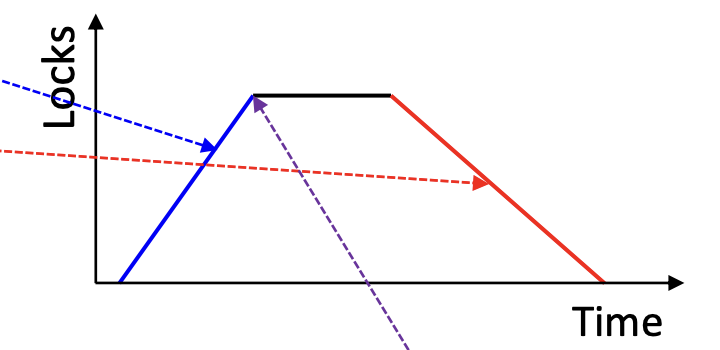
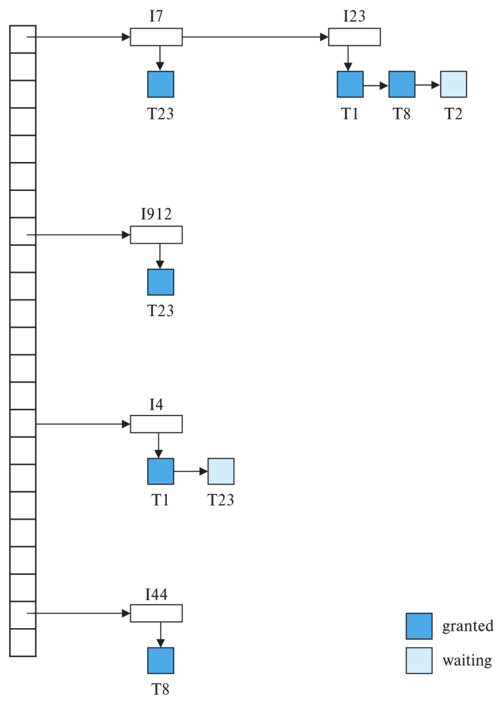

# 18. Concurrency Control

## Overview
- 스케줄 1: $T_1$ 다음에 $T_2$가 오는 직렬 스케줄
- 스케줄 3: 스케줄 1과 동등한 동시성 스케줄
- 스케줄 2: $T_2$ 다음에 $T_1$이 오는 직렬 스케줄
- Conflict: 충돌 발생
- Concurrency Control: 충돌하는 명령 간의 실행 순서를 변경하지 않으면서, 동시성 레벨을 가능한 한 높게 만드는 스케줄 생성

## Lock-based Protocols
- Lock: 데이터 아이템에 대한 동시 접근을 제어하는 메커니즘
- 데이터 아이템은 두 가지 모드로 잠길 수 있음
  1. eXclusive (X) mode: 데이터 아이템을 읽고 쓸 수 있음.
  - **lock-X** 및 **unlock** 명령을 사용하여 X-lock을 요청하고 해제
  2. Shared (S) mode: 데이터 아이템을 읽을 수만 있음.
  - **lock-S** 및 **unlock** 명령을 사용하여 S-lock을 요청하고 해제
- 모든 transaction은 데이터 아이템 Q에 대해 수행할 Operation 유형에 따라 적절한 모드로 Lock을 요청
  - Lock 요청은 Concurrency-Control Manager로 전달
  - Lock 요청이 승인된 후에만 transaction이 진행 가능
- 요청된 Lock이 해당 아이템에 대해 다른 transaction이 이미 보유하고 있는 Lock과 Compatible하면 transaction은 Lock을 부여받을 수 있음
- S-lock: 임의의 수의 transaction이 아이템에 대해 보유 가능
- X-lock: 한 transaction이 X-lock을 보유하고 있다면, 다른 transaction은 해당 아이템에 대해 어떠한 Lock도 보유할 수 없음

| | S | X |
| - | - | - |
| S | `true` | `false` |
| X | `false` | `true` |

> Lock Compatibility Matrix

## Schedule with Lock Grants
- 나머지 장에서는 Grant 생략
- Lock 요청 바로 다음에 오는 다음 명령 직전에 Grant가 발생한다고 가정
- 이 스케줄은 Serializable하지 않음
  - Lock을 단순히 획득/해제하는 것만으로는 Transaction isolation serializability을 보장하지 못함

| $T_1$ | $T_2$ | concurrency-control manager |
| - | - | - |
| lock-X($B$) | | grant-X($B,~T_1$)
| read($B$)<br>$B:=B-50$<br>write($B$)<br>unlock($B$) | |
| | lock-S($A$) |
| | | grant-S($A,~T_2$)
| | read($A$)<br>unlock(A)<br>lock-S($B$) |
| | | grant-S($B,~T_2$)
| | read($B$)<br>unlock($B$)<br>display($A+B$) |
| lock-X($A$) | |
| | | grant-X($A,~T_1$)
| read($A$)<br>$A:=A+50$<br>write($A$)<br>unlock($A$)

## Locking Protocols
- Locking Protocol: 모든 transaction이 Lock을 요청하고 해제할 때 따르는 규칙의 집합
- 가능한 스케줄 집합을 제한하여 Serializability를 강제
- 주어진 Locking Protocol 하에서,
  - 스케줄 S는 해당 Protocol을 따르는 transaction 집합에 의해 생성될 수 있다면 해당 Protocol 하에서 Legal
  - Protocol은 해당 Protocol 하의 모든 Legal 스케줄이 Serialiazable하다면 Serializability를 보장

## Deadlock and Starvation
- 부분 스케줄을 고려
  - $T_3$와 $T_4$ 모두 진행할 수 없음
  - lock-S(B) 실행은 $T_4$가 $T_3$가 B에 대한 X-lock을 해제하기를 기다리게 하고, `lock-X(A)` 실행은 $T_3$가 $T_4$가 A에 대한 S-lock을 해제하기를 기다리게 함
- 이러한 상황을 Deadlock이라고 함
- Deadlock을 처리하려면 $T_3$ 또는 $T_4$ 중 하나가 Rollback되어야 하고 Lock이 해제되어야 함
- Deadlock의 잠재성은 대부분의 Locking Protocol에 존재하며, 이는 필요악
- Starvation 또한 Concurrency Control Manager가 잘못 설계되면 발생 가능
  - Case 1: 한 transaction이 아이템에 대한 X-lock을 기다리는 동안, 다른 transaction들의 연속적인 S-lock 요청이 승인되는 경우
  - Case 2: 동일한 transaction이 Deadlock으로 인해 반복적으로 Rollback되는 경우
- Concurrency Control Manager는 Starvation을 방지하도록 설계될 수 있음

| $T_3$ | $T_4$
| - | -
| lock-X($B$)<br>read($B$)<br>$B:=B-50$
| | lock-S($A$)<br>read($A$)<br>lock-S($B$)
| lock-X($A$) |

## Two-Phase Locking (2PL) Protocol
- Conflict-Serializable 스케줄을 보장하는 Protocol
- 각 transaction은 Lock 요청과 해제를 두 단계로 나누어 실행해야 함

  - Phase 1: Growing Phase
    - Transaction은 Lock을 획득할 수 있음
    - Transaction은 Lock을 해제할 수 없음
  - Phase 2: Shrinking Phase
    - Transaction은 Lock을 해제할 수 있음
    - Transaction은 Lock을 획득할 수 없음
- 이 Protocol은 Serializability를 보장
  - Transaction들은 Lock Point(최종 Lock을 획득한 시점) 순서로 Serialize될 수 있음이 증명 가능
- Two-Phase Locking은 Serializability를 위한 필수 조건은 아님
  - 2PL을 사용하지 않아도 얻을 수 있는 Conflict Serializable 스케줄이 있음
- 그러나 Data 접근 순서와 같은 추가 정보가 없는 경우, Two-Phase Locking은 Conflict Serializability에 필요
- 추가 정보가 있다면, 2PL 이외의 다른 Locking Protocol을 고안할 수 있음
- Two-Phase Locking은 Deadlock으로부터의 자유를 보장하지 않음
- Cascading Roll-back이 없는 Recoverability를 보장하기 위해 기본 2PL에 확장이 필요함
  - Strict Two-Phase Locking: transaction은 Commit 또는 Abort할 때까지 모든 X-lock을 보유해야 함
    - Recoverability를 보장하고 Cascading Roll-back을 방지
  - Rigorous Two-Phase Locking: transaction은 Commit 또는 Abort할 때까지 모든 Lock을 보유해야 함
    - Transaction은 Commit 순서로 Serialize될 수 있음
- Lock Conversions
  - $T_1$: read($a_1$), read($a_2$), $\dots$, read($a_n$), write($a_1$)
  - $T_2$: read($a_1$), read($a_2$), $\dots$, display($a_1+a_2$)
  - $T_1$은 $a_1$에 대한 X-lock을 획득해야 함
    - $T_1$이 $T_2$보다 먼저 시작하면, $T_1$과 $T_2$의 모든 동시 실행은 직렬 실행과 같음
    - 그러나 $T_1$은 최종 실행에서만 X-lock이 필요
  - $T_1$이 먼저 S-lock을 획득하고 나중에 Lock을 X-lock으로 변경한다면, $T_1$과 $T_2$가 $a_1$과 $a_2$에 동시에 접근할 수 있으므로 더 높은 동시성을 얻을 수 있음
  - Lock Upgrade: S-lock을 X-lock으로 변환
  - Lock Downgrade: X-lock을 S-lock으로 변환
- Lock Conversion을 포함한 Two-Phase Locking Protocol:
  - Growing Phase
    - 아이템에 대한 S-lock 획득
    - 아이템에 대한 X-lock 획득
    - S-lock을 X-lock으로 변환 (Upgrade)
  - Shrinking Phase
    - S-lock 해제
    - X-lock 해제
    - X-lock을 S-lock으로 변환 (Downgrade)
- 이 Protocol은 Serializability를 보장
- Strict Two-Phase Locking 및 Rigorous Two-Phase Locking (Lock Conversion 포함)은 상용 Database 시스템에서 광범위하게 사용되며, 단순히 Two-Phase Locking으로 지칭되기도 함

## Automatic Acquisition of Locks
- Transaction $T_i$는 명시적인 Locking 호출 없이 표준 read/write 명령을 실행
- Operation `read(D)` 처리 방식:
```
if Ti has a lock on D then read(D);
else begin
    if necessary wait until no other transaction has a X-lock on D;
    grant Ti a S-lock on D;
    read(D);
end
```
- Operation `write(D)` 처리 방식:
```
if Ti has a X-lock on D then write(D);
else begin
    if necessary wait until no other transaction has any lock on D;
    if Ti has a S-lock on D then
        upgrade lock on D to X-lock;
    else grant Ti a X-lock on D;
    write(D);
end
```
- 모든 Lock은 Commit 또는 Abort 후에 해제 (Rigorous 2PL 사용)

## Implementation of Locking
- Lock Manager는 별도의 프로세스로 구현될 수 있음
- Transaction은 Lock 및 Unlock 요청을 Lock Manager에게 메시지로 보냄
- Lock Manager는 Lock Grant 메시지(또는 Deadlock의 경우 transaction에게 Rollback을 요청하는 메시지)를 보내 Lock 요청에 응답
- 요청하는 transaction은 요청에 응답할 때까지 대기
- Lock Table
  - Lock Manager가 관리하는 인메모리 자료구조
  - 승인된 Lock과 보류 중인 요청을 기록
  - 일반적으로 Lock이 걸린 Data 아이템의 이름을 Index로 하는 Hash Table로 구현
  - 각 Hashed된 Data 아이템에 대해, 요청이 도착한 순서대로 각 요청에 대한 Record의 연결 리스트가 존재
  - Collision 해결을 위해 Chaining 사용

## Lock Table
- 연결 리스트의 각 Record에는 다음이 포함됨
  - 요청을 보낸 transaction
  - 요청한 Lock 모드
  - 현재 요청이 승인되었는지 여부
- 새로운 Lock 요청 메시지 도착 시
  - Data 아이템에 대한 연결 리스트 끝에 Record 추가 (비어 있으면 리스트 생성)
  - 이전의 모든 Lock과 Compatible하면 승인
- Unlock 메시지 도착 시
  - 리스트에서 해당 Record 삭제
  - 뒤따르는 Record (있는 경우)를 검사하여 이제 승인될 수 있는지 확인
- Transaction이 Abort하면, transaction의 대기 중이거나 승인된 모든 요청이 삭제됨
  - Lock Manager는 이를 효율적으로 구현하기 위해 각 transaction이 보유한 Lock의 리스트를 유지할 수 있음


## 🌳 (Optional) Graph-based Protocols
- 추가 정보가 있다면 Conflict Serializability를 보장하는 Two-Phase Locking 이외의 다른 Locking Protocol을 고안할 수 있음
- 간단한 추가 정보: Database 아이템에 접근하는 순서
  - 모든 Data 아이템의 집합 D} = \{d_{1}, d_{2}, \dots, d_{h}\에 부분 순서 ($\to$)를 부과
  - $d_{i} \to d_{j이면, $d_{i와 $d_{j 모두에 접근하는 모든 transaction은 $d_{j보다 $d_{i에 먼저 접근해야 함
  - 이러한 부분 순서는 Data의 논리적 또는 물리적 조직의 결과일 수도 있고, 오로지 Concurrency Control 목적으로만 부과될 수도 있음
  - 집합 D는 이제 Directed Acyclic Graph(Database Graph)로 볼 수 있음
- Tree Protocol: X-lock만 사용하도록 제한된 간단한 Graph-based Protocol

-   각 transaction $T_i$는 Data 아이템을 최대 한 번 Lock할 수 있으며, 다음 규칙을 준수해야 함
  -   $T_i$의 첫 번째 Lock은 모든 Data 아이템에 걸릴 수 있음
  -   그 후, Data 아이템 Q는 Q의 Parent가 현재 $T_i$에 의해 Lock된 경우에만 $T_i$에 의해 Lock될 수 있음
  -   Data 아이템은 언제든지 Unlock될 수 있음
  -   $T_i$에 의해 Lock되고 Unlock된 Data 아이템은 그 후에 $T_i$에 의해 다시 Lock될 수 없음

## 🌲 (Optional) Graph-based Protocols (Cont.)
- Tree Protocol은 Conflict Serializability와 Deadlock으로부터의 자유를 보장
- Tree Protocol에서는 2PL보다 Unlock이 더 일찍 발생할 수 있음
  - 대기 시간 단축 및 동시성 증가
  - Protocol은 Deadlock-free: Rollback이 필요 없음
- 단점
  - Recoverability 또는 Cascade Freedom을 보장하지 않음
    - Recoverability 보장을 위해 Commit Dependency 도입 필요
    - $T_i$가 Uncommitted Data 아이템 Q를 읽을 때, Q를 마지막으로 Write한 Uncommitted transaction에 대한 $T_i$의 Commit Dependency를 기록
    - $T_i$는 Commit Dependency를 가진 모든 transaction이 Commit될 때까지 Commit이 허용되지 않음: 이들 중 하나라도 Abort하면 $T_i$도 Abort되어야 함
  - Transaction은 접근하지 않는 Data 아이템도 Lock해야 할 수 있음
    - 예: A와 J에 접근하기 위해 B, D, H 아이템도 Lock해야 함
    - Locking 오버헤드 증가 및 추가 대기 시간
    - 잠재적인 동시성 감소
- 2PL에서는 불가능한 스케줄이 Tree Protocol에서 가능하며, 그 반대도 가능

## 🚫 Deadlock Prevention
- Deadlock: transaction 집합이 존재하여, 집합 내의 모든 transaction이 집합 내의 다른 transaction을 기다리고 있는 상태
- Deadlock Prevention Protocols: 시스템이 Deadlock 상태로 진입하지 않도록 보장하는 Protocol. 일부 Prevention 전략:
  - 각 transaction이 실행을 시작하기 전에 모든 Data 아이템을 Lock하도록 요구 ('Hold-and-wait' 조건 제거)
  - 모든 Data 아이템에 부분 순서를 부과하고 transaction이 Data 아이템을 지정된 순서로만 Lock할 수 있도록 요구 ('Circular wait' 조건 제거)

## ⏱️ Deadlock Prevention (Cont.)
- Transaction Timestamp-based Schemes

  - Wait-Die Scheme (Non-preemptive)
    - Older transaction은 Younger transaction이 Data 아이템을 해제하기를 기다릴 수 있음
    - $\\text{Younger transaction은 $\\text{Older transaction을 절대 기다리지 않으며, 대신 Rollback됨
  - Wound-Wait Scheme (Preemptive)
    - Older transaction은 기다리는 대신 $\\text{Younger transaction을 Wound(Rollback 강제)
    - $\\text{Younger transaction은 $\\text{Older transaction을 기다릴 수 있음
  - 두 Scheme 모두에서,
    - Rollback된 transaction은 원래 Timestamp로 다시 시작되어 Starvation을 방지
    - 불필요한 Rollback이 발생할 수 있음
- Lock Timeout-based Schemes (Deadlock Detection & Recovery와 유사)

  - Transaction은 Lock을 위해 지정된 시간 동안만 대기
  - 그 후 대기 시간이 초과되면 transaction이 Rollback됨
  - Deadlock이 발생하면 Timeout으로 해결되도록 보장
  - 구현이 간단하지만, Deadlock이 없는 경우에도 transaction을 불필요하게 Rollback할 수 있음
  - 적절한 Timeout 간격 값을 결정하기 어려움
  - Starvation 또한 발생 가능

## 🔍 Deadlock Detection
- Wait-for Graph: transaction을 정점으로 하는 Directed Graph
  - $T_i \to \text{T_j로의 Edge: $T_i$가 T_j가 Conflicting 모드로 보유한 Lock을 기다리고 있는 경우
  - 시스템이 Deadlock 상태 $\iff$ Wait-for Graph에 Cycle이 있음
- 주기적으로 Deadlock-Detection Algorithm을 호출하여 Cycle을 찾음
- Deadlock이 감지되면:
  - Deadlock Cycle을 깨기 위해 일부 transaction이 Rollback되어야 함 (Victim)
  - Victim으로 최소 비용을 초래하는 transaction을 선택
  - Rollback: transaction을 어디까지 Rollback할지 결정
    - Total Rollback: transaction을 Abort하고 다시 시작
    - Partial Rollback: Cycle 내의 다른 transaction이 기다리고 있는 Lock을 해제하는 데 필요한 만큼만 Victim transaction을 Rollback
  - Starvation 가능성 $\to$ 해결책: 가장 오래된 transaction은 Victim으로 선택하지 않음

## 📐 Multiple Granularity
- 지금까지 개별 Data 아이템을 Locking Unit으로 사용
- 때로는 여러 Data 아이템을 그룹화하여 하나의 개별 Locking Unit으로 처리하는 것이 유리
  - 예: 전체 Relation을 스캔할 때, Tuple-level Lock을 발행하는 대신 전체 Relation을 Lock하는 단일 Lock 요청을 발행하는 것이 좋음
- 시스템이 다중 수준의 Granularity를 정의할 수 있도록 하는 메커니즘이 필요
  - Data 아이템이 다양한 크기를 갖도록 허용하고, 작은 Granularity가 더 큰 Granularity 내에 Nest되는 계층 구조를 정의
  - Tree 형태로 그래픽적으로 표현 가능
- Transaction이 Tree의 노드를 명시적으로 Lock하면, 해당 노드의 모든 Descendant를 같은 모드로 암묵적으로 Lock
- Locking Granularity(Locking이 수행되는 Tree의 수준):
  - Fine Granularity (Tree의 하위): 높은 동시성, 높은 Locking 오버헤드
  - Coarse Granularity (Tree의 상위): 낮은 Locking 오버헤드, 낮은 동시성

## 📊 Example of Granularity Hierarchy
- 가장 거친(상위) 수준부터 시작하는 수준:
  - Database (DB) $\to$ Area (A_1}, \text{A_2})$ $\to$ File (F_a}, \text{F_b}, \text{F_c})$ $\to$ Record
- 문제: $T_1$이 F_c에 X-lock을 보유하고 있다고 가정. F_c에 속하는 모든 Record에 X-lock을 암묵적으로 보유
  - Case 1: $T_2$가 r_c1에 대한 Lock 요청을 발행 (명시적으로 Lock되지 않음). $T_2$가 r_c1을 Lock할 수 있는지 어떻게 결정?
    - Root에서 r_c1까지 Tree를 Traverse해야 하며, 해당 경로의 어떤 노드라도 Incompatible 모드로 Lock되어 있으면 $T_2$는 대기해야 함
  - Case 2: $T_3$가 전체 DB에 대한 Lock 요청을 발행. 이는 승인되어서는 안 됨. 어떻게 결정?
    - Incompatible Lock이 있는지 전체 Tree를 Traverse하여 확인해야 함
- 해결책: Intention Lock 모드

## 🔑 Intention Lock Modes
- S 및 X Lock 모드 외에, Multiple Granularity를 위한 세 가지 추가 Lock 모드(Intention Lock Modes)
  - intention-shared (IS): Tree의 하위 수준에서 명시적 Locking이 Shared 모드 Lock으로만 수행됨을 나타냄
  - intention-exclusive (IX): Tree의 하위 수준에서 명시적 Locking이 Exclusive 모드 또는 Shared 모드 Lock으로 수행됨을 나타냄
  - shared and intention-exclusive (SIX): 해당 노드를 Root로 하는 Subtree가 Shared 모드로 명시적으로 Lock되어 있으며, 하위 수준에서 Exclusive 모드 Lock으로 명시적 Locking이 수행되고 있음을 나타냄
- 노드가 명시적으로 Lock되기 전에 해당 노드의 모든 Ancestor에 Intention Lock이 설정됨
  - Ancestor 노드를 S 또는 X 모드로 Lock할 때 모든 Descendant 노드를 확인할 필요 없이 허용
- 모든 Lock 모드에 대한 Compatibility Matrix

| | IS | IX | S | SIX | X |
| - | - | - | - | - | - |
| IS | Yes | Yes | Yes | Yes | No |
| IX | Yes | Yes | No | No | No |
| S | Yes | No | Yes | No | No |
| SIX | Yes | No | No | No | No |
| X | No | No | No | No | No |

## 📜 Multiple Granularity Locking Protocol
- Transaction $T_i$는 다음 규칙을 사용하여 노드 Q를 Lock할 수 있음

    1. Lock Compatibility Matrix를 준수해야 함
    2. Tree의 Root가 가장 먼저 Lock되어야 하며, 어떤 모드로든 Lock될 수 있음
    3.  노드 Q는 $T_i$의 Parent가 현재 IX 또는 IS 모드로 Lock된 경우에만 S 또는 IS 모드로 Lock될 수 있음
    4.  노드 Q는 $T_i$의 Parent가 현재 IX 또는 SIX 모드로 Lock된 경우에만 X, SIX, 또는 IX 모드로 Lock될 수 있음
    5.  $T_i$는 이전에 어떠한 노드도 Unlock하지 않은 경우에만 노드를 Lock할 수 있음 (즉, $T_i$는 Two-Phase)
    6.  $T_i$는 Q의 자식 중 $T_i$에 의해 현재 Lock된 것이 없는 경우에만 노드 Q를 Unlock할 수 있음
- Lock은 Root에서 Leaf 순서로 획득되는 반면, Leaf에서 Root 순서로 해제됨을 관찰
- Lock Granularity Escalation: 특정 수준에 Lock이 너무 많은 경우, 더 높은 Granularity S 또는 X Lock으로 전환

## ➕ Insert/Delete Operations
- 지금까지 Read 및 Write Operation에 국한하여 논의
- 일부 transaction은 새로운 Data 아이템을 생성 (Insert)하거나 기존 Data 아이템을 제거 (Delete)
- Insert/Delete Operation에 대한 Locking 규칙:
  - Read/Write 충돌과 Delete를 방지하기 위해 아이템이 Delete되기 전에 X-lock을 획득해야 함
  - Transaction이 Database에 새로운 Tuple을 Insert할 때, 해당 Tuple에 대한 X-lock이 자동으로 부여됨 $\to$ Tuple을 Insert하는 transaction이 Commit될 때까지 Insert된 Tuple은 다른 transaction이 접근할 수 없음


## 🕰️ Timestamp-based Protocols

## 🏷️ Timestamp-based Protocols
- 각 transaction $T_i$는 시스템에 진입할 때 Timestamp TS}(T_i)$가 부여됨
- 각 transaction은 고유한 Timestamp를 가짐
- Newer transaction은 Earlier transaction보다 Timestamp가 엄격하게 큼
- Timestamp는 시스템 클럭 또는 논리적 Counter일 수 있음
- Timestamp-based Protocols은 transaction의 Timestamp가 Serializability Order를 결정하도록 동시 실행을 관리
  - TS}(T_i) < \text{TS}(\text{T_j})$이면, 시스템은 생성된 스케줄이 $T_i$가 T_j보다 먼저 나타나는 직렬 스케줄과 동등하도록 보장해야 함
- 구현을 위해 각 Data 아이템 Q에 두 개의 Timestamp를 연결
  - W-timestamp}(\text{Q})$: write}(\text{Q})$를 성공적으로 실행한 transaction 중 가장 큰 Timestamp
  - R-timestamp}(\text{Q})$: read}(\text{Q})$를 성공적으로 실행한 transaction 중 가장 큰 Timestamp
  - 이러한 Timestamp는 새로운 read}(\text{Q})$ 또는 write}(\text{Q})$ Instruction이 실행될 때마다 업데이트됨
- Timestamp를 기반으로 하는 몇 가지 대안적인 Protocol 존재

## ➡️ Timestamp-Ordering Protocol
- Timestamp-Ordering (TSO) Protocol
- Read 및 Write Operation에 규칙을 부과하여 다음을 보장

  - 모든 Conflicting Operation은 Timestamp Order로 실행
  - Out of Order Operation은 transaction Rollback 및 새로운 TS로 재시작을 유발
- Transaction $T_i$가 read}(\text{Q})$를 발행한다고 가정

    1. TS}(T_i) < \text{W-timestamp}(\text{Q})$이면, $T_i$는 나중 transaction에 의해 이미 Overwrite된 Q의 값을 읽으려고 함
    - 따라서 Read Operation은 거부되고 $T_i$는 Rollback됨
    2. TS}(T_i) \ge \text{W-timestamp}(\text{Q})$이면, Read Operation은 실행되고 R-timestamp}(\text{Q})$는 max}(\text{R-timestamp}(\text{Q}), \text{TS}(T_i))$로 설정됨
- Transaction $T_i$가 write}(\text{Q})$를 발행한다고 가정

    1. TS}(T_i) < \text{R-timestamp}(\text{Q})$이면, $T_i$가 생성하는 Q의 값이 이전에 나중 transaction에 의해 필요했음 (즉, 그 값은 결코 생성되지 않을 것임)
    - 따라서 Write Operation은 거부되고 $T_i$는 Rollback됨
    2. TS}(T_i) < \text{W-timestamp}(\text{Q})$이면, $T_i$는 Q의 Obsolete Value를 Write하려고 함
    - 따라서 이 Write Operation은 거부되고 $T_i$는 Rollback됨
    3.  그렇지 않으면, Write Operation은 실행되고 W-timestamp}(\text{Q})$는 TS}(T_i)$로 설정됨

## 📈 Example of Schedule Under TSO
- 이 스케줄이 TSO 하에서 유효한가?

  - 초기 가정: R-TS}(\text{A}) = \text{W-TS}(\text{A}) = 0$, R-TS}(\text{B}) = \text{W-TS}(\text{B}) = 0$
  - TS}(\text{T_25}) = 25$, TS}(\text{T_26}) = 26$ 가정

    | Time | $T_2$5 | $T_2$6 | R-TS}(\text{A})$ | W-TS}(\text{A})$ | R-TS}(\text{B})$ | W-TS}(\text{B})$ |
    | - | - | - | - | - | - | - |
    | $1$ | read}(\text{A})$ | | $25$ | $0$ | $0$ | $0$ |
    | $2$ | read}(\text{B})$ | | $25$ | $0$ | $25$ | $0$ |
    | $3$ | | read}(\text{A})$ | $26$ | $0$ | $25$ | $0$ |
    | $4$ | | read}(\text{B})$ | $26$ | $0$ | $26$ | $0$ |
    | $5$ | write}(\text{A})$ | | $26$ | $25$ | $26$ | $0$ |
    | $6$ | write}(\text{B})$ | | $26$ | $25$ | $26$ | $25$ |
    | $7$ | | write}(\text{A})$ | $26$ | $26$ | $26$ | $25$ |
    | $8$ | | write}(\text{B})$ | $26$ | $26$ | $26$ | $26$ |
- 이 스케줄은 TSO 하에서 유효함
- 초기에 R-TS}(\text{Q}) = \text{W-TS}(\text{Q}) = 0$인 이 스케줄은?

| Time | $T_2$7 (TS}=27$) | $T_2$8 (TS}=28$) | R-TS}(\text{Q})$ | W-TS}(\text{Q})$ |
| - | - | - | - | - |
| $1$ | write}(\text{Q})$ | | $0$ | $27$ |
| $2$ | | read}(\text{Q})$ | $28$ | $27$ |
| $3$ | write}(\text{Q})$ | | Rollback | $27$ |
\-   $T_2$7의 두 번째 `write(Q)` 시도에서 TS}(\text{T_27}) = 27 < \text{R-TS}(\text{Q}) = 28$이므로, Write Operation은 거부되고 $T_2$7은 Rollback됨.

## ✏️ Thomas’ Write Rule
- Timestamp-Ordering Protocol의 수정된 버전으로, Obsolete Write Operation은 특정 상황에서 무시될 수 있음
- $T_i$가 Data 아이템 Q를 Write하려고 할 때, (규칙의 순서 중요)

    1. TS}(T_i) < \text{R-timestamp}(\text{Q})$이면, Write Operation은 거부되고 $T_i$는 Rollback됨
    2. TS}(T_i) < \text{W-timestamp}(\text{Q})$이면, $T_i$는 Q의 Obsolete Value를 Write하려고 함
    - $T_i$를 Rollback하는 대신, 이 Write Operation은 그냥 무시될 수 있음
    3.  그렇지 않으면, Write Operation은 실행되고 W-timestamp}(\text{Q})$는 TS}(T_i)$로 설정됨
- 이 Protocol의 첫 번째와 세 번째 규칙은 Timestamp-Ordering Protocol과 동일
- Thomas' Write Rule의 Correctness

  - $T_i$가 첫 번째 규칙을 통과. 따라서 TS}(T_i) \ge \text{R-timestamp}(\text{Q})$
  - TS}(T_i) < \text{W-timestamp}(\text{Q})$이면, R-timestamp}(\text{Q}) \le \text{TS}(T_i) < \text{W-timestamp}(\text{Q})$
  - 이는 Q를 Write한 transaction이 Q를 읽은 적이 없음을 의미 (Blind Write)
  - Blind Write는 아이템의 이전 값에 의존하지 않음 $\to$ 이전 Write는 안전하게 무시될 수 있음
- Thomas' Write Rule은 더 큰 잠재적 동시성을 허용
- Conflict-Serializable하지 않은 일부 View-Serializable 스케줄을 허용

## 🚀 Validation-based Protocols (Optimistic Concurrency Control)

## 🎯 Validation-based Protocol
- Concurrency-Control Scheme
  - Code 실행 오버헤드를 부과
  - Transaction 실행을 지연시킬 수 있음
- 대다수 transaction이 Read-only이고 transaction 간의 충돌 비율이 낮은 경우
  - Concurrency-Control 없이 실행되더라도 많은 transaction이 시스템을 일관된 상태로 남길 것임
  - $\to$ 더 적은 오버헤드를 부과하는 대안적인 Concurrency-Control Scheme을 사용하는 것이 좋음
- Idea: Concurrency Control 없이 (로컬 변수에서) 실행한 다음, Serializability 위반을 일으키지 않으면 DB에 Write (유효성 검사 테스트를 통해)
  - Write는 transaction 종료 시점으로 Postpone
  - Transaction이 Read/Write한 Data 아이템을 Track
  - Commit 시점에 유효성 검사를 수행하여 Serialization Order를 벗어난 Read/Write를 감지
- Transaction이 유효성 검사 동안 모든 것이 잘 될 것이라는 희망으로 완전히 실행되므로 Optimistic Concurrency Control (OCC)이라고도 함
- Transaction $T_i$의 실행은 세 단계로 수행
    1. Read and Execution Phase: $T_i$ 실행. Data 아이템을 (임시) 로컬 변수에 읽고 저장. 실제 Database 업데이트 없이 로컬 변수에 Write
    2. Validation Phase: $T_i$는 Serializability를 위반하지 않고 로컬 변수를 Write할 수 있는지 결정하기 위한 Validation Test를 수행. transaction이 Validation Test에 실패하면 Abort됨 (Rollback 필요 없음).
    3.  Write Phase: $T_i$가 Validate되면 업데이트가 Database에 적용됨 (Read-only transaction은 이 단계를 생략)
- 동시에 실행되는 transaction의 세 단계는 Interleave될 수 있음
- 하지만 각 transaction은 반드시 그 순서대로 세 단계를 거쳐야 함
- 단순화를 위해 Validation 및 Write 단계는 원자적이고 직렬적으로 함께 발생한다고 가정
  - 즉, 한 번에 하나의 transaction만 Validation/Write를 실행
- 각 transaction $T_i$는 3개의 Timestamp를 가짐

  - StartTS}(T_i)$: $T_i$가 실행을 시작한 시간
  - ValidationTS}(T_i)$: $T_i$가 Validation 단계에 진입한 시간
  - FinishTS}(T_i)$: $T_i$가 Write 단계를 완료한 시간
- ValidationTS}(T_i)$를 사용하여 TSO에 의해 Serializability Order를 결정

  - 즉, TS}(T_i) = \text{ValidationTS}(T_i)$
  - TS}(\text{T_j}) < \text{TS}(\text{T_k})$이면, 생성된 모든 스케줄은 T_j가 T_k보다 먼저 나타나는 직렬 스케줄과 동등해야 함
- Validation Test는 위 Timestamp와 Read/Write Set을 사용하여 Serializability Order가 Validation Time에 의해 결정되도록 보장

  - Read Set of $T_i$: $T_i$가 Read한 Data 아이템의 집합
  - Write Set of $T_i$: $T_i$가 Write한 Data 아이템의 집합
- Validation-based Protocol은 충돌 확률이 낮은 경우 Locking/TSO보다 더 높은 동시성을 제공하는 것으로 밝혀짐

## Validation Test
- Transaction $T_i$에 대한 Validation Test는 TS}(\text{T_k}) < \text{TS}(T_i)$인 모든 T_k에 대해 다음 조건 중 하나가 Hold해야 함을 요구

  - FinishTS}(\text{T_k}) < \text{StartTS}(T_i)$
    - T_k가 $T_i$가 시작하기 전에 실행을 완료했으므로, Serializability Order는 실제로 유지됨
  - Write Set of T_k $\cap$ Read Set of $T_i = \emptyset$, AND T_k가 $T_i$가 Validation 단계를 시작하기 전에 Write 단계를 완료 (StartTS}(T_i) < \text{FinishTS}(\text{T_k}) < \text{ValidationTS}(T_i)$)
- 위 조건 중 하나가 Hold하면 Validation은 성공하고 $T_i$는 Write 단계로 진행할 수 있음. 그렇지 않으면 Validation은 실패하고 $T_i$는 Abort됨
- Justification

  - 첫 번째 조건: transaction 실행이 Concurrent하지 않을 때 적용
    - Serializability Order는 자연스럽게 유지됨
  - 두 번째 조건: 실행이 Concurrent하지만, $T_i$는 T_k가 Write한 어떤 아이템도 Read하지 않았고, $T_i$는 T_k의 Read에 영향을 미칠 수 없음
    - FinishTS}(\text{T_k}) < \text{ValidationTS}(T_i)$는 $T_i$에 의한 Write가 실제로 Database에 Write되지 않았기 때문에 T_k가 $T_i$에 의한 어떤 Write도 보지 않았음을 보장

## 📊 Schedule Produced by Validation
- Validation을 사용하여 생성된 스케줄의 예

| Time | $T_1$ | $T_2$ | TS | Read Set | Write Set |
| - | - | - | - | - | - |
| $1$ | read}(\text{A})$ | | | $\{\text{A}\ | $\emptyset$ |
| $2$ | read}(\text{B})$ | | | $\{\text{A}, \text{B}\ | $\emptyset$ |
| $3$ | | read}(\text{B})$ | | $\emptyset$ | $\emptyset$ |
| $4$ | | read}(\text{C})$ | | $\{\text{B}, \text{C}\ | $\emptyset$ |
| $5$ | | compute B}=\text{B}+1$ | | $\{\text{B}, \text{C}\ | $\{\text{B}\ |
| $6$ | | compute A}=\text{A}+1$ | | $\{\text{B}, \text{C}\ | $\{\text{A}, \text{B}\ |
| $7$ | | Validation $T_2$ (TS}=7$) | $7$ | | |
| $8$ | | write}(\text{A})$ | | | |
| $9$ | | write}(\text{B})$ | | | |
| $10$ | compute A}=\text{A}+1$ | | | $\{\text{A}, \text{B}\ | $\{\text{A}\ |
| $11$ | Validation $T_1$ (TS}=11$) | | $11$ | | |
- $T_2$ $(\text{TS}=7) < \text{T_1 $(\text{TS}=11)$에 대한 Validation Test
  - FinishTS}(\text{T_2}) = 9$. StartTS}(\text{T_1}) = 1$
  - FinishTS}(\text{T_2}) \nless \text{StartTS}(\text{T_1})$ (즉, $9 \nless 1$)
  - Write Set of $T_2 = \{\text{A}, \text{B}\
  - Read Set of $T_1 = \{\text{A}, \text{B}\
  - Write Set of $T_2 \cap \text{Read Set of $T_1 = \{\text{A}, \text{B}\} \ne \emptyset$
- Validation Test 실패 $\to$ $T_1$ Abort
- 위 스케줄은 직렬 스케줄 (Validation Timestamp Order)과 동등