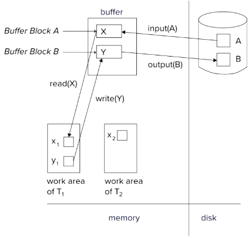
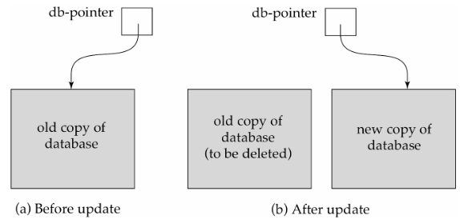
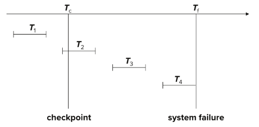
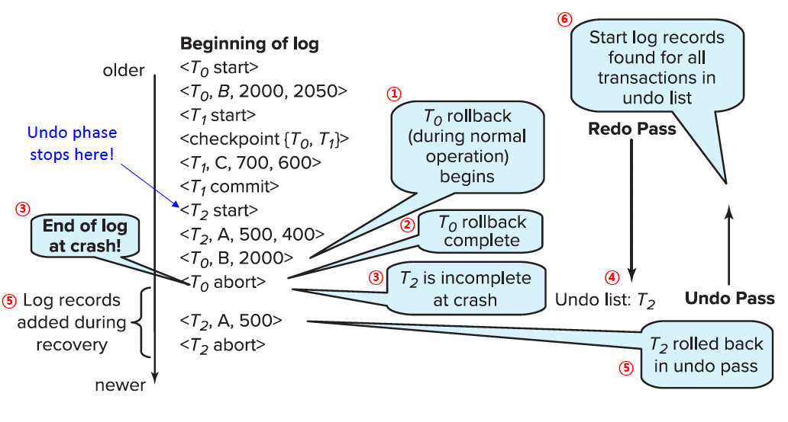

# 19. Recovery System

## Failure Classification
- Transaction 실패
  - Logical errors: 내부 오류 조건으로 인해 transaction이 완료될 수 없는 상황
  - System errors: 데이터베이스 시스템이 오류 조건(예: deadlock)으로 인해 활성 transaction을 종료해야 하는 상황
- System crash
  - 전원 실패 또는 기타 하드웨어/소프트웨어 실패로 시스템 붕괴 발생
  - Fail-stop assumption: 비휘발성 저장 장치 내용은 System crash로 인해 손상되지 않는다고 가정
  - 데이터베이스 시스템은 디스크 데이터 손상을 방지하기 위해 다수의 무결성 검사 수행
- Disk failure: 헤드 크래시나 유사한 디스크 오류로 인해 디스크 저장소의 일부 또는 전체 파괴
  - 파괴는 감지 가능하다고 가정
    - 디스크 드라이브는 checksum을 사용하여 failure 감지

## Data Access
- Physical blocks는 디스크에 상주하는 블록
- Buffer blocks는 메인 메모리에 일시적으로 상주하는 블록
- 디스크와 메인 메모리 간의 블록 이동은 다음 두 가지 연산을 통해 시작
  - $\text{input}(B)$: Physical block $B$를 메인 메모리로 전송
  - $\text{output}(B)$: buffer block $B$를 디스크로 전송하고 해당 Physical block을 교체
- 단순화를 위해 각 데이터 아이템은 단일 블록 내에 적재 및 저장된다고 가정
- 각 transaction $T_i$는 접근 및 업데이트하는 모든 데이터 아이템의 로컬 복사본을 유지하는 private work-area 보유
  - 데이터 아이템 $X$에 대한 $T_i$의 로컬 복사본을 $x_i$라고 지칭

- 시스템 buffer blocks와 private work-area 간의 데이터 아이템 전송 수행 방식
  - $\text{read}(X)$: 데이터 아이템 $X$의 값을 로컬 변수 $x_i$에 할당
  - $\text{write}(X)$: 로컬 변수 $x_i$의 값을 buffer block 내의 데이터 아이템 $X$에 할당
  - 두 경우 모두, $X$가 상주하는 $B_X$가 메모리에 없다면 먼저 $\text{input}(B_X)$ 발행
  - 참고: $\text{output}(B_X)$가 $\text{write}(X)$ 직후에 수행될 필요는 없음. 시스템은 적절하다고 판단될 때 output 연산 수행 가능
- Transactions
  - $X$에 처음 접근하기 전에 반드시 $\text{read}(X)$ 수행(이후의 읽기는 로컬 복사본에서 가능)
  - $\text{write}(X)$는 transaction이 commit 되기 전 언제든지 실행 가능

## Recovery Algorithms
- Transaction $T_i$가 계좌 $A$에서 계좌 $B$로 50달러를 이체한다고 가정
  - 두 가지 업데이트: $A$에서 50 차감 및 $B$에 50 추가
- Transaction $T_i$는 $A$와 $B$에 대한 업데이트가 데이터베이스에 출력되기를 요구
  - 수정 중 하나만 이루어지고 디스크에 출력된 후(즉, $T_i$가 아직 uncommitted 상태) 실패 발생 가능
    - 이러한 실패는 데이터베이스를 비일관적인 상태로 만듦 → (uncommitted) $T_i$의 atomicity가 중요!
  - 두 가지 모두 수정되고 $T_i$가 commit 되었으나, $A$와 $B$가 디스크에 출력되기 전 실패 발생 가능
    - 이러한 실패는 Lost updates를 초래 → (committed) $T_i$의 durability가 중요!
- Recovery 알고리즘은 실패에도 불구하고 transaction의 atomicity와 durability를 보장하여 데이터베이스 consistency를 확보하는 기술
  - 본 챕터의 중점 사항
- Recovery 알고리즘의 두 가지 파트
  1. 정상 transaction 처리 중 조치: 실패로부터 복구하기 위해 충분한 정보가 존재하도록 보장(Logging)
  2. 실패 후 조치: Atomicity, consistency, durability를 보장하는 상태로 데이터베이스 내용 복구(Recovery)

# Recovery and Atomicity
- 실패에도 불구하고 atomicity를 보장하기 위해, 데이터베이스 자체를 수정하기 전에 수정 사항을 설명하는 정보를 stable storage에 출력
- Log-based recovery 메커니즘을 상세히 학습
  - 먼저 핵심 개념 제시
  - 그 후 실제 Recovery 알고리즘 제시
- 덜 사용되는 대안: Shadow-copy 및 shadow-paging(교재에 간략한 세부 내용 포함)

> 소규모 데이터베이스를 위한 shadow-copy

## Log-based Recovery
- Log는 데이터베이스의 업데이트 활동 정보를 담은 log record의 sequence
  - Log는 stable storage에 유지
- Transaction $T_i$ 시작 시, $<T_i~ \mathbf{start}>$ log records를 작성하여 등록
- $T_i$가 $\text{write}(X)$를 실행하기 전, $<T_i,~ X,~ V_1,~ V_2>$ log record 작성
  - $V_1$: $\text{write}$ 전의 $X$ 값(이전 값)
  - $V_2$: $X$에 쓰일 값(새로운 값)
  - $\text{write}(X)$ 연산의 실제 실행은 데이터베이스 수정 방식에 따름
- $T_i$가 마지막 구문을 마치면, log record $<T_i~ \mathbf{commit}>$ 작성
  - Transaction의 commit log record가 stable storage에 출력되면 해당 transaction이 commit 되었다고 간주(해당 transaction의 이전 모든 log record가 이미 출력되어 있어야 함)
- Transaction이 수행한 Writes는 transaction commit 시점에 여전히 버퍼에 있을 수 있으며 나중에 출력될 수 있음.
- Log를 사용하는 두 가지 접근 방식
  - Immediate database modification
  - Deferred database modification

## Database Modification Schemes
- Database modification의 의미
  - Private area의 로컬 변수가 아닌, buffer block 또는 디스크상에서 업데이트 수행
- Immediate-modification scheme
  - Transaction commit 전에도 데이터베이스 수정 허용
  - 데이터베이스 수정 전에 업데이트 log record 작성 필수
    - Log records는 stable storage로 직접 출력된다고 가정
    - (log record 출력을 어느 정도 연기하는 방법은 나중에 확인)
  - 업데이트된 buffer blocks의 디스크 출력은 transaction commit 전후 언제든 발생 가능
    - 블록이 출력되는 순서는 쓰여진 순서와 다를 수 있음.
- Deferred-modification scheme
  - Transaction commit 시점에만 데이터베이스 수정 수행
  - Recovery의 일부 측면 단순화
  - 하지만 업데이트된 모든 데이터 아이템의 로컬 복사본을 저장해야 하는 overhead가 존재

## Immediate Database Modification Example
| Log | Write | Output
| - | - | -
| $<T_0~ \mathbf{start}>$ |
| $<T_0,~ A,~ 1000,~ 950>$ |
| | $A = 950$ |
| $<T_0,~ B,~ 2000,~ 2050>$ |
| | $B = 2050$ |
| $<T_0~ \mathbf{commit}>$ |
| $<T_1~ \mathbf{start}>$ |
| $<T_1,~ C,~ 700,~ 600>$ |
| | $C = 600$ |
| | | $B_B,~B_C$
| $<T_1~ \mathbf{commit}>$ |
| | | $B_A$

- 참고: $B_X$는 $X$를 포함하는 블록을 의미

## Concurrency Control and Recovery
- 동시 transactions 환경에서,
  - 모든 transactions는 단일 디스크 버퍼와 단일 로그 공유
  - 하나의 buffer block은 하나 이상의 transaction에 의해 업데이트된 데이터 아이템을 가질 수 있음.
- 가정 사항
  - Transaction $T_i$가 아이템을 수정했다면, $T_i$가 commit 되거나 abort 될 때까지 다른 transaction은 해당 아이템 수정 불가
  - 즉, uncommitted transactions의 업데이트는 다른 transactions에게 보이지 않아야 함
    - 그렇지 않다면 복구 시 문제 발생(예: $T_1$이 $A$ 업데이트 → $T_2$가 $A$ 업데이트 및 commit → $T_1$이 abort 해야 하는 경우 undo 수행 방법? - Recoverability issue)
  - 업데이트된 아이템에 대해 X-locks를 획득하고 transaction 종료 시까지 유지함으로써 보장 가능(Strict two-phase locking)
- 다른 transactions의 log record들이 로그 내에 섞여 있을 수 있음.

## Undo and Redo Operations
- Transactions의 undo와 redo
- $\text{undo}(T_i)$: $T_i$에 의해 업데이트된 모든 데이터 아이템의 값을 이전 값으로 복구($T_i$의 마지막 log record부터 역방향 진행)
  - 데이터 아이템 $X$가 이전 값 $V$로 복구될 때마다, 특별한 redo 전용 log record $<T_i,~ X,~ V>$가 작성됨($V=V_1$은 복구된 이전의 값).
  - 이 redo 전용 log records는 undone 된 transaction을 다시 redo해야 하는 특수한 경우에 사용
  - Transaction의 undo가 완료되면 log record $<T_i~ \mathbf{abort}>$ 작성
- $\text{redo}(T_i)$: $T_i$에 의해 업데이트된 모든 데이터 아이템의 값을 새로운 값으로 설정($T_i$의 첫 log record부터 정방향 진행)
  - 이 경우 별도의 logging 수행하지 않음.

## Recovering from Failure
- 실패 후 복구 시
  - Transaction $T_i$를 undo해야 하는 경우 로그 상태
    - Record $<T_i~ \mathbf{start}>$ 포함
    - 하지만 record $<T_i~ \mathbf{commit}>$ 또는 $<T_i~ \mathbf{abort}>$ 미포함
  - Transaction $T_i$를 redo해야 하는 경우 로그 상태
    - Record $<T_i~ \mathbf{start}>$ 포함
    - 그리고 record $<T_i~ \mathbf{commit}>$ 또는 $<T_i~ \mathbf{abort}>$ 포함
- Transaction $T_i$가 이전에 undo되었고 $<T_i~ \mathbf{abort}>$ record가 로그에 작성된 후 실패가 발생했다고 가정
  - 실패 복구 시, transaction $T_i$는 redo됨
    - $T_i$에 의해 생성된 log records를 redo하면 각 아이템이 새로운 값으로 설정(old → new)
    - 그 후, 이전 undo 작업에 의해 생성된 redo 전용 log records를 redo하면 모든 업데이트된 아이템이 다시 이전 값으로 설정(new → old)
  - 이러한 redo는 이전 값을 복구했던 단계를 포함하여 transaction $T_i$의 모든 원래 작업을 다시 수행
    - Repeating history(이력 반복)로 알려짐
    - 낭비처럼 보일 수 있으나 recovery를 크게 단순화

## Immediate DB Modification: Recovery Example
- 아래는 세 가지 시점에서의 로그 상태 표시

| (a) | (b) | (c)
| - | - | -
| $<T_0~\mathbf{start}>$ | $<T_0~\mathbf{start}>$ | $<T_0~\mathbf{start}>$
| $<T_0,~A,~1000,~950>$ | $<T_0,~A,~1000,~950>$ | $<T_0,~A,~1000,~950>$
| $<T_0,~B,~2000,~2050>$ | $<T_0,~B,~2000,~2050>$ | $<T_0,~B,~2000,~2050>$
| | $<T_0~\mathbf{commit}>$ | $<T_0~\mathbf{commit}>$
| | $<T_1~\mathbf{start}>$ | $<T_1~\mathbf{start}>$
| | $<T_1,~C,~700,~600>$ | $<T_1,~C,~700,~600>$
| | | $<T_1~\mathbf{commit}>$
- 각 경우의 Recovery 조치
  - (a) $\text{undo}(T_0)$: $B$는 $2000$으로 복구된 후 $A$는 $1000$으로 복구, log record $<T_0,~ B,~ 2000>$, $<T_0,~ A,~ 1000>$, $<T_0,~ \mathbf{abort}>$ 작성
  - (b) $\text{redo}(T_0)$ 및 $\text{undo}(T_1)$: $A$와 $B$는 $950$과 $2050$으로 설정되고, $C$는 $700$으로 복구. log record $<T_1,~ C,~ 700>$ 및 $<T_1,~ \mathbf{abort}>$ 작성
  - (c) $\text{redo}(T_0)$ 및 $\text{redo}(T_1)$: $A$와 $B$는 각각 $950$과 $2050$으로 설정. 그 후 $C$는 $600$으로 설정
- Recovery 조치가 취해지는 도중에도 실패 발생 가능
  - $\text{redo}()$와 $\text{undo}()$ 연산 모두 **Idempotent**(멱등성)여야 함

## Checkpoints
- 로그에 기록된 모든 transactions를 redo/undo하는 것은 매우 느릴 수 있음.
  - 시스템이 오랫동안 실행되었다면 전체 로그 처리는 시간 소요가 큼
  - 이미 데이터베이스에 업데이트를 출력한 transactions를 불필요하게 redo하게 될 수도 있음.
- 주기적으로 checkpointing을 수행하여 recovery 절차 효율화
  1. 현재 메인 메모리에 있는 모든 log records를 stable storage로 출력
  2. 변경된 모든 buffer blocks를 디스크로 출력
  3. stable storage에 log record $<\mathbf{checkpoint}~ L>$ 기록($L$은 checkpoint 시점에 활성 상태인 모든 transaction의 목록)
  4. Checkpointing 수행 중에는 모든 업데이트 중지
- Recovery 시, checkpoint 이전에 완료된 transactions는 고려할 필요 없게 됨.
  - Checkpoint 이전에 commit 되거나 abort 된 transactions는 checkpoint 이전 혹은 checkpointing 과정에서 이미 모든 업데이트가 stable storage로 출력되었을 것이기 때문
  - 로그의 끝에서부터 역방향으로 스캔하여 가장 최근의 $<\mathbf{checkpoint}~ L>$ record 탐색
  - $L$에 포함되어 있거나 checkpoint 이후에 시작된 transactions만 redo 또는 undo 대상
- Undo 작업을 위해 로그의 더 이전 부분이 필요할 수 있음.
  - $L$에 있는 모든 transaction $T_i$에 대해 record $<T_i~ \mathbf{start}>$가 발견될 때까지 역방향 스캔 지속
  - 위에서 찾은 가장 빠른 $<T_i~ \mathbf{start}>$ record 이전의 로그 부분은 Recovery에 필요하지 않으므로 원할 때 삭제 가능
- 예시
  - $T_1$ 무시 가능(Checkpoint로 인해 업데이트가 이미 디스크에 출력됨)
  - $T_2$ 및 $T_3$ redo
  - $T_4$ undo
  - $<T_2~ \mathbf{start}>$보다 이전 로그는 원할 경우 로그에서 안전하게 제거 가능

# Recovery Algorithm
> - 지금까지 복구 알고리즘에 대한 핵심 개념을 다루었음.  
> - 이제, 기본 복구 알고리즘의 세부적인 구성 요소들을 제시하고자 함.

- Logging(정상 작동 중)
  - Transaction 시작 시 $<T_i~ \mathbf{start}>$
  - 각 업데이트 시 $<T_i,~ X_j,~ V_1,~ V_2>$, 그리고
  - Transaction 종료 시 $<T_i~ \mathbf{commit}>$
- Transaction rollback(정상 작동 중)
  - 롤백할 transaction을 $T_i$라고 가정
  - 로그를 끝에서부터 역방향 스캔: $<T_i,~ X_j,~ V_1,~ V_2>$ 형태의 각 $T_i$ log record에 대해
    - $X_j$에 $V_1$을 써서 undo 수행,
    - 특별한 redo 전용 log record $<T_i,~ X_j,~ V_1>$ 작성
      - 이러한 log records는 compensation log records라고도 불림
  - Record $<T_i~ \mathbf{start}>$를 찾으면 스캔을 중지하고 log record $<T_i~ \mathbf{abort}>$ 작성
- Recovery from failure: 두 단계(Two phases)
  - Redo phase: Commit, abort 여부나 미완료(imcomplete) 상태에 상관없이 모든 transactions의 업데이트 replay
  - Undo phase: 모든 미완료 transactions를 undo
- Redo phase
  1. 마지막 $<\mathbf{checkpoint}~ L>$ records를 찾고 **undo-list**를 $L$로 설정
  2. $<\mathbf{checkpoint}~ L>$ record 위쪽부터 정방향으로 스캔하며 redo 수행 및 undo-list 구축
      1. Record $<T_i,~ X_j,~ V_1,~ V_2>$ 또는 $<T_i,~ X_j,~ V>$가 발견될 때마다 $X_j$에 $V_2$ 또는 $V$를 써서 redo
      2. Record $<T_i~ \mathbf{start}>$가 발견되면 $T_i$를 undo-list에 추가
      3. Record $<T_i~ \mathbf{commit}>$ 또는 $<T_i~ \mathbf{abort}>$가 발견되면 $T_i$를 undo-list에서 제거
- Undo phase
  - 로그를 끝에서부터 역방향 스캔하며 undo-list에 있는 transactions를 롤백
    1. $T_i$가 undo-list에 있는 상태에서 log record $<T_i,~ X_j,~ V_1,~ V_2>$가 발견되면 transaction rollback과 동일한 작업 수행
        1. $X_j$에 $V_1$을 써서 undo 수행
        2. Compensation log record $<T_i,~ X_j,~ V_1>$ 작성
    2. $T_i$가 undo-list에 있는 상태에서 log record $<T_i~ \mathbf{start}>$가 발견되면,
        1. log record $<T_i~ \mathbf{abort}>$ 작성
        2. $T_i$를 undo-list에서 제거
    3. Undo-list가 비게 되면 중지
- Undo phase가 완료된 후, 정상적인 transaction 처리 시작 가능

## Example of Recovery

# Buffer Management
## Log Record buffering
- Log records는 stable storage로 직접(directly) 출력되는 대신 메인 메모리에 버퍼링됨
- 버퍼 내의 log record 블록이 꽉 차거나 log force 연산이 실행될 때 log record가 stable storage로 출력
- Log force는 transaction을 commit하기 위해 모든 log record(commit record 포함)를 stable storage로 강제 출력하는 작업
- 여러 log records를 단일 출력 연산으로 내보낼 수 있어 I/O 비용 감소
- Log record가 버퍼링될 경우 준수해야 할 규칙
  - Log records는 **생성된 순서**대로 stable storage에 출력
  - 참고: 데이터 블록 (데이터베이스 버퍼) 출력은 순서가 바뀔 수 있음.
  - Transaction $T_i$는 log record $<T_i~ \mathbf{commit}>$이 stable storage에 출력되었을 때만 commit 상태로 진입
  - 메인 메모리의 데이터 블록이 데이터베이스로 출력되기 전, 해당 블록의 데이터와 관련된 모든 log record가 반드시 stable storage에 출력되어야 함
    - 이 규칙은 **Write-Ahead Logging** 또는 **WAL** 규칙이라 불림

## Database Buffering
- 데이터베이스는 데이터 블록의 in-memory buffer 유지
  - 새로운 블록이 필요할 때 버퍼가 꽉 찼다면 기존 블록을 버퍼에서 제거해야 함(즉, replacement)
  - 제거 대상으로 선택된 블록이 업데이트되었다면, 디스크로 출력 필수
- Recovery 알고리즘은 **no-force policy** 지원
  - Transaction commit 시 업데이트된 블록을 디스크에 쓸 필요 없음.
  - Force policy: Commit 시 업데이트된 블록 write 요구
    - 더 비싼 commit 비용
- Recovery 알고리즘은 **steal policy** 지원
  - Uncommitted transactions의 업데이트를 포함한 블록도 transaction commit 전에 디스크에 기록 가능
  - Uncommitted 업데이트가 있는 블록이 디스크로 출력될 경우, 해당 업데이트의 undo 정보를 담은 log record가 먼저 stable storage의 로그에 출력되어야 함
    - Write ahead logging
- 블록이 디스크로 출력될 때 해당 블록에 대한 업데이트가 진행 중이어서는 안 됨
  - 다음과 같이 보장 가능
    - 데이터 아이템을 write하기 전, transaction은 해당 데이터 아이템을 포함하는 블록에 대해 X-lock을 획득
    - Write가 완료되면 lock 해제 가능
    - 이렇게 짧은 기간 동안 유지되는 lock을 **latches**라고 지칭
- 블록을 디스크로 출력하는 과정
  1. 블록에 업데이트가 진행 중이지 않음을 보장하기 위해 블록에 대한 exclusive latch를 먼저 획득
  2. **Log flush** 수행(Write-Ahead Logging을 위해)
  3. 블록을 디스크로 출력
  4. 마지막으로 블록에 대한 latch 해제