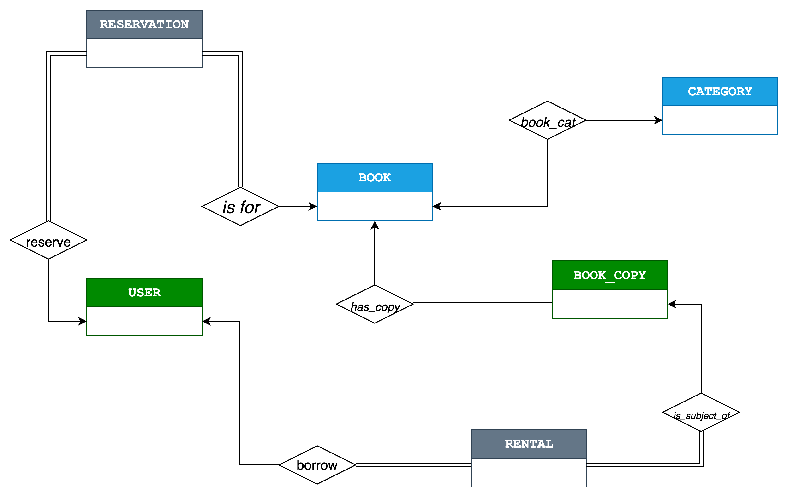
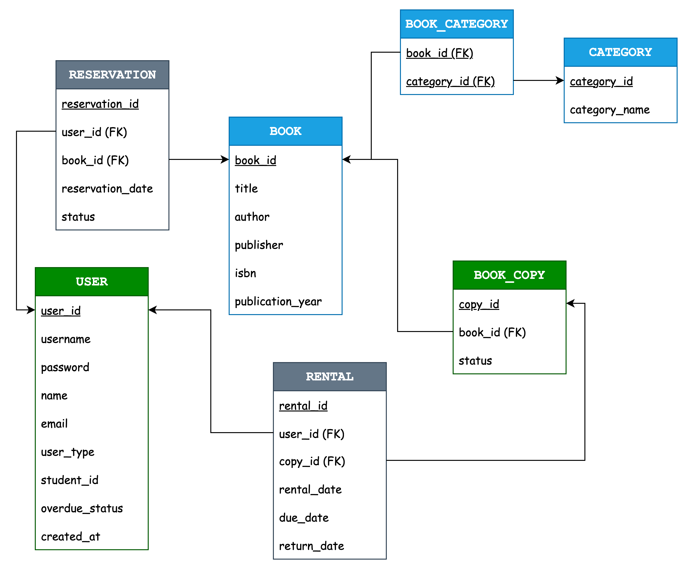

# Assignment 2-1: DB Schema Design

2021024057 김병준

## 1. 설계 의도

본 Database Schema는 도서관의 서적, 회원 관리, 대출/반납 시스템을 구현하는 것을 목표로 설계하였습니다.

**Normalization**: 데이터의 중복을 최소화하고 일관성을 유지하기 위해 엔티티를 분리. '서적'의 추상적인 정보(제목, 저자 등)를 담는 `BOOK` 엔티티와 실제 물리적인 책 한 권 한 권을 의미하는 `BOOK_COPY` entity를 따로 분리하여 재고 및 대출의 상태를 명확하게 관리할 수 있도록 함.

**Scalability**: 추후 새로운 기능이 추가되더라도 유연성 있게 확장할 수 있는 구조를 채택

**Integrity**: 기본키(PK)와 외래키(FK)의 관계를 명확히 설정하여 각 데이터 간의 논리적 연결을 보장하고, 잘못된 데이터가 입력되거나 삭제되는 것을 방지

**관계의 명확성**: '서적'과 '카테고리'의 다대다`(N:M)` 관계를 해결하기 위해 연결 테이블인 `BOOK_CAT`를 도입하여 관계를 명확하게 표현

## 2. Entity 및 Relation 설명

### Entity 역할

#### `USER` (회원)

시스템에 가입된 모든 사용자(일반 사용자, 관리자)의 정보를 저장

로그인, 권한 관리, 대출 자격 확인(연체 여부), 개인별 대출 기록 조회 등 회원과 관련된 모든 기능의 바탕이 됨
`user_type` 속성을 통해 일반 사용자와 관리자를 구분하고, 관리자의 경우에는 학번, `student_id`를 통해 접근 권한을 부여

#### `BOOK` (서적 정보)

도서의 고유한 정보(제목, 저자, ISBN 등)를 저장  
동일한 책이 여러 권 있는 경우에도 이 table에는 한 번만 등록

서적 검색, 목록 조회, 큐레이팅 차트 집계 시 기준이 되는 '정보'의 역할  
data duplicate를 방지하고 서적 정보를 일관되게 관리하는 역할

#### `BOOK_COPY` (개별 서적)

실제 도서관이 보유한 물리적인 책 한 권 한 권을 의미  
각 copy는 고유 `ID`를 가지며, 어떤 `BOOK`에 해당하는지와 현재 상태('대출 가능', '대출 중' 등) 정보를 가짐

'수량'과 '대출 가능 여부'를 파악하고, 특정 책의 어떤 복사본이 대출되었는지 추적하기 위해 필요

#### `CATEGORY` (카테고리)

'소설', 'IT', '자기계발'과 같은 서적의 category 명칭을 저장

서적을 종류에 따라 분류하고, category별 검색, 정렬, 인기 chart 조회를 위해 필요

#### `RENTAL` (대출 기록)

누가(`USER`), 어떤 책을(`BOOK_COPY`), 언제 빌리고 반납했는지에 대한 기록을 저장

사용자의 대출/반납 이력을 관리하고, 연체 여부 판단, 인기 서적 chart data 생성 등 대출과 관련된 핵심적인 기능을 수행

#### `BOOK_CAT` (서적-카테고리 연결)

`BOOK`과 `CATEGORY` 사이의 다대다`(N:M)` 관계를 구현하기 위한 중간 테이블

하나의 책이 여러 카테고리에 속할 수 있다고 했으므로, 이를 구현하기 위해 필요.  
이 테이블을 통해 특정 책이 어떤 카테고리(들)에 속하는지, 또는 특정 카테고리에 어떤 책(들)이 속하는지를 알 수 있음

### Relation 설명

- `USER`와 `RENTAL` `(1:N)`: 한 명의 회원은 여러 번의 대출 기록을 가질 수 있지만, 하나의 대출 기록은 한 명의 회원에게만 속함.

- `BOOK과` `BOOK_COPY` `(1:N)`: 하나의 서적 정보(`BOOK`)는 여러 개의 물리적 복사본(`BOOK_COPY`)을 가질 수 있음. e.g., '데이터베이스 시스템'이라는 책이 3권 있다면, `BOOK` 테이블에는 `1`개의 레코드가, `BOOK_COPY` 테이블에는 `3`개의 레코드가 생성

- `BOOK_COPY`와 `RENTAL` `(1:N)`: 하나의 복사본(`BOOK_COPY`)은 시간에 따라 여러 번 대출 가능 (하나의 특정 시점에는 1번만 대출 가능)

- `BOOK과` `CATEGORY` `(N:M)`: 하나의 책은 여러 카테고리에 속할 수 있고, 하나의 카테고리에는 여러 책이 포함될 수 있음.

  - `BOOK`과 `BOOK_CAT` `(1:N)`

  - `CATEGORY`와 `BOOK_CAT` `(1:N)`

## 3. E-R Diagram

## 4. 추가 기능 제안 (3가지)
요구 명세 외에 도서관 시스템의 활용도를 높일 수 있는 3가지 기능을 추가로 schema에 반영했습니다.

### 4.1. [통계] 개인별 독서 통계 제공

사용자가 자신의 'My Page'에서 월별 독서량, 가장 많이 대출한 카테고리, 선호하는 저자 등의 통계를 확인할 수 있는 기능

`USER`, `RENTAL`, `BOOK_COPY`, `BOOK`, `CATEGORY` table을 join하여 사용자의 대출 기록을 분석하여 구현 가능

### 4.2. [통계] 연체 현황 및 인기 도서 통계 (관리자용)

관리자 dashboard에서 전체 회원의 평균 연체일, 악성 연체자 목록, 연체가 자주 발생하는 서적 목록 등을 확인할 수 있는 기능  
> *이를 통해 도서 회수율을 높이는 정책을 수립할 수 있습니다.*

`RENTAL` 테이블의 `due_date`(반납 예정일)와 `return_date`(실제 반납일)를 비교 분석하여 구현

### 4.3. 서적 예약 기능

원하는 책의 모든 복사본이 대출 중일 경우, 사용자가 해당 서적을 **예약**할 수 있는 기능  
책이 반납되면 예약 순서에 따라 사용자에게 알림 전송

> 이를 위해 누가(`user_id`), 어떤 책을(`book_id`), 언제 예약했는지를 기록할 `RESERVATION`이라는 entity를 추가로 설계하였습니다.

## 5. Relation Schema

