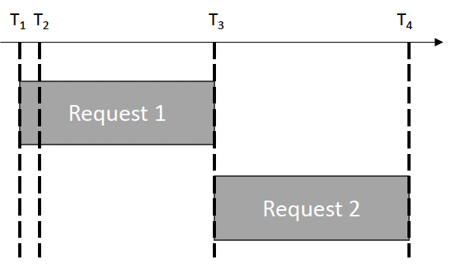
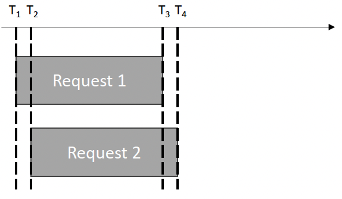
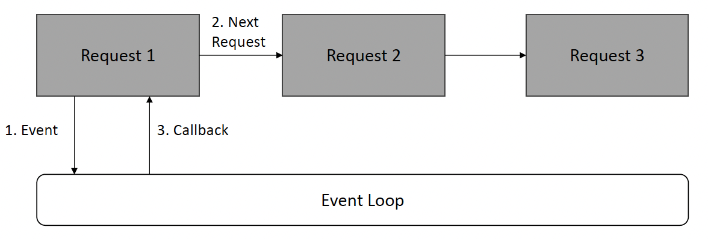

# Web Application Development

## 목차
- `Node.js`
- About `Node.js`
- Asynchronous Request Processing (비동기 요청 처리)
- Callback Function (콜백 함수)
- About `Node.js` project
- npm, `package.json`
- Router (라우터)
- Controller (컨트롤러)
- Middleware (미들웨어)
- Config (설정), `.env`

## About `Node.js`
- JavaScript Runtime (자바스크립트 런타임)
- JavaScript 코드를 실행할 수 있는 환경
- 프론트엔드(Frontend) 개발에 사용하는 JavaScript를 백엔드(Backend) 개발에도 사용 가능하도록 함
- Asynchronous Request Processing
- 요청을 받은 후 해당 요청이 끝나기 전에 다음 요청을 받을 수 있음
- Asynchronous IO (비동기 입출력)를 지원하므로 IO를 처리하는 동안 blocking (블로킹)하지 않음

## Asynchronous Request Processing
- Synchronous Request Processing (동기 요청 처리)
  
  - T1: Request 1 도착, 실행
  - T2: Request 2 도착
  - T3: Request 1 완료, Request 2 실행
  - T4: Request 2 완료
- Asynchronous Request Processing
  
  - T1: Request 1 도착, 실행
  - T2: Request 2 도착, 실행
  - T3: Request 1 완료
  - T4: Request 2 완료
- Asynchronous Request Processing in `Node.js`
  
- Event Loop (이벤트 루프)
  - Request1
  - Request2
  - Request3
  1. Event (이벤트)
  2. Next Request (다음 요청)
  3. Callback

## Callback Function
  - 비동기 작업(Asynchronous operation)이 완료되었을 때 호출되는 함수(Function)
  - 비동기 작업 간 순서 관계를 보장함
```javascript
const fs = require('fs');

// 파일을 비동기로 읽기
fs.readFile('example.txt', 'utf-8', (err, data) => {
  if (err) {
    console.error(err);
    return;
  }
  console.log(data);
});
```
  - 파일을 읽어온 후 에러(Error)가 있으면 콘솔창(Console)에 에러를 출력하고 그렇지 않은 경우 읽어온 데이터(Data)를 출력

# `Node.js` Project Structure

## npm, `package.json`
- npm (Node Package Manager)
  - 전 세계 개발자들이 만든 수많은 패키지를 설치하고 관리하는 도구
- Package (패키지)
  - 특정 기능을 수행하기 위해 만들어진 재사용 가능한 코드의 모음
- `package.json`
  - 프로젝트의 "설계도" 또는 "명세서"와 같은 파일로 아래와 같은 정보가 기록됨
  - 프로젝트 정보: 프로젝트의 이름, 버전, 설명 등
- Dependencies (의존성) 목록
  - 프로젝트가 실행되기 위해 필요한 패키지들의 이름과 버전
  - `npm install` 명령어를 실행하면 npm이 이 목록을 보고 필요한 패키지들을 `node_modules` 폴더에 자동으로 설치함
- Scripts (스크립트)
  - `npm start`, `npm test`와 같이 자주 사용하는 명령어를 미리 정의

## Router
- Router의 역할
  - 클라이언트(Client)로부터 들어온 요청(Request)의 URL 주소와 `HTTP` 메소드(Method) (`GET`, `POST` 등)를 보고 이 요청을 처리할 담당자에게 연결
- 구조
  - routes 또는 routers라는 별도의 폴더를 만들어 기능별로 Router 파일을 분리하여 관리 (예: `userRouter.js`, `postRouter.js`)

## Controller
- Controller의 역할
  - Router로부터 요청을 전달받아 실질적인 비즈니스 로직(Business Logic)을 처리
  - 데이터베이스(Database)에서 데이터를 조회하거나, 데이터를 가공하고, 그 결과를 클라이언트에게 응답(Response)하는 등의 실제 업무를 담당
- 구조
  - Router와 마찬가지로 controllers 폴더를 만들어 기능별로 파일을 (관리)
- Router와의 관계
- Router는 "어떤 요청이 들어왔으니 이 함수를 실행해"라고 알려주는 역할
  - 실제 함수 로직(Logic)은 Controller에 정의됨
- 이를 통해 코드를 더 깔끔하고 유지보수하기 쉽게 함

## Middleware
- Middleware의 역할
  - Router가 요청을 Controller에게 전달하기 전후에 실행되는 중간 처리 함수
  - 여러 Router에서 공통으로 필요한 기능들을 처리하는 데 유용
- 사용 예시
  - 사용자 인증 (Authentication): 로그인이 된 사용자인지 확인하고 아니라면 접근 차단
- 권한 검사 (Authorization): 관리자만 접근할 수 있는 페이지인지 확인

## Config, `.env`
- 역할
    - 데이터베이스 접속 정보, API 키(Key), 서버 포트(Port) 번호 등 프로젝트의 환경 설정을 코드와 분리하여 관리
- 필요한 이유
  - 데이터베이스 비밀번호와 같은 민감한 정보가 GitHub 등 공개된 곳에 노출되면 안 되므로 `.env` 파일에 저장하고 이 파일은 버전 관리(Version Control)에서 제외
- 구조
    - config/ 폴더에 데이터베이스 설정 등을 관리하고 민감한 정보는 프로젝트 최상단 루트(Root)의 `.env` 파일에 보관
  - dotenv와 같은 패키지를 사용해 이 변수들을 불러옴