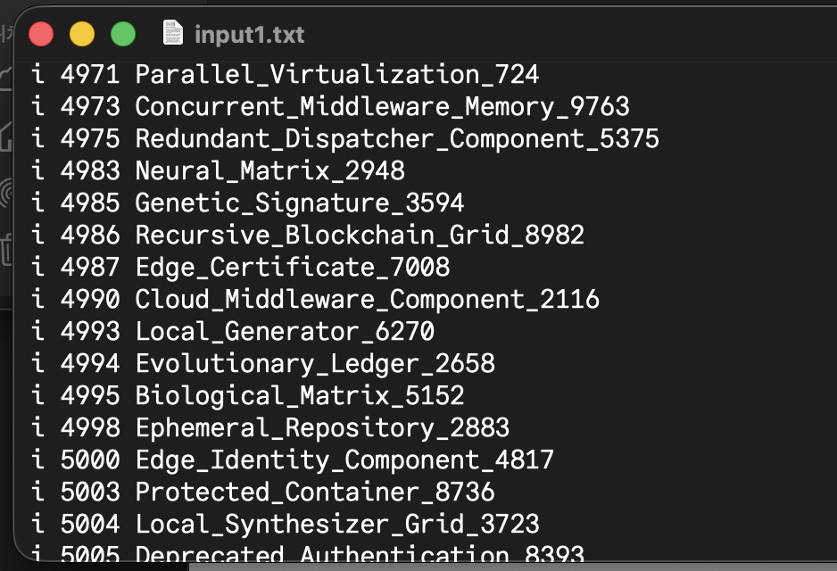
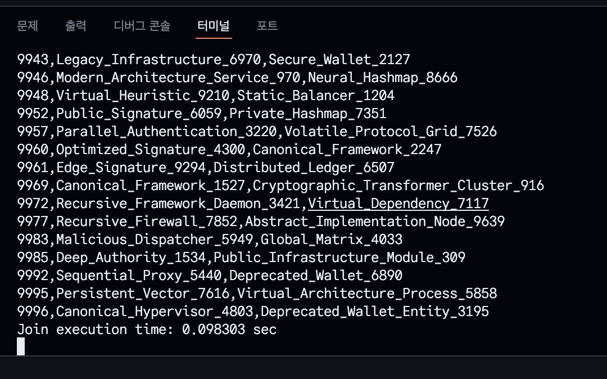

# Assignment 4: Implementation of Natural join on $B^+$-Tree
### 2021024057 김병준

## 1. Design
- 본 과제의 목표는 $B^+$-tree index 구조로 저장된 두 개의 데이터 테이블(Table 1, Table 2)에 대하여 Natural join 연산을 수행하는 알고리즘을 구현하는 것입니다. 각 테이블의 레코드는 `<Key, Value>` 쌍으로 구성되며, Key는 8-byte의 정수(`int64_t`), Value는 최대 120-byte의 문자열으로 주어졌습니다. 명세에 따라 Key는 중복되지 않는 Unique key로 가정합니다.
- 효율적인 join 연산을 구현하기 위해 다음과 같은 알고리즘적 사고 과정을 거쳤습니다.

### 1.1. Naive Approach: Nested loop join
- 가장 직관적인(naive한) 방법으로는 이중 반복문을 사용하는 것을 떠올려볼 수 있을 것입니다.
  - 동작: Table 1(Outer relation)의 모든 tuple을 순차적으로 스캔하면서, 각 tuple의 Key 값을 기준으로 Table 2(Inner relation)의 모든 tuple을 처음부터 끝까지 스캔하여 매칭되는지 확인합니다.
  - 분석: 이 방식은 두 테이블의 레코드 수가 각각 $N, M$일 때, $O(N \times M)$의 시간복잡도를 갖습니다. 이에 따라 데이터의 크기가 커질수록 성능이 기하급수적으로 저하될 것이므로, 본 과제와 같이 대용량 처리를 가정할 수 있는 시스템에서는 부적합할 것이라고  판단하였습니다.

### 1.2. Optimization Candidate: Sort-Merge join
- join 성능을 개선하기 위한 또 다른 접근법은 두 테이블을 Key 값을 기준으로 sort한 후 merge하는 것입니다.
  - 동작: Quick sort와 같이 (기존에 효율적이라고) 알려져 있는 알고리즘들을 사용하여 메모리 내에 불러온 두 테이블을 정렬합니다. 정렬된 두 테이블에 각각 포인터를 두고, Key 값을 비교하며 포인터를 이동시키는 방식으로 한 번의 스캔만으로 join을 완료할 수 있는 idea입니다.
  - 분석: 정렬 과정에 $O(N \log N + M \log M)$이 소요되며, 이후 병합 과정은 $O(N + M)$이 소요됩니다. 하지만 본 과제에서는 메모리 사용량이 `4 MiB`로 제한되어 있습니다. 전체 데이터를 메모리에 적재하여 정렬하는 것은 불가능하며, External merge sort 등을 고려해야 하므로 구현 복잡도와 디스크 I/O의 비용이 증가할 우려가 있습니다.

### 1.3. Final Design: $B^+$-Tree Based Merge Join
- 본 과제의 데이터 파일은 이미 $B^+$-tree 구조로 관리되고 있다는 점을 고려하였습니다.
- $B^+$-tree의 leaf node들은 Key 순서대로 정렬되어 있으며, linked list 형태로 서로 연결되어 있습니다. 이는 별도의 정렬 과정 없이도 이미 데이터가 sorted state라는 것을 의미합니다. 따라서 최종적으로 다음과 같은 최적화된 설계를 도출할 수 있었습니다.

1. Access Pattern: 각 $B^+$-tree의 가장 leftmost인 leaf page부터 접근을 시작합니다.
2. Two-Pointer strategy: 두 테이블의 현재 레코드를 가리키는 커서(Cursor)를 유지하며, 두 Key 값을 비교합니다.
    - `Key1 == Key2`인 경우: 두 Key가 일치하므로 join 결과를 출력하고, 두 커서를 모두 다음 레코드로 이동합니다.
    - `Key1 < Key2`인 경우: Table 1의 Key가 작으므로, Table 1의 커서를 다음으로 이동하여 더 큰 Key를 탐색합니다.
    - `Key1 > Key2`인 경우: Table 2의 Key가 작으므로, Table 2의 커서를 다음으로 이동합니다.
3. Page Traversal: 현재 leaf page의 모든 레코드를 탐색하면, `Right Sibling Page Number`를 참조하여 다음 leaf page를 디스크에서 load합니다.

#### 결론
- 이 설계를 통해 별도의 정렬 비용 없이 $O(N + M)$의 시간복잡도로 효율적인 natural join을 수행할 수 있을 것입니다.
- 또한, 한 번에 필요한 leaf page만 메모리에 적재하므로 `4 MiB` 메모리 제약 조건을 충분히 준수할 수 있습니다.

## 2. Implement
- 앞에서 설계한 알고리즘을 바탕으로 기존의 single 테이블 처리 구조를 확장하여 두 개의 테이블을 동시에 처리할 수 있도록 구현하였습니다.

### 2.1. Global Variable & Structure Extension
- 두 개의 테이블을 동시에 불러올 수 있도록 하기 위해 전역 변수를 하나씩 추가하였습니다. 기존의 단일 `fd`, `hp`(Header Page), `rt`(Root Page) 변수 외에 두 번째 테이블을 위한 변수들을 추가로 선언하여 독립적인 파일 접근이 가능하도록 하였습니다.

```c
// Global variables for handling two tables
H_P *hp, *hp2;          // Header pages
page *rt = NULL, *rt2 = NULL; // Root pages
int fd = -1, fd2 = -1;  // File descriptors
```

### 2.2. Modification of `open_table`
- 기존의 `open_table` 함수는 하나의 경로만 입력받았으나, join 연산을 위해서는 두 개의 파일 경로가 필요할 것입니다.. 이를 위해 기존 logic을 `open_single_table`이라는 내부 함수로 분리하고, 새로운 `open_table` 함수는 이를 두 번 호출하는 wrapper와 같은 형태로 재구현하였습니다.
  - `open_single_table`: 단일 DB 파일을 열고 fd, header, root 정보를 설정합니다.
  - `open_table`: 두 개의 경로(`pathname1`, `pathname2`)를 입력받아 각각 `open_single_table`을 호출하고, 두 호출의 결과값을 합산하여 반환함으로써 예외 상황을 전파합니다.

```c
int open_table(char * pathname1, char * pathname2) {
    int ret1 = open_single_table(pathname1, &fd, &hp, &rt);
    int ret2 = open_single_table(pathname2, &fd2, &hp2, &rt2);

    return ret1 + ret2;
}
```

### 2.3. Analysis of Existing API Modification
- 이제, 기존에 구현된 `db_find`, `db_insert`, `db_delete` 함수의 수정 필요성에 대해 검토해보도록 하겠습니다.
  - 현재 구조에서 `open_table`을 통해 두 개의 테이블을 열더라도, 기존의 `insert`, `delete`, `find` 함수들은 전역 변수로 선언된 첫 번째 테이블(`fd`, `rt` 등)을 대상으로 동작하도록 설계되어 있습니다. 이에 따라서 table 2에 대한 조작이 불가능하다는 한계점이 존재합니다.
  - 하지만 본 과제의 명세는 두 테이블 간의 join 연산 구현에 있으며, 다중 테이블에 대한 동시 트랜잭션 처리나 관리는 과제의 범위와 무관한 내용일 것입니다.
  - Join 알고리즘은 read-only 방식으로만 index 구조를 순회하는 방식이므로 기존 함수들의 수정 없이도 충분히 구현이 가능합니다.

### 2.4. Implementation of `db_join`

- 핵심 logic에 해당하는 `db_join` 함수는 다음과 같은 순서로 동작합니다.

1. 두 테이블 중 하나라도 비어있는 경우(`rpo == 0`), join 결과는 공집합일 것이므로 즉시 함수를 종료하여 불필요한 추가적인 연산을 방지합니다. (성능 향상을 위한 조치)
    ```c
    H_P * hp, * hp2; //header page is declared as global

    page * rt = NULL, * rt2 = NULL; //root is declared as global

    int fd = -1, fd2 = -1; //fd is declared as global
    ```
2. Initialization: `find_leaf` logic을 활용하여 각 $B^+$-tree의 가장 왼쪽 leaf page를 찾아 메모리에 load합니다.
3. Merge loop: 두 leaf page의 레코드를 순회하는 `while` 루프를 실행합니다.
    - 현재 가리키고 있는 두 레코드의 Key(`key1`, `key2`)를 비교합니다.
    - Match (`key1 == key2`): `printf`를 통해 `key, value1, value2` 형식으로 결과를 출력합니다. Key는 Unique 하므로 두 인덱스(`idx1`, `idx2`)를 모두 증가시킵니다.
    - Compare (`key1 < key2`): Table 1의 현재 Key가 작으므로, `idx1`을 증가시켜 Table 1에서 더 큰 Key를 찾습니다.
    - Compare (`key1 > key2`): Table 2의 현재 Key가 작으므로, `idx2`를 증가시킵니다.
    ```c
        // 현재 가리키고 있는 key값 각각 불러오기
        int64_t key1 = p1->records[idx1].key;
        int64_t key2 = p2->records[idx2].key;

        // Key 비교 및 join
        if (key1 == key2) {
            // 출력 형식에 따라서  출력
            printf("%lld,%s,%s\n", key1, p1->records[idx1].value, p2->records[idx2].value);
            
            // Unique Key이기 때문에, 둘 다 다음으로 이동
            idx1++;
            idx2++;
        }
        else if (key1 < key2) {
            // Table 1의 키가 작으면 Table 1의 포인터를 증가
            idx1++;
        }
        else {
            // Table 2의 키가 작으면 Table 2 포인터 증가
            idx2++;
        }
    ```
4. Page Transition: 인덱스가 현재 Page의 레코드 수를 초과하면, 해당 Page의 `right_sibling`의 offset을 확인합니다.
    - `right_sibling`이 0이 아니면 해당 페이지를 `load_page` 함수로 읽어오고 인덱스를 0으로 초기화합니다.
    - `right_sibling`이 0이면(마지막 Page), 탐색을 종료합니다.
5. Memory Release: 사용이 끝난 Page 메모리를 `free`하여 자원 누수를 방지합니다.
    ```c
        if (p1 != NULL) free(p1);
        if (p2 != NULL) free(p2);
    ```
- 이 구현은 디스크 I/O를 최소화하고, 필요한 시점에만 page를 로딩하는 on-demand 방식을 따르고 있습니다.

## 3. Result
- 구현된 join 기능의 정확성과 성능을 검증하기 위해 수행한 테스트에 대해서 다루고자 합니다.

### 3.1. Test Environment Setup
- 대량의 데이터를 통한 검증을 위해 Python 스크립트를 작성하여 테스트 케이스를 생성하였습니다.
  - Data Generation: 1부터 10,000까지의 범위를 갖는 Key와 랜덤한 String Value를 포함하는 두 개의 입력 파일(`input1.txt`, `input2.txt`)을 생성했습니다. 두 파일은 일부 Key가 겹치도록 설정하여 join 결과가 명확히 나타나도록 했습니다.



### 3.2. Execution Procedure

- 현재 `db_insert` 기능은 단일 파일에 대해서만 삽입이 가능한 상태이므로(추가적으로 변경하지 않았으므로), 다음과 같이 다소 우회적인 방법으로 두 개의 DB 파일을 구축하도록 하였습니다.

  1. `input1.txt`를 이용하여 `test1.db`에 데이터를 insert한다.
  2. 생성된 `test1.db`의 파일명을 `test2.db`로 변경한다.
  3. 프로그램을 재실행하여 빈 `test1.db`를 생성하고, `input2.txt`를 이용하여 데이터를 삽입한다.
  4. 결과적으로 `test1.db`와 `test2.db` 두 개의 완성된 $B^+$-tree 파일을 확보하였다.

### 3.3. Verification

- 구축된 두 DB에 대해 `j` (Join) 명령어를 수행하도록 합니다.
- 터미널 출력 결과를 확인한 결과, Key 값이 일치하는 튜플들에 대해서만 정확하게 `Key, Value1, Value2` 형식이 출력됨을 확인하였습니다.
- $O(N+M)$ 알고리즘이 적용되어, 약 1만 건 이상의 데이터에 대해서도 큰 지연 없이 즉각적인 결과가 도출되었습니다.



## 4. Troubleshooting
- 구현 과정에서 중대한 어려움은 없었습니다.
- 하지만 test 과정에서 다음과 같은 착오가 발생한 과정을 상세히 작성하고자 합니다.

### 4.1. Issue: Misinterpretation of Memory Usage

#### 4.1.1. 문제 상황
```sh
...
996,variable,ethernet
997,quince,key
999,node,quince
Join execution time: 0.000866 sec
Memory usage: 1277952 KB
Warning: Memory Limit Exceeded! (Limit: 4096 KB)
```
- 과제의 핵심 제약 사항인 "메모리 사용량 1 MiB 이하"를 준수하는지 확인하기 위해 로컬 환경(macOS)에서 메모리 사용량을 모니터링하였습니다. 테스트 도중 프로세스의 메모리 사용량이 예상했던 것보다 훨씬 큰 수치로 확인되어, 메모리 leak이 발생했거나 page 관리에 문제가 있는 것이라고 판단(오해)하여 혼란을 겪었습니다.

#### 4.1.2. 해결 과정

1. `valgrind`를 사용할 수 없는 macOS 환경이라 시스템 모니터와 터미널 명령어를 통해 확인했습니다.
2. 원인을 분석하던 중, macOS의 일부 메모리 모니터링 도구가 메모리 단위를 `KB`가 아닌 `Bytes` 단위로, 혹은 Page 단위로 다르게 표시할 수 있다는 점을 인지하였습니다.
3. 단위를 보정하여 다시 계산해본 결과, 실제 사용량은 허용 범위인 `4 MiB` 이내임을 확인하였습니다.
4. 또한, `db_join` 함수 내에서 `malloc`으로 할당한 `page` 구조체들이 루프 종료 후 또는 함수 리턴 전에 올바르게 `free` 되는지 코드를 재검토하여 안전성을 확보했습니다.

#### 4.1.3. 결론
- 메모리 수치 해석의 오류였으며, 실제 구현된 $B^+$-tree 기반 join 알고리즘은 필요한 페이지만을 메모리에 적재하므로 메모리 제약 조건을 충분히 만족하고 있음을 확인하였습니다.