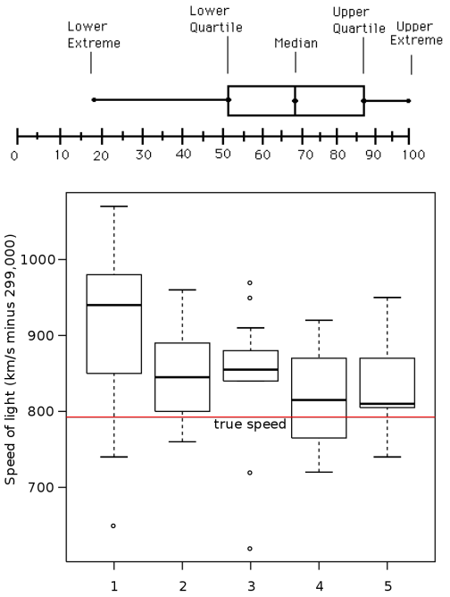
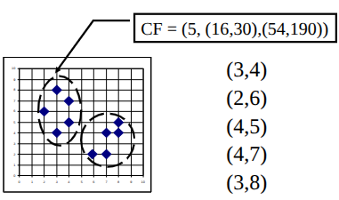
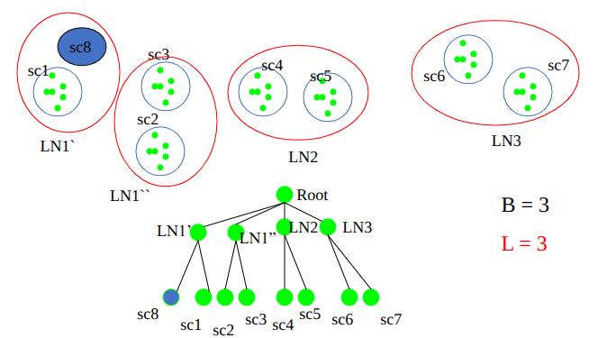
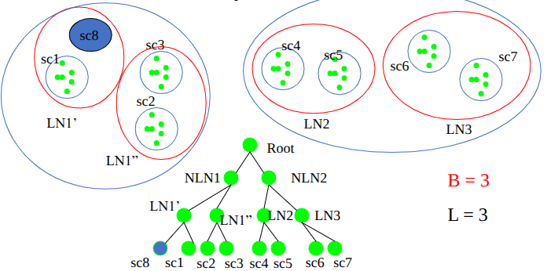

# 데이터사이언스 - Final

## 1. Data analysis and pre-processing

### 1.1. Mean / Median & Interpolation

| | 장점 | 단점
| - | - | -
| Mean | fast | outlier-sensitive
| Median | robust | sort-needed

- Median Interpolation
$$\text{median} = L_1 + \left(\frac{n/2 - \text{freq}_l}{\text{freq}_\text{median}}\right) \times \text{width}$$

### 1.2. Boxplot


- Five-number summary: Minimum, Q1, Median, Q3, Maximum
- The ends of the box are at Q1 and Q3 → height of the box is IQR
- The median is marked by a line within the box
- Whiskers: two lines outside the box extended to Minimum and Maximum
- Outliers: points beyond a specified outlier threshold, plotted individually

### 1.3. Binary Features Measure

|  | $j = 1$ | $j = 0$
| - | - | -
| $i = 1$ | q | r
| $i = 0$ | s | t

- Symmetric: $d(i,j) = \dfrac{r+s}{q+r+s+t}$

- Asymmetric: $d(i,j) = \dfrac{r+s}{q+r+s}$

- Example
  | | Fever | Cough | Test-1 | Test-2 | Test-3 | Test-4 
  | - | - | - | - | - | - | - 
  | Jack | $1$ | $0$ | $1$ | $0$ | $0$ | $0$ 
  | Mary | $1$ | $0$ | $1$ | $0$ | $1$ | $0$ 
  | Jim | $1$ | $1$ | $0$ | $0$ | $0$ | $0$ 

- Y, P → 1 / N → 0

$$d(\text{Jack},~ \text{Mary}):~ q=2,~ r=0,~ s=1,~ t=3 \Rightarrow d = \dfrac{0+1}{2+0+1} = \dfrac{1}{3} \approx 0.33$$

$$d(\text{Jack},~ \text{Jim}):~ q=1,~ r=1,~ s=1,~ t=3 \Rightarrow d = \dfrac{1+1}{1+1+1} = \dfrac{2}{3} \approx 0.67$$

$$d(\text{Jim},~ \text{Mary}):~ q=1,~ r=1,~ s=2,~ t=2 \Rightarrow d = \dfrac{1+2}{1+1+2} = \dfrac{3}{4} = 0.75$$

### 1.4. Minkowski Distance

- 기본 공식
  $$d(i,j) = \left(\sum_{f=1}^{p}|x_{if}-x_{jf}|^h\right)^{1/h}$$
- $h = 1$: Manhattan (L1)
  $$\sum|x_{if}-x_{jf}|$$
- $h = 2$: Euclidean (L2)
  $$\sqrt{\sum|x_{if}-x_{jf}|^2}$$
- $h \to \infty$: Supremum (L∞)
  - maximum difference between any component
  $$d(i,j) = \lim_{h \to \infty} \left(\sum_{f=1}^{p} |x_{if} - x_{jf}|^h\right)^{\frac{1}{h}} = \max_{f}^{p} |x_{if} - x_{jf}|$$

### 1.5. Normalization

- Min-Max
  $$v' = \dfrac{v - \min_A}{\max_A - \min_A}(\text{new\_max}_A - \text{new\_min}_A) + \text{new\_min}_A$$
  - Ex. $\dfrac{73600 - 12000}{98000 - 12000}(1.0 - 0) + 0 = 0.716$

- Z-score
  $$v' = \dfrac{v - \bar{A}}{\sigma_A}$$
  - Ex. $\dfrac{73600 - 54000}{16000} = 1.225$

- Decimal scaling: $v' = \dfrac{v}{10^j}$ where j is the smallest integer such that $\max(|v'|) < 1$

## 2. Clustering

### 2.1. K-Means Clustering

- Centroid
$$\mathbf{c}_k = \frac{\sum_{i=1}^{N}t_{ik}}{N}$$
- Radius
$$R_k = \sqrt{\frac{\sum_{i=1}^{N}(t_{ik}-c_k)^2}{N}}$$
- Diameter
$$D_k = \sqrt{\frac{\sum_{i=1}^{N}\sum_{j=i+1}^{N}(t_{ik}-t_{jk})^2}{N(N-1)/2}}$$

- Distance between Clusters (Linkage)
  | Method | Formula 
  | - | -
  | Single link | $dis(K_i, K_j) = \min(t_{ip}, t_{jq})$ 
  | Complete link | $dis(K_i, K_j) = \max(t_{ip}, t_{jq})$ 
  | Average | $dis(K_i, K_j) = \text{avg}(t_{ip}, t_{jq})$ 
  | Centroid | $dis(K_i, K_j) = dis(c_i, c_j)$ 
  | Medoid | $dis(K_i, K_j) = dis(M_i, M_j)$ 

- 장점: relatively efficient
  - $O(n \cdot k \cdot t)$
- 단점
  - Need to specify $k$
  - Unable to handle noises and outliers
  - Not suitable to discover clusters with non-convex shapes

### 2.2. K-Medoids / PAM

- Medoid: the most centrally-located real object in a cluster
  - less influenced by outliers than centroid.

- Swapping Cost $C_{jih}$
  - i: original seed / h: new seed / t: other seed / j: non-seed

| Case | Scenario | $C_{jih}$ 
| - | - | - 
| A | $j$ belonged to $i$, now belongs to $h$ | $d(j,h) - d(j,i)$ 
| B | $j$ belonged to $t$, still belongs to $t$ | $0$ 
| C | $j$ belonged to $i$, now belongs to $t$ | $d(j,t) - d(j,i)$ 
| D | $j$ belonged to $t$, now belongs to $h$ | $d(j,h) - d(j,t)$ 

$$TC_{ih} = \sum_j C_{jih}$$
$$\text{Swap accepted if } TC_{ih} < 0$$

- **PAM 장단점**
  - 장점: More robust than k-means in the presence of noise and outliers
  - 단점: Does not scale well for large data sets (Not Scalable)
    - $O(i \cdot k \cdot (n-k)^2)$

### 2.3. BIRCH

Points: $(3,4), (2,6), (4,5), (4,7), (3,8)$

$$CF = (n,\ LS,\ SS)$$
$$n\text{: number of points}$$
$$LS = \sum X_i$$
$$SS = \sum X_i^2$$




$$n = 5,\quad LS = (16,\ 30),\quad SS = (54,\ 190) \quad\Rightarrow\quad \mathbf{CF = (5,\ (16,\ 30),\ (54,\ 190))}$$

### 2.4. DBSCAN

- **Point Types**
  - Core: $|N_\varepsilon(p)| \ge \text{MinPts}$
  - Border: $|N_\varepsilon(p)| < \text{MinPts}$ within $\varepsilon$, but is in the neighborhood of a core point
  - Noise: neither core nor border

- **Density Reachability**
  - **Directly density-reachable**: $q \in N_\varepsilon(p)$ AND $p$ is a core point (asymmetric)
  - **Density-reachable**: chain $p_1 \to p_2 \to \cdots \to p_n$ where each step is directly density-reachable

- Pseudocode
  - DB: Database
  - $ε$: Radius
  - minPts: Density threshold
  - dist: Distance function
  - Data: label (Point Labels, initially undefined)

```pseudocode
foreach point p in database DB do             // Iterate over every point
    if label(p) ≠ undefined then continue     // Skip processed points
    Neighbors N ← RANGEQUERY(DB, dist, p, ε)  // Find initial neighbors
    if |N| < minPts then                      // Non-core points are noise
        label(p) ← Noise
        continue
    c ← next cluster label                    // Start a new cluster
    label(p) ← c
    Seed set S ← N \ {p}                      // Expand neighborhood
    foreach q in S do
        if label(q) = Noise then label(q) ← c
        if label(q) ≠ undefined then continue
        Neighbors N ← RANGEQUERY(DB, dist, q, ε)
        label(q) ← c
        if |N| < minPts then continue         // Core-point check
        S ← S ∪ N
```

- 장점
  - clusters can have arbitrary shape
  - number of clusters determined automatically
  - can separate noise
- 단점
  - input parameters may be difficult to determine
  - sensitive to parameter settings

## 3. Recommender Systems

### 3.1. KNN — Rating Prediction

- Simple average
  $$r_{u,i} = \frac{1}{|N|}\sum_{u'\in N}r_{u',i}$$
- Weighted average
  $$r_{u,i} = \frac{1}{k}\sum_{u'\in N}sim(u,u')\times r_{u',i}$$
- Bias-corrected
  $$r_{u,i} = \bar{r}_u + \frac{1}{k}\sum_{u'\in N}sim(u,u')\times(r_{u',i}-\bar{r}_{u'})$$