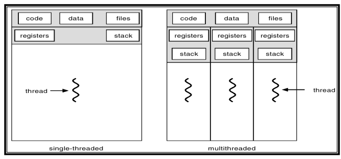
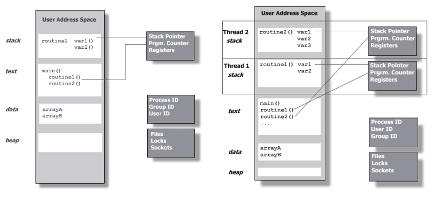
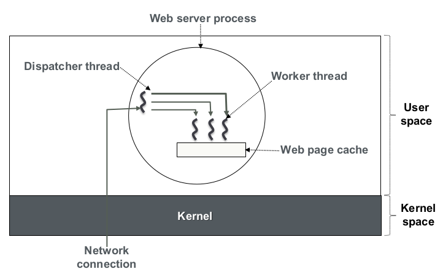
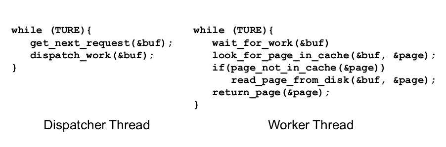
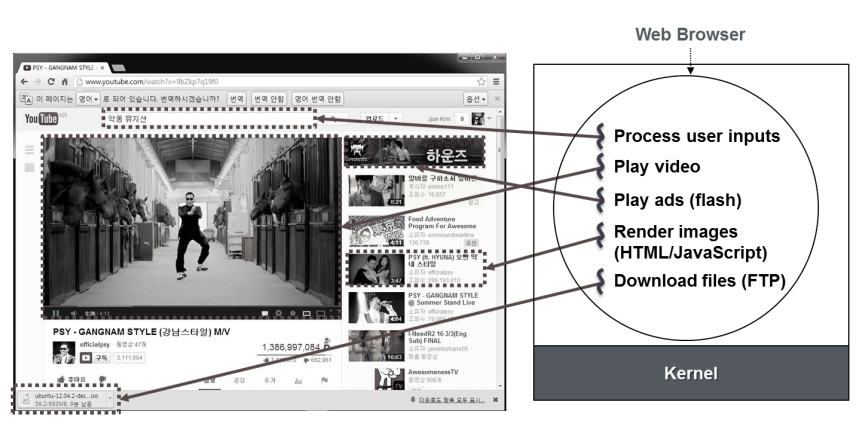
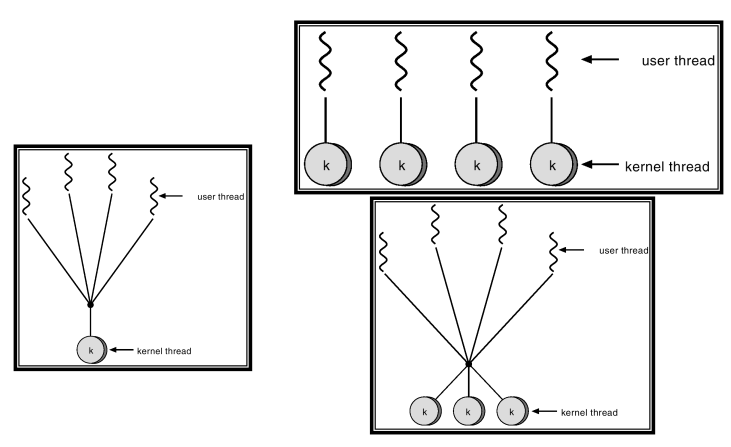
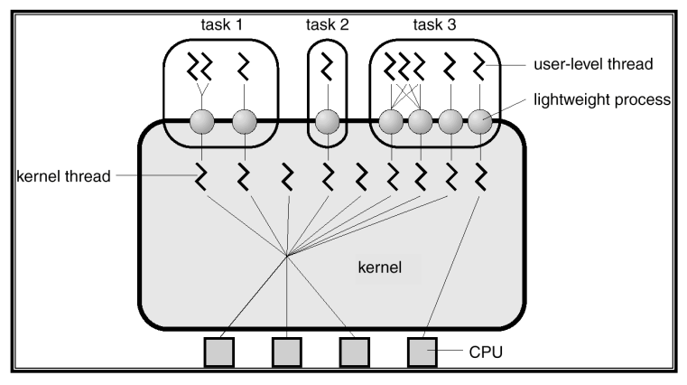
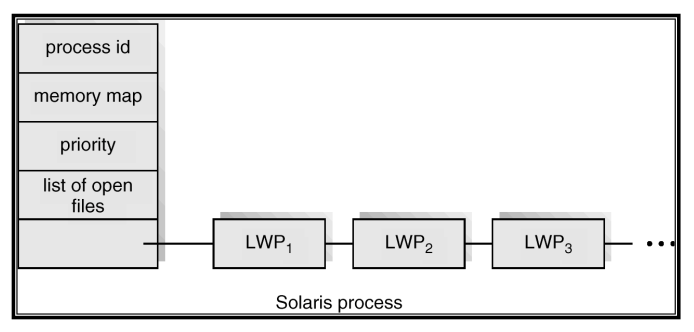

# 4. Threads

## 다루는 주제
- A. 스레드 개념
- B. 멀티스레딩 모델
- C. 스레딩 관련 이슈
- D. 사례

# A. 스레드 개념

## 개념
- 스레드는 흔히 경량 프로세스(lightweight process)라 불림
  - 실행의 단위 (스케줄링의 단위)
  - 최소한의 자원만을 필요로 
  - 전통적인 프로세스는 중량 프로세스(heavyweight process)라 불림



## 프로세스 vs. 스레드
- 프로세스
  - 실행 단위 (스케줄링 단위)
  - 완전한 자원 소유권을 가짐
    - 주소 공간과 프로세서 컨텍스트(context) 보유
    - 자원(파일, I/O 장치 등)에 대한 제어권 보유
- 스레드
  - 실행 단위 (스케줄링 단위)
  - 실행에 필요한 최소한의 자원만을 필요로 
    - private 스택(private stack) 공간과 프로세서 컨텍스트 보유
    - 프로세스의 다른 자원들을 공유

## 단일 스레드 vs. 멀티 스레드 애플리케이션


## 스레드 예제 – 생성과 종료

```c
#include <pthread.h>
#include <stdio.h>
#define NUM_THREADS 5

void *PrintHello(void *threadid) {
    printf("\n%d: Hello World!\n", threadid);
    pthread_exit(NULL);
}

int main (int argc, char *argv[]) {
    pthread_t threads[NUM_THREADS];
    int rc, t;
    for(t=0; t < NUM_THREADS; t++){
        printf("Creating thread %d\n", t);
        rc = pthread_create(&threads[t], NULL, PrintHello, (void *)t);
        if (rc){
            printf("ERROR; return code is %d\n", rc);
            exit(-1);
        }
    }
    pthread_exit(NULL);
}

```

```c
int
pthread_create (pthread_t *thread_id,
                const pthread_attr_t *attr,
                void *(*thread_function)(void *),
                void *arg);
```

- `pthread_create` 함수 분석
1. `thread_id` 인자를 통해 새로운 스레드 ID를 반환
2. `attr` 파라미터는 스레드 속성을 설정하는 데 사용됨 (기본값은 NULL)
3. `thread_func`는 스레드가 생성된 후 실행할 C 루틴임
4. `arg`를 통해 `start_routine`에 단일 인자를 전달할 수 있음

## Pthreads APIs
- `pthread_t pthread_self()`: 자신의 스레드 ID를 가져옴
- `int pthread_equal(pthread_t t1, pthread_t t2)`: 두 스레드 ID를 비교
- `int pthread_join(pthread_t thread, void status_ptr)`: 다른 스레드가 종료될 때까지 대기
- `int pthread_detach(pthread_t thread)`: 스레드가 종료될 때 할당된 자원을 즉시 회수할 수 있음을 나타냄 (분리된 스레드는 join될 수 없음)

## 스레드의 실행 특성
- 스레드는 실행 상태(실행 중, 준비, 대기)를 가짐
- 스레드 문맥 교환(context switching)이 필요
- 프로세스의 주소 공간(코드 및 데이터)과 자원을 공유
- 한 스레드가 전역 변수를 수정하면 프로세스 내 다른 모든 스레드가 변경 사항을 확인 가능
- 한 스레드가 연 파일은 다른 스레드에서도 사용 가능

## Thread Private Data
- 스택에 저장되는 변수는 스레드 private 데이터임
  - 함수로 전달되는 파라미터 역시 스레드 private 데이터에 해당
    ```c
    double func( double a )
    {
      double b;
    ...
    ```
- 변수 a와 b는 각 스레드에 대해 독립적임

## 스레드 로컬 변수 (Thread Local Variables)
- 모든 루틴에서 접근 가능한 전역 데이터이나, 각 스레드는 데이터의 독립적인 사본만을 가짐
    ```c
    __thread void * mydata;

    void * threadFunction( void * param )
    {
      mydata = param;
    ...
    ```
- `mydata` 변수는 스레드에 로컬하므로, 각 스레드는 해당 변수에 대해 서로 다른 값을 가질 수 있음

## 이점 Benefits
- 응답성 (Responsiveness)
  - 프로그램의 일부가 차단(block)되어도 계속 실행 가능
- 자원 공유 (Resource sharing)
  - 메모리와 자원을 공유
- 경제성 (Economy)
  - 생성 및 문맥 교환 비용이 저렴
- 멀티프로세서 아키텍처 활용
  - 멀티스레드 프로세스로 병렬성 증대 가능
- 동시성 프로그래밍 모델 제공

## 예시: 웹 서버를 위한 멀티스레딩

- 디스패처 스레드(Dispatcher Thread): 요청을 받아 작업 스레드에 전달
- 작업 스레드(Worker Thread): 실제 요청을 처리(캐시 확인, 디스크 읽기 등)



### Processes, Threads, and Tasks
- 태스크의 용어적 정의
  - 운영체제에서 흔히 사용되는 전문 용어는 아님
  - 하지만 많은 사람들이 실행 단위(unit of execution) 또는 스케줄링 단위(unit of scheduling)를 의미하는 용어로 "태스크"를 사용함
- 사용 맥락
  - 하위 운영체제에서 스레드를 지원하는지 여부와 관계없이 사용됨
  - 운영체제가 스레드를 지원할 경우 스레드를 의미할 수 있음
  - 운영체제가 스레드를 지원하지 않을 경우 프로세스를 의미할 수 있음

# B. 멀티스레딩 모델

## 사용자 스레드 (User Threads)
- 사용자 수준의 스레드 라이브러리에 의해 관리됨
  - 커널의 지원 없이 운영됨
- 장점: 생성 및 관리가 빠름 (커널 개입 없음)
- 단점: 커널이 단일 스레드 방식일 경우, 하나의 사용자 스레드가 시스템 콜로 차단되면 프로세스 전체가 차단됨
- 사례: POSIX Pthreads, Mach C-threads

## 커널 스레드 (Kernel Threads)
- 커널에 의해 직접 지원됨
- 커널이 커널 공간에서 스레드 생성, 스케줄링, 관리를 수행
- 사용자 스레드보다 생성 및 관리가 느림
- 사례: Windows, Solaris, Linux 등

## 멀티스레딩 모델의 종류

- 다대일(Many-to-One): 여러 사용자 스레드가 하나의 커널 스레드에 매핑됨 (커널 스레드 미지원 시스템에서 사용)
- 일대일(One-to-One): 각 사용자 스레드가 개별 커널 스레드에 매핑됨 (Windows, OS/2 등)
- 다대다(Many-to-Many): 여러 사용자 스레드가 그보다 적거나 같은 수의 커널 스레드에 매핑됨 (Solaris 2 등)

# C. 스레딩 관련 이슈

## fork() 시스템 콜의 의미
- 한 스레드가 `fork()`를 호출할 경우 두 가지 가능성이 존재
  - 새 프로세스가 모든 스레드를 복제
  - 새 프로세스가 단일 스레드로 생성됨
- 많은 시스템이 두 가지 변형된 `fork()`를 모두 제공하여 절충

## 기타 시스템 콜 관련 이슈
- 프로세스 내 모든 스레드는 파일 디스크립터 집합을 공유
- 한 스레드가 파일을 닫는 도중 다른 스레드가 읽거나 쓰는 상황에 대한 파일 잠금 프로토콜이 필요
- 공통 주소 공간을 공유
- `mmap`, `brk`와 같은 시스템 콜을 통한 동시 수정 시 스레드 안전(thread-safe)을 보장해야

## 스택 오버플로우 (Stack Overflow)
- UNIX 프로세스 스택 오버플로우 시 커널이 이를 감지하고 자동 확장
- 사용자 스레드의 경우 커널이 사용자 스택 정보를 알지 못
- 사용자 스레드 라이브러리가 스택 끝에 쓰기 방지 페이지를 할당하여 보호
- 오버플로우 발생 시 보호 오류가 발생하고 커널이 SIGSEGV 신호를 해당 스레드에 보냄

## 스레드 풀 (Thread Pool)
- 프로세스 시작 시 미리 일정 수의 스레드를 생성하여 풀에 저장
- 요청 발생 시 풀에서 스레드를 깨워 할당하고, 작업 완료 후 다시 풀로 반환
- 장점: 새 스레드 생성보다 처리가 빠르며, 시스템이 지원 가능한 스레드 수를 제한할 수 있음
- 웹 서버 멀티스레딩에 유용

# D. 사례

## Solaris 2 스레드
- 커널 및 사용자 수준 모두에서 스레드 지원
- 사용자 스레드와 커널 스레드 사이에 경량 프로세스(LWP)가 존재
- LWP는 커널이 지원하는 사용자 스레드이며, 프로세스는 최소 하나 이상의 LWP를 포함

- 커널 수준 스레드
  - LWP와 연결되거나 커널 자체 작업을 위해 존재하며, 시스템 내에서 유일한 스케줄링 대상
- 사용자 수준 스레드
  - 바운드(Bound): 특정 LWP에 영구적으로 연결됨 (빠른 응답이 필요한 실시간 앱용)
  - 언바운드(Unbound): 기본값으로, 가용한 LWP 풀에 멀티플렉싱되어 실행됨

## Solaris Process
