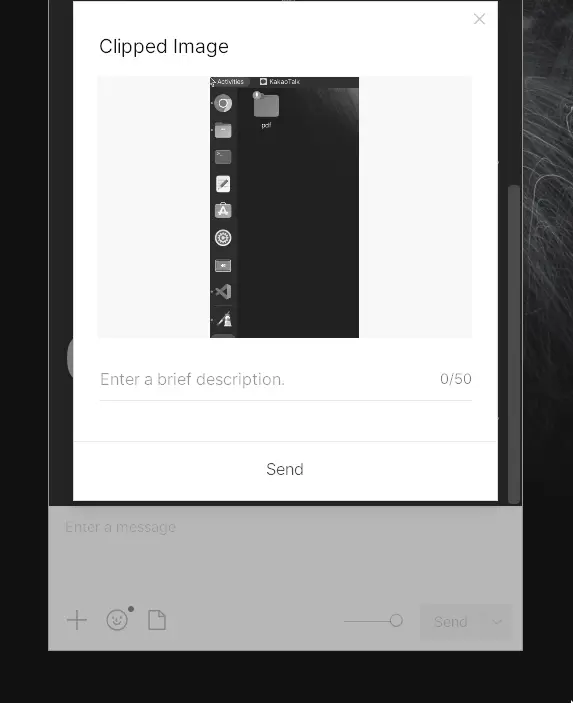

# Wayland 스크린샷 카카오톡(Wine) 붙여넣기 완벽 해결법

:::info
Ubuntu 26.04 LTS  
wine 11.0
:::

> *핵심 아이디어: Wine 기반 카카오톡은 **BMP 포맷**만 클립보드 인식이 가능합니다.*

리눅스(GNOME Wayland) 환경에서 캡처한 이미지가 카카오톡에 붙여넣기(Ctrl+V) 되지 않아 당황하셨나요? 

Wine 위에서 돌아가는 카카오톡은 구조적으로 **PNG를 인식하지 못하고 오직 BMP 형식만 받아들입니다.** 이를 해결하기 위해 캡처와 동시에 파일을 저장하고, 클립보드에 BMP 데이터를 주입하는 최적의 명령어를 공유합니다.

### 1. 핵심 기능
- **Wine 카카오톡 호환성 확보**: 클립보드에 BMP 데이터를 강제로 쏴주어 카톡 복붙 문제를 원천 해결합니다.
- **Wayland 지연 시간 해결**: `wl-paste`를 연동하여 데이터 유실 없는 안정적인 캡처가 가능합니다.
- **자동 백업**: 별도 저장 버튼 없이도 `Pictures/Screenshots` 폴더에 PNG 파일이 자동 저장됩니다.
- **Flameshot 순정 상태 유지**: 도구 설정 변경 없이 명령어 한 줄로 모든 기능을 수행합니다.

### 2. 사전 준비
터미널에서 아래 패키지들을 먼저 설치해 주세요.

```bash
sudo apt install flameshot wl-clipboard imagemagick copyq
```

### 3. 최종 명령어 (단축키 등록용)
설정(Settings) -> 키보드(Keyboard) -> 단축키(Shortcuts)에 아래 명령어를 등록하세요.

```bash
sh -c 'flameshot gui; dir="$HOME/Pictures/Screenshots"; mkdir -p "$dir"; f="$dir/screenshot_$(date +%Y%m%d_%H%M%S).png"; wl-paste -t image/png | magick png:- "$f" && [ -s "$f" ] && magick "$f" bmp:- | copyq copy image/x-MS-bmp -'
```

### 4. 왜 이 명령어를 써야 합니까?
- **카카오톡은 왜 안 붙여넣어졌을까?**: Wine 환경의 카카오톡은 클립보드에서 `.PNG` 형식을 찾지 못합니다. 이 명령어는 `magick`과 `copyq`를 이용해 **`image/x-MS-bmp`** 타입을 생성하여 카톡이 바로 인식하도록 만듭니다.
- **`magick`의 역할**: 단순히 파일만 저장하는 게 아니라, 캡처된 데이터를 실시간으로 변환하여 확장자를 다양하게 쏴주는 엔진 역할을 합니다.
- **`wl-paste` 활용**: Wayland 환경에서 발생하는 클립보드 호출 오류를 방지하는 핵심 장치입니다.


> *이제 캡처 후 바로 카카오톡 대화창에서 `Ctrl+V`를 눌러보세요.*  
> ***깔끔하게 전송**되는 것을 확인하실 수 있습니다.*