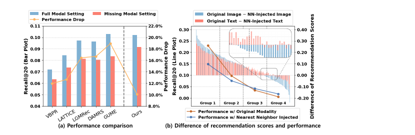
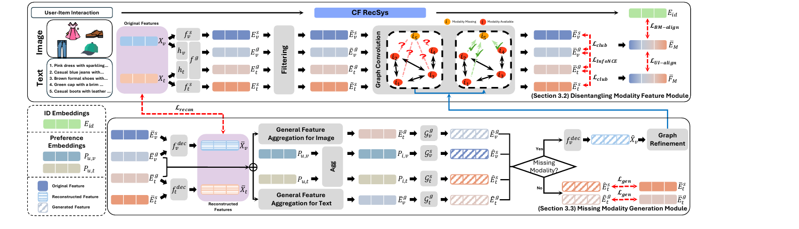
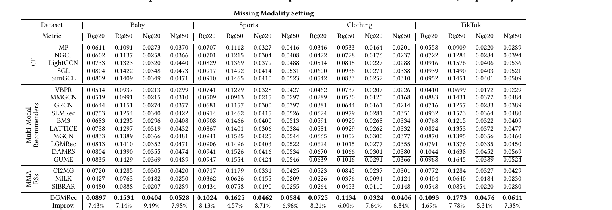
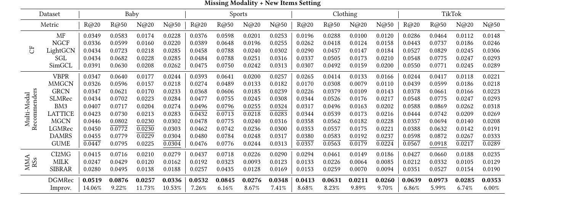
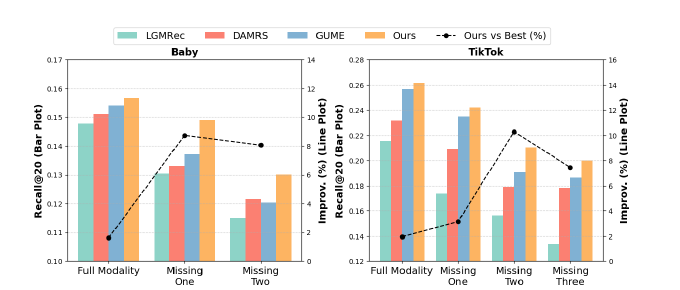
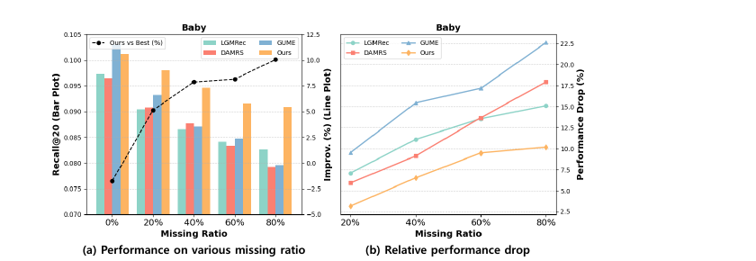
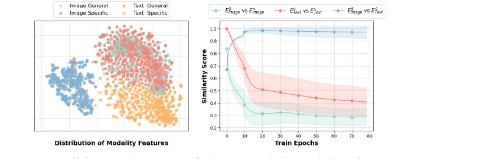
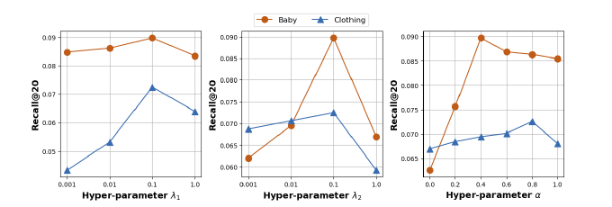

# Disentangling and Generating Modalities for Recommendation in Missing Modality Scenarios

**Jiwan Kim** — KAIST, Daejeon, Republic of Korea · kim.jiwan@kaist.ac.kr 
**Hongseok Kang** — KAIST, Daejeon, Republic of Korea · ghdtjr0311@kaist.ac.kr 
**Sein Kim** — KAIST, Daejeon, Republic of Korea · rlatpdlsgns@kaist.ac.kr 
**Kibum Kim** — KAIST, Daejeon, Republic of Korea · kb.kim@kaist.ac.kr 
**Chanyoung Park** *(Corresponding author)* — KAIST, Daejeon, Republic of Korea · cy.park@kaist.ac.kr

*SIGIR '25, July 13–18, 2025, Padua, Italy* 
ACM ISBN 979-8-4007-1592-1/2025/07 
https://doi.org/10.1145/3726302.3729953

## Abstract

Multi-modal 추천 시스템(MRS)은 이미지, 텍스트, 오디오 등 다양한 modality를 활용하여 개인화를 향상시키는 데 뚜렷한 성과를 거두었습니다. 그러나 두 가지 중요한 과제가 충분히 해결되지 않은 채로 남아 있습니다. (1) modality 결측 시나리오에 대한 불충분한 고려, (2) modality 특징의 고유한 특성에 대한 간과입니다. 이러한 과제들은 modality가 결측된 현실적인 상황에서 심각한 성능 저하를 초래합니다. 이 문제들을 해결하기 위해 modality 결측 시나리오에 특화된 새로운 프레임워크인 Disentangling and Generating Modality Recommender (DGMRec)를 제안합니다. DGMRec은 정보 기반 관점에서 modality 특징을 일반(general) 특징과 특수(specific) 특징으로 분리하여 추천을 위한 더 풍부한 표현을 가능하게 합니다. 이를 기반으로, 다른 modality의 정렬된 특징을 통합하고 사용자 modality 선호도를 활용하여 missing modality 특징을 생성합니다. 광범위한 실험을 통해 DGMRec이 modality 결측 및 새로운 아이템 설정, 다양한 결측 비율, 다양한 수준의 missing modality를 포함한 어려운 시나리오에서 최신 MRS들을 일관되게 능가함을 보였습니다. 또한 DGMRec의 생성 기반 접근 방식은 기존 MRS에서는 적용할 수 없었던 cross-modal retrieval을 가능하게 하여, 실제 응용에 대한 적응성과 잠재력을 보여줍니다. 코드는 https://github.com/ptkjw1997/DGMRec 에서 확인할 수 있습니다.

**CCS Concepts:** Information systems → Recommender systems

**Keywords:** Multi-modal Recommender Systems; Missing Modalities; Collaborative Filtering; Feature Disentanglement

## 1. Introduction

최근 Amazon, Alibaba 같은 e-commerce 플랫폼과 YouTube, TikTok 같은 소셜 미디어 서비스는 일상생활의 필수 요소가 되었습니다. 이들의 추천 시스템은 사용자 행동과 의사결정을 형성하는 데 중추적인 역할을 합니다. 특히 Matrix Factorization (MF)이나 Graph Neural Networks (GNNs) 같은 Collaborative Filtering (CF)을 활용한 전통적인 방법들은 개인화된 추천을 성공적으로 제공하여 고객과 기업 모두에게 점점 더 중요해지고 있습니다.

CF 모델이 효과적임을 입증했음에도 불구하고, 이들은 여전히 사용자 피드백의 내재적 희소성에 의해 제약을 받습니다. 이를 해결하기 위해 이미지, 텍스트, 오디오 등 다양한 modality의 통합이 유망한 해결책으로 떠올랐으며, 피드백 부족을 보완하고 전통적인 CF 접근 방식에 비해 사용자 선호도를 더 깊이 이해할 수 있게 합니다. 이로 인해 CF 모델만으로는 달성할 수 없는 풍부한 의미 표현을 도출하고 아이템 간 관계를 파악하기 위해 multi-modal 콘텐츠를 활용하는 multi-modal 추천 시스템(MRS)의 발전이 이루어졌습니다.

MRS가 효과성을 입증했음에도 불구하고, 몇 가지 실질적인 과제들이 충분히 해결되지 않은 채로 남아 있습니다.

**C1. Modality 결측 시나리오가 충분히 다루어지지 않았습니다** 기존 MRS들은 일반적으로 아이템의 모든 modality 특징이 항상 완전히 사용 가능하다고 가정합니다. 그러나 실제 산업 환경에서는 아이템의 일부 또는 전체 modality 특징이 결측될 수 있습니다. 구체적으로, MRS에 관한 기존 연구들은 modality 결측 시나리오를 처리하기 위해 주로 두 가지 방식 중 하나를 사용합니다. 첫째는 학습 데이터셋에서 missing modality 특징을 가진 아이템을 단순히 제외하는 것이고, 둘째는 missing modality에 합성 특징을 주입하는 것입니다(예: modality의 전역 평균 또는 최근접 이웃 평균(NN) 사용). 주입 방법이 효과적인 것으로 나타났지만, 여전히 modality 결측 시나리오에서 상당한 성능 저하가 발생합니다. Figure 1(a)에서, 모든 modality 특징이 사용 가능하다고 가정하는 여러 MRS의 성능을 Amazon Baby 데이터셋에서 모든 modality가 사용 가능한 경우와 일부 modality가 무작위로 결측된 경우의 두 가지 시나리오에서 비교했습니다. 이러한 단순한 주입 방식도 missing modality가 있는 경우 상당한 성능 저하를 경험한다는 것을 확인했습니다.

NN 주입 방법이 modality 결측 하에서 성능 저하를 방지하지 못하는 이유를 조사하기 위해, 최근 MRS인 LGMRec에 대한 영향을 분석했습니다. Figure 1(b)에서, 아이템이 모든 modality 특징을 포함하는 시나리오와 특정 modality 특징(이미지 또는 텍스트)이 결측된 시나리오 간 긍정적 user-item 쌍의 추천 점수 차이를 계산하고 내림차순으로 정렬했습니다. 또한 긍정적 user-item 쌍을 정렬된 차이에 따라 네 그룹으로 나누고 각 그룹에 대한 추천 성능을 평가했습니다. 추천 점수의 차이가 클수록 modality 결측 하에서 추천 성능의 저하가 더 심각하다는 것을 관찰했습니다. 추천 점수의 차이는 NN 주입 특징이 원래 modality를 얼마나 잘 포착하는지를 나타내므로(값이 작을수록 좋음), 이 결과는 낮은 추천 성능이 NN 주입 특징이 원래 modality를 성공적으로 대체하지 못한 데서 비롯된다는 것을 시사합니다. 아이템 modality 특징에 크게 의존하는 최신 SOTA MRS에서는 modality 결측으로 인한 성능 저하가 더욱 악화됩니다.

**Figure 1: (a) missing modality가 존재할 때 최근 MRS들의 성능 저하. (b) modality가 존재하는 경우(Original Image/Text)와 modality가 결측된 경우(NN-Injected Image/Text) 두 조건 하에서 모델의 추천 점수 차이. 선 그래프는 LGMRec [6]의 성능을 나타냅니다**

**C2. Modality의 고유한 특성이 간과되었습니다** 기존 MRS들은 일반적으로 동일한 아이템의 다양한 modality 특징이 본질적으로 의미론을 공유한다고 가정하면서 아이템의 서로 다른 modality를 직접 정렬하는 것을 목표로 합니다. 그러나 이 가정이 항상 성립하는 것은 아닙니다. 구체적으로, 이미지 modality는 색상과 스타일 같은 시각적 속성을 포착하여 아이템의 유형적이고 심미적인 측면을 강조하는 경향이 있습니다. 반면에 텍스트 modality는 설명적이고 맥락적인 정보를 전달하여 기능적 속성이나 배경 세부 사항을 강조합니다. 이는 각 modality가 다른 modality로는 완전히 포착될 수 없는 고유한 modality별 정보를 포함하고 있음을 나타냅니다. 이런 이유로 기존 연구들에서처럼 아이템의 서로 다른 modality를 직접 정렬하는 것은 이러한 뚜렷한 특성을 설명하지 못하여 고품질 아이템 표현 개발을 방해합니다.

실제로 LGMRec이 modality별 정보를 포착하지 못하는 것은 Figure 1(b)에서 빨간색과 파란색 막대의 부호가 반대인 Group 3과 4의 추천 점수 차이를 자세히 살펴보면 관찰할 수 있습니다. 부호가 반대인 빨간색과 파란색 막대를 가진 아이템들은 LGMRec이 텍스트와 이미지 modality의 고유한 특성을 설명하지 못한 것들이라고 주장합니다. 더 정확히 말하면, 주입된 특징은 모든 아이템이 공통으로 공유하는 특징으로 볼 수 있으므로, 추천 점수의 차이는 공통으로 공유된 특징을 설명한 후 아이템에 남아 있는 뚜렷한 modality별 정보로 해석될 수 있습니다. 이 관점에서, 텍스트에서 관찰된 양의 차이(빨간색 막대)는 텍스트에 남아 있는 정보가 모델의 예측에 유익하다는 것을 나타내는 반면, 이미지의 음의 차이(파란색 막대)는 이미지에 남아 있는 정보가 덜 도움이 되거나 심지어 예측을 방해할 수 있음을 시사합니다. 하나의 아이템에서 나타나는 이러한 대조는 텍스트와 이미지 modality가 제공하는 modality별 정보가 상당히 다르기 때문에 발생합니다. 이러한 관찰은 각 modality가 다른 modality와 공유되지도 정렬되지도 않는 고유한 정보를 포함하고 있음을 강조합니다. 따라서 이러한 경우에 modality 간 정렬을 강제하는 것은 각 modality의 고유한 기여를 모호하게 하고 추천 성능에 악영향을 미칠 수 있습니다.

modality 결측이라는 현실적인 과제를 해결하기 위한 missing modality aware 추천 시스템(MMA-RS)에 대한 연구가 있었지만, 이러한 접근 방식들은 주로 missing modality를 가진 아이템을 처리할 때 모델의 견고성에 초점을 맞춥니다. 그러나 missing modality를 그 불완전한 상태로 사용하기 때문에, 이러한 방법들은 각 modality에 내재된 고유한 특성을 활용하지 못합니다. 또한 주로 콘텐츠 기반 접근 방식에 의존하기 때문에, 일반적인 성능 면에서 기존 CF 방법보다 낮은 성능을 보이는 경향이 있어, 실제 세계의 과제를 처리하려는 노력에도 불구하고 실용적 적용 가능성이 제한됩니다.

MRS와 MMA-RS의 내재적 한계를 극복하기 위해, missing modality 특징 처리와 modality의 공통 및 고유 특성 추출이라는 과제를 효과적으로 해결하는 새로운 모델 Disentangling and Generating Modality Recommender (DGMRec)를 제안합니다.

**C1에 대한 해결:** missing modality 특징을 처리하기 위해 DGMRec은 오토인코더 아키텍처를 사용하여 아이템의 modality 특징을 실제와 유사하게 재구성하고, 아이템의 뚜렷한 속성을 보존합니다. missing modality가 있는 아이템의 경우, DGMRec은 두 가지 지식 소스를 활용하여 modality 특징을 생성합니다. 다른 사용 가능한 modality의 정렬된 특징과 상호작용한 사용자의 modality 선호도입니다. 생성된 특징을 사용하여 DGMRec은 item-item 그래프를 강화하고, missing modality가 존재할 때 기존 모델들이 포착하기 어려웠던 더 견고하고 풍부한 의미론적 관계를 달성합니다.

**C2에 대한 해결:** 공통 및 고유 modality 특징을 추출하기 위해 DGMRec은 별도의 인코더를 사용하여 일반 및 특수 modality 특징을 도출합니다. 또한 단일 modality 내에서 일반 및 특수 특징을 분리하는 동시에 서로 다른 modality에 걸쳐 공유된 특성을 학습하기 위한 두 가지 정보 기반 손실 함수를 적용합니다.

이 두 가지 과제는 modality 속성의 분리가 아이템을 정확하게 표현하기 위한 특징 생성의 품질에 직접적인 영향을 미치기 때문에 밀접하게 연결되어 있습니다.

본 논문의 기여를 요약하면 다음과 같습니다.

- 현재 MRS의 modality 결측 시나리오에서의 심각한 성능 저하를 식별하고 분석하여, 단순한 주입 방법의 부적절함을 한계로 지적합니다.
- 아이템의 뚜렷한 특성을 활용하여 missing modality를 재구성하는 견고한 생성 기반 접근 방식을 제안하여, DGMRec이 다양한 실제 시나리오에서 우수한 성능을 달성할 수 있게 합니다.
- 제안된 세밀한 missing modality 특징 생성은 DGMRec이 cross-modal retrieval과 같은 추가 작업을 수행할 수 있게 하여 결측 시나리오에서 사용자 행동을 지원합니다. 이는 기존 추천 시스템에서는 달성할 수 없는 기능입니다.
- 상호 정보의 관점에서 일반 및 특수 modality 특징을 분리하고 학습하는 새로운 접근 방식을 도입합니다.

## 2. Related Works

### 2.1 Multi-modal Recommender Systems

Multi-modal 추천 시스템(MRS)은 다양한 방식으로 multi-modal 콘텐츠를 활용합니다. 첫째로 특징을 직접 활용하는 특징 기반 접근 방식이 광범위하게 연구되었습니다. 예를 들어, VBPR은 시각 특징을 ID 임베딩과 직접 통합합니다. 마찬가지로 SLMRec, GRCN, MMGCN 등의 방법은 graph convolution networks (GCNs)를 사용하여 modality 지식과 CF 지식을 통합합니다. BM3은 자기지도 학습을 위해 modality의 대조적 뷰를 활용하고, LGMRec은 modality 특징 추출에서 전역 및 지역 지식의 학습을 균형 있게 조율하기 위해 하이퍼그래프와 지역 그래프를 모두 활용하는 하이브리드 접근 방식을 채택합니다. 반면에 LATTICE, MICRO, FREEDOM, DAMRS와 같은 그래프 기반 접근 방식은 특징을 직접 활용하기보다 modality 특징을 기반으로 아이템 간 관계를 파악하는 데 집중합니다. 최근에는 두 전략을 결합한 하이브리드 접근 방식도 등장했습니다. GUME와 MGCN은 modality 특징과 item-item 그래프를 동시에 활용합니다.

이러한 MRS들은 multi-modal 정렬로부터 상당한 이점을 얻었습니다. 그러나 기존 방법들은 modality 간의 관계를 완전히 무시하거나 직접 정렬에만 의존하여 modality 간 공유 정보를 추출합니다. 그 결과, 서로 다른 modality에 내재된 고유한 정보가 종종 간과되고 학습되지 않은 채로 남습니다. 일부 최근 연구들은 아이템의 질적 표현을 위한 고유 modality 특징의 중요성을 강조하고 다른 도메인에서 직교 학습 방법을 채택했습니다. 그러나 그들의 단순한 접근 방식인 modality 특징의 평균을 공통성으로 취하고 이를 고유 특징에 대한 modality 특징으로 대체하는 방법은 정보적 관점에서 충분한 논리적 근거를 결여하고 있습니다.

### 2.2 Missing Modality-Aware Recommender Systems

대부분의 기존 MRS는 모든 modality가 사용 가능하고 완전하다고 가정하지만, 이는 실제 응용에서는 드문 경우입니다. missing modality aware 추천 시스템(MMA-RS)은 두 가지 일반적인 시나리오를 고려하여 이러한 과제를 해결합니다. 하나는 modality에서 일부 특징 값이 결측된 불완전한 modality이고, 다른 하나는 전체 modality를 사용할 수 없는 missing modality입니다. MILK와 SIBRAR은 missing modality를 직접 처리하지 않고 견고한 추천을 하기 위해 각각 불변 학습과 단일 분기 네트워크를 활용하여 missing modality를 처리합니다. 대안적으로, 어떤 특징이 missing modality에 대한 효과적인 대체물 역할을 할 수 있는지를 조사하면서 모델 아키텍처는 거의 변경하지 않는 연구도 있습니다. 그러나 대부분의 MMA-RS 방법들은 콘텐츠 기반 아키텍처로 인해 CF 지식을 효과적으로 포착하지 못할 뿐만 아니라, 각 modality의 고유한 특성에 대한 충분한 고려가 결여된 단순한 접근 방식에 의존하여 전반적인 성능이 최적화되지 못합니다. 이 점에서, 우리의 동기와 가장 일치하는 연구는 CI2MG로, 이는 missing modality를 생성하기 위해 하이퍼그래프와 optimal transport (OT)를 활용합니다. 그러나 CI2MG는 OT 계산에서 상당한 계산 비용이 발생하고 OT 프로세스와 다른 추천 모듈 간의 통합이 부족합니다.

## 3. Methodology

아이템의 뚜렷한 특성을 반영하여 missing modality를 정확하게 생성하려면 modality의 일반(공유) 및 특수(고유) 특징을 모두 고려하는 것이 필수적입니다. 이를 위해 별도의 인코더를 사용하여 일반 및 특수 특징을 추출하는 Disentangling Modality Feature 모듈(Section 3.2)을 제안합니다. 또한 이러한 특징들을 분리하고 modality 전반에 걸쳐 일반 특징의 정렬을 보장하기 위한 정보 기반 손실을 도입합니다.

이어서, modality 결측이 있는 경우 의미 있는 modality 표현을 추출하고 item-item 그래프를 구성하기 위해, 아이템의 뚜렷한 특성을 세밀한 방식으로 포착하는 일반 및 특수 특징을 생성하고 이 생성된 특징을 사용하여 item-item 그래프를 적응적으로 정제하는 Missing Modality Generation 모듈(Section 3.3)을 제안합니다.

마지막으로, modality 특징은 의미론적 콘텐츠를 포착하는 데 효과적이지만 추천 작업에 필수적인 협업 지식이 부족합니다. 이를 완화하기 위해 사용자 표현과 아이템 표현을 연결하여 collaborative filtering과 modality 특징을 연결하는 두 가지 추가 정렬 방법(Section 3.4)을 도입합니다.

### 3.1 Preliminaries

$U$와 $I$를 각각 사용자와 아이템의 집합으로 표기하며, $|U|$와 $|I|$는 각각 사용자와 아이템의 수를 나타냅니다. User-Item 상호작용 행렬은 $R \in \mathbb{R}^{|U| \times |I|}$로 정의됩니다. 각 아이템의 modality 특징은 사전 학습된 모델(이미지는 CNN 모델, 텍스트는 SBERT)을 사용하여 추출되고 $X_m \in \mathbb{R}^{|I| \times d_m}$으로 표현되며, missing modality 특징은 평균값으로 초기화됩니다. 사용자와 아이템의 ID 임베딩은 $E_\text{id} \in \mathbb{R}^{(|U|+|I|) \times d}$로 정의됩니다.$^2$ $N_i$는 아이템 $i$와 상호작용한 사용자 집합을 나타내고, $N_u$는 사용자 $u$가 상호작용한 아이템 집합을 나타냅니다.

> $^2$ 표기의 명확성과 일관성을 위해 행렬은 대문자, 벡터는 소문자로 표기합니다 (예: $e_{i,id}$는 $i$번째 아이템의 ID 임베딩 벡터, $e_{u,id}$는 $u$번째 사용자의 ID 임베딩 벡터를 나타내며, $i,j$는 아이템을, $u,v$는 사용자를 인덱싱합니다).

**Figure 2: DGMRec 프레임워크 개요. Disentangling Modality Feature 모듈과 Missing Modality Generation 모듈로 구성됩니다. Missing Modality Generation 모듈에서는 아이템이 텍스트 modality는 갖고 있고 이미지 modality는 결측된 경우를 예시로 보여줍니다**

### 3.2 Disentangling Modality Feature Module

기존 MRS들은 modality 특징을 직접 정렬하거나 modality 전반에 걸쳐 인접 뷰를 결합하여 modality의 고유한 특성을 모호하게 합니다. 이를 해결하기 위해 인코더 함수를 사용하여 각 modality로부터 두 가지 유형의 특징, 즉 일반 특징과 특수 특징을 추출합니다(Section 3.2.1). 이러한 특징들은 GCN 기반 item-item 그래프와 정보 기반 분리를 통해 더욱 정제됩니다(Section 3.2.2).

#### 3.2.1 Extracting Modality Features

각 modality $m$에 대해 일반 특징 $E^g_m$과 특수 특징 $E^s_m$을 추출하기 위해, 완전 연결 레이어로 구성된 두 개의 별도 인코더를 사용합니다. 공통 속성을 추출하기 위해 모든 modality에 걸쳐 파라미터를 공유하는 일반 인코더 $f^g$와 각 modality $m$에 특화된 특수 인코더 $f^s_m$입니다.

$$
E^g_m = f^g(h_m(X_m)), \quad E^s_m = f^s_m(X_m) \tag{1}
$$

여기서 일반 인코더 $f^g : \mathbb{R}^d \to \mathbb{R}^d$는 modality 전반에 걸쳐 파라미터를 공유하여 공통 속성을 추출하는 반면, 특수 인코더 $f^s_m : \mathbb{R}^{d_m} \to \mathbb{R}^d$는 각 modality m의 고유한 특성을 포착하기 위해 독립적인 파라미터를 사용합니다. 또한 $X_m$은 modality 전반에 걸쳐 서로 다른 차원을 갖기 때문에, 각 modality를 통일된 차원으로 투영하기 위한 또 다른 완전 연결 레이어 $h_m : \mathbb{R}^{d_m} \to \mathbb{R}^d$를 사용합니다.

아울러 사용자 modality 선호도를 더욱 효과적으로 포착하기 위해 사용자에 대한 Modality Preference Embedding 행렬 $P_{u,m} \in \mathbb{R}^{|U| \times d}$를 도입합니다. 이는 아이템의 modality 선호도 행렬 $P_{i,m} \in \mathbb{R}^{|I| \times d}$를 계산하는 데 다음과 같이 사용됩니다.

$$
p_{i,m} = \frac{1}{|N_i|} \sum_{u \in N_i} p_{u,m} \tag{2}
$$

여기서 $p_{u,m} \in \mathbb{R}^d$와 $p_{i,m} \in \mathbb{R}^d$는 각각 사용자 $u$와 아이템 $i$의 modality 선호도 임베딩입니다. 이 아이템 선호도 임베딩 행렬 $P_{i,m}$은 상호작용한 사용자의 modality 선호도를 포함하므로, 이를 사용하여 modality 특징을 다음과 같이 사용자 선호도와 정렬합니다.

$$
\tilde{E}_m = E_m \odot \sigma(P_{i,m}) \tag{3}
$$

여기서 $\odot$는 원소별 곱(element-wise product)이고 $\sigma$는 시그모이드 함수입니다. 노이즈 제거된 특징 $\tilde{E}_m$이 사용자 선호도와 관련된 정보를 유지하여 추천을 개선할 것으로 기대합니다.

노이즈 제거된 modality 특징은 이후 item-item 그래프를 사용한 GCN을 통해 강화됩니다. 구체적으로, 아이템 modality 특징 $X_m$의 유사도 점수를 기반으로 상위 $k$개의 유사 아이템으로 인접 행렬 $S^m$을 구성하며, $S^m$은 다음과 같이 계산됩니다.

$$
S^m_{i,j} = \frac{(x_{i,m})^\top x_{j,m}}{\|x_{i,m}\|\|x_{j,m}\|} \tag{4}
$$

백본 GCN으로는 계산적 단순성과 광범위한 채택으로 인해 LightGCN을 다음과 같이 활용합니다.

$$
\bar{E}^{(l)}_m = S^m \cdot \bar{E}^{(l-1)}_m, \quad \text{where } \bar{E}^{(0)}_m = \tilde{E}_m \text{ and } \bar{E}_m = \bar{E}^{(L)}_m \tag{5}
$$

여기서 $\bar{E}^{(l)}_m \in \mathbb{R}^{|I| \times d}$는 그래프 컨볼루션의 $l$번째 레이어에서의 modality 특징을 나타내고, $L$은 레이어의 수입니다. 마지막 $L$번째 레이어의 표현을 아이템의 modality 특징으로 사용함에 유의합니다. 마지막으로, 아이템의 최종 modality 특징 행렬 $\bar{E}^{(L)}_m$이 주어지면, 사용자가 상호작용한 아이템의 modality 특징을 집계하여 사용자 modality 특징 행렬 $\bar{F}_m \in \mathbb{R}^{|U| \times d}$를 다음과 같이 계산합니다.

$$
\bar{f}_{u,m} = \frac{1}{|N_u|} \sum_{i \in N_u} \bar{e}_{i,m} \tag{6}
$$

#### 3.2.2 Disentangling Modality Features

일반 및 특수 특징에 대한 인코더를 분리하는 것만으로는 효과적인 분리를 달성하기에 불충분합니다. 따라서 두 가지 대조 손실을 활용하는 정보 기반 접근 방식을 도입합니다. 하나는 단일 modality 내에서 일반 및 특수 특징 간의 상호 정보를 줄이고, 다른 하나는 여러 modality에 걸쳐 일반 특징 간의 상호 정보를 향상시킵니다.

**동일한 modality 내에서 일반 및 특수 특징 간의 상호 정보를 최소화하기 위해,** 조건부 분포 p(·|·)를 추정하기 위해 파라미터 $\varphi$를 가진 변분 분포 $q_\varphi(\cdot|\cdot)$를 사용하는 샘플 기반 접근 방식인 Contrastive Log-ratio Upper Bound (CLUB)을 적용합니다. $q_\varphi$는 2층 MLP로 구성됩니다.

$$
L_\text{club} = \sum_{i,m} \left[ \log q_\varphi(\bar{e}^g_{i,m} | \bar{e}^s_{i,m}) - \frac{1}{|I|} \sum_{j \in I} \log q_\varphi(\bar{e}^g_{j,m} | \bar{e}^s_{i,m}) \right] \tag{7}
$$

$L_\text{club}$은 $\bar{E}^g_m$과 $\bar{E}^s_m$ 간의 상호 정보의 상한을 근사합니다. $L_\text{club}$을 다른 모델 파라미터와 함께 반복적으로 최소화하여, modality의 일반 및 특수 특징이 상호 보완적인 정보를 갖도록 장려합니다.

**서로 다른 modality의 일반 특징 간의 상호 정보를 최대화하기 위해,** 상호 정보의 음의 하한을 근사하는 InfoNCE 손실을 채택합니다.

$$
L_\text{InfoNCE} = \sum_{i \in I} -\log \frac{\exp(\bar{e}^g_{i,m} \cdot \bar{e}^g_{i,m'})}{\sum_{j \in I} \exp(\bar{e}^g_{i,m} \cdot \bar{e}^g_{j,m'})} \tag{8}
$$

InfoNCE는 서로 다른 modality의 일반 특징들(즉, 서로 다른 modality $m, m'$에 대한 $\bar{E}^g_m$과 $\bar{E}^g_{m'}$)을 동일한 잠재 공간으로 매핑하여 효과적으로 정렬합니다. 따라서 InfoNCE 손실을 최소화하면 상호 정보의 하한이 최대화되어 여러 modality의 일반 특징 간의 더 나은 정렬이 보장됩니다.

분리를 위한 최종 손실은 아래와 같습니다.

$$
L_\text{disentangle} = L_\text{club} + L_\text{InfoNCE} \tag{9}
$$

요약하면, $L_\text{disentangle}$이 하나의 modality 내에서 일반 및 특수 특징을 효과적으로 분리하는 동시에 서로 다른 modality에 걸쳐 일반 특징을 정렬할 것으로 기대합니다. 이러한 손실들은 잘 정렬된 modality를 유지하고 그 고유한 특성을 보존하면서 missing modality 표현을 생성하기 위한 cross-modality 정보 활용을 가능하게 합니다.

### 3.3 Missing Modality Generation Module

Section 3.2에서 논의한 바와 같이, modality 특징은 정보 기반 접근 방식을 사용하여 일반 및 특수 구성 요소로 분리됩니다. 이렇게 잘 분리된 특징을 기반으로, 원시 modality 특징을 정확하게 재구성하기 위해 디코더를 학습합니다(Section 3.3.1). 그런 다음 DGMRec은 아이템의 뚜렷한 특성을 세밀한 방식으로 포착하는 일반 및 특수 특징을 생성합니다(Section 3.3.2). 이러한 생성된 특징은 원시 modality 특징을 생성하고 item-item 그래프를 정제하는 데 활용되어 missing modality로 인한 불안정성을 해결합니다(Section 3.3.3).

#### 3.3.1 Modality Feature Reconstruction

각 modality $m$에 대해 일반 특징 $\bar{E}^g_m$과 특수 특징 $\bar{E}^s_m$을 사용하여 modality의 원시 특징 $X_m$을 다음과 같이 재구성하는 추가적인 디코더 $f^\text{dec}_m : \mathbb{R}^d \to \mathbb{R}^{d_m}$을 적용합니다.

$$
\bar{X}_m = f^\text{dec}_m(\bar{E}^g_m \oplus \bar{E}^s_m) \tag{10}
$$

여기서 $\oplus$는 연결(concatenation) 연산을 나타냅니다. 재구성 과정은 원시 modality 특징 $X_m$과 재구성된 modality 특징 $\bar{X}_m$ 사이의 재구성 손실 $L_\text{recon}$에 의해 안내됩니다.

$$
L_\text{recon} = \sum_{i \in I} MSE(x_{i,m}, \bar{x}_{i,m}) \tag{11}
$$

여기서 $MSE$는 평균 제곱 오차 손실입니다. 이를 통해 재구성된 특징이 원시 특징과 유사하도록 보장하여 DGMRec이 학습된 $\bar{E}^g_m$과 $\bar{E}^s_m$을 활용하여 missing modality에 대한 특징을 정확하게 생성할 수 있도록 합니다. 즉, 분리된 특징 $\bar{E}^g_m$과 $\bar{E}^s_m$은 단순히 의미 없는 분리 표현이 아니라 $\bar{X}_m$을 정확하게 재구성하기 위한 의미 있는 modality 정보를 유지합니다.

#### 3.3.2 Missing Modality Generation

missing modality를 처리하기 위해서는 일반 및 특수 특징을 별도로 효과적으로 생성하는 것이 필수적입니다. 이 두 특징은 동일한 modality에서 유래하지만 근본적으로 다른 특성을 가지므로 생성을 위한 별개의 접근 방식이 필요합니다.

일반 특징 $\hat{E}^g_m$을 생성하기 위해, Eq. 8의 $L_\text{InfoNCE}$에 의해 정렬된 다른 modality $m'$의 원래 일반 특징 $\bar{E}^g_{m'}$을 활용합니다. 이러한 특징을 직접 사용하면 불안정할 수 있으므로, 각 modality $m$에 대해 2층 MLP로 구성된 일반 특징 생성기 $G^g_m$을 도입하여 다음과 같이 일반 특징을 생성합니다.

$$
\hat{E}^g_m = G^g_m\Big(\bigoplus_{m'} \bar{E}^g_{m'}\Big) \tag{12}
$$

여기서 $\bigoplus$는 사용 가능한 모든 modality $m'$에 걸쳐 적용되는 연결 연산을 나타냅니다. 입력 modality $m'$도 결측된 경우(즉, 두 개 이상의 modality가 결측된 경우)에는 연결된 벡터가 missing modality의 수에 관계없이 일관된 차원을 유지하도록 modality 특징의 평균을 사용합니다.

특수 특징 $\hat{E}^s_m$을 생성하기 위해서는 다른 modality의 정보를 활용할 수 없습니다. 대신, Eq. 3에서 보이듯이 아이템의 modality 특징과 정렬된 사용자 modality 선호도를 활용합니다. 아이템의 modality별 지식은 해당 아이템과 연관된 모든 사용자의 modality 선호도 내에 암묵적으로 포착되어 있으므로, 각 modality에 대해 2층 MLP로 구성된 특수 특징 생성기 $G^s_m$이 이 정보를 사용하여 각 아이템의 특수 특징을 다음과 같이 생성합니다.

$$
\hat{E}^s_m = G^s_m(P_{i,m}) \tag{13}
$$

생성된 특징이 modality의 원래 정보를 보존하도록 보장하기 위해, 원래 특징($\bar{E}^g_m$, $\bar{E}^s_m$)과 생성된 특징($\hat{E}^g_m$, $\hat{E}^s_m$)을 가능한 한 유사하게 만드는 생성 손실 $L_\text{gen}$을 다음과 같이 도입합니다.

$$
L_\text{gen} = \sum_{i \in I} \Big( MSE(\bar{e}^g_{i,m}, \hat{e}^g_{i,m}) + MSE(\bar{e}^s_{i,m}, \hat{e}^s_{i,m}) \Big) \tag{14}
$$

중요하게도, 재구성 및 생성 관련 손실($L_\text{recon}$과 $L_\text{gen}$)은 사용 가능한 modality가 있는 아이템에 대해서만 계산되어 missing modality 아이템이 학습 과정을 방해하는 것을 방지합니다.

#### 3.3.3 Refining Item-Item Graph via Generated Features

하이퍼파라미터(즉, 매 `5` epoch마다)에 의해 결정된 일정한 간격으로, DGMRec은 missing modality가 있는 아이템에 대한 특징을 생성합니다. 생성된 $\hat{E}^g_m$과 $\hat{E}^s_m$은 디코더를 사용하여 원시 특징 $X_m$을 근사하는 $\hat{X}_m$을 다음과 같이 생성하는 데 사용됩니다.

$$
\hat{X}_m = f^\text{dec}_m(\hat{E}^g_m \oplus \hat{E}^s_m) \tag{15}
$$

그러나 단순히 원시 modality 특징을 생성된 특징으로 대체하는 것만으로는 missing modality로 인한 문제를 해결하기에 불충분합니다. Figure 1에서 관찰한 바와 같이, item-item 그래프를 사용하여 modality 특징에 크게 의존하는 SOTA MRS는 심각한 성능 저하를 겪습니다. 이는 NN 특징이 주입될 때 형성되는 부적절한 엣지가 안정적인 학습을 방해하고 진정한 의미론적 관계의 전파를 저해하기 때문입니다. 따라서 생성된 원시 특징 $\hat{X}_m$을 기반으로, Eq. 4와 동일한 과정을 통해 아이템 간의 의미론적 관계를 정확하게 반영하는 새로운 인접 행렬 $\hat{S}^m$을 구성합니다.

또한 갑작스러운 그래프 변화로 인한 모델 학습의 불안정성을 방지하기 위해, 조정 가능한 하이퍼파라미터 $\alpha$를 사용하여 새로운 연결을 다음과 같이 부드럽게 통합하는 적응적 업데이트 전략을 제안합니다.

$$
S^m = \alpha S^m + (1-\alpha) \hat{S}^m \tag{16}
$$

이를 통해 그래프 구조를 강화하고 아이템 간 더 풍부한 의미론적 관계를 포착할 것으로 기대합니다.

missing modality가 있는 아이템과 연관된 엣지만 업데이트하며, modality를 포함하는 아이템에서 missing modality가 있는 아이템으로 향하는 방향성 엣지를 구성합니다. 이 설계의 목적은 두 가지입니다. 충분히 학습되지 않은 생성된 특징으로 인한 원래 modality 특징의 오염을 방지하여 학습 중의 불안정성을 피하고, missing modality가 있는 아이템을 포함하는 쌍에 대해서만 유사도 점수를 계산함으로써 계산 비용을 줄입니다. 이 접근 방식은 item-item 그래프가 학습 중의 견고성을 유지하면서 의미 있는 의미론적 관계를 포착할 수 있게 합니다.

**선행 연구와의 비교** 우리의 item-item 그래프 정제 접근 방식은 인접 행렬을 먼저 잠재 벡터를 사용하여 구성한 후 추천 손실과 함께 공동으로 최적화하는 LATTICE, MICRO와 다릅니다. 특히, 우리의 접근 방식은 원시 modality 특징을 정확하게 재구성하기 위해 디코더를 최적화하고, 이후 이를 사용하여 새로운 인접 행렬을 생성합니다. missing modality가 있는 경우, 우리의 접근 방식은 디코더를 통한 생성된 특징으로 missing modality가 있는 아이템에 대한 엣지를 효과적으로 연결할 수 있지만, 기존 방법들은 missing modality 처리 기능이 없어 이를 달성할 수 없습니다.

### 3.4 Alignment for Recommendation Task

Modality 특징은 의미론적 콘텐츠를 효과적으로 포착하지만 추천 작업에 필수적인 협업 지식이 부족합니다. 이 한계를 해결하기 위해, collaborative filtering과 modality 특징을 연결하는 두 가지 정렬 방법을 제안합니다. 사전 학습된 모델에서 추출한 modality 특징을 ID 임베딩과 정렬함으로써, modality 지식과 협업 지식을 원활하게 통합합니다.

#### 3.4.1 Fusing ID embedding and Modality Features

최종 modality 표현은 먼저 평균 풀링을 통해 모든 modality의 일반 특징을 얻은 다음, 이 결합된 일반 특징을 modality의 특수 특징과 평균 풀링하여 생성됩니다.

$$
\bar{E}_M = \text{MeanPool}_{m \in M}\big(\bar{E}^s_m, \text{MeanPool}_{m' \in M}(\bar{E}^g_{m'})\big)
$$
$$
\bar{F}_M = \text{MeanPool}_{m \in M}\big(\bar{F}^s_m, \text{MeanPool}_{m' \in M}(\bar{F}^g_{m'})\big) \tag{17}
$$

여기서 $M$은 모든 modality의 집합입니다. modality 특징을 통합하여, 최종 추천 표현은 CF 모델의 ID 임베딩과 해당 modality 표현을 결합하여 다음과 같이 도출됩니다.

$$
\bar{E}_u = E_{u,id} + \bar{F}_M, \quad \bar{E}_i = E_{i,id} + \bar{E}_M \tag{18}
$$

최종 추천 점수 $y_{u,i}$는 사용자와 아이템 표현 간의 내적으로 다음과 같이 계산됩니다.

$$
y_{u,i} = \bar{e}^\top_u \bar{e}_i \tag{19}
$$

#### 3.4.2 Behavior-Modality Alignment

Modality 특징은 아이템 표현에 중요하지만, 협업 지식의 부재로 인해 user-item 관계를 포착하기 어렵습니다. 이 과제를 완화하기 위해, 대조 손실을 통해 사용자 행동과 modality 특징을 다음과 같이 정렬함으로써 협업 지식을 통합합니다.

$$
\begin{aligned}
L_\text{BM-align} = &\sum_{u \in U} -\log \frac{\exp(e_{u,id} \cdot \bar{f}_{u,M})}{\sum_{v \in U} \exp(e_{u,id} \cdot \bar{f}_{v,M})} \\
&+ \sum_{i \in I} -\log \frac{\exp(e_{i,id} \cdot \bar{e}_{i,M})}{\sum_{j \in I} \exp(e_{i,id} \cdot \bar{e}_{j,M})}
\end{aligned} \tag{20}
$$

#### 3.4.3 User-Item Alignment

각 modality 내에서의 일관성을 보장하기 위해 사용자와 아이템 간의 modality 특징을 다음과 같이 추가로 정제합니다.

$$
L_\text{UI-align} = \sum_{m \in M} \sum_{(u,i) \in O} -\log \frac{\exp(\bar{f}_{u,m} \cdot \bar{e}_{i,m})}{\sum_{j \in I} \exp(\bar{f}_{u,m} \cdot \bar{e}_{j,m})} \tag{21}
$$

여기서 $O$는 상호작용 행렬 $R$의 양의 관측치(positive observation) 집합입니다 (즉, $R_{u,i} = 1$일 때 $(u,i)$는 $O$에 포함됩니다). 아이템의 modality 특징을 상호작용한 사용자의 modality 특징과 정렬함으로써, DGMRec은 추천 관련 지식을 포착하여 modality 특징의 일관성을 향상시킵니다.

최종 정렬 손실은 다음과 같이 정의됩니다.

$$
L_\text{align} = L_\text{BM-align} + L_\text{UI-align} \tag{22}
$$

$L_\text{BM-align}$과 $L_\text{UI-align}$을 결합함으로써, 우리의 접근 방식은 modality 특징을 collaborative filtering 지식과 효과적으로 통합하여 견고하고 포괄적인 추천 시스템을 완성합니다.

추천 작업을 위한 사용자 및 아이템 표현을 최적화하기 위해 Bayesian Personalized Ranking (BPR) 손실을 사용합니다.

$$
L_\text{bpr} = \sum_{(u,i^+,i^-) \in D} \big(-\sigma(y_{u,i^+} - y_{u,i^-})\big) \tag{23}
$$

여기서 $D = \{(u,i^+,i^-) \mid (u,i^+) \in O, (u,i^-) \notin O\}$는 triplet 데이터셋이고, $\sigma(\cdot)$는 시그모이드 함수를 나타냅니다.

DGMRec의 최종 목적 함수는 아래와 같습니다.

$$
L = L_\text{bpr} + L_\text{recon} + L_\text{gen} + \lambda_1 L_\text{disentangle} + \lambda_2 L_\text{align} \tag{24}
$$

여기서 $\lambda_1$, $\lambda_2$는 하이퍼파라미터입니다.

## 4. Experiment

### 4.1 Experimental Settings

**Datasets** 이전 연구들을 따라 5-core 설정으로 Amazon Baby, Sports, Clothing 데이터셋 및 TikTok 데이터셋을 사용합니다. Amazon 데이터셋은 이미지와 텍스트 modality를 포함하며, modality 특징은 이전 연구를 따라 동일한 사전 학습된 모델(이미지는 CNN 모델, 텍스트는 SBERT)을 사용하여 추출합니다. TikTok 데이터셋은 이미지, 텍스트, 오디오 modality를 포함합니다. 데이터셋의 통계는 Table 1에 요약되어 있습니다.

| Dataset | # Users | # Items | # Interactions | Sparsity | Image | Text | Audio |
|---|---|---|---|---|---|---|---|
| Baby | 19,445 | 7,050 | 160,792 | 99.88% | ✓ | ✓ | ✗ |
| Sports | 35,598 | 18,357 | 296,337 | 99.95% | ✓ | ✓ | ✗ |
| Clothing | 39,387 | 23,033 | 278,677 | 99.97% | ✓ | ✓ | ✗ |
| TikTok | 9,308 | 6,710 | 68,722 | 99.89% | ✓ | ✓ | ✓ |

**Table 1: 데이터셋 통계**

**Missing Modality Setting** 다른 MMA-RS들과 유사하게 missing modality가 있는 설정을 도입합니다. 두 가지 modality를 가진 데이터셋의 경우, 아이템을 균등하게 나누어 각각 0, 1, 2개의 missing modality를 갖는 아이템의 비율을 1/3씩 설정합니다. 세 가지 modality의 경우, 각각 0, 1, 2, 3개의 missing modality를 갖는 아이템의 비율을 1/4씩 설정합니다. 결측으로 선택된 특정 modality는 각 아이템에 대해 무작위로 선택되었습니다.

**New Items Setting** 선행 연구의 설정을 따라 아이템의 20%를 테스트 세트에만 등장하는 새로운 아이템으로 선택하여, 이 아이템들이 학습 및 검증 단계에서 보이지 않도록 합니다. 이 설정은 이전에 보지 못한 아이템에 대한 모델의 일반화 능력을 평가하여 현실적인 시나리오에서의 성능을 테스트합니다.

**Compared Methods** 공정한 비교를 위해 5가지 전통적인 CF 모델, 10가지 multi-modal 추천 시스템, 3가지 missing modality aware 추천 시스템을 포함한 광범위한 모델을 대상으로 DGMRec을 평가했습니다.

전통적인 CF 모델로는 행렬 분해 방법(MF-BPR), GNN 기반 방법(NGCF, LightGCN), 대조 학습 방법(SGL, SimGCL)을 사용합니다. Multi-modal 추천 시스템으로는 특징 기반 방법(VBPR, MMGCN, GRCN, SLMRec, BM3, LGMRec), 그래프 기반 방법(LATTICE, DAMRS), 하이브리드 방법(MGCN, GUME)을 사용합니다. missing modality aware 추천 시스템으로는 불변 학습을 활용한 견고한 학습 방법(MILK), 단일 분기 네트워크(SIBRAR), Optimal Transport와 하이퍼그래프를 활용한 생성 기반 방법(CI2MG)을 사용합니다.

**Evaluation Metrics** 각 데이터셋을 이전 연구들을 따라 8:1:1로 학습, 검증, 테스트 세트로 분할합니다. 평가를 위해 $K = 20$ 및 $K = 50$으로 설정한 Recall@$K$와 NDCG@$K$ 지표를 사용합니다.

**Implementation** DGMRec과 다른 기준 모델들을 PyTorch로 구현합니다. 옵티마이저로 Adam을 채택합니다. 임베딩 차원은 `64`로 고정합니다. DGMRec의 경우 하이퍼파라미터 $\lambda_1$과 $\lambda_2$는 `{1.0, 1e-1, 1e-2, 1e-3}`에서 조정하고, 대조 학습의 $\tau$와 그래프 구조 조정을 위한 $\alpha$는 간격 $0.2$로 $[0, 1]$에서 조정합니다. Modality 생성 간격은 `5` epoch로 고정합니다. 수렴을 위해 조기 종료와 총 epoch는 각각 `30`과 `1,000`으로 고정합니다.

### 4.2 Performance Comparison

DGMRec에 대한 포괄적인 평가를 위해 다양한 시나리오에서 평가를 수행합니다. 전체 성능(Section 4.2.1), 다양한 missing modality 수준(Section 4.2.2), 다양한 결측 비율(Section 4.2.3), cross-modal retrieval(Section 4.2.4)입니다.

#### 4.2.1 Overall Performance

Table 2에서 Missing Modality Setting 하에서 DGMRec과 다른 모델들의 성능을 제시합니다. 또한 더 현실적이고 어려운 시나리오를 시뮬레이션하기 위해, missing modality와 새로운 아이템을 결합한 Missing Modality and New Items Setting 하에서의 성능도 평가합니다. 다음과 같은 관찰을 도출했습니다.

**Table 2: 성능 비교. 최고 성능과 차순위 성능은 각각 굵은 글씨와 밑줄로 표시됩니다**

첫째, DGMRec은 두 가지 설정 모두에서 모든 데이터셋에 걸쳐 기존 MRS와 MMA-RS를 일관되게 능가합니다. 이는 기존의 주입 기반 방법에 비해 missing modality를 처리하기 위한 제안된 생성 기반 접근 방식의 이점을 강조합니다. missing modality 특징을 동적으로 생성함으로써 DGMRec은 기준 방법들에 비해 견고하고 우수한 성능을 달성합니다.

둘째, Missing Modality Setting과 결합된 Missing Modality and New Item Setting을 비교할 때, 최고의 CF 모델과 최고의 MRS 간의 성능 격차가 좁아지는 반면 DGMRec이 달성하는 개선은 증가합니다. 이는 새로운 아이템 처리에 있어 DGMRec의 modality 생성 모듈의 효과성을 보여줍니다.

셋째, 콘텐츠 기반의 MMA-RS인 MILK와 SIBRAR은 CF 모델에 비해 낮은 성능을 보입니다. 또한 LightGCN을 백본으로 활용하여 CF 지식을 활용하는 CI2MG는 기본 LightGCN보다 낮은 성능을 보입니다. 이는 적절한 정렬(즉, Optimal Transport) 없이 modality 특징을 생성하면 성능 저하로 이어질 수 있음을 나타냅니다.

#### 4.2.2 Performance at Different Missing Modality Levels

**Figure 3: Amazon Baby와 TikTok 데이터셋에서 다양한 결측 수준에 따른 성능**

Figure 3에서 다양한 missing modality 수준에 걸쳐 DGMRec의 성능을 평가합니다. 첫째, DGMRec은 모든 missing modality 수준에 걸쳐 모든 기준 모델을 일관되게 능가합니다. 이는 DGMRec이 modality 특징의 분리를 통해 의미 있는 표현을 얻을 뿐만 아니라 missing modality를 효과적으로 생성하여 성능을 향상시킨다는 것을 보여줍니다. 둘째, modality가 전혀 없는 경우(즉, Baby 데이터셋에서 하나 결측, TikTok 데이터셋에서 하나 및 두 개 결측)에 비해 일부 modality를 사용할 수 있을 때 성능 향상이 더 큽니다. 이는 생성 과정에서 다른 사용 가능한 modality를 활용하여 일반 특징을 생성하는 것의 중요성을 강조합니다. 셋째, 사용 가능한 modality가 없는 시나리오(즉, Baby에서 두 개 결측, TikTok에서 세 개 결측)에서도 DGMRec은 여전히 상당한 성능 향상을 달성합니다. 이는 사용 가능한 modality의 완전한 부재로 인해 일반 특징을 생성할 수 없는 상황에서도 선호도 기반 접근 방식과 상호작용 데이터를 사용하여 생성된 특수 특징이 효과적임을 보여줍니다.

#### 4.2.3 Performance under Varying Missing Ratios

결측 비율을 0%(missing modality 없음), 20%, 40%, 60%, 극단적인 시나리오인 80%로 설정하여 실험을 수행합니다. 각 설정에서 missing modality가 있는 아이템과 missing modality의 유형은 무작위로 선택되었으며, 실험 전반에 걸쳐 선택이 일관되게 유지됩니다. Figure 4(a)에서 막대 그래프를 사용하여 Amazon Baby 데이터셋에서 LGMRec, DAMRS, GUME와 비교한 DGMRec의 결과를 제시합니다.

**Figure 4: (a) 다양한 결측 비율에서의 성능, (b) Amazon Baby 데이터셋에서의 상대적 성능 저하**

모든 결측 비율에 걸쳐 DGMRec은 0% 기준의 경우를 제외하고 모든 기준 모델을 일관되게 능가하였으며, 0% 기준에서는 성능이 약간만 낮았습니다. 특히, GUME의 성능이 결측 비율이 증가함에 따라 크게 떨어지면서 DGMRec과 다른 모델 간의 성능 격차가 실질적으로 확대되어 결측 비율 80%에서 최대 10.05%에 달했습니다. 이는 낮은 수준에서 극단적인 경우까지 광범위한 결측 비율에 걸친 DGMRec의 견고성을 보여줍니다. 또한 DGMRec의 성능 저하는 다른 모델에 비해 일관되게 작았으며, 20% 결측에서 2.7%(3.2% vs. 5.9%), 80% 결측에서 4.9%(10.2% vs. 15.1%)였습니다. 이는 DGMRec이 Disentangling Modality Feature 모듈을 통해 modality 특징을 효과적으로 활용하여 높은 성능을 달성할 뿐만 아니라 Missing Modality Generation 모듈을 통해 missing modality를 처리하는 견고한 능력을 보여준다는 것을 강조합니다.

#### 4.2.4 Cross-Modal Retrieval via Modality Generation

이 섹션에서는 기존 MRS가 달성할 수 없는 것인 missing modality가 있는 아이템을 검색하는 능력을 보여줌으로써 실제 산업 응용을 위한 DGMRec의 생성 기반 접근 방식의 잠재력을 입증합니다. 비교를 위해 기존 MRS가 이 작업에 완전히 적용될 수 없으므로 최근접 이웃(NN) 방식을 사용했습니다.

**Dataset: Baby**

| Metric | Missing 1 Modality (NN) | Missing 1 Modality (DGMRec) | Missing 2 Modalities (NN) | Missing 2 Modalities (DGMRec) |
|---|---|---|---|---|
| Hit@10 | 0.1344 | 0.3577 | - | 0.3496 |
| Hit@20 | 0.1999 | 0.3801 | - | 0.3690 |

**Table 3: DGMRec의 Cross-Modal Retrieval 결과(Hit@10, Hit@20). NN은 Nearest Neighbor 방식을 의미합니다**

Table 3은 하나의 missing modality와 두 개의 missing modality(즉, 모든 modality 결측) 시나리오에서의 검색 성능을 제시합니다. DGMRec은 하나의 modality가 결측된 경우 NN 방법을 현저하게 능가합니다. 또한 모든 modality가 결측된 어려운 경우에서도 DGMRec은 탁월한 성능을 달성하는 반면 NN은 완전히 실패합니다. 생성된 modality 특징을 활용하여, DGMRec은 아이템 스트리밍 과정에서 modality가 결측되는 경우에도 유사한 아이템을 검색하고 의미 있는 설명을 제공할 수 있습니다. 이는 불완전한 modality 데이터에도 불구하고 효과적인 추천과 설명을 제공하는 것이 중요한 실제 및 산업적 시나리오에서의 DGMRec의 강력한 실용적 적용 가능성을 강조합니다.

### 4.3 Model Analysis

#### 4.3.1 Ablation Study

| Datasets | Baby R@20 | Baby N@20 | Clothing R@20 | Clothing N@20 | TikTok R@20 | TikTok N@20 |
|---|---|---|---|---|---|---|
| **DGMRec** | **0.0897** | **0.0404** | **0.0725** | **0.0324** | **0.1093** | **0.0476** |
| w/o Disentangle | 0.0756 | 0.0331 | 0.0596 | 0.0268 | 0.0985 | 0.0419 |
| &nbsp;&nbsp;w/o CLUB | 0.0854 | 0.0373 | 0.0617 | 0.0277 | 0.1031 | 0.0452 |
| &nbsp;&nbsp;w/o InfoNCE | 0.0778 | 0.0347 | 0.0631 | 0.0280 | 0.1001 | 0.0429 |
| w/o Generation | 0.0848 | 0.0373 | 0.0646 | 0.0282 | 0.0988 | 0.0402 |
| &nbsp;&nbsp;w/o Recon Loss | 0.0872 | 0.0376 | 0.0703 | 0.0313 | 0.1034 | 0.0434 |
| &nbsp;&nbsp;w/o Gen Loss | 0.0862 | 0.0374 | 0.0647 | 0.0284 | 0.1041 | 0.0438 |
| w/o Alignment | 0.0554 | 0.0248 | 0.0392 | 0.0142 | 0.0745 | 0.0335 |
| &nbsp;&nbsp;w/o UI-align | 0.0789 | 0.0335 | 0.0634 | 0.0284 | 0.0903 | 0.0389 |
| &nbsp;&nbsp;w/o BM-align | 0.0811 | 0.0346 | 0.0576 | 0.0260 | 0.1011 | 0.0422 |

**Table 4: DGMRec 구성 요소에 대한 ablation study**

Table 4에서 DGMRec의 각 구성 요소의 기여도를 강조하기 위한 ablation study를 수행했습니다. 일반적으로 어떤 손실을 제거해도 모든 데이터셋에 걸쳐 성능이 저하되었습니다. 첫째, $L_\text{disentangle}$을 제외하면 성능이 저하되어 modality 특징 분리의 효과성을 보여줍니다. 이는 modality 분리가 modality 표현 포착에 효과적임을 시사합니다. 둘째, $L_\text{recon}$과 $L_\text{gen}$과 같은 생성 관련 손실을 제거하면 성능이 저하됩니다. 이러한 손실들은 missing modality를 효과적으로 생성하기 위해 도입되었으며, 재구성된 특징을 원래 특징과 정렬하는 것이 중요함을 나타냅니다. 셋째, $L_\text{align}$을 제거하면 가장 심각한 성능 저하가 발생합니다. 이는 modality 특징을 CF 지식과 정렬하는 것의 중요한 역할을 강조합니다. CF 지식과의 정렬은 modality 특징이 추천에 효과적으로 기여하도록 보장하여 DGMRec에서의 중요성을 보여줍니다.

#### 4.3.2 Impact of Modality Disentanglement

**Figure 5: (a) 분리된 modality 특징의 시각화와 (b) 학습 중 특징 간 유사도 점수**

Disentangling Modality Feature 모듈의 효과성을 평가하기 위해, TSNE를 사용하여 Baby 데이터셋에서 무작위로 선택된 500개의 아이템의 일반 및 특수 modality 특징을 시각화하고 학습 중 유사도 점수를 추적하여 분리 과정을 관찰했습니다. Figure 5(a)에서 보이듯이, 특수 특징은 잘 분리된 반면, 일반 특징은 modality 전반에 걸친 공유적 특성을 반영하여 더 많이 뒤섞여 나타납니다. 또한 Figure 5(b)는 동일한 modality 내에서 일반 및 특수 특징 간의 유사도 점수가 학습 중 점차 감소하는 반면, 서로 다른 modality의 일반 특징 간의 유사도 점수는 증가함을 보여줍니다. 이러한 경향은 DGMRec에서 분리 모듈의 효과성을 보여줍니다.

#### 4.3.3 Time Complexity Analysis

DGMRec의 missing modality 생성 과정은 특정 epoch당 추가적인 계산 비용을 발생시킬 수 있습니다. 이 과정의 복잡도를 평가하기 위해, Table 5에서 세 가지 Amazon 데이터셋에 걸쳐 세 가지 주요 지표를 비교했습니다. 평균 학습 epoch당 시간(Train), 총 추론 시간(Inference), 전체 과정에 걸친 총 학습 시간(Total)입니다.

| (sec) | Baby Train | Baby Inference | Baby Total | Sports Train | Sports Inference | Sports Total | Clothing Train | Clothing Inference | Clothing Total |
|---|---|---|---|---|---|---|---|---|---|
| LGMRec | 2.81 | 3.39 | 171.5 | 7.01 | 6.54 | 603.2 | 6.58 | 7.20 | 559.1 |
| DAMRS | 3.56 | 3.33 | 238.7 | 14.99 | 6.93 | 1723.6 | 16.53 | 7.23 | 1934.2 |
| GUME | 2.74 | 2.94 | 152.1 | 9.45 | 7.32 | 662.1 | 9.29 | 7.96 | 667.2 |
| DGMRec | 2.63 | 3.38 | 210.4 | 8.83 | 6.18 | 666.5 | 9.91 | 7.32 | 802.4 |

**Table 5: 비교 방법들의 시간 복잡도**

상대적으로 작은 Baby 데이터셋의 경우, DGMRec이 필요한 시간은 다른 모델과 거의 동일하여 DGMRec의 추가 과정이 소규모 데이터셋에서 눈에 띄는 비효율성을 만들지 않음을 보여줍니다. 더 큰 Sports와 Clothing 데이터셋의 경우, DGMRec은 modality 생성 및 그래프 정제 과정으로 인해 약간 더 높은 비용이 발생하지만, 차이는 크지 않습니다. DGMRec이 달성하는 상당한 성능 향상을 고려하면, 이 추가적인 시간 비용은 합리적이며 DGMRec이 대규모 데이터셋에서도 여전히 경쟁력이 있음을 나타냅니다.

#### 4.3.4 Parameter Sensitivity

**Figure 6: 다양한 하이퍼파라미터에 따른 성능**

Figure 6에서 Baby와 Clothing 데이터셋에서 DGMRec의 모든 하이퍼파라미터, 즉 $L_\text{disentangle}$에 대한 $\lambda_1$, $L_\text{align}$에 대한 $\lambda_2$, 그래프 정제를 위한 $\alpha$의 영향을 조사합니다. 결과는 $\lambda_1$과 $\lambda_2$ 모두 `0.01`로 설정할 때 최고 성능을 달성하며, 값이 너무 낮거나 너무 높을 때 상당한 성능 저하가 관찰되었습니다. 특히, 정렬 손실을 통해 성능에 직접적으로 영향을 미치는 $\lambda_2$는 $\lambda_1$보다 더 민감한 것으로 나타났습니다. 균형 하이퍼파라미터 $\alpha$의 경우, 그래프 정제가 없음을 나타내는 `0.0` 값이 가장 낮은 성능으로 이어져 DGMRec에서 그래프 정제 과정의 중요성을 강조합니다. 또한 `1.0`과 같은 극단적인 값보다 적당한 $\alpha$ 값에서 최상의 결과가 달성되어 균형 잡힌 접근 방식을 유지할 필요성을 강조합니다.

## 5. Conclusion

본 논문에서는 두 가지 주요 과제를 다루는 새로운 모델 DGMRec을 제안합니다. 첫째로 modality 결측 시나리오가 충분히 해결되지 않았고, 둘째로 modality의 고유한 특성이 간과되었습니다. DGMRec의 아이디어는 일반 및 특수 modality 특징을 효과적으로 분리하는 것에 있으며, 이를 세밀한 방식으로 missing modality를 생성하는 데 활용합니다. 이 두 모듈은 DGMRec 프레임워크 내에서 시너지적으로 작동합니다. 그 결과, DGMRec은 현실적인 설정에서 높은 성능을 달성하여, missing modality가 극도로 많은 시나리오와 정보 검색 작업을 포함한 산업 응용에 대한 강력한 잠재력을 보여줍니다.

## Acknowledgment

이 연구는 한국 정부(MSIT) 재원으로 정보통신기획평가원(IITP)의 지원(RS-2023-00216011, RS-2022-II220077)과 과학기술정보통신부(ICT) 재원으로 한국연구재단(NRF)의 지원(NRF-2022M3J6A1063021)을 받아 수행되었습니다.

## References

[1] Haoyue Bai, Le Wu, Min Hou, Miaomiao Cai, Zhuangzhuang He, Yuyang Zhou, Richang Hong, and Meng Wang. 2024. Multimodality invariant learning for multimedia-based new item recommendation. *SIGIR*. 677–686.

[2] Pengyu Cheng, Weituo Hao, Shuyang Dai, Jiachang Liu, Zhe Gan, and Lawrence Carin. 2020. Club: A contrastive log-ratio upper bound of mutual information. *ICML*. PMLR, 1779–1788.

[3] Jae Won Cho, Dong-Jin Kim, Jinsoo Choi, Yunjae Jung, and In So Kweon. 2021. Dealing with missing modalities in the visual question answer-difference prediction task through knowledge distillation. *CVPR*. 1592–1601.

[4] P Kingma Diederik. 2014. Adam: A method for stochastic optimization. (2014).

[5] Christian Ganhör, Marta Moscati, Anna Hausberger, Shah Nawaz, and Markus Schedl. 2024. A Multimodal Single-Branch Embedding Network for Recommendation in Cold-Start and Missing Modality Scenarios. *RecSys*. 380–390.

[6] Zhiqiang Guo, Jianjun Li, Guohui Li, Chaoyang Wang, Si Shi, and Bin Ruan. 2024. LGMRec: Local and Global Graph Learning for Multimodal Recommendation. *AAAI*, Vol. 38. 8454–8462.

[7] Ruining He and Julian McAuley. 2016. Ups and downs: Modeling the visual evolution of fashion trends with one-class collaborative filtering. *WWW*. 507–517.

[8] Ruining He and Julian McAuley. 2016. VBPR: visual bayesian personalized ranking from implicit feedback. *AAAI*, Vol. 30.

[9] Xiangnan He, Kuan Deng, Xiang Wang, Yan Li, Yongdong Zhang, and Meng Wang. 2020. Lightgcn: Simplifying and powering graph convolution network for recommendation. *SIGIR*. 639–648.

[10] Sein Kim, Hongseok Kang, Seungyoon Choi, Donghyun Kim, Minchul Yang, and Chanyoung Park. 2024. Large language models meet collaborative filtering: An efficient all-round llm-based recommender system. *SIGKDD*. 1395–1406.

[11] Guojiao Lin, Meng Zhen, Dongjie Wang, Qingqing Long, Yuanchun Zhou, and Meng Xiao. 2024. GUME: Graphs and User Modalities Enhancement for Long-Tail Multimodal Recommendation. *CIKM*. 1400–1409.

[12] Zhenghong Lin, Yanchao Tan, Yunfei Zhan, Weiming Liu, Fan Wang, Chaochao Chen, Shiping Wang, and Carl Yang. 2023. Contrastive intra-and inter-modality generation for enhancing incomplete multimedia recommendation. *ACM MM*. 6234–6242.

[13] Daniele Malitesta, Emanuele Rossi, Claudio Pomo, Tommaso Di Noia, and Fragkiskos D Malliaros. 2024. Do We Really Need to Drop Items with Missing Modalities in Multimodal Recommendation?. *CIKM*. 3943–3948.

[14] Daniele Malitesta, Emanuele Rossi, Claudio Pomo, Fragkiskos D Malliaros, and Tommaso Di Noia. 2024. Dealing with Missing Modalities in Multimodal Recommendation: a Feature Propagation-based Approach. *arXiv preprint arXiv:2403.19841* (2024).

[15] Aaron van den Oord, Yazhe Li, and Oriol Vinyals. 2018. Representation learning with contrastive predictive coding. *arXiv preprint arXiv:1807.03748* (2018).

[16] Adam Paszke, Sam Gross, Francisco Massa, Adam Lerer, James Bradbury, Gregory Chanan, Trevor Killeen, Zeming Lin, Natalia Gimelshein, Luca Antiga, et al. 2019. Pytorch: An imperative style, high-performance deep learning library. *NeurIPS* 32 (2019).

[17] N Reimers. 2019. Sentence-BERT: Sentence Embeddings using Siamese BERT-Networks. *arXiv preprint arXiv:1908.10084* (2019).

[18] Steffen Rendle, Christoph Freudenthaler, Zeno Gantner, and Lars Schmidt-Thieme. 2012. BPR: Bayesian personalized ranking from implicit feedback. *arXiv preprint arXiv:1205.2618* (2012).

[19] Zhulin Tao, Xiaohao Liu, Yewei Xia, Xiang Wang, Lifang Yang, Xianglin Huang, and Tat-Seng Chua. 2022. Self-supervised learning for multimedia recommendation. *IEEE Transactions on Multimedia* 25 (2022), 5107–5116.

[20] Laurens Van der Maaten and Geoffrey Hinton. 2008. Visualizing data using t-SNE. *Journal of machine learning research* 9, 11 (2008).

[21] Cheng Wang, Mathias Niepert, and Hui Li. 2018. LRMM: Learning to recommend with missing modalities. *arXiv preprint arXiv:1808.06791* (2018).

[22] Xiang Wang, Xiangnan He, Meng Wang, Fuli Feng, and Tat-Seng Chua. 2019. Neural graph collaborative filtering. *SIGIR*. 165–174.

[23] Wei Wei, Chao Huang, Lianghao Xia, and Chuxu Zhang. 2023. Multi-modal self-supervised learning for recommendation. *ACM Web Conference 2023*. 790–800.

[24] Yinwei Wei, Xiang Wang, Liqiang Nie, Xiangnan He, and Tat-Seng Chua. 2020. Graph-refined convolutional network for multimedia recommendation with implicit feedback. *ACM MM*. 3541–3549.

[25] Yinwei Wei, Xiang Wang, Liqiang Nie, Xiangnan He, Richang Hong, and Tat-Seng Chua. 2019. MMGCN: Multi-modal graph convolution network for personalized recommendation of micro-video. *ACM MM*. 1437–1445.

[26] Jiancan Wu, Xiang Wang, Fuli Feng, Xiangnan He, Liang Chen, Jianxun Lian, and Xing Xie. 2021. Self-supervised graph learning for recommendation. *SIGIR*. 726–735.

[27] Le Wu, Yonghui Yang, Kun Zhang, Richang Hong, Yanjie Fu, and Meng Wang. 2020. Joint item recommendation and attribute inference: An adaptive graph convolutional network approach. *SIGIR*. 679–688.

[28] Renjie Wu, Hu Wang, Hsiang-Ting Chen, and Gustavo Carneiro. 2024. Deep multimodal learning with missing modality: A survey. *arXiv preprint arXiv:2409.07825* (2024).

[29] Guipeng Xv, Xinyu Li, Ruobing Xie, Chen Lin, Chong Liu, Feng Xia, Zhanhui Kang, and Leyu Lin. 2024. Improving Multi-modal Recommender Systems by Denoising and Aligning Multi-modal Content and User Feedback. *SIGKDD*. 3645–3656.

[30] Junliang Yu, Hongzhi Yin, Xin Xia, Tong Chen, Lizhen Cui, and Quoc Viet Hung Nguyen. 2022. Are graph augmentations necessary? simple graph contrastive learning for recommendation. *SIGIR*. 1294–1303.

[31] Penghang Yu, Zhiyi Tan, Guanming Lu, and Bing-Kun Bao. 2023. Multi-view graph convolutional network for multimedia recommendation. *ACM MM*. 6576–6585.

[32] Wenmeng Yu, Hua Xu, Ziqi Yuan, and Jiele Wu. 2021. Learning modality-specific representations with self-supervised multi-task learning for multimodal sentiment analysis. *AAAI*, Vol. 35. 10790–10797.

[33] Zheng Yuan, Fajie Yuan, Yu Song, Youhua Li, Junchen Fu, Fei Yang, Yunzhu Pan, and Yongxin Ni. 2023. Where to go next for recommender systems? id- vs. modality-based recommender models revisited. *SIGIR*. 2639–2649.

[34] Jinghao Zhang, Yanqiao Zhu, Qiang Liu, Shu Wu, Shuhui Wang, and Liang Wang. 2021. Mining latent structures for multimedia recommendation. *ACM MM*. 3872–3880.

[35] Jinghao Zhang, Yanqiao Zhu, Qiang Liu, Mengqi Zhang, Shu Wu, and Liang Wang. 2022. Latent structure mining with contrastive modality fusion for multimedia recommendation. *IEEE Transactions on Knowledge and Data Engineering* 35, 9 (2022), 9154–9167.

[36] Hongyu Zhou, Xin Zhou, Zhiwei Zeng, Lingzi Zhang, and Zhiqi Shen. 2023. A comprehensive survey on multimodal recommender systems: Taxonomy, evaluation, and future directions. *arXiv preprint arXiv:2302.04473* (2023).

[37] Xin Zhou. 2023. Mmrec: Simplifying multimodal recommendation. *ACM MMAsia Workshops*. 1–2.

[38] Xin Zhou and Zhiqi Shen. 2023. A tale of two graphs: Freezing and denoising graph structures for multimodal recommendation. *ACM MM*. 935–943.

[39] Xin Zhou, Hongyu Zhou, Yong Liu, Zhiwei Zeng, Chunyan Miao, Pengwei Wang, Yuan You, and Feijun Jiang. 2023. Bootstrap latent representations for multi-modal recommendation. *ACM Web Conference 2023*. 845–854.

[40] Lipeng Zhu and David J Hill. 2021. Data/model jointly driven high-quality case generation for power system dynamic stability assessment. *IEEE Transactions on Industrial Informatics* 18, 8 (2021), 5055–5066.