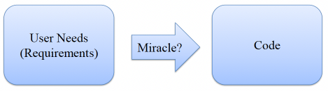
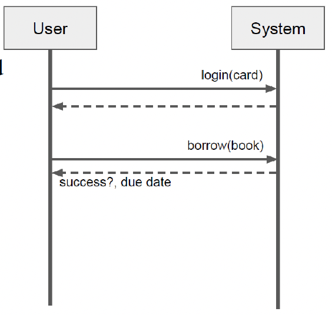

# 10. Object-Oriented Analysis

## 학습 목표
- Domain의 핵심 추상화를 식별하고 domain model로 모델링
- System 내 핵심 상호작용 식별 및 system sequence diagram으로 모델링
- Low representational gap 설계 원칙의 장점 및 한계 논의

## From Requirements to Code

## From Problem to Solution
- Problem Space (Domain Model)
    - 실제 세계의 개념
    - 요구사항, 개념
    - 개념 간의 관계
    - 문제 해결
    - 어휘 구축
- Solution Space (Object Model)
    - System 구현
    - Classes, objects
    - Objects 간의 참조 및 상속 계층
    - 결과 계산
    - 해결책 찾기

## An Object-Oriented Design Process
- 문제 model / diagram, 개념 정의
    - Domain model (a.k.a. conceptual model), 용어집
- System 동작 정의
    - System sequence diagram
    - System behavioral contracts
- Object 책임 할당, 상호작용 정의
    - Object interaction diagrams
- 잠재적 해결책 model / diagram
    - Object model
- (흐름: OO Analysis: 문제 이해 -> OO Design: 해결책 정의)

## A Design Process
- Object-Oriented Analysis
    - 문제 이해
    - 핵심 개념과 그 관계 식별
    - (시각적) 어휘 구축
    - Domain model (aka conceptual model) 생성
- Object-Oriented Design
    - Software classes와 그 관계를 class diagrams로 식별
    - 책임 (attributes, methods) 할당
    - Interaction diagrams를 통한 동작 탐색
    - 설계 대안 탐색
    - Object model (aka design model) 및 interaction models 생성
- Implementation
    - 설계를 code로 mapping, classes 및 methods 구현

## A High-level Software Design Process
- Project 시작
- 요구사항 수집
- Actors 및 use cases 정의
- **문제 model / diagram, objects 정의**
- **System 동작 정의**
- Object 책임 할당
- Object 상호작용 정의
- 잠재적 해결책 model / diagram
- 해결책 구현 및 test
- 유지보수, 발전 등

# Domain Models 도메인 모델

## Object-Oriented Analysis
- 요구사항에 나오는 **명사**들, 자연어 용어집
- Problem domain의 개념 찾기
    - Real-world abstractions, 반드시 software objects는 아님
- 문제 이해
- 공통 어휘 확립
- 공통 문서화, 큰 그림
- Communication을 위함
- (비공식적인) 표기법으로 UML class diagrams를 자주 사용
- 추후 classes를 찾기 위한 출발점 (low representational gap)

## Input to the Analysis Process: Requirements and Use Cases
> 공공 도서관은 일반적으로 지역 사회 주민들이 대출할 수 있는 도서, 영화 또는 기타 도서관 자료를 소장합니다. 각 회원에게는 일반적으로 도서관 계정과 계정 ID 번호가 기재된 도서관 카드가 발급되며, 이를 통해 도서관에서 본인 확인을 할 수 있습니다. 회원의 도서관 계정에는 해당 회원이 대출한 자료와 각 대출 자료의 반납 기한이 기록됩니다. 각 자료 유형에는 기본 대여 기간이 설정되어 있으며, 이는 자료가 대출될 때 반납일을 결정합니다. 회원이 반납일 이후에 자료를 반납할 경우, 해당 자료에 지정된 연체료를 지불해야 하며, 이 금액은 회원의 도서관 계정에 기록됩니다.

>사용 사례 시나리오: 도서관 회원은 도서관 시스템 키오스크에서 도서관 카드로 로그인하여 책을 대출할 수 있어야 합니다. 회원의 미납 연체료가 없음을 확인한 후, 도서관 시스템은 해당 도서의 대여 기간을 현재 날짜에 더하여 반납 기한을 결정하고, 해당 도서와 반납 기한을 회원의 도서관 계정에 대출 자료로 기록해야 합니다.

## Modeling a Problem Domain
- Domain 설명의 핵심 개념 식별
    - 명사, 동사, 개념 간 관계 식별
    - "System"과 같은 non-specific한 어휘 지양
    - Operations와 concepts 구분
    - Domain 전문가와 brainstorming

## Glossary 용어집
- 핵심 개념 식별 및 정의
- 개발자와 고객 간의 공유된 이해 보장

## Visual Notation: UML
- (UML 표기법 예시 이미지)

## Reading Associations
- (연관 관계(Associations) 읽기 예시 이미지)

## Attributes vs. Concepts
- "실제 세계에서 어떤 개념적 class X를 text나 숫자로 생각하지 않는다면, 그것은 attribute가 아니라 concept일 가능성이 높음"
- Type annotations 회피

## Modeling a Problem Domain
- Domain model은 살아있는 문서
- Communication을 위해 사용
- 실제 세계 개념에 집중
    - (예: Database 같은 추상적 구현 관심사 아님)
- Methods/operations 없음
- 관계(relationships)와 다중성(cardinalities) 표시

## Identifying Concepts
- (도서관 시스템 예시 텍스트에서 개념 식별 예시 - 1차)
- A public library ... collection of books, movies, or other library items ... people living in a community. Each library member ... library account ... library card ... account’s ID number ... the library. A member’s library account ... items ... member ... due date ... borrowed item. Each type of item ... default rental period ... item’s due date ... item. If a member ... item ... item’s due date, the member ... late fee ... item, an amount of money ... member’s library account
- (도서관 시스템 예시 텍스트에서 개념 식별 예시 - 2차 정제)
- A public library ... collection of books, movies, or other library items ... Each library member ... library account ... library card ... ID number ... A member’s library account ... items ... member ... due date ... borrowed item. Each type of item ... default rental period ... item’s due date ... item. If a member ... item ... item’s due date, the member ... late fee ... item, an amount of money ... member’s library account

## Hints for Identifying Concepts
- 요구사항 명세 읽기, 명사 찾기
- 기존 models 재사용
- 범주 list 사용
    - 유형의 사물: `cars`, `telemetry data`, `terminals` 등
    - 역할: `mother`, `teacher`, `researcher`
    - 이벤트: `landing`, `purchase`, `request`
    - 상호작용: `loan`, `meeting`, `intersection` 등
    - 구조, 장치, 조직 단위 등
- 일반적인 use scenarios 분석, 동작 분석
- Brainstorming
- 먼저 수집; 나중에 조직, 필터링, 수정

## One Domain Model for the Library System

## Notes on the Library Domain Model
- 모든 개념은 프로그래머가 아니어도 접근 가능
- UML 표기법은 다소 비공식적. 관계는 종종 단어로 설명됨
- 실제 세계의 "is-a" 관계는 domain model에 적합
- 실제 세계의 추상화는 domain model에 적합
- 반복이 중요: 이 예시는 초안임. 실제 설계에서는 일부 용어 수정 가능성
    - 예: `Item` vs. `LibraryItem`, `Account` vs. `LibraryAccount`
- 집합 타입(Aggregate types)은 보통 별도 개념으로 모델링
- 기본 attributes (숫자, 문자열)는 보통 attributes로 모델링

## Why Domain Modeling?
- Domain 이해
    - 세부사항이 중요! (예: System에게 책과 비디오는 다른가?)
- 완전성 보장
    - (예: 연체료가 고려되었는가?)
- 공통 용어 집합에 동의
    - 예: `library item` vs `collection entry` vs `book`
- 설계 준비
    - Domain concepts는 OO classes의 좋은 후보 (-> low representational gap)

## Hints for Object-Oriented Analysis (1)
- Domain model은 어휘 제공
    - 개발자, 테스터, 고객, domain 전문가 간 communication을 위함
    - 단일 어휘에 동의하고 시각화
- Software classes나 data가 아닌, concepts에 집중
    - 아이디어, 사물, objects
    - 이름 부여, 정의 및 예시 제공 (symbol, intension, extension)
- 용어집(Glossary) 추가
- 일부는 classes로 구현될 수도, 아닐 수도 있음

## Hints for Object-Oriented Analysis (2)
- 많은 선택지가 존재
- Model이 완벽하게 정확하지 않을 것임
    - 괜찮음
    - 부분적인 model로 시작, 필요한 것만 모델링
    - 나중에 추가 정보로 확장
    - 변경 사항 명확히 communicate
    - 그렇지 않으면 "analysis paralysis(분석 마비)" 위험

## Domain Model Distinctions
- VS. data model (solution space)
    - 반드시 저장될 data는 아님
- VS. object model 및 Java classes (solution space)
    - 실제 domain concepts만 포함 (실제 objects 또는 실제 세계의 추상화)
    - "UI frame", database 등 미포함

# System Sequence Diagram

## Understanding System Behavior
- System sequence diagram: 하나의 use scenario에 대해, system의 경계(boundary)에서 발생하는 이벤트 순서를 보여주는 model
- 설계 목표: System의 interface 식별 및 정의
    - System 수준의 구성요소만 (예: 사용자와 전체 system)

## One Example for the Library System
- Use case 시나리오: Library member가 library card로 kiosk 로그인 후 책 대출. 연체료 미납 확인 후, rental period를 더해 반납 기한 결정. 책과 반납 기한을 member의 account에 기록
    

# Behavioral Contracts

## Formalize System at Boundary
- System behavioral contract
    - System sequence diagrams에서 식별된 특정 operation에 대한 pre-conditions와 post-conditions 기술
    - System 수준의 텍스트 명세, software specifications와 유사

## System Behavioral Contract Example
- Operation: `borrow(item)`
- Pre-conditions:
    - Library member가 system에 이미 로그인함
    - Item이 현재 다른 member에게 대출되지 않음
- Post-conditions:
    - 로그인된 member의 account에 새로 대출된 item 기록, 또는 member에게 미납 연체료 경고
    - 새로 대출된 item은 item의 rental period + 현재 날짜로 계산된 미래의 반납 기한 포함

## Distinguishing Domain vs. Implementation Concepts
- Domain-level concepts:
    - 실제 세계의 유사물(analogue)을 가진 거의 모든 것
- Implementation-level concepts:
    - 구현과 유사한 method 이름
    - Programming types
    - Visibility modifiers
    - Helper methods 또는 classes
    - Design patterns의 산출물

## Summary: Understanding the Problem Domain
- Domain 수준의 표현을 구축하는 tools 파악
    - Domain models
    - System sequence diagrams
    - System behavioral contracts
- 신속하고 (때로는) 유연하게
    - 명백한(?) 세부 사항 생략
    - 반복, 반복, 또 반복...
- Domain 전문가로부터 feedback 받기
    - Domain 수준의 concepts만 사용