# Object-Oriented Design

## From Requirements to Code
- 사용자 요구사항 (Requirements)
- 기적? Code

## From Problem to Solution
- **Problem Space (Domain Model)**
  - 실제 세계의 개념
  - 요구사항, 개념
  - 개념 간의 관계
  - 문제 해결
  - 어휘 구축
- **Solution Space (Object Model)**
  - 시스템 구현
  - `Classes`, `objects`
  - `Objects` 간의 참조 및 상속 계층
  - 결과 계산
  - 해결책 찾기

## An Object-Oriented Design Process
- **OO Analysis: 문제 이해**
  - 문제 model / diagram 화, 개념 정의
  - Domain model (a.k.a. conceptual model), 용어집
- **OO Design: 해결책 정의**
  - 시스템 행동 정의
  - 시스템 sequence diagram
  - 시스템 행동 계약
  - 객체 책임 할당, 상호작용 정의
  - 객체 interaction diagrams
  - 잠재적 해결책 model / diagram 화
  - Object model

## Learning Goals
- Solution Space에서의 UML
  - Object diagrams: 개념에서 classes로
  - Interaction diagrams: 시스템 경계를 넘어서는 상호작용
- 설계 결정 (Design Decisions)
  - 원칙, patterns, heuristics 어휘 확장
  - GRASP patterns를 적용한 설계 책임 할당
  - 설계 간의 tradeoffs 추론
  - Coupling 및 `cohesion` 관점에서의 tradeoffs 논의

# Modeling Implementations with UML

## A Word on UML
- UML은 표준화된, 확립된 표기법
- 대부분의 software engineers가 읽을 수 있고, 많은 도구들이 지원
- 소수의 실무자들만이 엄격하게 사용
- 일반적으로 스케치, 커뮤니케이션, 문서화, (아마도) 벽 장식용으로 비공식적 사용
- 커뮤니케이션을 위해 UML 사용
  - 표기법을 다소 엄격하게 따르지만, 모든 세부 사항은 아님

## One Domain Model for the Library System
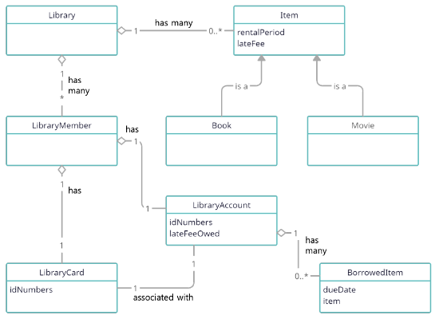

## From Concepts to Objects
- Domain 개념은 classes와 어떻게 다른가?
  - 모든 개념이 class가 되어야 하는가?
  - 모든 class가 개념을 나타내야 하는가?

## Object Diagrams
- Fields와 methods를 가진 Objects/classes
- Methods를 가진 Interfaces
- Associations, visibility, types


## Object Diagram Notation: Classes/Objects

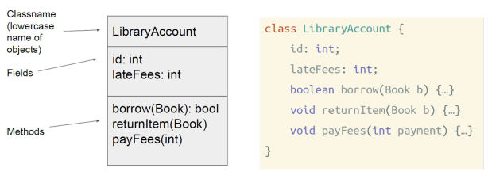

```
class LibraryAccount {
  id: int;
  lateFees: int;
  boolean borrow(Book b) { ... }
  void returnItem(Book b) { ... }
  void payFees(int payment) { ... }
}
```

## Object Diagram Notation: Interfaces
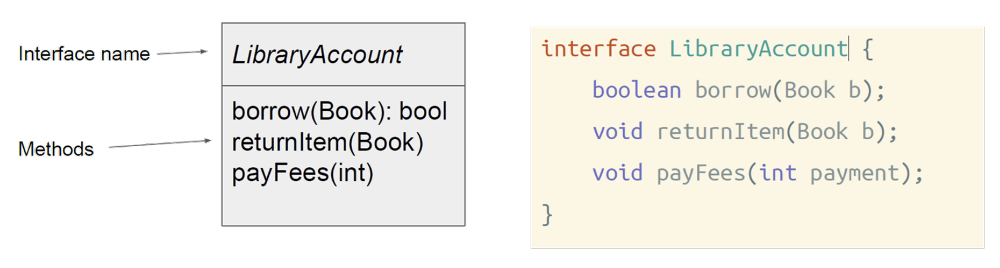
```
interface LibraryAccount {
  boolean borrow(Book b);
  void returnItem(Book b);
  void payFees(int payment);
}
```

## Object Diagram Notation: Associations

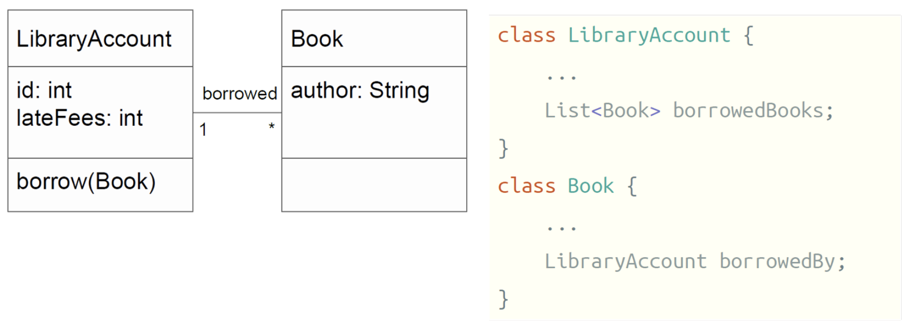
```
class LibraryAccount {
  ...
  List<Book> borrowedBooks;
}
class Book {
  ...
  LibraryAccount borrowedBy;
}
```

- Fields를 associations 대신 또는 추가로 사용하지 말 것
- Fields는 기본 types에만 사용

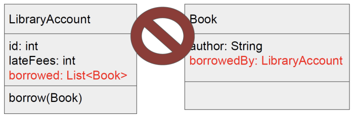

## Class Diagram vs Object Diagram
- Classes와 objects 둘 다 modeling 가능
- 용어는 종종 혼용됨
- 특정 objects를 modeling해야 하는 경우 `objectId: Class` 표기법 사용
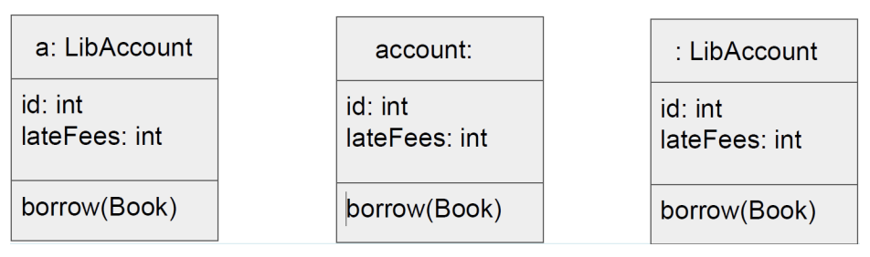

## Class Diagrams and JavaScript/TypeScript
- Classes를 사용하지 않을 때에도, 동일한 아이디어를 표현하기 위해 표기법 사용
  - 동일한 shape을 공유하는 많은 objects
- TypeScript interfaces는 class diagram 표기법과 일치

```javascript
function newLibraryAccount(id, lateFees) {
    return {
        borrow: function (book) { ... },
        returnItem: function (book) { ... },
        payFees: function (payment) { ... }
    }
}
```

## One Object Model for the Library System
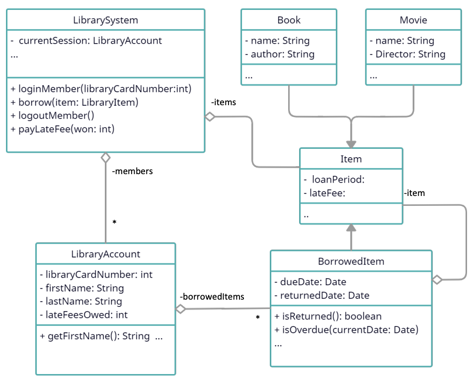

## Domain Model vs Object Model

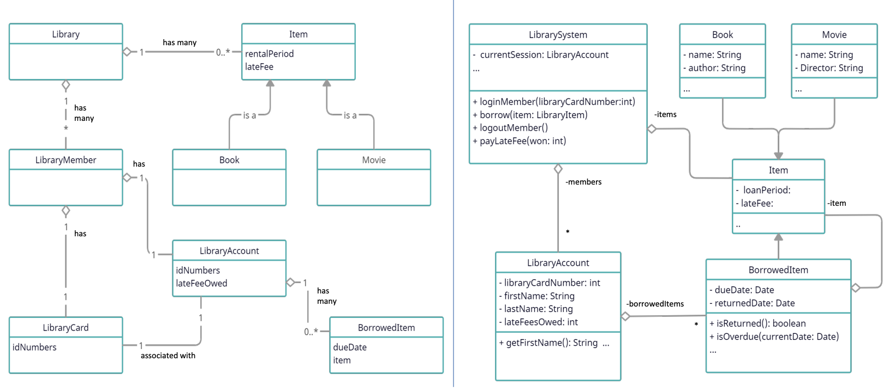

## Object Diagram Notation Requirements
- 표기법에 대해 매우 엄격하지는 않지만,
  - Classes/objects, interfaces, concepts에 적합한 2 또는 3 부분으로 된 상자 사용
  - Fields와 methods에 types 포함
  - 적절한 경우 fields가 아닌 associations 사용
  - Association 이름과 cardinalities 사용
    - "is-a"(상속 관계)를 제외한 화살표 타입은 크게 신경 쓰지 않음

# Modeling Interactions Past the System Boundary
- **Use case scenario:** 도서관 회원이 도서관 카드를 사용하여 도서관 시스템 키오스크에서 로그인하고 책을 대출
- 회원이 미납 연체료가 없는지 확인한 후, 도서관 시스템은 현재 날짜에 대여 기간을 더해 책의 반납 기한을 결정
- 해당 책과 반납 기한을 회원의 도서관 계정에 대출 항목으로 기록
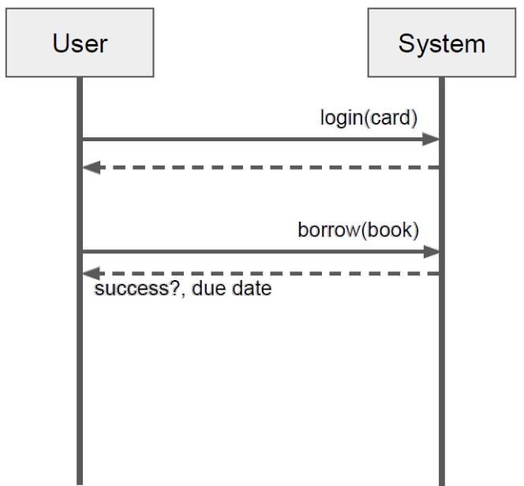

## Interaction Diagrams
- Objects 간의 상호작용
- 두 가지 일반적인 표기법: sequence diagrams, communication diagrams
- Sequence diagrams는 system sequence diagrams와 유사하지만, objects/classes 간의 상호작용을 묘사
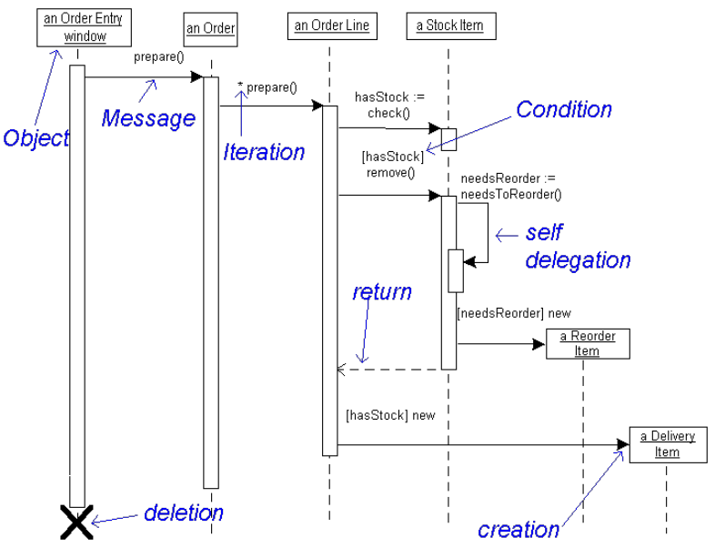

## Example


## Interaction Diagram Practice
- **Use case scenario:** ...책을 대출. 회원의 미납 연체료가 없는지 확인 후, 시스템은 대출 기간(loan period)을 현재 날짜에 더해 반납 기한을 결정하고, 책과 반납 기한을 회원 계정에 대출 항목으로 기록
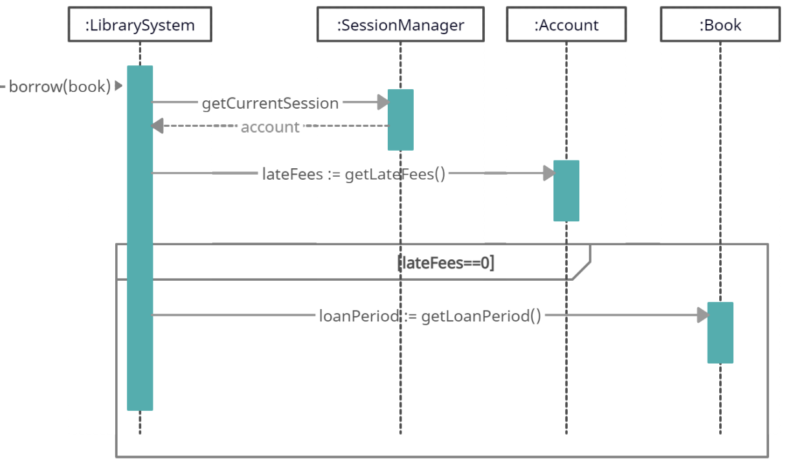

## Interaction Diagrams Help Evaluate Design Alternatives
- 설계 대안을 명시적으로 고려
- 각 대안에 대해, 설계 선택에 의해 암시되는 상호작용 스케치
  - 상호작용은 components의 APIs에 해당

# Object-Level Design

## Who is Responsible?
- 도서관 문제(Library problem) 고려
  - 어느 class가 사용자가 대출한 항목을 **알아야** 하는가
  - 어느 class가 연체료를 **계산해야** 하는가

## Doing and Knowing Responsibilities
- 책임(Responsibilities)은 객체의 행동 측면에서의 의무와 관련
- **Doing responsibilities (수행 책임)**
  - 객체 생성 또는 계산 수행 등 무언가를 직접 수행
  - 다른 objects의 행동 개시
  - 다른 objects의 활동 제어 및 조정
- **Knowing responsibilities (정보 책임)**
  - Private 캡슐화된 data에 대해 알기
  - 관련된 objects에 대해 알기
  - 파생하거나 계산할 수 있는 것들에 대해 알기
- Object design은 domain modeling만큼 명확하지 않음
  - Domain modeling의 과제는 매우 정밀해지는 것
  - 구현에 가까워질수록 선택 필요 (Data, methods 배치 등)
  - 실제 세계 개념과 결코 1:1이 아님
- 책임 할당(Assigning Responsibilities)에 대한 고찰이 도움됨
  - 디자인 원칙과 heuristics에 의존
  - GRASP (General Responsibility Assignment Software Patterns/Principles에 대부분 포함

## GRASP의 9개 패턴
1. Information expert
2. Creator
3. Controller
4. Indirection
5. Low coupling
6. High cohesion
7. Polymorphism
8. Protected variations
9. Pure fabrication

## Information Expert
| Name | Information Expert
| - | -
| **Problem** | 객체에 책임을 할당하는 기본 원칙은 무엇인가?
| **Solution** | 책임을 수행하는 데 필요한 정보를 가진 class에 책임을 할당
### Applying Information Expert
- Software `Board`는 모든 `Square` objects를 집합(aggregate)시킬 것
- 따라서, `Board`는 이 책임을 수행하는 데 필요한 정보를 가짐
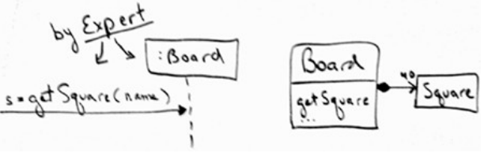

## Creator
| Name | Creator
| - | -
| Problem | 누가 A를 생성하는가?
| Solution | 다음 중 하나 이상이 참(많을수록 좋음)일 경우, class B에 class A의 instance 생성 책임을 할당<br>B가 A를 "포함"하거나 복합적으로 aggregate 함<br>B가 A를 기록함<br>B가 A를 긴밀하게 사용함<br>B가 A 생성을 위한 초기화 data를 가짐

## Example: Creator
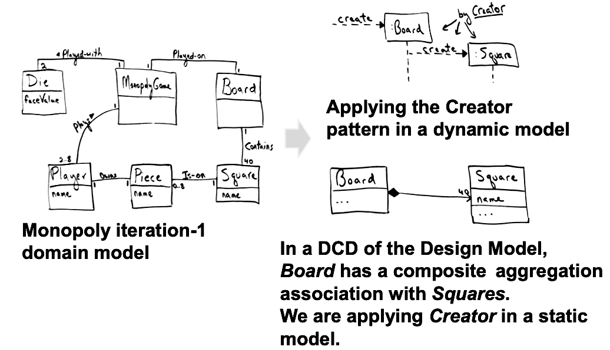
- Dynamic model에서 Creator pattern 적용
- Design Model의 DCD에서, `Board`는 `Squares`와 composite aggregation association을 가짐
  - Static model에 Creator 적용 중

## Controller
| Name | Controller
| - | -
| Problem | UI layer를 넘어 system operation을 수신하고 조정("제어")하는 첫 번째 객체는 무엇인가?
| Solution | 다음 선택지 중 하나를 나타내는 객체에 책임 할당<br>전체 "system", "root object", software가 실행 중인 device 또는 주요 subsystem (모두 facade controller의 변형)<br>System operation이 발생하는 use case scenario (use case 또는 session controller)

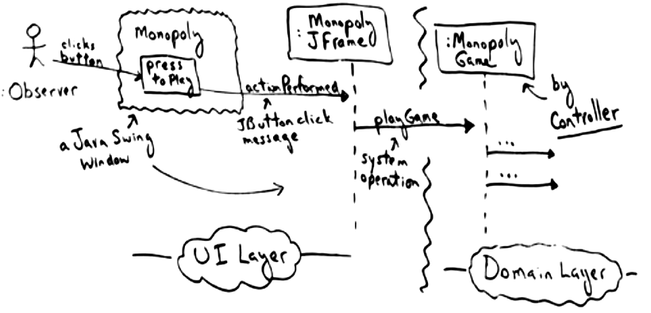
- `MonopolyGame`을 사용한 Controller pattern 적용
- UI layer와 software objects의 domain layer 연결

## Design Goals, Principles, and Patterns
- Design Goals
  - 변경, 이해, 재사용, 분업 등을 위한 설계
- Design Principle
  - Low coupling
  - high cohesion
  - Low representational gap
- Design Heuristics
  - Law of Demeter
  - Information expert
  - Creator
  - Controller


# Design Principle: Low Representational Gap
2025.11.5.(목)

## Low Representational Gap
- 식별된 개념은 구현 시 classes에 대한 영감을 제공
- Domain 개념을 반영하는 Classes는 종종 이해하기 직관적이며, 거의 변경되지 않음 (low representational gap)

## Designs with Low Representational Gap
- 각 domain class에 대해 software class 생성, 해당 관계 생성
- **Design goal:** 변경을 위한 설계
- 이것은 단지 시작점
  - 모든 domain classes가 software 대응물을 필요로 하지는 않음
  - Pure fabrications가 필요할 수 있음
  - 다른 원칙들이 종종 더 중요

# Design Principle: Low Coupling
- Module은 가능한 한 적은 수의 다른 modules에 의존해야 함
  - 이해도 향상 (이해를 위한 설계)
      - Context에 대한 제한된 이해, 고립된 상태에서 이해 용이
  - 변경 비용 감소 (변경을 위한 설계)
      - 변경에 필요한 context가 적음
      - Module interface 변경 시, 영향을 받는 modules가 적음 (파급 효과 감소)
  - 재사용성 향상 (재사용을 위한 설계)
      - 의존성이 적어 새로운 context에 적응 용이

## Topologies with Different Coupling
> *Types of module interconnection structures*

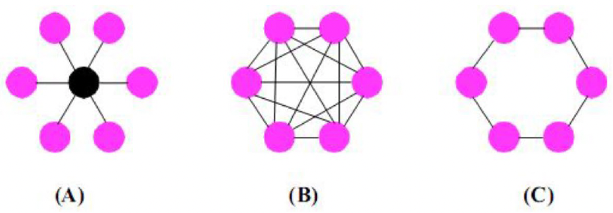

## High Coupling is Undesirable
- Low coupling을 가진 element는 적은 수의 다른 elements에 의존
  - Elements == classes, subsystems, ...
  - "적은"은 context에 따라 다름
- High coupling을 가진 class는 많은 다른 classes에 의존
  - 관련된 classes의 변경이 로컬 변경을 강제; 로컬 class의 변경이 관련된 classes의 변경을 강제 (취약함, 파급 효과)
  - 고립된 상태에서 이해하기 어려움
  - 다른 의존적 classes의 추가적인 존재를 요구하므로 재사용하기 어려움
  - 확장하기 어려움 – 많은 곳에서 변경 필요

## Design Goals, Principles, and Patterns
- **Design Goals:** 변경, 이해, 재사용, 분업 등을 위한 설계
- **Design Principle:** Low coupling, high cohesion, Low representational gap
- **Design Heuristics:** (시스템에서 원칙 증진) Law of Demeter, Information expert, Creator, Controller

## Design Heuristic: Law of Demeter
- 각 module은 다른 units에 대해 제한된 지식만 가져야 함: 현재 unit과 "밀접하게" 관련된 units만
- 특히: 낯선 이에게 말 걸지 말 것 (Don’t talk to strangers\!)
- 예: `a.getB().getC().foo()` 금지

```
for (let i of shipment.getBox().getItems())
    shipmentWeight += i.getWeight() ...
```
> *So don't do this ^ !!*

## Coupling: Discussion
- 매우 안정적인 elements에 대한 high coupling은 보통 문제되지 않음
  - 안정적인 interface는 변경될 가능성이 낮고, 잘 이해됨
  - Implementations에 대한 coupling보다 interfaces에 대한 coupling 선호
- Subclass/superclass coupling은 특히 강력함
  - Protected fields와 methods가 노출됨
  - Subclass는 많은 superclass 변경(예: method signatures 변경, abstract methods 추가)에 취약
  - Guideline: Coupling을 줄이기 위해, 상속(inheritance)보다 composition 선호
- Coupling은 많은 원칙 중 하나
  - Cohesion, low repr. gap 및 기타 원칙도 고려

## Design Goals
- Low coupling이 지원하는 방식 설명:
  - **Design for change (변경을 위한 설계)**
      - 더 적은 수의 다른 objects에 대한 의존성으로 변경이 더 쉬움
      - 변경이 파급 효과(rippling effects)를 가질 가능성 감소
  - **Design for understandability (이해를 위한 설계)**
      - 이해해야 할 의존성이 적음 (예: `a.getB().getC().foo()`)
  - **Design for division of labor (분업을 위한 설계)**
      - 더 작은 interfaces, 분할 용이
  - **Design for reuse (재사용을 위한 설계)**
      - 복잡한 의존성 없이 재사용 용이

## Design Heuristic: Controller (also Design Pattern: FAÇADE)
- **Problem:** 어떤 객체가 system operation (event)을 수신하고 조정하는가?
- **Solution:** 다음을 나타내는 객체에 책임 할당
  - 전체 system, device, 또는 subsystem (façade controller)
  - System event가 발생하는 use case scenario (use case controller)
- **Process:** System sequence diagram에서 도출 (핵심 원칙: Low representational gap, high cohesion)
- (다이어그램 53, 54 내용 포함)

## Controller: Discussion
- `Controller`는 coordinator
  - 많은 작업을 직접 수행하지 않음
  - 다른 objects에 위임
- Façade controllers는 system events가 "너무 많지" 않을 때 적합
  - 시스템을 위한 하나의 전체 controller
- Use case controller는 façade controller가 과도한 책임으로 "비대해질" 때(low cohesion, high coupling) 적합
  - 특정 작업을 위한 여러 개의 작은 controllers
- Façade design pattern (추후 강의)과 밀접하게 관련됨

## Controller: Design Tradeoffs
- Coupling 감소
  - User interface와 domain logic이 서로 분리됨 (decoupled)
- 이해도: 고립된 상태에서 이해 가능, 다음으로 이어짐:
- Evolvability (진화 용이성): UI와 domain logic 모두 변경 용이
  - 둘 다 `controller`에 결합(coupled)되어, `controller`가 중재자(mediator) 역할. 이 coupling은 덜 해로움
  - `Controller`는 더 작고 안정적인 interface
  - Domain logic 변경이 UI가 아닌 `controller`에 영향
  - Domain logic design을 몰라도 UI 변경 가능
- 재사용성 지원
  - `Controller`는 domain logic에 대한 interface 역할
  - 더 작고 명시적인 interfaces는 evolvability 지원
- 단, 비대해진(bloated) controllers는 coupling을 높이고 `cohesion`을 낮춤; 해당 시 분할

# Design Principle: High Cohesion (OR SINGLE RESPONSIBILITY PRINCIPLE)
높은 응집도

## Design Principle: Cohesion
- Module은 작고 관련된 책임 집합을 가져야 함
  - 이해도 향상 (이해를 위한 설계)
      - 작은 책임 집합이 이해하기 더 쉬움
  - 재사용성 향상 (재사용을 위한 설계)
      - 응집력 있는(cohesive) 책임 집합은 다른 application에서 재발생할 가능성이 높음

## Example: Low Cohesion
```
class DatabaseApplication {
    public void authorizeOrder(Data data, User currentUser, ...){
        // check authorization
        // lock objects for synchronization
        // validate buffer
        // log start of operation
        // perform operation
        // log end of operation
        // release lock on objects
    }

    public void startShipping(OtherData data, User currentUser, ...){
        // check authorization
        // lock objects for synchronization
        // validate buffer
        // log start of operation
        // perform operation
        // log end of operation
        // release lock on objects
    }
}
```

## Anti-Pattern: God Object

```
class Chat {
    List<String> channels;
    Map<String, List<Msg>> messages;
    Map<String, String> accounts;
    Set<String> bannedUsers;
    File logFile;
    File bannedWords;
    URL serverAddress;
    Map<String, Int> globalSettings;
    Map<String, Int> userSettings;
    Map<String, Graphic> smileys;
    CryptStrategy encryption;
    Widget sendButton, messageList;
}
```

```
class Chat {
    Content content;
    AccountMgr accounts;
    File logFile;
    ConnectionMgr conns;
}

class ChatUI {
    Chat chat;
    Widget sendButton, ...;
}

class AccountMgr {
    ... accounts, bannedUsers ...
}
```

## Cohesion in Graph Implementations

```
class Graph {
    Node[] nodes;
    boolean[] isVisited;
}

class Algorithm {
    int shortestPath(Graph g, Node n, Node m) {
        for (int i; ...) {
            if (!g.isVisited[i]) {
                ...
                g.isVisited[i] = true;
            }
        }
        return v;
    }
}
```

- 이것이 좋은 구현인가?
- No, graph가 data뿐만 아니라 알고리즘적 책임까지 맡고 있기 때문

## Bluemarble Example
- 어느 디자인이 더 높은 `cohesion`을 가지는가?

```
class Player {
    Board board;
    /* in code somewhere... */ this.getSquare(n);
    Square getSquare(String name) { // named squares
        for (Square s: board.getSquares())
            if (s.getName().equals(name))
                return s;
        return null;
    }
}
```

```
class Player {
    Board board;
    /* in code somewhere... */ board.getSquare(n);
}

class Board {
    List<Square> squares;
    Square getSquare(String name) {
        for (Square s: squares)
            if (s.getName().equals(name))
                return s;
        return null;
    }
}
```

## Hints for Identifying Cohesion
- 개념(concept)당 하나의 색상 사용
- 해당 concept의 모든 코드를 그 색상으로 강조  
→ Classes/methods는 적은 수의 색상을 가져야 함
- "Concept"이 무엇인지 명확한 정의는 없음
- Concepts는 더 작은 concepts로 분할될 수 있음
  - Graph with search vs.
  - Basic Graph + Search Algorithm vs.
  - Basic Graph + Search Framework + Concrete Search Algorithm, 등
- 엔지니어링 판단(engineering judgment) 필요

## Cohesion: Discussion
- Very Low Cohesion: Class가 매우 다른 기능 영역의 많은 것들을 전적으로 책임짐
- Low Cohesion: Class가 하나의 기능 영역에서 복잡한 작업을 전적으로 책임짐
- High Cohesion: Class가 하나의 기능 영역에서 적당한 책임을 가지며, 작업을 수행하기 위해 (다른) classes와 협력
- High cohesion의 장점
  - Classes 유지보수 용이
  - 이해 용이
  - 종종 low coupling 지원
  - 세분화된 책임으로 재사용성 지원
- 경험 법칙 (Rule of thumb): high cohesion을 가진 class는 상대적으로 적은 수의 고도로 연관된 기능의 methods를 가지며, 너무 많은 작업을 수행하지 않음

## Coupling vs Cohesion (Extreme cases)
- 모든 코드가 하나의 class/method에
  - Very low coupling, 그러나 very low cohesion
- 모든 구문(statement)이 분리됨
  - Very high cohesion, 그러나 very high coupling
- 좋은 tradeoff를 찾을 것; low representational gap 등 다른 원칙들도 고려

# Design Heuristic: Information Expert

## Information Expert (Design Heuristic)
- Heuristic: 책임을 수행하는 데 필요한 정보를 가진 class에 책임을 할당
  - 일반적으로 공통적인 직관을 따름
- Domain Model classes 대신 Software classes
  - Software classes가 아직 존재하지 않는 경우, Domain Model에서 적절한 추상화(abstractions)를 찾음 (-\> correspondence)
- Design process: Domain model에서 도출
  - 핵심 원칙: Low representational gap, low coupling

## Information Expert: Example 1
- 어느 class가 shipment의 무게를 계산하는 데 필요한 모든 정보를 가지고 있는가?

## Information Expert: Example 2
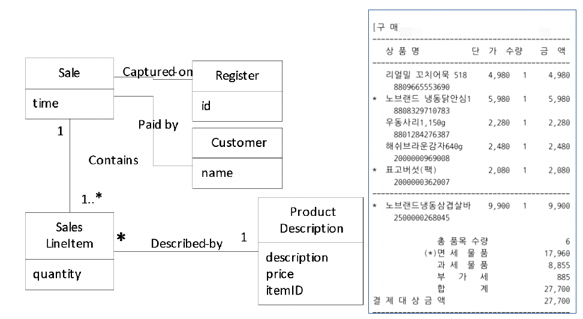
- 판매(sale)의 총합(grand total)을 아는 책임은 누구에게 있는가?
- (다이어그램 71, 72 내용)
- Design Class Responsibility
  - Sale: 판매 총액(sale total)을 앎
  - SalesLineItem: 라인 아이템 소계(line item subtotal)를 앎
  - ProductSpecification: 제품 가격(product price)을 앎

| Design Class | Responsibility
| - | -
| Sale | Knows sale total
| SalesLineItem | Knows line item subtotal
| ProductSpecification | Knows product price

## Information Expert → "Do It Myself Strategy"
- Expert는 보통 software object가 자신이 나타내는 무생물(inanimate) 실제 세계 사물에 대해 일반적으로 수행되는 작업들을 직접 수행하는 설계로 이어짐
  - 판매(sale)는 당신에게 총액을 말해주지 않음; 그것은 무생물
- OO design에서, 모든 software objects는 "살아있고" "생명(animated)"이 있으며, 책임을 맡고 일을 할 수 있음
- 그들은 자신이 아는 정보와 관련된 일을 함

# Design Heuristic: Creator

## Creator (Design Heuristic)
- Problem: 누가 A를 생성하는가?
- Solution: 다음과 같은 경우 B에게 class A의 instance 생성 책임 할당
  - B가 A objects를 aggregate, B가 A objects를 포함, B가 A objects의 instances를 기록, B가 A objects를 밀접하게 사용, B가 A objects 생성에 필요한 초기화 data를 가짐 (많을수록 좋음)
  - 선택지가 있는 경우, B가 A objects를 aggregate 하거나 포함하는 것을 선호
- Key idea: Creator는 어차피 참조(reference)를 유지해야 하며, 생성된 object를 자주 사용하게 될 것
- Process: Domain model, interaction diagrams에서 추출
  - 핵심 원칙: Low coupling, low representational gap

## Creator: Example
- Beetle objects 생성 책임은 누구에게 있는가?
  - Creator pattern은 Tree를 제안

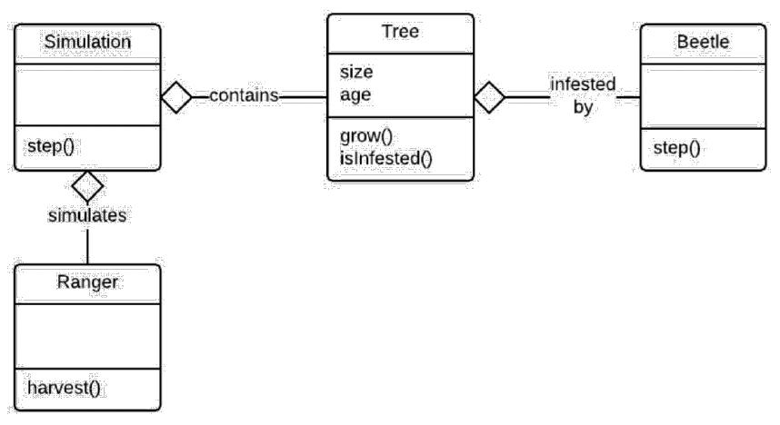

- Interaction diagram:


## Creator (GRASP)
- Problem: 객체 생성 책임 할당
  - Graph에서 Nodes는 누가 생성?
  - SalesItem의 instances는 누가 생성?
  - Simulation에서 Children은 누가 생성?
  - Bluemarble 게임에서 Tiles는 누가 생성?
- AI? Player? Main class? Board? Meeple (Dog)?

## Creator: Discussion of Design Goals/Principles
- Low coupling, high cohesion 증진
  - Class가 참조해야 할 objects 생성 책임
  - Objects를 직접 생성하면, object 생성을 위해 다른 class에 의존하는 것을 피함
- Evolvability (design for change) 증진
  - Object 생성이 숨겨져(hidden), 로컬에서 교체 가능
- Contra (반대): 때때로 objects는 특별한 방식으로 생성되어야 함
  - 복잡한 초기화
  - 다른 상황에서 다른 classes를 instantiate
  - 이 경우, cohesion은 생성을 다른 object에 두도록 제안: builder, factory method 같은 design patterns 참고

## Other Design Heuristics
- (향후 강의):
  - Mutability 최소화
  - Conceptual weight 최소화
  - 상속(Inheritance)보다 composition/delegation 선호
  - Coupling을 줄이기 위해 indirection 사용
  - ...

## Object-level Artifacts of This Design Process
- **Object interaction diagrams**는 objects에 methods를 추가
  - 추가적인 data 책임 추론 가능
  - 추가적인 data types 및 architectural patterns 추론 가능
- **Object model**은 중요한 설계 결정(design decisions)을 종합(aggregates)
  - 구현 가이드(implementation guide) 역할

## Summary
- Design은 품질 속성(quality attributes)에 의해 주도됨
  - Evolvability, separate development, reuse, performance, ...
- Design principles는 품질 달성을 위한 지침 제공
  - Low coupling, high cohesion, high correspondence, ...
- GRASP design heuristics는 이러한 원칙들을 증진
  - Creator, Expert, Controller, ...