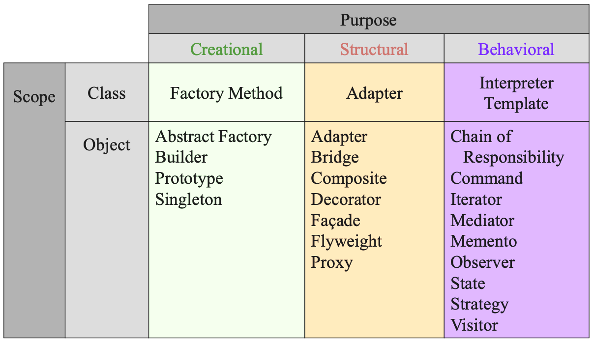
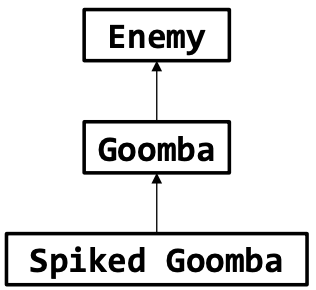
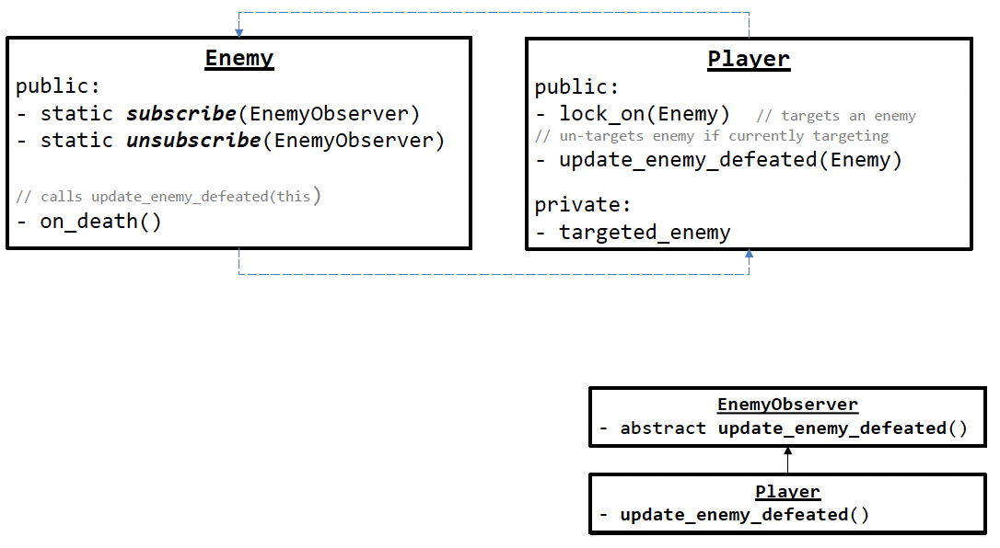
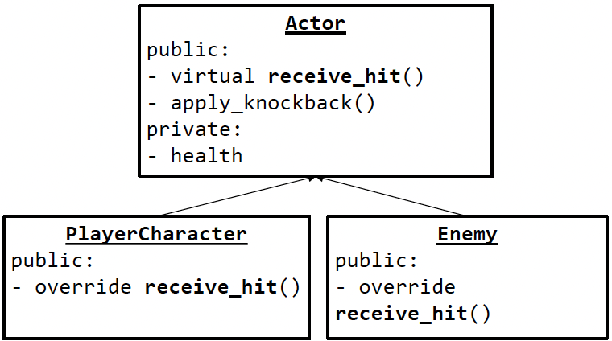
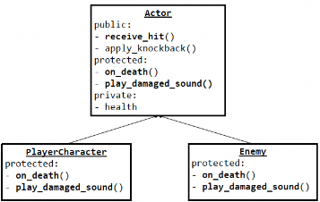

# 12. Design Patterns

## Learning Goals
- Design pattern의 동기 이해 (솔루션의 template로서)
- 다양한 design pattern 유형 학습
- Design pattern 사용 시점 논의
- 문제 해결을 위한 적절한 design pattern 적용

## Design Challenges
- 재사용을 위한 software 설계의 어려움. 찾아야 할 것들:
  - 우수한 문제 분해 및 적절한 software
  - 유연성, 모듈성, 명료성을 갖춘 design
- Trial and error(시행착오)를 통해 design 도출
- 성공적인 design 존재
  - 두 design이 거의 동일하지 않음
  - 일부 반복적인 특성 존재
- Design을 기술, 성문화, 표준화할 수 있는가?
  - Trial and error 단계 단축
  - "더 나은" software를 더 빨리 생산

# Design Principles

## Design Patterns
> *"각 pattern은 우리 환경에서 반복적으로 발생하는 문제와 그 문제에 대한 핵심 해결책을 설명함. 이 해결책은 두 번 다시 똑같은 방식으로 수행하지 않고도 백만 번 이상 사용 가능"* (Christopher Alexander, 1977)
- 건물과 마을의 pattern 설명에서 유래
- SE에서 design pattern은 벽과 문이 아닌 object와 interface 관점
- 상호작용하는 object 집합이 특정 작업을 수행하거나 특정 기능을 제공하기 위해 협업하는 방식

## Design Patterns Everywhere!

## History of Patterns
- "Pattern" 개념은 1977년 Christopher Alexander의 A Pattern Language (2543개 patterns)에서 처음 표현
- 1990년 Gang of Four or "GoF"(Gamma, Helm, Johnson, Vlissides) 그룹이 design pattern 카탈로그 편찬
- 1995년 책 Design Patterns: Elements of Reusable Object-Oriented Software는 이 분야의 고전

## Benefits of Using Patterns
- Pattern은 공통 design 어휘
  - 엔지니어가 문제를 추상화하고 구현과 분리하여 논의 가능
  - 문화 구현; Domain 특화 pattern은 design 속도 향상
- Pattern은 design 전문성을 포착하고 전달
  - Design 재사용 촉진 및 실수 방지
- 문서화 개선 (더 적은 양 필요) 및 이해도 향상 (pattern은 한 번 잘 설명됨)

## Architecture vs. Design Patterns
- Architecture
  - Application 구조화를 위한 상위 수준 framework
    - "RPC 기반 client-server"
    - "Abstraction layering"
    - "CORBA 기반 분산 객체 지향 system"
- 계산 component 및 상호작용 관점에서 system 정의
- Design Patterns
- Architecture보다 낮은 수준 (때때로 micro-architecture)
- Application 내 하위 문제 해결을 위한 재사용 가능한 협업
- Subsystem X를 Subsystem Y에서 어떻게 분리(decouple)할까?
- Why Design Patterns?
- 높은 추상화 수준에서 객체 지향 재사용 지원
- 객체 지향 구현을 안내하고 제약하는 "framework" 제공

## 4 Essential Elements of Design Patterns
- Name: Pattern 식별
- Problem: 문제 및 context 관점에서 pattern 적용 시점 기술
- Solution: Design 구성 요소, 관계, 책임, 협업 기술
- Consequences: Pattern 적용 결과 및 trade-off

## How to Describe Design Patterns more fully
- Design pattern을 위한 형식
- Pattern Name and Classification
- Intent
- Also Known As
- Motivation
- Applicability
- Structure
- 동료 개발자가 pattern을 평가, 선택, 활용할 수 있도록 정보 전달이 중요
- Participants
- Collaborations
- Consequences
- Implementation
- Sample Code
- Known Uses
- Related Patterns

## Organizing Design Patterns
- By Purpose (pattern의 역할 반영):
- Creational Patterns
- Structural Patterns
- Behavioral Patterns
- By Scope: pattern 적용 대상
- Classes
- Objects

## Design Patterns Space


## Creational Patterns
> "System이 object 생성 방식과 독립적이도록 만들어라."
- 일반 constructor가 충분하지 않은 경우
  - Object 생성 방식/시점 제어
  - 언어 한계 극복 (예: keyword/default args 부재)
  - Polymorphic type 숨김

## Named Constructor (Idiom)
- Creational pattern에서 사용되는 기법

```cpp
class Llama {
public:
    static Llama create_llama(String name) {
        return new Llama(name);
    }
private: // Making ctor private depends on our needs
    Llama(String name_in){ name = name_in; }
    String name;
};
```

## Scenario: Polymorphic Objects
- **Problem**: Client에게 type을 노출하지 않고 polymorphic object를 생성 및 사용
- **Solution**: 원하는 type의 object를 생성하되, base class의 object를 반환하는 함수 작성

## Factory Pattern (Function)
- String이 factory에 생성할 type 전달

```cpp
Llama llama_factory(String name, String type) {
    if (type == "ninja_llama") {
        return new NinjaLlama(name);
    }
    if (type == "whooping_llama") {
        return new WhoopingLlama(name);
    }
    ...
}

Llama steve = llama_factory("Steve", "ninja_llama");
```

## Factory Pattern (Class)
- Client가 (아마도) static method를 호출하여 올바른 type 생성

```cpp
class LlamaFactory {
public:
    static Llama make_ninja_llama(string name) {
        return new NinjaLlama(name);
    }
    static Llama make_whooping_llama(string name) {
        return new WhoopingLlama(name);
    }
};

Llama steve =
    LlamaFactory.make_ninja_llama("Steve");
```

## Scenario: Difficulty-Based Enemies
- Polymorphic Enemy class 계층 구조의 컴퓨터 게임 구현 중. 선택된 난이도에 따라 다른 버전의 enemy 생성을 원함
- "Normal" 난이도: Regular goomba
- "Hard" 난이도: Spiked goomba
- Bad Solution: Enemy 생성 시점마다 난이도 확인

```cpp
// !! DON'T DO THIS !!
Enemy* goomby = nullptr;
if (difficulty == "normal") {
    goomby = new Goomba();
}
else if (difficulty == "hard") {
    goomby = new SpikedGoomba();
}
```

## Solution: Abstract Factory


```cpp
// Only have to do this once!
AbstractEnemyFactory factory = null;
if (difficulty == “normal”) {
    factory = new NormalEnemyfactory();
}
else if (difficulty == “hard”) {
    factory = new HardEnemyFactory();
}
...
Enemy goomby = factory.create_goomba();
```



## Scenario: Global Application State
- Global하게 access 가능한 application state 필요. Data 접근 및 갱신 제어 필요
- Bad solution: 순수 global 변수 (plz no)
- Less bad solution: 모든 state`를 class에 넣고 global instance 보유

## Aside: When is Global State OK?
- 모든 곳에서 access 필요, parameter 전달이 코드를 과도하게 복잡하게 만듦
- Parameter 전달 줄이려고 global 변수 사용은 BAD
- Program 외부에 저장된 state (database, web API 등)

## Singleton Pattern
- "Class가 단 하나의 instance`만 갖도록 보장하고, 이에 대한 global 접근 지점 제공"

```
public:
- static get_instance() // named ctor

private:
- static instance // the one instance
- Singleton() // ctor
```

## Singleton (Implementation)

```java
class Singleton {
    public static Singleton get_instance() {
        if (Singleton.instance == null) {
            Singleton.instance = new Singleton();
        }
        return Singleton.instance;
    }
    private static Singleton instance = null;
    private Singleton() {
        spams = 42;
        System.out.println("Singleton created");
    }
    // Our global state
    private int spams;
    public int num_spams() {
        return spams;
    }
    public void add_spam() {
        spams += 1;
    }
}
```

## Using the Singleton
- Exercise: 이 code의 출력은?

```
public:
- static get_instance() // named ctor
- num_spams()
- add_spam() // adds 1 to num_spams

private:
- static instance // the one instance
- Singleton() // ctor, prints message
- spams
```

```java
class Main {
    public static void main(String[] args) {
        int spams = Singleton.get_instance().num_spams();
        System.out.println(spams);
        Singleton.get_instance().add_spam();
        spams = Singleton.get_instance().num_spams();
        System.out.println(spams);
    }
}
```

## Using the Singleton (Solution)
- Exercise: 이 code의 출력은?

```java
class Main {
    public static void main(String[] args) {
        int spams = Singleton.get_instance().num_spams();
        System.out.println(spams);
        Singleton.get_instance().add_spam();
        spams = Singleton.get_instance().num_spams();
        System.out.println(spams);
    }
}
```
- Output:

```
Singleton created
42
43
```

## `Singleton.get_instance()`
- 타이핑이 많음. 이렇게 한다면?

```java
Singleton s = Singleton.get_instance();
System.out.println(s.num_spams())
```
- 그래서, 좋은가? 좋지 않은가?
- `Singleton.get_instance()`가 매번 동일한 object를 반환할 보장 없음

## Singleton: Design Scenario
- 카드 게임 Euchre 컴퓨터 버전 구현 중. Game class가 게임 state 저장
- Application 시작 시, Euchre 한 게임 플레이 후 종료
- Game`을 singleton`으로 만들어야 하는가?

## Make Game a Singleton?
- 찬성
  - Application에 Game instance가 하나만 존재
- 반대
  - Game instance가 우연히 하나일 뿐, 하나만 있어야 한다는 요구사항 없음
  - Singleton pattern은 application 요구사항이 단 하나의 instance 존재를 명시할 때만 사용
  - Singleton pattern은 모든 것을 global로 만들기 위한 변명이 아님

## Structural Patterns
- 기존 class interface로부터 새로운 class interface 구축
- 구현 세부사항 숨김
- 더 깔끔하고 특화된 interface 제공
- 익숙한가?

## Adapter Pattern
- "Class의 interface를 client가 기대하는 다른 interface로 변환"
- "Gang of Four" Design Patterns book
- 
- Problem: 필요한 기능은 있지만 원하는 방식이 아닌 object 보유
  - 사용하기 번거롭고/불편함. Bug 발생 쉬움
- Example:
  - Iterator는 있지만 collection은 없음
  - For-each loop 실행 원함. Iterator로는 불가능, Iterable 필요

```java
public void printAll(Iterator itr) {
    // error: must implement Iterable
    for (String s : itr) {
        System.out.println(s);
    }
}
```

## Adapter in Action
- Solution: 제공된 기능과 원하는 기능 사이를 연결하는 **adapter object** 생성

```java
public class IterableAdapter implements Iterable {
    private Iterator iterator;
    public IterableAdapter(Iterator itr) {
        this.iterator = itr;
    }
    public Iterator iterator() {
        return iterator;
    }
}
...
public void printAll(Iterator itr) {
    IterableAdapter adapter = new IterableAdapter(itr);
    for (String s : adapter) { ... } // works
}
```

## Adapter Pattern (More Examples)
- C++ `fstream` 초기 구현
- C FILE macro를 위한 Adapter

## Other Structural Patterns
- Composite: Client가 개별 object와 object 그룹을 동일하게 처리
  - 예: PowerPoint에서 object 선택 및 이동
- Proxy: "다른 object에 대한 접근 제어를 위해 surrogate(대리자) 또는 placeholder 제공"
  - 예: `std::vector::reference`

## Composite Pattern
- Example: 그리기 편집기 같은 그래픽 application
  - 단순 component로 복잡한 다이어그램 구축


## Behavioral Patterns
- "Behavioral pattern은 algorithm 및 object 간 책임 할당과 관련"
- 이미 본 Behavioral pattern: Iterator pattern
- 구현 방식과 무관하게 container 순회를 위한 통일된 interface

## Scenario: “Lock-on” in Action-Adventure Game
> *"플레이어 캐릭터가 적에게 “lock-on”(이동과 상관없이 적을 향해 얼굴을 돌림)할 수 있는 컴퓨터 게임을 구현 중이다. lock-on된 적이 쓰러지면 캐릭터는 해당 적을 더 이상 조준하지 않아야 한다."*

## “Lock-on”: Not-so-good Implementation
- Enemy가 쓰러지면, player character의 `release_lock_on()` 호출

```cpp
class Player {
    public void
    release_lock_on(Enemy enemy) {
        if (enemy == locked_on) {
            locked_on = null;
        }
    }
    private Enemy locked_on;
}

class Enemy {
    // Called when the enemy is defeated
    public void on_death() {
        // Global accessor for the player
        // character
        get_player().release_lock_on(this);
    }
}
```
- 이 접근 방식의 문제점은?
- Player`와 Enemy가 tightly coupled (강하게 결합)
- 하나를 변경하면 다른 하나도 변경해야 함
- Player가 둘 이상이라면?
- Enemy`를 쓰러뜨릴 때 player`의 "score"를 갱신하고 싶다면?
- Enemy 사망 시 새로운 작업 추가 시, Enemy class를 수정하고 새 feature와 couple`해야 함

## Observer Pattern (a.k.a. “Publish-Subscribe”)
> *"객체 간 일대다 종속성을 정의하여, 객체의 상태가 변경될 때 모든 종속 객체가 자동으로 통지받고 update되도록 한다."*


Note: 구독/구독 취소는 구현에 따라 정적 or 비정적일 수 있음.

```csharp
class Subject {
    public static void subscribe(Observer observer) {
        subscribers.Add(observer);
    }
    public static void unsubscribe(Observer observer)
    {
        subscribers.Remove(observer);
    }
    public static void change_state() {
        foreach (Observer observer in subscribers) {
            observer.update();
        }
    }
    private static List subscribers
        = new List();
}

class Observer {
    public void update() {
        System.out.println("Received update");
    }
}

class MainClass {
    public static void Main (string[] args) {
        Observer observer1 = new Observer();
        Observer observer2 = new Observer();
        Subject.subscribe(observer1);
        Subject.change_state();
        Subject.subscribe(observer2);
        Subject.change_state();
        Subject.unsubscribe(observer2);
        Subject.change_state();
    }
}
```
- Exercise: "Received update"가 몇 번 출력되는가?

## Observer for “Lock-on” Feature



> *Abstract란 “파생 클래스는 이 메서드를 반드시 재정의해야 한다”는 의미*

## Observer for “Lock-on” Feature (Implementation)

```csharp
class Enemy {
    public static void subscribe(EnemyObserver observer) {
        subscribers.Add(observer);
    }
    public static void unsubscribe(EnemyObserver observer) {
        subscribers.Remove(observer);
    }
    public void on_death() {
        foreach (EnemyObserver observer in subscribers) {
            observer.update_enemy_defeated(this);
        }
    }
    private static List subscribers
        = new List();
}

interface EnemyObserver {
    void update_enemy_defeated(Enemy enemy);
}

class Player: EnemyObserver {
    public void update_enemy_defeated(Enemy enemy) {
        if (enemy == target) {
            target = null;
        }
    }
    public void lock_on(Enemy enemy) {
        target = enemy;
    }
    private Enemy target;
}
```

## Observer “update_” Functions
- 여러 update_ 함수는 세분화 유지
- Update에 관심 없는 observer는 무시 가능 (빈 구현)
- Observer가 data를 가져오게(pull) 하는 것보다, 새 data를 parameter로 전달(push)하는 것이 일반적

## Scenario: Damage-Dealing in Action Game
> *"플레이어 캐릭터가 다양한 적과 전투를 벌이는 컴퓨터 게임을 제작 중이다. 플레이어나 적이 공격을 받으면 피해를 입고, 체력이 0이 되면 사망, 플레이어가 사망하면 게임이 종료된다. 적이 사망하면 아이템을 drop한다. 그렇지 않으면 플레이어/적은 뒤로 밀려나며 소리를 내뱉는다."*

## Damage-Dealing: First Design
- 참고: `receive_hit()`은 Actor가 damage 입을 때 호출됨


```java
class Actor {
    public void receive_hit(float damage) {
        health -= damage;
    }
    public float get_health() { return health; }
    private float health = 42;
    public void apply_knockback() {
        System.out.println("Knocked back!");
    }
}

class Enemy extends Actor {
    public void receive_hit(float damage) {
        base.receive_hit(damage);
        if (get_health() <= 0) {
            System.out.println("Dropped an item");
        }
        else {
            System.out.println("Weah");
            apply_knockback();
        }
    }
}

class Player extends Actor {
    public void receive_hit(float damage) {
        base.receive_hit(damage);
        if (get_health() <= 0) {
            System.out.println("Game over");
        }
        else {
            System.out.println("Ow");
            apply_knockback();
        }
    }
}
```

## Template Method Pattern
> *"“알고리즘의 골격을 하나의 작업으로 정의하고 일부 단계를 하위 클래스로 미루는 패턴이다. 템플릿 method 패턴은 알고리즘의 구조를 변경하지 않으면서 하위 클래스가 알고리즘의 특정 단계를 재정의할 수 있도록 한다.”"*

## Damage-Dealing: Template Method


## Damage-Dealing: Template Method (Implementation)

```java
Abstract class Actor {
    public void receive_hit(float damage) {
        health -= damage;
        if (get_health() <= 0) {
            on_death();
        }
        else {
            play_damaged_sound();
            apply_knockback();
        }
    }
    protected void on_death();
    protected void play_damaged_sound();
    // Other members same as before
}

class Enemy extends Actor {
    protected void on_death() {
        System.out.println("Dropped an item");
    }
    protected void play_damaged_sound() {
        System.out.println("Weah");
    }
}

class Player extends Actor {
    protected void on_death() {
        System.out.println("Game over");
    }
    protected void play_damaged_sound() {
        System.out.println("Ow");
    }
}
```

## Template Method: The “Hollywood Principle”
- 첫 구현: Derived class가 Base class의 `receive_hit()` 호출
- Template method 구현: Non-virtual base class `receive_hit()`이 derived class method 호출
> *"Don’t call us, we’ll call you!"*

## Exercise: Updating our Algorithm
- Knock back될 수 없는 TurretEnemy 추가 가정
- 새 enemy type 포함하도록 design 수정
    [UML 다이어그램: Slide 54와 동일]

## Exercise: Updating our Algorithm (Solution)
- Knock back될 수 없는 TurretEnemy 추가 가정
- 새 enemy type 포함하도록 design 수정