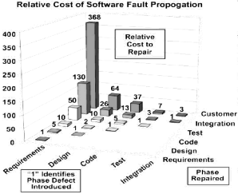
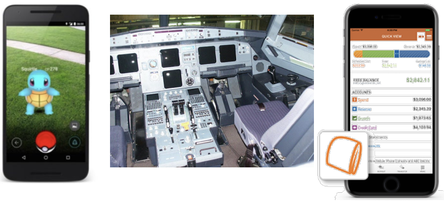

# 13. Intro to QA Testing

## Learning Goals
- Testing을 (비구조적) 차원에서 coverage를 달성하기 위한 활동으로 간주
- Usability, reliability, security, robustness (일반 및 아키텍처), performance, integration과 같은 품질 속성 평가를 위한 testing 전략 열거
- Trade-off를 제시하고 각 technique이 유용할 수 있는 시점 식별
- Testing을 프로젝트의 lifecycle 및 practice에 통합
- Test plan 개요 작성

## Quality Assurance (QA) is **HARD**
- QA & Software Testing은 MS에서 도전적인 과제
- Microsoft와 같은 대형 상용 소프트웨어 회사에서는 development만큼 testing 수행
- Developer만큼 많은 tester 보유. Tester는 항상 testing 수행, developer는 약 절반의 시간을 testing 과정에 참여
- Test case는 매우 비쌈. 프로그램 자체보다 test harness에 더 많은 code 라인 존재 (종종 약 3:1 비율)
- Time Estimates (in hours):

| Activity | Estimated | Actual
| - | - | -
| Testing plans | 3 | 0
| Unit testing | 3 | 1
| Validation testing | 4 | 2
| Test data | 1 | 1

## QA has Many Facets
- Questions
- Specification이 올바른지 어떻게 보장하는가?
- 시스템이 specification을 충족하는지 어떻게 보장하는가?
- 시스템이 사용자의 요구를 충족하는지 어떻게 보장하는가?
- 시스템이 잘못 동작하지 않는지 어떻게 보장하는가?

## Verification vs Validation
- Verification: 시스템이 specification을 충족하는가?
  - 즉, 시스템을 올바르게 구축했는가?
- Verification: Design 또는 code에 결함이 있는가?
  - 즉, 잘못된 design 또는 implementation 결정이 있는가?
- Validation: 시스템이 사용자의 요구를 충족하는가?
  - 즉, 올바른 시스템을 구축했는가?
- Validation: Specification에 결함이 있는가?
  - 즉, requirements 캡처를 잘못 수행했는가?

## Brief Case Discussion

> *어떤 qualities가 중요하며, 어떻게 그것을 보장할 수 있을까?*

## Very Important
- 모든 품질 문제를 완벽하게 해결할 수 있는 단일 analysis technique은 없음
- 어떤 technique이 적절한지는 여러 요인에 따라 다름
  - 해당 시스템 (및 크기/복잡성), 품질 목표, 가용 resource, 안전/보안 요구사항 등

## Definition: Software Analysis
> Software artifact의 속성을 결정하기 위한 체계적인 조사
- 포괄적이 되려는 시도
  - 예: Test coverage, inspection check list, exhaustive model checking
- 자동: Regression testing, static analysis, dynamic analysis
- 수동: Manual testing, inspection, modeling
- Code, system, module, execution trace, test case, design 또는 requirements 문서

## Principle Techniques
- Dynamic:
  - Testing: 통제된 환경에서 test data로 code를 직접 실행
  - Analysis: Test run에서 data를 추출하는 tool
- Static:
  - Inspection: Code, design 문서 (spec 및 model), 수정 사항에 대한 인간의 평가
  - Analysis: Tool이 program을 실행하지 않고 reasoning

## No Single Technique
- 모든 품질 문제를 완벽하게 해결할 수 있는 단일 analysis technique은 없음
- 어떤 technique이 적절한지는 여러 요인에 따라 다름
  - 해당 시스템 (및 크기/복잡성), 품질 목표, 가용 resource, 안전/보안 요구사항 등

## What is Testing?
- 통제된 환경에서 test data로 code를 직접 실행
- 주요 목표:
  - Verification: Program이 품질 속성을 포함한 requirements를 충족하는지 확인
  - Defect testing: Failure 발견
- 기타 목표:
  - Reveal bugs (주요 목표)
  - Assess quality (정량화 어려움)
  - Clarify the specification, documentation
  - Verify contracts
- "Testing shows the presence, not the absence of bugs.” -Edsger W. Dijkstra 1969

## Software Errors
- Functional errors
- Performance errors
- Deadlock
- Race conditions
- Boundary errors
- Buffer overflow
- Integration errors
- Usability errors
- Robustness errors
- Load errors
- Design defects
- Versioning and configuration errors
- Hardware errors
- State management errors
- Metadata errors
- Error-handling errors
- User interface errors
- API usage errors
- …

## What are We Covering?
- Program/system 기능:
  - Execution space (white box!)
  - Input 또는 requirements space (black box!)
- 예상되는 사용자 경험 (usability)
  - GUI testing, A/B testing
- 예상되는 performance envelope (performance, reliability, robustness, integration)
  - Security, robustness, fuzz, infrastructure testing
  - Performance 및 reliability: soak 및 stress testing
  - Integration 및 reliability: API/protocol testing

## “Traditional” Coverage
- Statement
- Branch
- Function
- Path (?)
- MC/DC

## We Can Measure Coverage on Almost Anything
- Testing을 위한 일반적인 adequacy criteria는 program execution 또는 specification space의 전체 "coverage"에 근접
- 주어진 verification 활동이 목표를 달성한 정도를 측정. 활동의 adequacy 근사
- 가장 자주 testing에 적용되지만, 모든 verification 활동에 적용 가능
- 측정된 항목 중 적어도 한 번 실행되거나 평가된 항목의 총 수에 대한 비율로 표현. 보통 백분율로 표현

## Testing Levels
- Unit testing
- Integration testing
- System testing

## JUnit
- Java를 위한 인기 있는 unit-testing framework
- 사용하기 쉬움
- Tool 지원 가능
- Design mechanism으로 사용 가능

## Test Driven Development
- Test 우선!
- 인기 있는 agile technique
- Code 작성 전 specification으로 test 작성
- 실패하는 test 없이 code 작성 금지
- 주장:
  - Testable design을 향한 design 접근 방식
  - Interface 우선 고려
  - 불필요한 code 작성 방지
  - 더 높은 제품 품질 (예: 더 나은 code, 더 적은 defect)
  - 더 높은 test suite 품질
  - 더 높은 전반적인 생산성

## Continuous Integration
- 자동으로 build, test 및 결과 표시

## Regression Testing
- 일반적인 model:
  - Bug fix 등을 위해 regression test 도입
  - Code가 evolve함에 따라 결과 비교
- Code1 + TestSet -> TestResults1
- Code2 + TestSet -> TestResults2
- Code가 evolve함에 따라 TestResults1을 TestResults2 등과 비교
- Specification이 변경되지 않는 한 동일해야 함
- 이점:
  - Bug fix가 유지되고 bug가 다시 나타나지 않도록 보장
  - Specification에 대한 의존도 감소

# The Oracle Problem

## What are We Covering?
- Program/system 기능:
  - Execution space (white box!)
  - Input 또는 requirements space (black box!)
- 예상되는 사용자 경험 (usability)
  - GUI testing, A/B testing
- 예상되는 performance envelope (performance, reliability, robustness, integration)
  - Security, robustness, fuzz, infrastructure testing
  - Performance 및 reliability: soak 및 stress testing
  - Integration 및 reliability: API/protocol testing

## Usability Testing
- Specification?
- Test harness? Environment?
- Nondeterminism?
- Unit testing?
- Automation?
- Coverage?

## Automating GUI/Web Testing
- 어려움
- Capture and Replay Strategy
  - Mouse actions
  - System events
- Test Scripts: ("Start" 버튼 클릭, Y 필드에 값 X 예상)
- 많은 tool 및 framework
  - 예: JUnit + Jemmy (Java/Swing)
  - Selenium (Web)
- (Model을 GUI와 분리하여 GUI testing 부하 방지)
- Functional correctness를 넘어서?

## Manual Testing?
- Live System?
- Extra Testing System?
- Check output / assertions?
- Effort, Costs?
- Reproducible?

## Usability: A/B Testing
- Control (A)과 treatment (B)인 두 가지 variant를 이용한 통제된 무작위 experiment
- 한 사용자 그룹에는 A (현재 시스템) 제공, 다른 무작위 그룹에는 B 제시. 결과 비교
- Web 또는 GUI 기반 application에서 자주 사용됨 (특히 광고 또는 GUI 요소 배치/design 결정 test)

# Example

## What are We Covering?
- Program/system 기능:
  - Execution space (white box!)
  - Input 또는 requirements space (black box!)
- 예상되는 사용자 경험 (usability)
  - GUI testing, A/B testing
- 예상되는 performance envelope (performance, reliability, robustness, integration)
  - Security, robustness, fuzz, infrastructure testing
  - Performance 및 reliability: soak 및 stress testing
  - Integration 및 reliability: API/protocol testing

## Security/Robustness Testing
- Specification?
- Test harness? Environment?
- Nondeterminism?
- Unit testing?
- Automation?
- Coverage?

## Random Testing
- Program의 input domain에서 무작위로 input 독립적 선택
  - Program의 input domain 식별
  - 난수를 해당 input domain에 mapping
  - 특정 확률 분포에 따라 input domain에서 input 선택
  - 해당 input에 대해 program이 적절한 output을 달성하는지 확인
- Random testing은 program의 faultiness에 대한 확률적 보장 제공
- 예: Failure 없이 약 23,000개 input (N = 23,000)을 사용한 random testing은 90% 신뢰도 (C = 0.9)로 program이 10,000번 중 1번 (F = 104) 이상 failure하지 않음을 입증

## Reliability: Fuzz Testing
- Program, device 또는 system에 malformed (비정상) 및 unexpected input data를 feed하여 security 관련 defect 또는 denial of service, degradation of service 또는 기타 원치 않는 behavior로 이어지는 critical flaw를 찾는 negative software testing 방법 (A. Takanen et al, 2008)
- Fuzz test를 생성하거나 fuzz testing을 수행하는 데 사용되는 program 및 framework를 fuzzer라고 함

## Types of Faulty Found
- Pointer/array errors
- Not checking return codes
- Invalid/out of boundary data
- Data corruption
- Signed characters
- Race conditions
- Undocumented features
- ...Possible tradeoffs?

## Fuzzing Process
- Seed pool
- 모든 seed input i1에 대해
1. 선택:
  - 선호되는 input 우선
2. 수정:
  - Bitflip
  - Byteflip
  - ...
- (Modified seed input)
- (One cycle)
3. 새 path를 cover하지 않는 input 버리기
3. 새 path를 cover하는 input을 pool에 추가

## Unit and Regression Testing for Performance
- Critical component의 execution time 측정
- Execution time을 log로 기록하고 시간에 따라 비교

## Profiling
- Execution time 및 memory 병목 현상 찾기

## Performance Testing During Design
- Modeling 및 simulation
  - 예: queuing theory

## Stress Testing
- Robustness testing technique: 정상 작동 한계를 넘어 test
- System granularity의 모든 level에서 적용 가능
- Stress test는 일반적으로 heavy load 하에서의 robustness, availability, error handling에 중점

## Soak Testing
- 문제: System이 인위적으로 제한된 execution 조건 하에서는 예상대로 작동할 수 있음
  - 예: Memory leak은 failure로 이어지는 데 더 오래 걸릴 수 있음
- Soak testing: 상당한 load 하에 상당한 time 동안 system을 testing (긍정)
- 주어진 duration과 threshold 하에서 simulated 환경의 test 대상 반응 확인에 사용

# Chaos Engineering

## Chaos Monkey
- Netflix infrastructure testing system
- "악의적인" program이 component, network, datacenter, AWS instance 등을 무작위로 손상
- Chaos monkey가 최초 – production instance를 무작위로 비활성화
- 다른 monkey로는 Latency Monkey, Doctor Monkey, Conformity Monkey 등이 있음. Infrastructure level에서의 Fuzz testing
- System architecture가 계획되지 않은/무작위 outage에 resilient한지 확인하기 위해 component의 failure 강제
- Netflix는 chaos monkey code를 open-source로 공개

# Brief Case Discussion

## What are We Covering?
- Program/system 기능:
  - Execution space (white box!)
  - Input 또는 requirements space (black box!)
- 예상되는 사용자 경험 (usability)
  - GUI testing, A/B testing
- 예상되는 performance envelope (performance, reliability, robustness, integration)
  - Security, robustness, fuzz, infrastructure testing
  - Performance 및 reliability: soak 및 stress testing
  - Integration 및 reliability: API/protocol testing

## Completeness?
- 통계적 threshold
  - 보고된/수리된 defect
  - Defect 종류의 상대적 비율
  - "Going gold" 예측 변수
- Coverage criterion
  - 예: 항공 software에 100% coverage 필요
  - Software 왜곡
  - Matrix: Test case를 requirements use case에 mapping
- 과거 data 참조 가능
  - 조직 내에서 project 간 비교 가능. 기대치 및 예측 변수 개발
  - 조직 간에는 commensurability의 어려움으로 인해 더 어려움 (예: 항공 software vs. 소비자 software)
- 경험 법칙: Error detection rate가 떨어질 때 (testing investment 대비 diminishing returns 의미)
- 가장 일반적: Time 또는 money 소진

## Limits of Testing
- 실행되지 않은 code의 bug를 찾을 수 없으며, bug 부재 보장 불가
- Oracle problem
- Nondeterminism, flaky tests
  - 특정 종류의 bug는 매우 드문 조건에서만 발생
- Specification 관찰/단언 어려움
  - Memory leaks, information flow, …
- 잠재적으로 비싸고 긴 실행 time
- 잠재적으로 높은 manual effort
- Verification, not validation
- ...