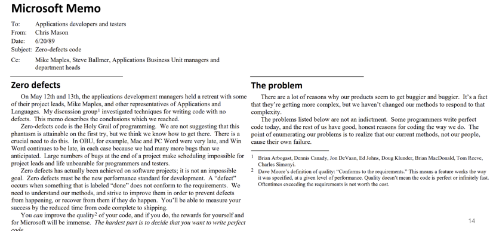
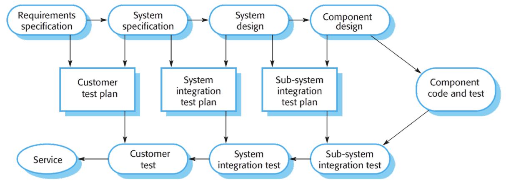
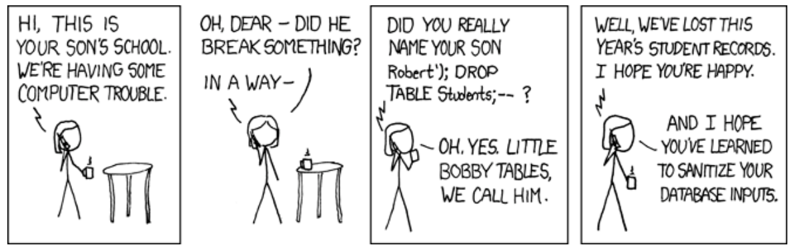

# 14. QA Process

## Quality Assurance Process
- How to get developers to
  - write tests
  - use static analysis
  - appreciate testers

## Learning Goals
- QA의 Process 측면 이해
- QA 기술들의 Tradeoffs 설명
- 주어진 프로젝트와 Quality attribute에 적합한 QA 기술 선택
- QA의 시점(When)과 분량(How much) 결정
- Process 내에서 QA 기술을 강제하는 방법에 대한 개념 개요
- Tools와 Policies를 Process에 통합하는 시점과 방법 선택: Daily builds, Continuous integration, Test automation, Static analysis, Issue tracking 등
- QA 기술 도입 시의 인간적 및 사회적 과제(Human and social challenges) 이해
- Process와 Tool 개선이 기능(Features)과 품질(Quality) 사이의 딜레마를 어떻게 해결할 수 있는지 이해

## QA Process Considerations
- 우리는 몇 가지 QA 기술을 (간략히) 다루었음
  - Formal verification
  - Unit testing, Test driven development
  - Quality attributes를 위한 다양한 형태의 Advanced testing (GUI testing, Fuzz testing 등)
  - Static analysis
  - Dynamic analysis
  - Formal inspections 및 다른 형태의 Code reviews
- 그러나: 언제 사용할 것인가? 어떤 기술을? 얼마나? 어떻게 도입할 것인가? Quality culture를 어떻게 확립할 것인가? 규정 준수(Compliance)를 어떻게 보장할 것인가? Social issues는? 외부 Components는 어떻게 할 것인가?

## Case Study: Google’s Tricorder

## Integrate Static Analysis in Review Process
- Code review 도구 내의 Bots으로서의 Static analysis
  - 각 Commit마다 자동으로 적용됨
  - 결과가 Author와 Reviewers에게 보임
- 가벼운 Checkers, 추가 및 수정이 용이함
- 효과적이지 않은 Checkers를 표시하기 위한 Feedback buttons 제공

## Tricorder
- Sadowski, Caitlin, et al. "Tricorder: Building a program analysis ecosystem." 2015 IEEE/ACM 37th IEEE International Conference on Software Engineering. Vol. 1. IEEE, 2015.

## Case Study: QA (previously) at Microsoft

## How does Microsoft Work?

## Microsoft's Culture
- 최고의 Developers 채용
  - "IBM이 수천 명이 필요한 일을 Microsoft는 수백 명의 일류 Developers로 달성할 수 있음"
- 그들에게 자유 부여
- 제품별 Teams가 크게 독립적임
- 비교적 짧은 Development cycles
  - Version updates (예: Excel 3->4) 1-2개월
  - New products 1-4년
  - Release date에 의해 주도됨
- 사전 Specification이 거의 없으며, 변경 및 기능 축소(Cutting features)에 유연함

## Early Days (1984): Separate Testing from Development
- Hardware manufacturers로부터의 Bug 불만 제기 후 (예: BASIC의 잘못된 계산)
- Customers가 제품에 대해 불만 제기
- IBM은 Microsoft가 개발 및 품질 관리(Quality control) Process를 개선할 것을 주장
- 심각한 데이터 파괴 Bug로 인해 Microsoft는 20,000명의 사용자에게 각각 $10의 비용을 들여 Multiplan 업데이트를 배송해야 했음
- Developers와 일부 Management(Balmer 포함)의 저항: "Developers가 스스로 자신의 제품을 테스트할 수 있으며, 가끔 고등학생, 비서, 외부 계약직의 도움을 받으면 됨"
- 외부 Testers 고용
- Formal inspections의 관료주의, 단계 간 Signoff, 또는 시간 기록(Time logging)을 회피
- 별도의 Testing group; Automated tests; 신규 입사자 및 Critical components에 대한 Code reviews

## Early Days (1986): Testing Groups
- "Developers가 게을러짐", QA를 Test team에 의존
- "Infinite defects" - Developers가 수정하는 속도보다 Testers가 Defects를 더 빨리 찾아냄
- 늦고 거대한 Integrations ("Big bang") - 긴 Testing periods, 출시 지연
- Mac Word 3 재앙: 8개월 지연, 수백 개의 Bugs (Crashing 및 데이터 파괴 Bugs 포함); 무료 업그레이드에 100만 달러 소요
- 품질 전달(Delivering quality)에 대한 압박 증가

## 1989 Retreat and “Zero defects”

## Zero-Defect Rules for Excel 4
- 모든 변경 사항은 Compile 및 Link 되어야 함
- 모든 변경 사항은 Mac 및 Windows에서 Automated quick tests를 통과해야 함
- 할당된 Open bugs가 10개를 초과하는 Developer는 새로운 기능을 진행하기 전에 이를 수정해야 함

## Testing Buddies
- Development와 Test teams가 분리되어 있으며, 대략 비슷한 규모
- Developers는 자신의 코드를 테스트하고 Automated tests를 매일 실행
- 개별 Testers가 종종 한 명의 Developer에게 배정됨
  - 그들의 Private releases (Branch)를 테스트하고, 코드가 Merge 되기 전에 이메일로 직접적이고 신속한 Feedback 제공

## Testers
- Support team 및 Customers와 소통하고, 미디어 평가를 검토하도록 장려됨
- High-risk 영역에 대한 Testing strategy 개발
- 다양한 형태의 Testing 수행 (내부적으로 불리는 명칭): Unstructured testing, Ad hoc testing, Gorilla testing, Free-form Fridays

## Early-mid 90s
- Zero defect 목표 (1989 memo)
- Milestones (1988년 Publisher 1.0에서 처음 도입)
- Version control, Branches, 빈번한 Integration
- Daily builds
- Automated tests ("Quick autotest") - Checkin 전에 반드시 성공해야 함
- Usability labs
- Beta testing (Win 95의 경우 400,000명의 Beta testers), Instrumentation 포함
- 간략한 Formal design reviews; 선별된 Code reviews
- Defect tracking 및 Metrics
- Developers가 한 Release cycle 이상 Product group에 머무름

## Metrics
- Severity(심각도) 별 Open bugs 수
  - Open bugs 수는 Milestone 전에 감소할 것으로 예상됨
  - 알려진 모든 심각한 Bugs는 Release 전에 수정되어야 함
  - Severity 1 (Product crash), Severity 2 (Feature crash), Severity 3 (Bug with workaround), Severity 4 (Cosmetic/Minor)
  - Releases 및 Projects 전반에 걸쳐 Metrics 추적
- Performance metrics
- Bug data는 "출시 준비 완료(Ready to ship)" 결정에 사용됨
  - 절대적인 관점이 아닌 상대적이고 실용적인 관점
  - "시장은 늦는 것은 용서하지만, 버그가 많은 것은 용서하지 않을 것이다"

## Challenges of Microsoft’s Culture
- Product teams 간의 소통이 거의 없음
- Developers와 Testers가 종종 "Software engineering 문헌을 잘 읽지 않아, 바퀴를 재발명(Reinventing the wheel)함"
  - Architecture, Design, Components 공유, Quality metrics 등을 오랫동안 과소평가함
- Developers가 변화와 "관료주의(Bureaucracy)"에 저항함

## Project Postmortem
- 체계적인 문제점과 모범 사례 식별 (10-150 페이지 보고서)
  - 반복되는 문제와 잘 작동하는 관행 문서화
  - 예
    - Breadth-first → Depth-first & Tested milestones
    - 불충분한 Specification
    - Commits를 리뷰하지 않음
    - 가정(Assumptions)을 전달하기 위해 Asserts 사용
    - 적절한 Tools 부족 → Automated tests
    - Testers와 Beta releases를 위한 Instrumented versions
    - Zero defect rule이 Developers의 우선순위가 아님
- 메모(Memos)로 통찰력을 순환시키고, Team 간 학습 장려

## Process Audits
- 문제가 있는 Projects에 대한 비공식적인 1주 Audits
- Metrics 분석, Team members 인터뷰
- 다른 Teams의 Best practices를 채택하도록 권고
  - Daily builds, Automated tests, Milestones, Reviews

## The 2002 Trustworthy Computing Memo
- Microsoft가 고객의 신뢰를 확보하고 유지하기 위해 회사 차원에서 해야 할 많은 변화들이 있음 - Software 개발 방식부터 지원 노력, 운영 및 비즈니스 관행에 이르기까지
- Software가 더욱 복잡해지고, 상호 의존적이며 상호 연결됨에 따라, 회사로서의 평판 또한 더 취약해졌음
- 단일 Microsoft 제품, 서비스 또는 정책의 결함(Flaws)은 Platform 및 Services 전반의 품질뿐만 아니라, 회사에 대한 고객의 시각에도 영향을 미침

## Code Reviews
- 자체 Code review 도구 보유 (Passaround style)
- Reviews가 얼마나 효과적인지에 대한 내부 연구
- Code reviews를 개선하기 위한 내부 Tools

## SLAM/SDV (since 2000)
- 목표: 종종 Drivers에 의해 발생하는 Blue screens 감소
- C 언어용 Driver verification tool
- Model checking 기술
- 좁은 범위의 Protocol 위반(Violations) 클래스 발견
  - Drivers의 특성 사용 (일반 C 코드가 아님)
  - Microsoft의 잘 테스트된 샘플 Drivers에서 여러 Bugs 발견
- Microsoft compiler suite에서 완전히 자동화됨
- 무료로 이용 가능
- Driver certification program을 통해 강제됨
- 강력한 비즈니스 사례: 대부분의 Blue screens 제거
- Model checking의 기초 과학에 기반: 공공 자금 지원을 받은 대학 연구실에서 유래

## 2010: Agile
- Web-based services 및 C++ 진화는 더 빠른 Iteration 요구
- Agile 방법론 수용
- Testing team의 대규모 축소 (Developer 당 2명의 Testers에서 1명 미만으로): 이제 Developers가 자신의 Testing을 수행할 것으로 기대됨

## Annotation
- 수백만 줄의 Unannotated code가 있는 상황에서 Developers에게 어떻게 동기를 부여할 것인가?
- Microsoft의 접근 방식
  - Checkin 시 Annotations 요구 (예: __ecount()가 없는 char*가 포함된 코드 거부)
  - 어차피 주석(Comment)에 넣을 내용처럼 Annotations를 자연스럽게 만듦
- 이제 기계가 확인 가능(Machine checkable)
- Engineering practices와 맞지 않는 Formality 회피
  - 점진성(Incrementality)
- 모든 Compile 마다 Code design consistency 확인
- 노력의 각 증가분(Increment)에 대해 프로그래머에게 보상
  - 부분적인 Code에 Annotations를 달아도 이점 제공
  - Code의 가장 중요한 부분에 먼저 집중 가능
  - 핑계 방지: 마감일 이후에 하겠다
- Annotations를 추론(Infer)하는 Tools 구축
  - Inference는 근사적이어서 Annotations 변경이 필요할 수 있지만, 전반적인 작업 절약
  - 불행히도 Microsoft 외부에서는 아직 사용 불가

## SAGE
- White-box fuzz testing (Symbolic-execution 기반 Test generation)
- 특히 File 및 Protocol parsing routines의 Security issues 대상
  - "Image processors, Media players, File decoders, Document parsers를 포함한 수백 개의 Microsoft applications에서 이전에 알려지지 않은 많은 Security vulnerabilities 발견"
- 자체 SMT constraint solver (Z3)
- Research project에서 Large-scale deployment로 발전
  - 200대의 머신에서 대규모 실행

## Bug Prediction
- Metrics
- Software repositories 마이닝(Mining)
- 결과 예시
  - Distributed development는 중요하지 않지만, Organizational distance는 중요함
- 현재 Testing effort 우선순위 지정에 활용 중

## Boogie, Dafny, ...
- Intermediate Verification Language
- "사용 가능한 Formal verification"
  - Dafny 언어...
- 현재 활발히 연구 중...

## Case Study: Microsoft
- Microsoft는 Features 단위로 Software 계획
- Release 당 3-4개의 Milestones
- 각 Milestone 이후, 어떤 Features를 여전히 구현해야 할지 재고
- Milestone 말에 Stabilization 및 Freeze

## Prepare Servicing Strategy for Windows 10 Updates

## QA Process Considerations
- 우리는 몇 가지 QA 기술을 (간략히) 다루었음
  - Formal verification
  - Unit testing, Test driven development
  - Quality attributes를 위한 다양한 형태의 Advanced testing (GUI testing, Fuzz testing 등)
  - Static analysis
  - Dynamic analysis
  - Formal inspections 및 다른 형태의 Code reviews
- 그러나: 언제 사용할 것인가? 어떤 기술을? 얼마나? 어떻게 도입할 것인가? Quality culture를 어떻게 확립할 것인가? 규정 준수(Compliance)를 어떻게 보장할 것인가? Social issues는? 외부 Components는 어떻게 할 것인가?

## Start QA As Soon As Possible

## Qualities and Risks
- 어떤 Qualities가 요구되는가? (Requirements engineering)
- 어떤 Risks가 예상되는가?
- Qualities와 Risks에 기반하여 QA strategy 조정(Align)

## Test Plans Linking Development and Testing

## Example: SQL Injection Attacks

> 어떤 QA strategy가 적합한가?

## Example: Scalability
- 어떤 QA strategy가 적합한가?

## Example: Usability
- 어떤 QA strategy가 적합한가?

## QA Tradeoffs
- QA 접근 방식의 한계 이해
  - 예: Testing 대 Static analysis, Formal verification 대 Inspection 등
- 기술들을 혼합하여 사용(Mix and match)
- 다른 Qualities를 위해 다른 기술 사용

# QA within the Process

## QA as Part of the Process
- Milestones에서의 QA 산출물(Deliverables) 보유 (Management policy)
  - Milestone 전 Inspection / Test report
- Development practices 변경 (Developer의 동의 필요)
  - 예: Continuous integration, Pair programming, Reviewed checkins, Zerobug, Checking 전 Static analysis
- Code review의 일부로서의 Static analysis (Google)
- Bugs 및 기타 Quality metrics 추적

## Defect Tracking
- Issues: Bug, Feature request, Query
- 측정(Measurement)의 기초
  - 어떤 Phase에서 보고되었는가
  - 수리 기간, 난이도
  - 분류(Categorization)
  - → Root cause analysis
- 의사소통 촉진(Facilitates communication)
  - 보고자에게 다시 질문
  - 보고서가 잊히지 않도록 보장
- 책임(Accountability)

## Enforcement
- Microsoft: Check in gates
  - Analysis suite가 실행되어 오류가 생성되지 않아야 Code를 Check in 가능
  - Test coverage, Dependency violation, 불충분/나쁜 Design intent, Integer overflow, Allocation arithmetic, Buffer overruns, Memory errors, Security issues
- eBay: Dev/QA handoff
  - Developers는 데스크탑에서 FindBugs 실행
  - QA는 Code 수신 시 FindBugs 실행, 결과 게시, 높은 우선순위 수정 요구
- Google: Commits에 대한 Static analysis, Review에 표시됨
- 성공을 위한 요구사항
  - 낮은 False positives
  - False positive 경고를 무시(Override)할 수 있는 방법 (일반적으로 Inspection을 통해)
  - Developers가 먼저 Static analysis를 받아들여야 함

# Social Aspects

## Social Issues
- Defects에 대한 Developer의 태도
- Security에 대한 Developer 교육
- QA practices 강제를 위해 동료 압력(Peer pressure) 사용
  - Breaking the build - 다양한 규칙들
- Developer 대 Tester 문화
- Testers는 나쁜 소식을 전하는 경향이 있음
- 성과 평가(Performance evaluations)에 Defects 포함?
- Issues 대 Defects
- 좋은 Test suits는 신뢰도(Confidence)를 높이고, Shared code ownership 장려

## Reporting Defects
- 재현 가능한(Reproducible) Defects
- 간단하고 일반적임(Simple and general)
- 보고서 당 하나의 Defect
- 적대적이지 않음(Non-antagonistic)
  - (Testers는 보통 나쁜 소식을 가져옴)
  - 문제(Problem)를 진술
  - 비난하지 않음(Don't blame)

## Reporting Defects (BAD)

## Reporting Defects (GOOD)

## Summary
- QA plan 개발
  - Quality goals 및 Risks 식별
  - 접근 방식 혼합 및 매칭(Mix and match)
  - QA 강제(Enforce), 관행(Practices) 확립
- Microsoft의 Case study
- Process 내 QA 통합
- QA의 Social issues