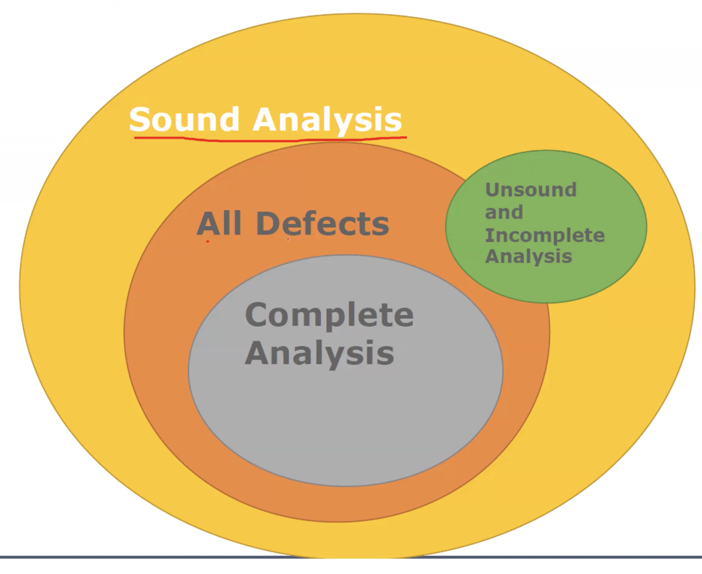
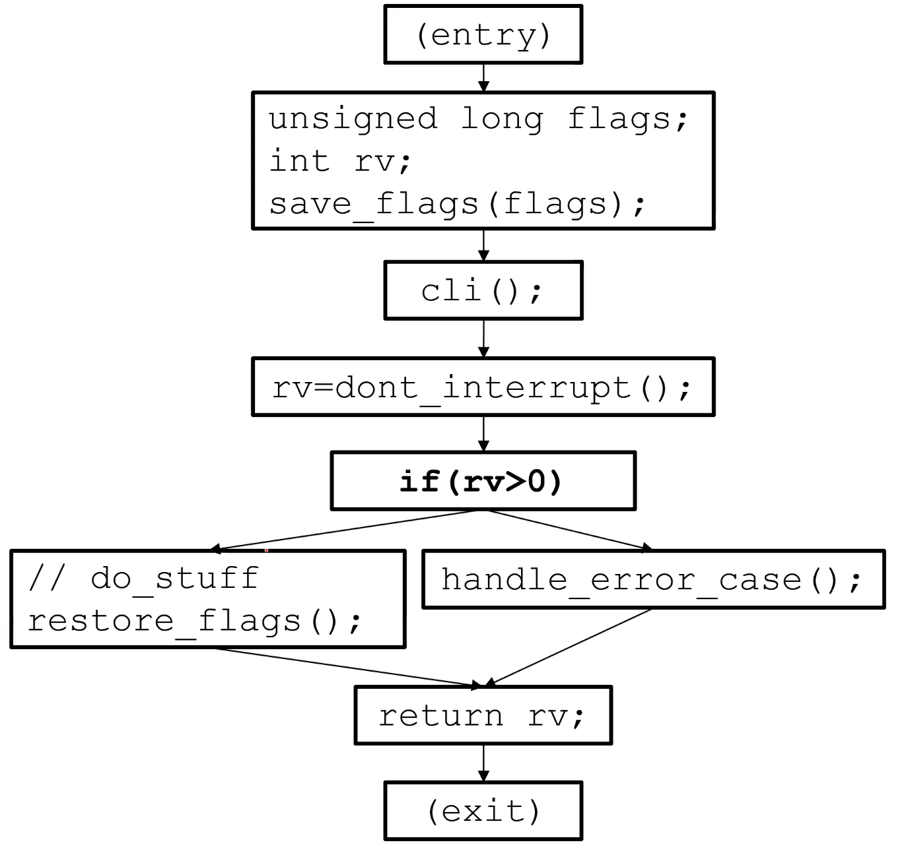
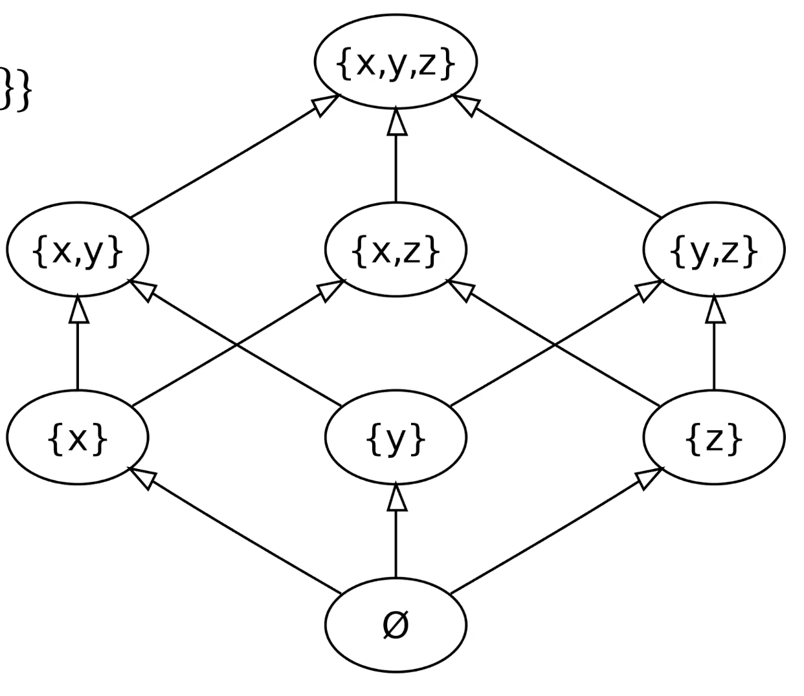

# 16. Static Analysis

## Learning Goals
- 한 문장으로 정적 분석 정의 및 정적 분석이 목표로 하는 Bug 유형 설명
- Syntactic 또는 Structural 정적 분석의 예시 제시
- 간단한 예제에 대해 기본적인 Control Flow Graph를 수작업으로 작성
- Control-flow 분석과 Dataflow 분석의 구별, 코드 예제에서의 정의 및 단계별 수행
- Dataflow Analysis 구현
- 정적 분석이 왜 Sound, Complete, Terminating할 수 없는지에 대한 고차원적 설명 및 분석 설계의 trade-off 평가
- 정적 분석을 수행하는 도구의 특성 파악 및 선택

## `goto fail;`
```c
static OSStatus
SSLVerifySignedServerKeyExchange(SSLContext *ctx, bool isRsa, SSLBuffer signedParams, uint8_t *signature, UInt16 signatureLen) {
    OSStatus err;
    …
    if ((err = SSLHashSHA1.update(&hashCtx, &serverRandom)) != 0)
      goto fail;
    if ((err = SSLHashSHA1.update(&hashCtx, &signedParams)) != 0)
      goto fail;
      goto fail;
    if ((err = SSLHashSHA1.final(&hashCtx, &hashOut)) != 0)
        goto fail;
    …
    fail
    SSLFreeBuffer(&signedHashes);
    SSLFreeBuffer(&hashCtx);
    return err;
}
```

## A Bug in the Old Linux Kernel
```c
/* from Linux 2.3.99 drivers/block/raid5.c */
static struct buffer_head *
get_free_buffer(struct stripe_head * sh, int b_size) {
    struct buffer_head *bh;
    unsigned long flags;
    save_flags(flags);
    cli(); // disables interrupts
    if ((bh = sh->buffer_pool) == NULL)
        return NULL;
    sh->buffer_pool = bh -> b_next;
    bh->b_size = b_size;
    restore_flags(flags); // re-enables interrupts
    return bh;
}
```

## Could You Have Found Them?
- 이러한 Bug들이 얼마나 자주 발생할 것인가
- Driver Bug
  - Interrupt가 비활성화된 상태에서 Driver로부터 반환될 경우 발생하는 일
  - 고려사항: 단일 함수
- 2000줄(LOC) 파일 내의 경우
- 60,000줄(LOC) 모듈 내의 경우
- 리눅스 커널(LINUX KERNEL) 내부의 경우
- 교훈: 일부 결함은 테스트나 검사를 통해 발견하기 매우 어려움

[https://www.cnet.com/news/privacy/klocwork-our-source-code-analyzer-caught-apples-gotofail-bug/](https://www.cnet.com/news/privacy/klocwork-our-source-code-analyzer-caught-apples-gotofail-bug/)

## Defects of Interest
- 테스트와 대조적으로 일반적이지 않거나 강제하기 어려운 실행 경로상에 존재
- 이러한 결함을 찾기 위해 모든 경로를 구체적으로 실행(또는 해석/분석)하는 것은 불가능
- 실제로 원하는 것은 프로그램의 전체 가능한 상태 공간(State Space)을 확인하여 특정 속성을 검사하는 것

## Defects Static Analysis Can Catch
- 단순하고 기계적인 설계 규칙을 일관되게 따르지 않음으로 인해 발생하는 결함.
  - Security: Buffer 오버런, 부적절하게 검증된 입력
  - Memory safety: Null 역참조, 초기화되지 않은 데이터
  - Resource leaks: Memory, OS 리소스
  - API Protocols: Device drivers, 실시간 라이브러리, GUI 프레임워크
  - Exceptions: 산술/라이브러리/사용자 정의
  - Encapsulation: 내부 데이터 접근, 비공개 함수 호출
  - Data races: 동기화 없이 두 스레드가 동일한 데이터에 접근
- Key: 단순하고 기계적인 설계 규칙 준수 여부 확인

# Defining Static Analysis

## What is Static Analysis?
- 프로그램 상태 공간의 추상화에 대한 체계적인 검사
  - 코드를 실행하지 않음(코드 리뷰와 유사)
- Abstraction: 분석하기 더 간단한 프로그램의 표현 생성
  - 탐색할 상태 수가 적어짐, 어려운 문제를 다루기 쉽게 만듬
- 전체 상태 공간에 대해 특정 속성이 유지되는지 확인
  - Liveness: "좋은 일이 결국 발생함"
  - Safety: "나쁜 일이 절대 발생하지 않음"

## The Bad News: Rice’s Theorem
> "튜링 머신에 의해 인식되는 언어에 대한 비자명한 속성은 결정 불가능하다" (Henry Gordon Rice, 1953)
- 모든 정적 분석은 필연적으로 Incomplete하거나 Unsound하거나 Undecidable함 (혹은 이것들의 복합)

## Soundness and Completeness
| | 에러 존재 | 에러 존재하지 않음
| - | - | -
| 에러 보고됨 | True positive<br>(correct analysis result) | False positive
| 에러 보고되지 않음 | False negative | True negative<br>(correct analysis result)

- Sound Analysis
  - 모든 결함을 보고
  - False negative가 없음
  - 일반적으로 과대 근사(Overapproximated)
- Complete Analysis
  - 보고된 모든 결함이 실제 결함임
  - False positive 없음
  - 일반적으로 과소 근사(Underapproximated)



# Simple Syntactic and Structural Analyses

## Syntactic Analysis
- 특정 패턴의 모든 발생 찾기
```java
public foo() {
  …
  logger.debug(“We have ” + conn + “connections.”);
} 
public foo() {
  …
    if (logger.inDebug()) {
    logger.debug(“We have ” + conn + “connections.”);
    }
}
```
- Grep 명령어 예시: `grep "if \(logger\.Debug\(" . -r`

## Type Analysis
```java
public void foo() {
    int a = computeSomething();

    if (a == "5")
        doMoreStuff();
}
```

## Abstraction: Abstract Syntax Tree
- 소스 코드의 구문 구조를 트리로 표현
  - Parser가 구체적인 구문을 추상 구문으로 변환하고 결과적인 모호성 처리
- 의미적으로 관련된 정보만 기록
  - Abstract: 모든 세부 사항(괄호 등)을 표현하지 않으며, 이러한 것들은 구조에서 유추 가능
- 컴파일러를 통해 생성 가능
- 예시: $5 + (2 + 3)$

## Type Checking
- Class X, Logger 등의 구조 및 메서드 호출 관계를 보여주는 다이어그램 및 코드
- Class X
  - Field: logger
  - Method: foo
    - If stmt
      - Method Invoc.: logger inDebug
      - Block
        - Method Invoc.: logger debug
        - Param.: String 연결
- Logger 클래스 구조
  - `boolean inDebug() {…}`
  - `void debug(String msg) {…}`


## Abstract Syntax Tree Walker
- `Logger.inDebug` 체크 외부에서 디버깅 로그를 표시하지 않는지 확인
- Abstraction
  - `Logger.debug()` 호출만 확인
  - 모두 `if (Logger.inDebug())`로 감싸져 있는지 확인
- Systematic: 모든 코드 검사
- Abstract Syntax Tree (AST) Walker로 알려짐
  - 코드를 구조화된 트리로 취급
  - Control Flow, 변수 값, Heap 무시
  - Code style checker가 이와 같은 방식으로 작동

## Structural Analysis


# Bug Finding

## Structural Analysis to Detect goto fail;?
- `goto fail;` 중복 코드가 포함된 `SSLVerifySignedServerKeyExchange` 함수 코드 재제시

## Summary of Syntactic/Structural Analyses
- Token 스트림 또는 코드 구조(AST) 분석
- 패턴을 찾는 데 유용
- 실행 경로와 무관한 국소적/구조적 속성

## Tools
- Checkstyle
- 다수의 Linter (C, JS, Python 등)
- Find bugs (일부 분석)

## Tools: Compilers
- Type checking, 적절한 초기화 API, 올바른 API 사용

- 프로그램
  ```c
  int add(int x, int y) {
      return x + y;
  }

  void main() {
      add(2);
  }
  ```
- 컴파일러 출력
  ```sh
  $> error: too few arguments to function 'int add(int, int)'
  ```

- 높은 경고 레벨로 컴파일
  - 예: `$ gcc -Wall`

# Control-Flow Analysis

## Control/Dataflow Analysis
- Control Flow Graph를 통한 경로로 모든 가능한 실행에 대해 추론
  - 모든 프로그램 지점에서 관심 있는 속성과 관련된 정보 추적
  - Exception 처리, 함수 호출 등 포함.
- 관심 있는 속성과 관련된 값/상태만 포착하는 Abstract domain 정의
- 그래프를 통한 모든 가능한 실행(경로)에 대해 가능한 모든 구체적인 값 대신 Abstract state 추적

## Control Flow Graphs
- 프로그램을 통한 제어 흐름의 트리/그래프 기반 표현
  - 모든 가능한 실행 경로 포착
- 각 노드는 Basic block: 내부로 들어오거나 나가는 점프 없음
- 엣지(Edges)는 노드 간의 제어 흐름 옵션 표현
- Intra-procedural: 단일 함수 내 (cf. Inter-procedural)

```c
a = 5 + (2 + 3)
if (b > 10)
    a = 0;
return a;
```

- 노드 0\~6으로 구성된 그래프 구조

## Control Flow Graphs (CFG)

```java
public int foo() {
    doStuff();

    return 3;

    doMoreStuff();
    return 4;
}
```


## A Bug in the Old Linux Kernel
- 리눅스 RAID 드라이버(`raid5.c`)의 `get_free_buffer` 함수 코드
- 해당 함수에 대한 Control Flow Graph 그리기 (단순화 포함)

## Example of a CFG
- `int foo()` 함수 예제 코드
  - `save_flags`, `cli`, `dont_interrupt` 호출
  - `if (rv > 0)` 분기 및 복구 로직
- Entry부터 Exit까지의 흐름도 표현
- 동일한 `foo()` 함수의 흐름도 표현 반복



## Control/Dataflow Analysis
- Control Flow Graph를 통한 경로로 모든 가능한 실행에 대해 추론
  - 모든 프로그램 지점에서 관심 있는 속성과 관련된 정보 추적
  - Exception 처리, 함수 호출 등 포함.
- 관심 있는 속성과 관련된 값/상태만 포착하는 Abstract domain 정의
- 그래프를 통한 모든 가능한 실행(경로)에 대해 가능한 모든 구체적인 값 대신 Abstract state 추적

## Abstract Domain: Lattices
- Lattice $D = (S, r)$
  - $D$는 프로그램 속성의 Domain
  - $S$는 요소들의 집합(무한할 수 있음)
- $S$는 유일한 최대 요소(Top)와 최소 요소(Bottom)를 반드시 포함해야 함.
  - $r$은 $S$의 요소들에 대한 이항 관계
- $r$의 필수 속성
  - 부분 순서(Partial order): 반사적, 추이적, 반대칭적
  - 모든 요소 쌍은 유일한 최대 하한(Meet)과 유일한 최소 상한(Join)을 가짐

## Example of a Lattice
- $D = (2^{\{x,y,z\}}, \subseteq)$
  - $2^{\{x,y,z\}} = \{\emptyset, \{x\}, \{y\}, \{z\}, \dots, \{x, y, z\}\}$

  

## Say What? Why We Need It?
- 모든 프로그램 지점에서 관심 속성과 관련된 모든 가능한 값 추적
- 가능한 값(추적 중인 정보)은 Domain을 정의하는 Lattice의 요소로 모델링
- 프로그램 전체에서 정보가 어떻게 변하는지 설명하는 제약 조건을 구축하여 정보를 계산하는 데 Lattice 사용
  - Transfer function: 명령어가 상태에 미치는 영향
  - Meet/Join: Control Flow의 영향

## Abstract Domain: Interrupt Checker
```
      maybe-enabled
    /               \
enabled          disabled
      \          /
            ?
```

## Reasoning about a CFG
- 분석은 프로그램 지점(노드 사이의 지점)에서 상태를 업데이트함.
- 각 노드에 대해
  - 선행 노드(Predecessors)의 상태를 검사/결합하여 진입 시 상태 결정
  - 연산(Transfer)의 효과에 기반하여 노드 종료 시 상태 평가
- 각 프로그램 지점의 상태가 변하지 않을 때까지 후행 노드(Successors)와 전체 그래프를 통해 반복
- **Output: 각 프로그램 지점에서의 상태**

## An Interrupt Checker
- **Abstraction**
  - 3가지 Abstract states: **Enabled, Disabled, Maybe-enabled**
  - Interrupt가 disable된 상태로 함수 끝에 도달할 수 있는지 alarm을 줌.
- Transfer function
  - Basic block에 `cli()` 호출이 포함된 경우, 분석 상태를 **Enabled**에서 **Disabled**로 변경
  - Basic block에 `restore_flags()` 호출이 포함된 경우, 분석 상태를 **Disabled**에서 **Enabled**로 변경

## Transfer Function
- 가정: 블록 전 프로그램 지점의 Interrupt enabled
  ```
          ↓
  ┏━━━━━━━━━━━━━━━━━━━┓
  ┃ // do_stuff       ┃
  ┃ restore_flags();  ┃
  ┗━━━━━━━━━━━━━━━━━━━┛
          ↓
  ```
- 블록 후 프로그램 지점: Interrupt disabled

## Join
- 가정: 블록 전 프로그램 지점의 Interrupt disabled
```
                    ┏━━━━━━━━━━━━┓
                    ┃ if(rv > 0) ┃
                    ┗━━━━━━┳━━━━━┛
          ┌────────────────┴────────────────┐
          │                                 │
          ▼                                 ▼
  True branch:                          False branch:
  interrupts disabled                   interrupts disabled

┏━━━━━━━━━━━━━━━━━━━┓                 ┏━━━━━━━━━━━━━━━━━━━━━━┓
┃ // do_stuff       ┃                 ┃ Handle_error_case(); ┃
┃ Restore_flags();  ┃                 ┗━━━━━━━━━━┳━━━━━━━━━━━┛
┗━━━━━━━━━┳━━━━━━━━━┛                            │
          │                                      │
  interrupts enabled                    interrupts disabled
          │                                      │
          └────────────────┬─────────────────────┘
                           ▼
                    ┏━━━━━━━━━━━━┓
                    ┃ return rv; ┃
                    ┗━━━━━━━━━━━━┛

                   interrupts...???
```

## Join/Branching
- 다수의 이전 상태로부터 오는/가는 정보를 어떻게 처리할 것인가
- 분기(Branch)에 도달했을 때 수행할 작업
  1. 각 경로를 개별적으로 탐색
      - 각 경로에 대한 가장 정확한 정보
      - 그러나 경로의 수가 무수히 많을 수 있음
      - 상태 폭발(State explosion) 발생, 루프는 무한성 문제 추가
  2. Join!
    - 경로를 다시 하나로 결합
    - 덜 정확하며 정보 손실 발생 (Rice's theorem)
    - 그러나 상태 폭발이 없으며 종료됨 (Terminate)
- 조건문뿐만 아니라 루프, Switch, Exception도 해당됨

## Interrupt Analysis: Join Function
- Abstraction
  - 3가지 상태: Enabled, Disabled, Maybe-enabled
  - Program counter
- Join: Basic block의 선행 노드 중 적어도 하나가 Interrupt enabled이고 적어도 하나가 Disabled인 경우
  - Join(Enabled, Enabled) → Enabled
  - Join(Disabled, Disabled) → Disabled
  - Join(Disabled, Enabled) → Maybe-enabled
  - Join(Maybe-enabled, \*) → Maybe-enabled

## Example of the Interrupt Analysis
- `foo()` 함수 예제에 대한 분석 추적
- 각 단계별 상태 변화 ($\sigma →$ Enabled/Disabled)
- 문제 발생 지점: $\sigma →$ Maybe-enabled


## Abstraction
- 간단한 코드 예제
  - `cli();`
  - `if (*)` 분기 내 `restore_flags();`
  - 종료 시점 상태 확인

## Too Simple?
- 함수당 전역 상태(Control flow analysis)만 추적하는 것도 유용함.
  - 예: 다수 컴파일러(예: Java)의 Dead-code 감지
  - 결정 지점 전후의 동적 분석을 위한 Instrumentation, 루프 감지
  - 리눅스 커널의 실제 Interrupt 분석
- 복잡성을 한 단계 높이는 것은 변수당 상태를 추적하는 것 (Dataflow analysis)
- 예: 변수 x가 0이 될 수 있는가
  - 원본 Domain: $N$은 모든 변수를 정수로 매핑. 가능한 구체적 상태 수는 거대함.
    - $n$개의 32비트 변수는 $2^{32*n}$개의 상태 초래
    - 루프가 있으면 상태가 무한히 변할 수 있음
  - Abstract state space는 훨씬 작음: 변수가 Zero, Not-zero, 또는 Maybe-zero ($2^{n*3}$)

# Data-Flow Analysis

## Data- VS. Control-Flow
- Dataflow: 프로그램 내 변수(일부 부분 집합) 각각에 대한 Abstract value 추적
- Control flow: 해당 함수에 대한 전역(Global) 상태 추적

## Example: Zero/Null-pointer Analysis
- 변수 x가 0이 될 수 있는가?
  - (어떤 종류의 오류를 확인할 수 있는가?)
- 원본 Domain: $N$은 모든 변수를 정수로 매핑
- Abstraction: 모든 변수는 Non zero(NZ), Zero(Z), 또는 Maybe zero(MZ)임

## Zero Analysis Transfer
- 어떤 연산이 관련되어 있는가?
- 변수를 업데이트할 수 있는 모든 연산!

## Zero Analysis Join (per Variable)
- Join(Zero, Zero) → Zero
- Join(Not-zero, Not-zero) → Not-zero
- Join(Zero, Not-zero) → Maybe-zero
- Join(Maybe-zero, \*) → Maybe-zero

## Example

```c
x = 10;
y = x;
z = 0;
while (y > -1) {
    x = x / y;
    y = y - 1;
    z = 5;
}
```
- 나눗셈에서 y가 0이 될 수 있는지 확인하기 위해 **Zero analysis** 사용
- 1차 반복
  - 각 라인별 상태(NZ, Z, MZ) 변화 추적
  - Join 적용 결과
- 2차 반복
  - 상태 변화 및 Join 적용 결과
  - $y → MZ$ 등 상태 업데이트
- 3차 반복
  - 이전 상태와 비교하여 변경 사항 없음 (Stable, Fixed point 도달)
  - 경고: Div-by-zero 오류 발생 가능

## Abstraction at Work
- 가능한 상태의 수는 거대함.
  - $n$개의 32비트 변수는 $2^{32*n}$개의 가능한 상태
  - $2^{32*3} = 2^{96} \approx 7.92 \times 10^{28}$
  - Loop가 있으면 상태가 무한히 변할 수 있음
- Zero Analysis는 상태 공간을 좁힘
  - 4개의 Abstract values (Z, NZ, MZ, $\bot$)
  - $2^{4*3} = 2^{12} = 4096$
  - 이 제한된 공간이 탐색되면 완료됨
- 모든 루프 반복에 대해 외삽(Extrapolate)

## Termination Intuition
- Termination을 항상 보장하지는 않음. 수렴(fixed point)하지 않을 수 있음.
- 전체 프로그램에 대해 정보가 변하지 않을 때까지 원하는 순서대로 명령어를 처리할 수 있음
  - 계산되지 않은 모든 상태의 초기 상태로 특별한 값 사용
- 함수의 고정점(Fixed point)은 함수가 자신에게 매핑하는 데이터 값 $\nu$임
  - $-f(v) = v$
- Flow function은 수학적 함수임
- 각 고정점에서의 Dataflow analysis 상태는 데이터 값임

## The Bad News: Rice’s Theorem
> **"튜링 머신에 의해 인식되는 언어에 대한 비자명한 속성은 결정 불가능하다"  (Henry Gordon Rice, 1953)**
- 모든 정적 분석은 필연적으로 Incomplete하거나 Unsound하거나 Undecidable함 (혹은 이것들의 복합)

## Computability Theory says…
- 정지 문제(Halting problem): 주어진 프로그램이 주어진 입력에 대해 정지/종료할지 결정하는 문제
- 이 문제를 해결하는 일반적인 알고리즘은 불가능
  - 더 구체적으로, 결정 불가능함 (Yes 답은 얻을 수 있지만, No 답은 얻을 수 없음)
- 때때로 휴리스틱을 사용할 수 있지만, 모든 프로그램에 대해 일반적으로 해결하는 것은 여전히 불가능
```py
def g():
  if halts(g):
    loop_forever()
```

## OK, So?
- 어떤 프로그램이 비자명한 속성(절대 Null 역참조 안 함, 항상 모든 파일 핸들 해제 등)을 갖는지 정적으로 항상 알 수 있다면, 정지 문제도 일반적으로 해결할 수 있음
- ...그러나 정지 문제는 명백히 불가능함.
- 따라서, 완벽한 정적 분석은 없음. 항상 False positive나 False negative(또는 둘 다)를 가짐
- 모든 도구는 trade-off를 가짐

## Sound vs. Heuristic Analysis vs. Reality
- Heuristic Analysis
  - FindBugs, Coverity, Checkstyle 등
  - 규칙 따름, 근사치 사용, False positive를 줄이기 위해 일부 검사 회피
  - False positive와 False negative 모두 보고할 수 있음
- Sound Static Analysis
  - Type checking, Not-Null 등 (특정 결함 클래스)
  - Sound Abstraction, False positive를 줄이기 위한 정밀한 분석
- 그러나 실제로는, 언어가 복잡하며, 모든 도구는 내부적으로 무엇을 모델링할지/실제 abstraction을 어떻게 할지에 대한 결정이 필요함.

## Example: Null Pointers
```
int foo() {
    Integer x = new Integer(6);

}
```


## What About that Function Call?
- 몇 가지 간단한 옵션
  - 완전히 엉뚱한 Control Flow(Exception, Longjumps)가 우려된다면, 더 복잡한 Control Flow Graph로 모델링 가능
  - 모든 함수가 반환된다고 가정하고 "프로그램이 종료된다고 가정할 때, 분석이 Sound하게 계산됨..."이라고 주장하며 무시
    - 대부분의 사람들은 신경 쓰지 않으며 기본적으로 가정함.
- Interprocedural 분석이 존재하지만 확장하기 어렵고 본 강의 범위를 벗어남.
  - 예: 단일의 큰 그래프 구축 또는 메서드 레벨에서의 추상화; 종종 도움을 주기 위한 수동 주석(Annotation) 사용

## Try-Catch?


## Design Choices: Representation and Abstract Domain
- Try/catch를 모델링하지 않는다면 어떠한가
- 한다면... 어떻게 포함해야 하는가
- `IOException`이 아닌 경우는 어떠한가
- 더 넓은 질문: Semantics를 얼마나 정밀하게 모델링해야 하는가
  - 예: 명령어, 조건 확인 등의 Semantics

## Upshot: Analysis as Approximation
- 분석은 실제적으로 근사(Approximate)해야 함.
  - False positives: 실제로는 오류가 없는 곳에 오류 보고 가능
  - False negatives: 실제로 존재하는 오류를 보고하지 않을 수 있음
  - 모든 분석 도구는 False negative 또는 False positive를 가짐
- Approximation 전략
  - 올바른 코드를 위한 패턴 P 찾기
    - 확인하기 실행 가능하며(분석이 빨리 종료됨),
    - 실제 대부분의 올바른 코드를 커버하고(낮은 False positive),
    - 오류가 없음을 의미함(False negative 없음)
- 분석은 실제적으로 꽤 훌륭할 수 있음
  - 많은 도구가 낮은 False positive/negative 비율을 가짐
  - Sound 도구는 False negative가 없음
    - 확인하는 카테고리 내에서 오류를 절대 놓치지 않음

## Summary
- 정적 분석: 프로그램을 실행하지 않고 프로그램 소스를 체계적으로 자동 분석
- Structural 분석은 코드 내 패턴을 찾음
- Control-flow 분석은 모든 가능한 경로 분석 (global 속성)
- Data-flow 분석은 모든 경로에서 변수의 가능한 (abstract) 값 분석
  - Abstraction, Transfer function, Join
  - Fix point 계산. termination
- 분석은 Unsound하거나 Incomplete하거나 둘 다임.