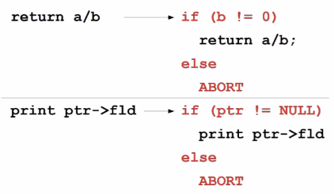
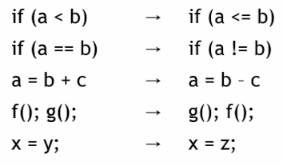
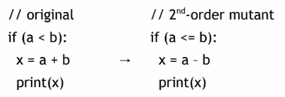

# 17. Software Testing

## What is Test Automation?
> The use of software to control the **execution** of tests, the **comparison** of actual outcomes to predicted outcomes, the **setting up** of test preconditions, and other test **control** and test **reporting** functions  
> *Software를 사용하여 테스트 실행을 제어하고, 실제 결과와 예상 결과를 비교하며, 테스트 전제 조건(preconditions) 설정 및 기타 테스트 제어/보고 기능을 수행*

- Cost 절감
- Human error 감소
- 개인별 Test quality 편차 감소
- Regression testing 비용의 획기적 절감

## Software Testability
> The degree to which a system or component facilitates the establishment of test criteria and the performance of tests to determine whether those criteria have been met  
> *System 또는 component가 테스트 기준을 수립하고, 해당 기준이 충족되었는지 확인하기 위한 테스트 수행을 용이하게 하는 정도*

- 쉽게 말해 software에서 결함을 찾기가 얼마나 어려운지를 의미
- Testability를 지배하는 두 가지 실질적인 문제
  - Software에 test values를 어떻게 제공할 것인가
  - 테스트 실행 결과를 어떻게 관찰할 것인가

## Observability and Controllability
- Observability
  > How easy it is to observe the behavior of a program in terms of its outputs, effects on the environment and other hardware and software components
  - Hardware devices, Databases, 원격 파일에 영향을 미치는 Software는 Observability가 낮음.
- Controllability
  > How easy it is to provide a program with the needed inputs, in terms of values, operations, and behaviors
  - Keyboard 입력을 통한 Software 제어는 쉬움
  - Hardware sensors나 분산 Software로부터의 입력은 제어가 더 어려움
- Data abstraction은 Controllability와 Observability를 감소시킴

## Observability and Controllability (Definition)
- 출력, 환경에 미치는 영향, 기타 Hardware 및 Software components 측면에서 프로그램의 동작을 관찰하기가 얼마나 쉬운가 (Observability)
- 값, 연산, 동작 측면에서 프로그램에 필요한 입력을 제공하기가 얼마나 쉬운가 (Controllability)

## Components of a Test Case
- Test case는 명확한 구조를 가진 다중 부분 Artifact
- Test case values
- Expected results
  - Test oracle은 Expected results를 사용하여 테스트 통과 여부를 결정함.
- Software가 예상대로 동작할 때 생성되어야 하는 결과
- 테스트 중인 Software의 실행을 완료하는 데 필요한 입력 값

## Affecting Controllability and Observability
- Prefix values
  > Software가 Test case values를 받을 수 있는 적절한 상태가 되도록 하는 데 필요한 입력
- Postfix values
  > Test case values가 전송된 후 Software로 전송되어야 하는 입력
  1. Verification Values: Test case values의 결과를 확인하는 데 필요한 값
  2. Exit Values: 프로그램을 종료하거나 안정적인 상태로 되돌리는 데 필요한 값 또는 명령

## Putting Tests Together
- Test case
  > The test case values, prefix values, postfix values, and expected results necessary for a complete execution and evaluation of the software under test  
  > *테스트 중인 Software의 완전한 실행 및 평가에 필요한 Test case values, Prefix values, Postfix values, Expected results*
- Test set
  > A set of test cases  
  > *Test cases의 집합*
- Executable test script
  > A test case that is prepared in a form to be executed automatically on the test software and produce a report  
  > *테스트 Software에서 자동으로 실행되고 보고서를 생성할 수 있는 형태로 준비된 Test case*

## Test Automation Framework
> A set of assumptions, concepts, and tools that support test automation  
> *Test automation을 지원하는 가정, 개념 및 도구의 집합*

## What is JUnit?
- 반복 가능한 Automated tests를 작성하고 실행하는 데 사용되는 Open source Java testing framework (표준)
- JUnit 기능이 포함한 사항들
  - Expected results 테스트를 위한 Assertions
  - 공통 Test data 공유를 위한 테스트 기능
  - 테스트를 쉽게 구성하고 실행하기 위한 Test suites
  - 그래픽 및 텍스트 기반 Test runners
- 산업계에서 널리 사용됨
- 독립형 Java 프로그램(Command line)으로 사용하거나 Eclipse, VSCode, IntelliJ 등 IDE 내에서 사용 가능

## JUnit Tests
- JUnit 테스트 대상
  - 전체 Object
  - Object의 일부 (Method 또는 상호 작용하는 Methods)
  - 여러 Objects 간의 상호 작용
- 주로 System testing이 아닌 Unit testing 및 Integration testing을 위해 의도됨
- 각 테스트는 하나의 Test method에 포함됨
- Test class는 하나 이상의 Test methods를 포함.
- Test classes 포함 사항
  - Test methods의 집합
  - 각 테스트 전후 및 모든 테스트 전후에 상태를 설정(Set up)하고 업데이트(Update)하는 Methods

## Writing Tests for JUnit
- `org.junit.jupiter.api.Assertions` class의 Methods 사용 필요
  - Javadoc에서 전체 기능 설명 제공
- 각 Test method는 조건(Assertion)을 확인하고 테스트 실패 또는 성공 여부를 Test runner에게 보고함.
- Test runner는 결과를 사용하여 사용자에게 보고(Command line 모드)하거나 디스플레이 업데이트(IDE)
- 모든 Methods는 `void`를 반환
- `org.junit.jupiter.api.Assertions`의 대표적인 Methods
  - `assertTrue(boolean)`
  - `assertTrue(String, boolean)`
  - `fail(String)`
  - ...

## JUnit Test Fixtures
- Test fixture는 테스트의 상태(state)를 의미
  - 하나 이상의 테스트에서 사용되는 Objects 및 Variables
  - 초기화 (*prefix* values)
  - 재설정 값 (*postfix* values)
- 서로 다른 테스트는 상태 공유 없이 Objects를 사용할 수 있음.
- Test fixtures에서 사용되는 objects는 instance variables로 선언되어야 함.
- `@Before` method에서 초기화되어야 함.
- `@After` method에서 할당 해제 또는 재설정될 수 있음.

## Simple JUnit Example
```java
public class Calc
{
    static public int add (int a, int b)
    {
        return a + b;
    }
}
```

```java
import org.junit.jupiter.api.Test;
import static org.junit.jupiter.api.Assertions.*;

public class CalcTest
{
    @Test public void testAdd()
    {
        assertTrue ("Calc sum incorrect",
        5 == Calc.add (2, 3)); // Test values
    }
}
```
- `Calc` class와 `CalcTest` class 예제
- `@Test` annotation 사용
- `assertTrue`를 사용하여 덧셈 결과 검증

## Testing the Min Class

```java
import java.util.*;

public class Min
{
  /**
  * Returns the mininum element in a list
  * @param list Comparable list of elements to search
  * @return the minimum element in the list
  * @throws NullPointerException if list is null or
  * if any list elements are null
  * @throws ClassCastException if list elements are
  not mutually comparable
  * @throws IllegalArgumentException if list is empty
  */
  ...
}
```

```java
public static <T extends Comparable<? super T>> T min (List<? extends T> list)
{
    if (list.size() == 0)
    {
      throw new IllegalArgumentException ("Min.min");
    }
    Iterator<? extends T> itr = list.iterator();
    T result = itr.next();
    if (result == null) throw new NullPointerException ("Min.min");
    while (itr.hasNext())
    { // throws NPE, CCE as needed
        T comp = itr.next();
        if (comp.compareTo (result) < 0)
        {
            result = comp;
    }   }
    return result;
}
```
- List에서 최소 요소를 반환하는 `Min` class 예제
- Generics 사용
- 예외 처리 (`NullPointerException`, `ClassCastException`, `IllegalArgumentException`) 포함 로직

## `MinTest` Class
- Test fixture 및 Pre-test setup method (Prefix)
  - `@BeforeEach`: 각 Test method 실행 전 호출 (`setUp`)
- Post test teardown method (Postfix)
  - `@AfterEach`: 각 Test method 실행 후 호출 (`tearDown`)
- 표준 JUnit classes import
```java
import static
org.junit.jupiter.api.Assertions.*;
import org.junit.Jupiter.api.*;
import java.util.*;
```

```java
private List<String> list; // Test fixture
// Set up - Called before every test method.
@BeforeEach
    public void setUp()
    {
       list = new ArrayList<String>();
    }
```
```java
// Tear down - Called after every test
method.
@AfterEach
public void tearDown()
{
    list = null; // redundant in this example
}
```

## Min Test Cases: `NullPointerException`
```java
@Test public void testForNullList()
{
    list = null;
    try {
        Min.min (list);
    } catch (NullPointerException e) {
        return;
    }
    fail (“NullPointerException expected”);
}
```
```java
@Test
public void testForNullElement()
{
    list.add (null);
    list.add ("cat");
    assertThrows(NullPointerException.class, () -> Min.min (list));
}
```

```java
@Test
public void testForSoloNullElement()
{
    list.add (null);
    assertThrows(NullPointerException.class, () -> Min.min (list));
}
```
- `testForNullList`: List가 null인 경우 테스트
  - `fail` assertion 사용 (예외가 발생하지 않으면 실패 처리)
- `testForNullElement`: List 요소 중 null이 포함된 경우 테스트
  - `assertThrows` 사용 (예외 class 명시)
- `testForSoloNullElement`: null 요소 하나만 있는 경우 테스트
  - 쉽게 간과될 수 있는 특수 케이스 포착

## More Exception Test Cases for Min
```java
@Test
@SuppressWarnings ("unchecked")
public void testMutuallyIncomparable()
{
    List list = new ArrayList();
    list.add ("cat");
    list.add ("dog");
    list.add (1);
    assertThrows(ClassCastException.class, () -> Min.min (list));
}
```

```java
@Test
public void testEmptyList()
{
    assertThrows(IllegalArgumentException.class, () -> Min.min (list));
}
```
- `testMutuallyIncomparable`: 비교 **불가능한** 타입(String, Integer) 혼합 시 `ClassCastException` 테스트
  - Java generics가 raw types 사용을 막지 않음을 보여줌.
- `testEmptyList`: 빈 리스트에 대한 `IllegalArgumentException` 테스트

## Remaining Test Cases for Min
```java
@Test
public void testSingleElement()
{
    list.add ("cat");
    Object obj = Min.min (list);
    assertTrue ("Single Element List", obj.equals ("cat"));
}
@Test
public void testDoubleElement()
{
    list.add ("dog");
    list.add ("cat");
    Object obj = Min.min (list);
    assertTrue ("Double Element List", obj.equals ("cat"));
}
```
- Happy Path 테스트 (예외 없는 케이스)
- `testSingleElement`: 단일 요소 리스트 테스트
- `testDoubleElement`: 두 요소 리스트 테스트

## Summary: Seven Tests for Min
- 예외가 **있는** 5가지 테스트
  1. Null list
  2. 여러 요소 중 Null element 포함.
  3. Null 단일 요소
  4. 비교 **불가능한** Types
  5. Empty elements
- 예외가 **없는** 2가지 테스트  
  6. Single element  
  7. Two elements

## Data-Driven Tests
- 문제점: 유사한 값으로 함수를 여러 번 테스트할 때 발생하는 Test code bloat(부풀리기) 방지 필요
- 간단한 예: 두 숫자 더하기
  - 주어진 숫자 쌍을 더하는 것은 다른 쌍을 더하는 것과 동일함.
  - 하나의 테스트만 작성하기를 원함.
- Data-driven unit tests는 각 Test values 컬렉션에 대해 생성자를 호출함.
  - 동일한 테스트가 각 Data values 세트에 대해 실행됨
  - `@Parameters` annotation이 지정된 Method로 Data values 컬렉션 정의

## Example JUnit Data-Driven Unit Test
```java
import static org.junit.jupiter.api.*;
import static org.junit.jupiter.params.provider.*;
import org.junit.jupiter.api.*;
import org.junit.jupiter.params.*;
import org.junit.jupiter.params.provider.*;
import java.util.stream.Stream;
import java.util.*;
@RunWith (Parameterized.class)
public class DataDrivenCalcTest
{
    private static Stream<Arguments> data() {
        return Stream.of(
            Arguments.of(1, 1, 2),
            Arguments.of(2, 3, 5)
        );
    }
    @ParameterizedTest
    @MethodSource("data")
    public void additionTest(int v1, int v2, int expected)
    { assertTrue ("Addition Test", expected == Calc.add (v1, v2)); }
}
```
- `@ParameterizedTest` 및 `@MethodSource` 사용 예제
- Data source와 Test method 분리
- Stream을 통해 Arguments(입력값, 기대값) 전달
- 동일한 로직(`additionTest`)으로 여러 데이터 세트(1+1=2, 2+3=5) 검증

## How to Run Tests
- JUnit은 Test drivers 제공
  - Command line에서 실행되는 문자 기반 Test driver
  - GUI 기반 Test driver (`junit.swingui.TestRunner`)
    - Programmer가 실행할 Test class 지정 가능
    - "Run" 버튼 생성
- 테스트 실패 시 JUnit은 실패 위치 및 발생한 Exceptions 정보 제공

## JUnit Resources
- JUnit 다운로드 및 문서 [junit.org]()
- JUnit 5 User Guide
- IntelliJ 블로그의 JUnit 5 테스트 작성 가이드

## Summary of Unit Testing
- 테스트를 효율적이고 효과적으로 만드는 유일한 방법은 가능한 많이 자동화하는 것임.
- Test frameworks는 테스트 자동화를 위한 매우 간단한 방법을 제공
- 그러나 "Silver bullet(만능 해결책)"은 아님. 테스트의 어려운 문제는 여전히 존재함.

> *어떤 Test values를 사용할 것인가?*  
> Test design의 문제이며 ... Test criteria의 목적

# Test Suite Quality Metrics

## Learning Goals
- Test suite quality metrics는 어떤 Suite를 사용할지 결정하는 데 도움을 줌.
  - Line coverage: Suite 실행 시 방문한 line의 비율, 단순하지만 제한된 확신만 줌.
  - Branch coverage: 조건문의 True/False 값을 모두 요구, 더 풍부함 (Data values를 간접적으로 통합)
  - Mutation analysis: Suite가 감지한 Seeded defects(심어놓은 결함)의 비율 측정, 비용이 많이 들지만 효과적임.

## Testing
- Module, Module 집합 또는 System 실행
  - 미리 결정된 Inputs 사용 (Test case)
  - 실제 Outputs 캡처
  - 실제 Outputs와 Expected outputs 비교
- 실제 결과 == 예상 결과  
  → Test case **성공**
- 실제 결과 != 예상 결과  
  → Test case **실패**

## Testing Question
- 언제 테스트를 중단해야(할 수) 있는가?
- 완벽하지만 실행 **불가능한** 답: 모든 Test cases를 실행했을 때
- 완벽하지만 실행 **불가능한** 답 2: 모든 Faults를 찾았을 때
- 각 추가 테스트 실행의 상대적인 Surrogate benefit(대리 이익)을 알 수 있는가?
  - 실제 Fault detection 능력을 사전에 정확히 측정할 수 없으므로 Surrogate(대리) 지표 사용
- 신뢰할 수 있는 Surrogate measure는 매우 유용함.
  - 두 Test cases를 비교하여 어떤 것을 사용할지 결정 가능
  - 측정의 성격에 따라 중단 시점(불완전하지만 실질적으로 필요한)을 표시할 수 있음.

## Coverage
- Test suite가 모든 Requirements를 커버("checked")하기를 원함.
- **X coverage**는 X가 Test suite에 의해 실행/행사되는 정도
- 예시
  - Code coverage: Source code가 Test suite에 의해 실행되는 정도
  - Statement coverage: 실행된 Source statements의 비율

## Do Tests Cover All Requirements?
- 이상적인 세계에서는 requirements와 test cases 간의 Traceability(추적성)가 존재
- 즉, 각 테스트 케이스에는 다음과 같은 주석이 첨부됨
  - "이 테스트를 통과한 프로그램은 요구사항 X를 만족함"
  - "이 테스트 통과 시 프로그램이 요구사항 Y를 준수한다는 확신을 줌"
- 항공우주 등 특정 산업을 제외하고 공식적인 Traceability는 드묾

## An Approximation
- Requirements에 대한 공식적인 Traceability가 없다고 가정
- 따라서 프로그램이 요구되는 모든 좋은 일만 수행한다고 테스트하는 것은 불가능(또는 실행 불가능)

## Don’t Do Bad Things
- 적어도 프로그램이 특정 "나쁜 일"을 하지 않는다는 것은 테스트할 수 있음.
  - 예: Segfault 발생 안 함, 암호 유출 안 함, 특정 입력에 대해 오답 내지 않음.
- "나쁜 일을 절대 하지 않음"은 "항상/결국 좋은 일을 함"과 동일하지 않음.
  - Liveness vs. Safety properties

## Testing to Find Bugs
- 프로그램이 "나쁜 일"을 하지 않는다는 확신을 얻기 위해 테스트함.
- 즉, 버그가 없다는 확신
- 핵심 논리적 관찰: Line X를 절대 테스트하지 않으면, Line X에 Bug가 존재하지 않는다는 것을 테스트로 배제할 수 없음.

## $P \to Q$
$$
\text{No text covers X} \to \text{may have bug in X}
$$
> "X를 커버하는 테스트 없음 → X에 버그가 있을 수 있음"
- Line X를 테스트해도 여전히 Line X에 버그가 있을 수 있음.
  - 예: `foo(a,b) { return a/b; }`에서 `foo(6,2)` 테스트 시 성공하지만 `0`으로 나눌 때 버그 존재 가능
- 그러나 X를 테스트하는 것은 X의 정확성에 대해 작지만 `0`이 아닌 확신을 줌.

## “All Other Things Being Equal”
- Test A가 line 1, 2를 방문하고, Test B가 line 1, 2, 3, 4를 방문한다면,
- 다른 모든 조건이 동일할 때 Test B를 선호함.
  - Test A는 1, 2에 대한 확신만 주고 3, 4에 대한 정보는 없음.
  - Test B는 1, 2, 3, 4에 대한 확신을 줌.
- 테스트된 line당 얻는 확신/정보가 $c > 0$이라면, Test A는 $2c$, Test B는 $4c$를 제공 ($B > A$)
  - $c > 0$, $4c > 2c$이므로

## Simplifying Assumptions
- 가정 1: 방문한 각 line에 대해 동일한 양의 확신(또는 정보)을 얻음.
- 가정 2: 방문한 line당 얻는 확신(또는 정보)의 양은 양수임.

## Using Line Coverage
- 리소스 예산("AOTBE", etc) 내에서 실행되는 두 Test suites가 있을 때, 하나만 실행할 수 있다면 Line coverage가 더 높은 것을 선호함.
- Coverage는 두 Test suites를 비교하고 "더 나은" 것을 선택하게 해주는 Metric
- 이 정보를 사용하여 Software process의 의사 결정("테스트를 어떻게 해야 하는가?")을 안내함.

## Collecting Line Coverage
- 가장 간단하게는 Print-statement debugging 방식
- 프로그램의 모든 line 앞에 출력문 삽입
  - 모든 테스트 실행, 출력 정보 수집, 중복 제거, 카운트
- 실질적 우려: Observer effect (관찰이 현상을 변화시킴)

## Coverage Instrumentation
- Coverage instrumentation은 Observer effect를 최소화하는 방식으로 Coverage 정보를 기록하도록 프로그램을 수정함.
  - Source 또는 Binary 레벨에서 수행 가능
- 실제로 stdout/stderr에 출력하지 않음.
- 속도를 너무 느리게 하지 않음 (중복 출력 전 확인?)
- Infinite loops를 도입하지 않음 ("print"를 "print" 호출로 계측?)

## Good News: “Solved” Problem
- 잘 연구된 문제이며 다양한 형태의 Coverage에 대한 Push-button 솔루션이 존재함.
  - IDE 내장 또는 외부 도구
- 예: Python의 coverage, `gcc`의 `gcov`, Java의 `cobertura` 등

## Problems with Line Coverage
- Line coverage의 문제점은 무엇인가?
- 100% Line coverage 상황에서도 프로그램에 여전히 버그가 있을 수 있는가?
- (재검토) Line X를 테스트해도 여전히 Line X에 버그가 있을 수 있음.

## Data Values and Implicit Control Flow


## Intuition
- 많은 흥미로운 Data values는 Implicit 또는 Explicit 제어 변경을 유발함.
  - 즉, Conditionals의 다른 분기가 실행되도록 함.
- 비공식적으로, 흥미로운 Data values를 커버하는 문제는 모든 Conditionals 분기를 커버하는 문제로 귀결될 수 있음.

## Branch Coverage
- Branch coverage는 Test suite에 의해 실행된 Conditional branches의 총수를 계산하는 Test suite quality metric (if->true와 if->false를 별도로 계산)
- Branch coverage는 Line coverage를 포함(Subsume)할 수 있음.
  - 모든 Branches를 커버하는 Test suite는 모든 Lines도 커버함.

## Branch vs. Line
- Branch coverage는 일반적으로 Line coverage보다 더 많은 확신을 줌.
- 일반적으로 100% Branch coverage는 100% Line coverage를 의미함.
- 그러나 Branch coverage는 높은 Line coverage를 달성하는 것보다 높은 Branch coverage를 달성하기 어렵다는 점에서 "더 비쌈"
  - 참고: Quality가 실제로 "더 비싼" 것이 아니라, 이전에 Line coverage만으로 충분하다고 스스로 속였던 것임. 정확한 것은 원래 비용이 듦.

## Other Flavors
- Function Coverage: 호출된 Functions의 비율
- Condition Coverage: Boolean subexpressions가 True와 False로 평가된 비율
- Modified Condition / Decision Coverage (MC/DC): Function coverage + Branch coverage (단순화된 설명)
  - Mission critical (예: 항공 전자) Software에서 사용됨

## Mutation Testing
- **Mutation testing** (또는 Mutation analysis)은 Test suite의 품질이 의도적으로 추가된 Defects를 찾는 수와 관련된 Test suite adequacy metric
- 비공식적 설명: *"Test suite가 보안 버그를 찾는 데 정말 훌륭하다고? 소스 코드에 **의도적으로 버그를 추가**해서 찾는지 봐야겠어!"*

## Defect Seeding
- **Defect seeding**은 프로그램에 의도적으로 Defect를 도입하는 과정
  - 도입된 Defect는 실제 개발자가 도입하는 Defects와 의도적으로 유사함.
  - Seeding은 일반적으로 Source code를 변경하여 수행됨
- Mutation testing의 경우 Defect seeding은 일반적으로 자동으로 수행됨 (인간의 버그 모델 기반)

## Mutation Operators
- Mutation operator는 프로그램 지점을 체계적으로 변경함.
- Mutation testing에서 mutation operators는 역사적인 인간의 Defects를 모델로 함.


## Mutant
- **Mutant** (또는 **Variant**)는 하나 이상의 프로그램 위치에 하나 이상의 Mutation operators를 적용하여 생성된 원본 프로그램의 버전
- Mutant의 **Order**는 적용된 Mutation operators의 수


## Competent Programmers
- **Competent programmer hypothesis**: 프로그램 Faults는 구문적으로 작으며 몇 번의 키스트로크로 수정할 수 있다는 가설
- 프로그래머는 대체로 올바른 프로그램을 작성함.
- 따라서 mutants는 실제 Faults의 가능성 있는 효과를 시뮬레이션함.
- 따라서 ***Test suite가 인위적인 Mutants를 잘 포착한다면, 프로그램의 알려지지 않은 실제 Faults도 잘 포착할 것임.***

## Competent? Really?
- Competent programmer hypothesis가 사실인가?
- 예 그리고 아니오
- 인간이 단순한 오타(예: +를 -로)를 자주 내는 것은 사실임.
- 그러나 일부 버그는 그보다 더 복잡한 것도 사실임.

## Coupling Effect
- **Coupling effect hypothesis**: 복잡한 faults는 단순한 faults와 결합(Coupled)되어 있어, 프로그램의 모든 단순한 faults를 감지하는 Test suite가 높은 비율의 복잡한 faults도 감지할 것이라는 가설
- 사실인가?
  - 단순한 Mutants를 감지하는 테스트는 역사적으로 2차 및 3차 Order mutants의 99% 이상을 감지할 수 있었음 [A. J. Offutt 연구]

## Mutation Testing
- Test suite가 원본은 통과하지만 Mutant는 실패하게 만들면, 해당 Mutant를 kill(감지, 드러냄)했다고 함.
- Test suite의 Mutation testing (또는 Analysis)은 다수의 Mutants를 만들고 그중 kill된 비율을 측정하여 진행됨
  - 이 비율을 Mutation adequacy score (또는 Mutation score)라고 함.
  - 점수가 높은 Test suite가 더 좋음.

## Mutation Analysis: Pros and Cons
- 다른 Test suite adequacy criteria를 포함(Subsume)할 잠재력이 있음 (매우 좋을 수 있음)
- 어떤 Mutation operators를 사용할 것인가?
- 어디에 적용하고 얼마나 자주 적용할 것인가? (보통 무작위지만 방법이 문제)
- It is **very expensive**. 1,000개의 Mutants를 만들면 Test suite를 1,000번 실행해야 함!

## Equivalent Mutant Problem
- `x = a + b; y = c + d;`가 있을 때 두 문장을 바꾸는 경우를 가정
- 결과 프로그램은 mutant이지만 의미적으로는 원본과 동일 (Semantically equivalent)
  - 원본이 통과/실패하는 모든 테스트를 동일하게 통과/실패함.
- 따라서 mutation score를 희석시킴
- **Equivalent mutants**를 감지하는 것은 큰 문제임. 얼마나 어려울까?
  - Undecidable (결정 불가능) 문제임 ...