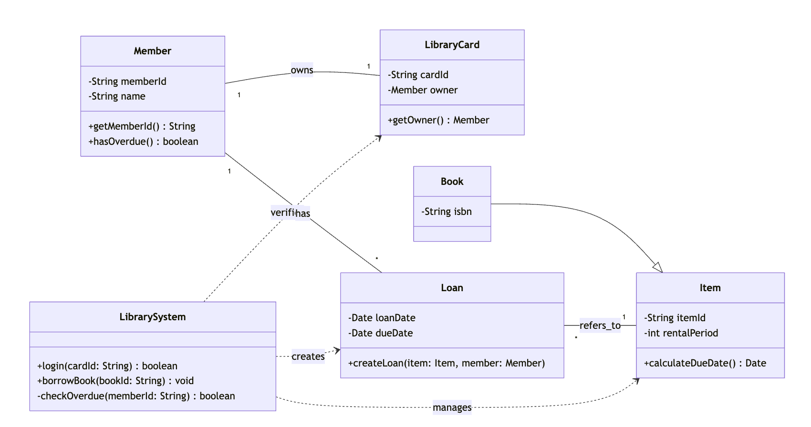

# 2024년 기말고사

### 1. 다음 요구사항과 유즈케이스를 읽고 물음에 답하시오. (30점)

> 공공 도서관은 지역 사회 구성원들이 대여할 수 있는 책, 영화, 기타 자료들을 보관하고 있다. 도서관 회원은 도서관 계정과 해당 계정의 ID 번호가 적힌 도서관 카드를 갖고 있으며, 이를 통해 도서관에서 본인을 확인할 수 있다. 회원의 도서관 계정에는 대출한 자료와 각 자료의 반납 기한이 기록된다. 각 자료 유형마다 대여 기간이 설정되어 있으며, 이 기간을 기준으로 대출 시 반납 기한이 결정된다. 만약 회원이 반납 기한을 넘긴 후 자료를 반납할 경우, 해당 자료에 대한 연체료가 발생하며, 이 금액은 회원의 도서관 계정에 기록된다.

> 유즈 케이스 시나리오: 도서관 회원은 도서관 카드를 사용하여 도서관 시스템 키오스크에 로그인한 후 책을 대출할 수 있다. 도서관 시스템은 먼저 회원에게 미납된 연체료가 없음을 확인해야 한다. 미납된 연체료가 없으면 도서관 시스템은 해당 책의 대여 기간을 현재 날짜에 더해 반납 기한을 산정하고, 해당 책과 반납 기한을 회원의 도서관 계정에 대출된 자료로 기록해야 한다.

1. 도서관 시스템의 Analysis Model Class diagram을 작성하시오. (10점)

2. 도서관 시스템의 Design Model Class diagram을 작성하시오. (10점)

3. 주어진 유즈 케이스 시나리오의 Sequence diagram을 작성하시오. (10점)


### 2. 당신은 경쟁사의 제품을 역공학으로 분석하여 다음과 같은 코드를 작성할 수 있었다. 분석 결과 Decorator 패턴과 그 외 두 종류의 디자인 패턴까지 총 세 종류의 디자인 패턴을 사용하고 있었다. Decorator 패턴 외에 어떤 디자인 패턴을 사용하고 있고 어떤 Class와 Method가 해당 디자인 패턴과 관련되어 있는지 설명하시오. (Decorator 패턴 외 총 2개의 패턴에 대해 설명) (15점)

```java
public interface I1 {
    public I2 method1();
}

public interface I2 {
    public void method2(I3 i3);
}

public interface I3 {
    public void method3();
}

public final class C1 implements I1 {
    private static C1 c1 = new C1();
    private C1() {}

    public static C1 method4() { return c1; }

    public I2 method1() { return new C2(); }

    private static class C2 implements I2 {
        C2() {}

        public void method2(I3 i3) {
            i3.method3();
        }
    }
}

public class C3 implements I3 {
    private final String s;

    public C3(String s) {
        this.s = s;
    }

    public void method3() {
        System.out.print(s);
    }
}

public class C4 implements I3 {
    private final I3 i3;

    public C4(I3 i3) {
        this.i3 = i3;
    }

    public void method3() {
        System.out.print("*");
        i3.method3();
    }
}

public class Main {
    public static final void main(String[] args) {
        final I3 x1 = new C4(new C3("*"));
        final I2 x2 = C1.method4().method1();
        for(int i = 0; i < 100; i++) {
            x2.method2(x1);
        }
        x2.method2(new C4(new C3("")));
    }
}
```

이 코드에서 Decorator 패턴 외에 사용된 두 가지 디자인 패턴은 singleton 패턴과 factory method 패턴이다.

1. singleton 패턴은 `C1` 클래스에 적용되어 있다. `C1` 클래스는 생성자를 `private`으로 선언하여 외부에서 임의로 인스턴스를 생성하지 못하도록 제한하였다. 대신 클래스 내부에서 `static` 필드인 `c1`을 통해 자기 자신의 유일한 인스턴스를 미리 생성해 두고, `public static` 메서드인 `method4()`를 통해서만 이 인스턴스에 접근할 수 있도록 하였다. 이는 시스템 전체에서 해당 클래스의 인스턴스가 오직 하나만 존재하도록 보장하는 역할을 한다.
2. 팩토리 메서드 패턴은 `C1` 클래스의 `method1()`과 내부 클래스 `C2`의 관계에서 찾아볼 수 있다. `C1`의 `method1()`은 구체적인 구현 클래스인 `C2`의 인스턴스를 생성하여 반환하는 역할을 수행한다. 이때 `C2`는 `private static inner class`로 선언되어 있어 외부에서는 그 존재를 알 수 없으며, 클라이언트는 오직 `I2` 인터페이스를 통해서만 반환된 객체를 사용할 수 있다. 이는 객체 생성의 구체적인 내용을 캡슐화하여 유연성을 높이는 방식이다.

### 3. 소프트웨어 품질보증 활동에 관한 질문에 답하시오. (10점)

1. 소프트웨어 테스트 자동화가 왜 중요한가 서술하시오. (5점)  
    - 소프트웨어 테스트 자동화가 중요한 이유는 회귀 테스트(Regression Testing)의 효율성을 극대화할 수 있기 때문이다. 소프트웨어가 수정되거나 기능이 추가될 때마다 기존 기능이 정상적으로 동작하는지 반복적으로 검증해야 하는데, 자동화는 이를 빠르고 정확하게 수행하여 개발 속도를 높여준다. 또한 장기적인 관점에서 테스트 수행에 드는 인력과 시간을 절감하여 전체적인 개발 비용을 낮추는 효과가 있다. 마지막으로 사람이 테스트를 수행할 때 발생할 수 있는 피로도나 실수에 의한 부정확성을 배제할 수 있어 테스트 결과의 신뢰성을 보장한다.

2. 소프트웨어 테스트만 잘 하면 다른 소프트웨어 품질보증 활동을 하지 않아도 되는가? 맞다면 그 이유를, 아니라면 어떤 상황에서 어떤 다른 소프트웨어 품질보증 활동이 필요한지 서술하시오. (5점)
    - 소프트웨어 테스트만 잘한다고 해서 다른 품질보증 활동이 필요 없는 것은 아니다. 테스팅은 이미 작성된 코드에서 결함을 발견하는 활동일 뿐, 결함이 유입되는 것 자체를 예방하거나 코드의 구조적 품질을 보증하지는 못하기 때문이다. 따라서 요구사항 정의나 설계 단계에서 논리적 오류를 사전에 발견하기 위한 정형 기술 검토(Formal Inspection)가 필요하다. 또한 코드를 실행하지 않고도 코딩 표준 준수 여부나 잠재적인 메모리 누수, 스택 오버플로우 등을 분석할 수 있는 정적 분석(Static Analysis) 활동이 병행되어야 소프트웨어의 품질을 온전하게 보증할 수 있다.

### 4. 다음 주어진 코드에 데이터 흐름 (Data-flow) 정적 분석을 적용하여 $0$으로 나누는 연산이 발생하는지 분석하고자 한다. 이 때 다음 질문에 답하시오. (단, x, y, z는 정수 타입이 아닌 일반적인 숫자 타입이라 가정하고, `input()` 함수는 사용자로부터 입력받은 임의의 숫자값을 리턴하는 함수이다.) (20점)

```c
x = input();
y = x;
z = x;
while (y > 0) {
    x = x/z;
    y = y-1;
    z -= 2;
}
```

1. 데이터 흐름 정적 분석을 구현하기 위한 Abstract domain, Transfer function, Join function을 정의하시오. (10점)
    - 데이터 흐름 정적 분석을 위해 변수가 가질 수 있는 값의 범위를 나타내는 구간(Interval) 도메인을 추상 도메인(Abstract Domain)으로 정의한다. 이때 도메인 $D$는 정수 집합과 무한대를 포함하는 구간 $[l, u]$들의 집합으로 표현된다. 전이 함수(Transfer Function)는 프로그램의 각 문장이 실행될 때 구간의 변화를 계산하는 함수로, 대입문에서는 해당 값의 구간을 갱신하고 산술 연산에서는 구간 산술(Interval Arithmetic)을 적용하여 결과 범위를 계산하도록 정의한다. 합류 함수(Join Function)는 제어 흐름이 갈라졌다가 다시 합쳐지는 지점에서 두 경로의 구간을 모두 포함하는 최소한의 구간을 구하는 합집합(Interval Union) 연산으로 정의한다.
2. 데이터 흐름 정적 분석을 적용하여 $0$으로 나누는 연산이 발생하는지 분석하시오. 흐름 그래프의 각 노드마다 정적 분석 결과를 표시해야 한다. (15점)
    - 정적 분석을 수행하면 $0$으로 나누는 연산이 발생할 가능성이 있음을 탐지할 수 있다. 분석 과정은 다음과 같다. 먼저 초기 상태에서 입력값 `x`는 모든 정수 범위를 가질 수 있으므로 `x`, `y`, `z` 모두 $[-\infty, +\infty]$로 초기화된다. `while` 루프의 진입 조건인 `y > 0`을 만족하기 위해 루프 내부에서 `y`와 `z`는 $[1, +\infty]$의 범위를 갖는다. 첫 번째 반복에서는 `z`가 1 이상의 양수이므로 `x/z` 연산이 안전하다. 그러나 루프 내에서 `z -= 2` 연산이 수행되면 `z`의 범위는 $[-1, +\infty]$로 확장된다. 이후 루프가 반복될 때 합류 함수에 의해 `z`의 범위는 $[-1, +\infty]$ 상태로 유지되며, 이 구간에는 0이 포함된다. 따라서 `x = x / z` 구문에서 제수가 0이 될 수 있는 가능성이 발견되므로, 해당 노드에 '$0$으로 나누기 오류(Division by Zero)' 경고를 표시해야 한다.

### 5. 다음 삼각형 판별 C 프로그램에 대해 질문에 답하시오. (20점)

```c
#include <stdio.h>

int main() {
    int a, b, c, temp;
    printf("Enter the lengths of the three sides: ");
    scanf("%d %d %d", &a, &b, &c);
    
    if (a <= 0 || b <= 0 || c <= 0) {
        printf("Side lengths must be positive integers.\n");
        return 1;
    }
    
    if (a > b) {
        temp = a; a = b; b = temp;
    }
    if (b > c) {
        temp = b; b = c; c = temp;
    }
    if (a > b) {
        temp = a; a = b; b = temp;
    }
    
    if (a + b > c) {
        if (a == b && b == c) {
            printf("Equilateral triangle.\n");
        } else if (a == b || b == c || c == a) {
            printf("Isosceles triangle.\n");
        } else {
            printf("Scalene triangle.\n");
        }
        
        if (a * a + b * b == c * c) {
            printf("Also right triangle.\n");
        }
    } else {
        printf("Do not form a triangle.\n");
    }
    
    return 0;
}
```

1. 라인 커버리지 100%를 달성하기 위해 Test Case를 작성하시오. (10점)
    - 라인 커버리지 100%를 달성하기 위해서는 프로그램 내의 모든 실행 경로를 최소한 한 번씩은 통과해야 한다. 이를 위해 다음과 같은 테스트 케이스들이 필요하다.
        1. 입력값이 $0$ 이하인 경우를 검증하기 위해 `0, 5, 5`를 입력한다.
        2. 내부 정렬 로직과 직각 삼각형 조건을 모두 수행하기 위해 `5, 4, 3`을 입력한다(내부에서 `3, 4, 5`로 정렬됨).
        3. 정삼각형 분기를 수행하기 위해 `2, 2, 2`를 입력한다.
        4. 이등변 삼각형 분기를 수행하기 위해 `2, 2, 3`을 입력한다.
        5. 삼각형이 성립되지 않는 조건을 수행하기 위해 `1, 2, 5`를 입력한다.
    - 이 케이스들을 모두 실행하면 프로그램의 모든 문장이 적어도 한 번씩 실행된다.
2. 테스트를 통해 100% 라인 커버리지를 달성했을 때 주어진 프로그램에 버그가 없다고 보장할 수 있는가? 보장할 수 있다면 그 이유를 설명하고, 보장할 수 없다면 왜 보장할 수 없는지 구체적인 사례를 들어 설명하시오. (10점)
    - 테스트를 통해 100% 라인 커버리지를 달성했더라도 프로그램에 버그가 없다고 보장할 수는 없다. 라인 커버리지는 구문이 실행되었는지만 확인할 뿐, 논리적인 오류나 데이터 값에 따른 런타임 에러까지 검증하지 못하기 때문이다. 구체적인 사례로 이 프로그램의 직각 삼각형 판별 로직인 `a * a + b * b == c * c` 부분을 들 수 있다. 만약 입력값 `a`, `b`, `c`에 매우 큰 정수(예: 46341 이상)가 입력될 경우, 제곱 연산 과정에서 정수형 변수의 표현 범위를 초과하는 정수 오버플로우(Integer Overflow)가 발생하여 잘못된 결과를 출력할 수 있다. 라인 커버리지 테스트는 해당 식을 실행만 하면 통과되므로 이러한 잠재적 결함을 찾아낼 수 없다.