# 9. UML

## Learning Goals
- UML (Unified Modeling Language)이 무엇인지, 왜 필요한지 이해
- 기본 UML notation(표기법)을 사용하여 design(설계)을 전달
- 다양한 유형의 UML diagram(다이어그램)의 표기법과 목적 이해

## What Could the Arrow Mean? (Revisited)
- 많은 가능성 존재
- A가 B로 control(제어)을 전달
- A가 B로 data(데이터)를 전달
- A가 B로부터 value(값)을 가져옴
- A가 B로 데이터를 stream(스트림)
- A가 B로 message(메시지)를 전송
- A가 B를 create(생성)
- A가 B보다 먼저 발생
- B가 A로부터 전기를 공급받음.

## What is UML?
- Unified Modeling Language (통합 모델링 언어)
- Specifying(명세화), constructing(구축), documenting(문서화)를 위한 visual language(시각적 언어)
- OMG (Object Management Group)에 의해 유지 관리
- 웹사이트: [http://www.omg.org](http://www.omg.org)
- Object-oriented(객체 지향)
- Model(모델) / view(뷰) 패러다임
- Target language(대상 언어) 독립적

## Model/View Paradigm
- 각 diagram은 system(시스템) 일부에 대한 view에 불과
- 모든 diagram이 함께 모여 완전한 그림을 제공

## Underlying System Model
- UML diagram 유형의 Classification(분류)

## Favorite UML diagram types
- widely used(널리 사용됨): 출처의 60% 이상
- Scarcely used(거의 사용되지 않음): 출처의 40% 이하
- (참고: Riggo et al., What are the used UML diagrams? A Preliminary Survey, EESSMod, 2013)

## UML
- UML을 적용(사용)하는 3가지 방법
- Sketch(스케치)
    - Conceptual perspective(개념적 관점)
    - Problem 또는 solution space의 어려운 부분을 탐색하기 위해 비공식적이고 불완전한 diagram 생성 → 상호 소통 매체
- Blueprint(청사진)
    - Specification perspective(명세 관점)
    - Code generation(코드 생성)을 위해 **비교적 상세한** design diagram 사용
- Programming language(프로그래밍 언어)
    - Implementation perspective(구현 관점)
    - UML로 소프트웨어 system의 완전한 executable specification(실행 가능 명세) 작성
    - 실행 가능한 코드가 자동으로 생성
    - 이론, 도구 robustness(견고성), usability(사용성) 측면에서 여전히 개발 중

## What the UML is Not?
- UML은 Object-Oriented 분석 및 design process(프로세스)가 아님.
    - UML은 소프트웨어 system을 개발하는 체계적인 방법이 아님.
- UML은 Object-Oriented 사고방식을 가르쳐주지 않음.
    - 객체 structure(구조)나 behavior(행위)를 어떻게 설계해야 하는지 알려주지 않음.
    - design이 좋은지 나쁜지 알려주지 않음.

# Use Case Diagrams

## What is a Use Case?
- Use Case(유스케이스): 사람 사용자, 다른 system, 하드웨어 구성요소 또는 내부 시계에 의해 system으로 전송된 event(이벤트)에 의해 촉발되는 behavior 또는 일관된 behavior 집합

## Use Case Diagrams
- System이 high-level(높은 수준)에서 무엇(WHAT)을 할 것인지 기술
- (다이어그램 구성 요소)
- Use Case
- Use Case Name (유스케이스 이름)
- Subject Name (주체 이름)
- Subject(주체)
- System Boundary(시스템 경계)
- Association(연관)
- Dependency(의존)
- Actor(행위자)

## Actor
- System과 상호작용해야 하는 누군가 또는 무언가
- 사용자, 외부 system, 장치

## An Actor is a Role
- Actor는 사용자가 system과 상호작용할 때 수행하는 단일 role(역할)을 정의
- 여러 사용자가 단일 role 수행 가능
- 단일 사용자가 여러 role 수행 가능

## Identifying Actors
- 유용한 질문들
  - 누가 system의 주요 functionality(기능)을 사용할 것인가 (**primary actors**(주요 행위자))?
  - 누가 일상 업무를 위해 system의 지원을 필요로 하는가?
  - 누가 system을 유지보수, 관리하고 작동하도록 유지해야 하는가 (**secondary actors**(보조 행위자))?
  - System이 처리해야 할 hardware devices(하드웨어 장치)는 무엇인가?
  - System이 상호작용해야 할 다른 system은 무엇인가?
  - 누가 또는 무엇이 system이 생성하는 결과(가치)에 관심이 있는가?

## Use Case
- Actor와 Subject 간의 transaction(트랜잭션)으로 표현되는 기능 단위
- 하나 이상의 Actor와 system 간의 상호작용
- Use case 식별하기
    - Actor가 system에 요구하는 function(기능)은 무엇인가?
    - Actor가 system의 특정 정보를 읽기, 생성, 삭제, 수정 또는 저장해야 하는가?
    - Actor가 system의 event에 대해 notify(알림)을 받아야 하는가?
    - System의 새로운 기능을 통해 Actor의 일상 업무가 단순화되거나 효율화될 수 있는가?

## An Example of Use Case Text
- Buy a Product (제품 구매)
- Main Success Scenario(주 성공 시나리오):
    1. 고객이 카탈로그를 탐색하고 구매할 아이템 선택
    2. 고객이 결제 진행
    3. 고객이 배송 정보 입력 (주소; 익일 또는 3일 배송)
    4. System이 배송비 포함 전체 가격 정보 제시
    5. 고객이 신용카드 정보 입력
    6. System이 구매 승인
    7. System이 즉시 판매 확인
    8. System이 고객에게 확인 이메일 발송
- Extensions(확장):
    - 3a: 고객이 regular customer(단골 고객)인 경우  
      - .1: system이 현재 배송, 가격, 청구 정보 표시  
      - .2: 고객이 이 default(기본값)을 수락하거나 변경 가능, MSS 6단계로 복귀  
    - 6a: system이 신용카드 구매 승인 실패  
      - .1: 고객이 신용카드 정보를 다시 입력하거나 취소 가능  

## Subject Symbol
- System Boundary 표시
- Use Case에 의해 정의된 behavior를 realize(실현)하는 Classifier(분류자)

## Association
- Actor와 system 간의 bi-directional 통신 표현
- Actor와 Use Case 사이에 그려짐
- 화살표 없이, 선으로 표현

## Dependency–Include
- Base Use Case에서 inclusion Use Case로의 관계 표현
- Use Case가 다른 Use Case를 call(호출)함을 암시
- 주로 여러 Use Case에 공통적인 behavior를 reuse하기 위해 사용됨.

## Dependency–Extend
- 일부 추가적인 behavior가 더해져야 할 때 사용
- Optional(선택적) 또는 conditional(조건부) behavior를 모델링
- Infrequent events(드문 이벤트) 표시

## Tips for Use Case Modeling
- 각 Use Case가 domain experts(도메인 전문가)와 프로그래머 모두 이해할 수 있는 system 사용의 중요한 chunk(부분)을 설명하도록 보장
- Use Case를 텍스트로 정의할 때, noun(명사)과 verb(동사)를 정확하고 일관되게 사용하여 interaction diagrams을 위한 objects와 message 도출에 도움
- 여러 Use Case에 필요한 공통 usage(사용)을 Factor out(분리)
    - usage이 required(필수적)이면 사용
    - Base Use Case가 완전하고 usage이 optional일 수 있다면 사용 고려
- Use Case diagram은
    - 동일한 level of abstraction(추상화 수준)의 Use Case만 포함해야 함
    - 필요한 Actor만 포함해야 함
- 많은 수의 Use Case는 packages(패키지)로 구성해야 함

# Class Diagrams

## Class Diagrams
- Description of static structure
    - Showing the types of objects ...
- (다이어그램 구성 요소)
- Class Name(클래스 이름)
- Class Attributes(클래스 속성)
- Class Operations(클래스 오퍼레이션)
- Association
- Multiplicity(다중성)
- Generalization(일반화)
- Guard(가드)
- "..."는 요소가 더 있을 수 있음을 의미
- 공백은 "알 수 없음" 또는 "멤버 없음"을 의미
- Static structure(정적 구조)에 대한 설명
- System 내 object의 type(유형)과 그들 간의 relationship(관계) 표시

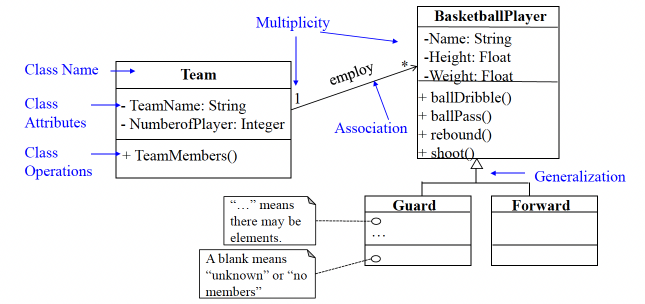

## Classes
- 사각형 세 개를 쌓아놓은 형태로 표현
- 모든 Object-Oriented system의 가장 중요한 building block(구성 요소)
- Object set(집합)에 대한 설명
- Entity의 추상화
- problem/solution 도메인에 존재함

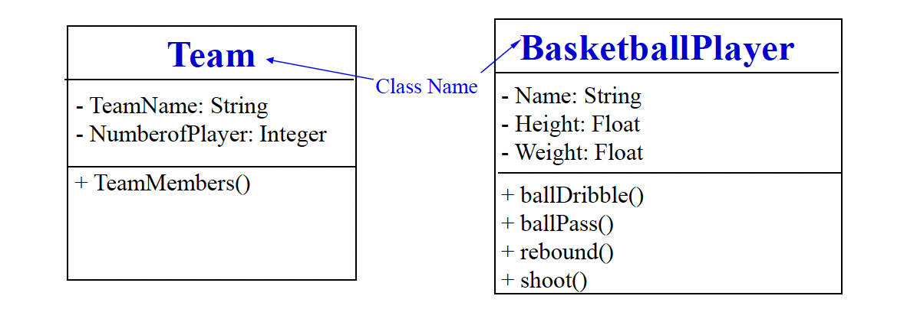

## Attributes and Operations
- Attributes(속성)
    - 모델링되는 대상의 property(속성)을 표현
    - Syntax(구문): attributeName: Type
- Operations
    - Class의 object로부터 요청된 service(서비스)의 구현
    - Syntax: operationName(param1:type, param2:type, ...) : Result

## Association and Multiplicity
- Association
    - Class instance(인스턴스) 간의 connection(연결)을 명시하는 Class 간의 relationship
    - Association의 이름은 주로 동사를 씀.
- Multiplicity
    - 다른 Class의 *하나*(ONE)의 instance와 관련된 한 Class의 instance 수
- 예: "팀(Team)은 0명 이상의 농구 선수(Basketball Player)를 고용(employ)한다."

## Aggregations and Compositions
- Aggregation(집합)
    - Element 간의 Weak(약한) "whole-part"(전체-부분) relationship
    - 예: 공항(Airport)은 많은 비행기(Airplane)를 가짐.
- Composition(복합)
    - Element 간의 Strong(강한) "whole-part" relationship
    - 예: 창문(Window)은 스크롤바(Scrollbar)를 'contains'.

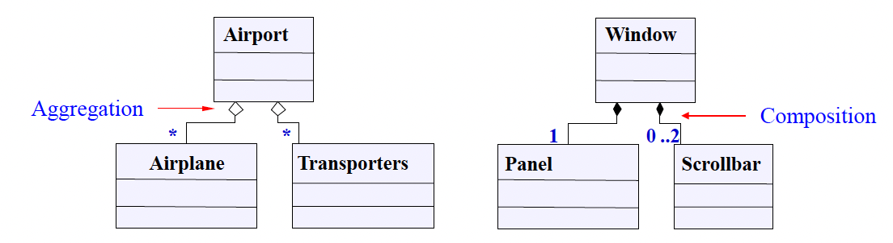

## Inheritance 상속
- Superclass와 subclasses 간의 relationship
- Superclass의 모든 Attributes와 Operations는 subclasses의 일부가 됨.

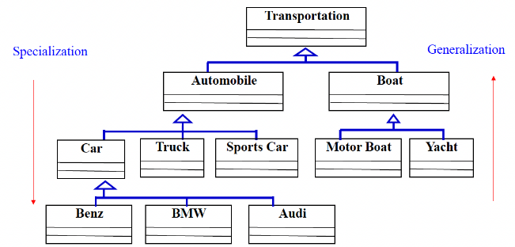

## Tips for Class Modeling
- Class(클래스) 찾기
    - 저장되거나 분석되어야 할 data가 있는가?
    - External system(외부 시스템)이 있는가?
    - External system은 Class로 모델링됨.
    - pattern(패턴), class libraries(클래스 라이브러리), component 등이 있는가?
    - System이 처리해야 할 device(장치)가 있는가?
- 가능할 때마다 명시적인 traceability(추적성) 확보
    - Use Case의 noun로부터 Class/Attributes를, verb로부터 Operations를 도출하려 노력
    - 항상 어떤 형태의 behavioral diagrams(행위 다이어그램)과 함께 Class diagram 작성

# Sequence Diagrams

## Sequence Diagrams
- System 내 instance 간의 message("interaction") sequence 표시
- time ordering(시간 순서) 강조
- (다이어그램 구성 요소)
- Lifeline(생명선)
- Message name(메시지 이름)
- Messages line(메시지 라인)
- ReferenceFrame(참조 프레임)
- Sequence DiagramName(시퀀스 다이어그램 이름)

## Lifelines
- 일정 기간 동안 interaction에 참여하는 개별 participant(참여자)
- Subsystem(서브시스템) / object / Class
- Actor
- 표기: `Instance name (object) : Type name (class)`

## Messages
- 두 object 간의 One-way communication
- Value를 전달하는 parameter를 가질 수 있음.
- (Asynchronous message(비동기 메시지), Synchronous message(동기 메시지))

## Combined Fragment Frame
- Interaction fragments(프래그먼트)의 표현식 정의
- Interaction operators(연산자)는 내용이 behavior를 어떻게 기술하는지 정의
- Alt: 각 섹션이 하나의 **alternative**(대안). 예: `alt [a>0]`
- Ref: 다른 Use Case **참조**
- Loop: **반복**되는 behavior sequence 명시. 예: `loop [1,5]`, `loop [6]`
  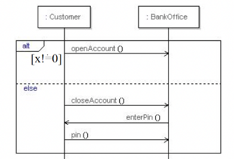

## Referencing
- 이미 존재하는 sequence diagram 재사용
- 불필요한 duplication(중복) 방지

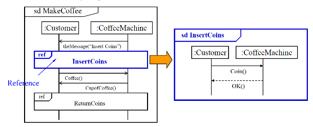

## Tips for Sequence Diagram
- Interaction의 context(컨텍스트) 설정
    - 예: 하나의 Use Case
- Flow(흐름)을 왼쪽에서 오른쪽으로, 위에서 아래로 표현
- Active(활성) instance는 왼쪽/위에, passive(수동) instance는 오른쪽/아래에 배치
- 여러 object의 behavior를 보고 싶다면 각 Use Case에 대한 sequence diagram 작성

# Activity and Swimlane Diagrams

## Activity Diagram
- 특정 scenario(시나리오) 내 interaction의 flow를 graphical representation(그래픽 표현)으로 제공하여 Use Case 보충
- Activity diagram(활동 다이어그램)은 flow-chart(순서도)와 유사
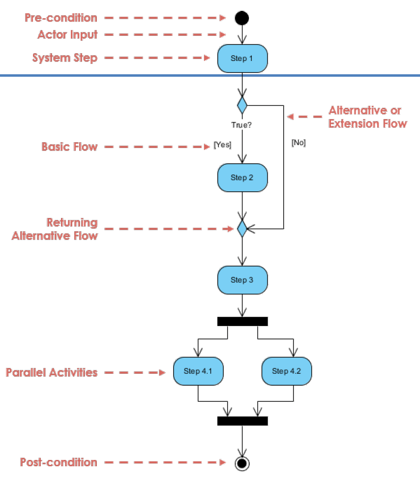 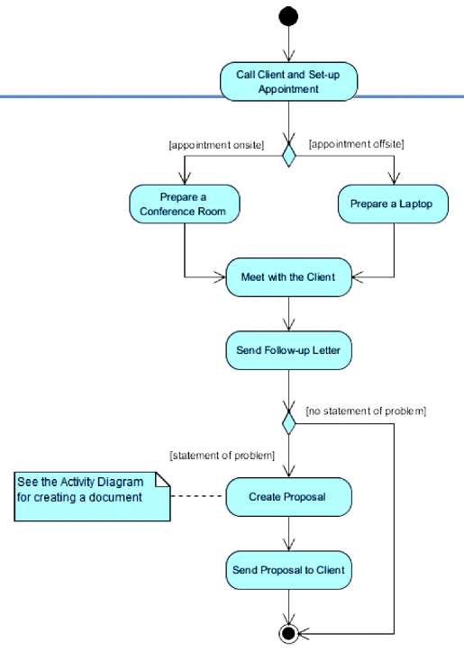

## Swimlane Diagrams
- modeler(모델러)가 어떤 Actor가 action에 대한 responsibility(책임)이 있는지 표시하도록 허용
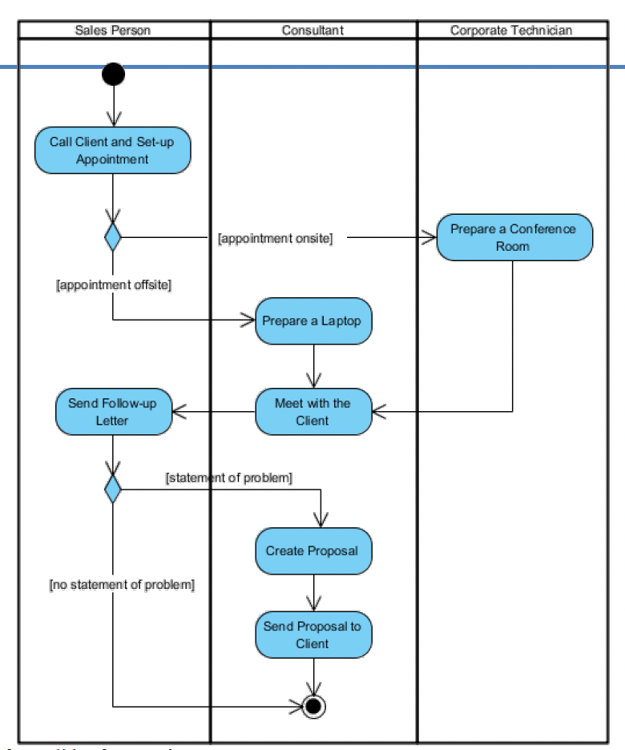

# State Machine Diagrams [10.30.(목)]

## State Machine Diagrams
- 각 Class의 object lifecycle을 모델링하여 시간에 따른 object의 동적인 동작 기술
- 표시 항목
    - 한 State에서 다른 state로의 transition를 유발하는 사건
    - State 변경으로 인한 action
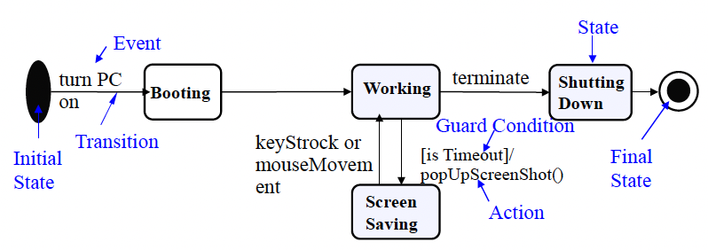

## States 상태
- State: object의 수명 동안의 condition(조건) 또는 situation(상황)
- 어떤 condition을 만족하거나, 어떤 activity를 수행하거나, 어떤 event를 기다림

## Event and Action
- Event: Object가 State를 변경하도록 유발하는 Stimulus(자극)
- Action: Signal 또는 operation call의 Output

## Transition
- Event에 의해 촉발되어 한 state에서 다른 state로의 변경
- Guard Condition이 true일 때만 발생
- Syntax: `event(arguments)[condition]/action`
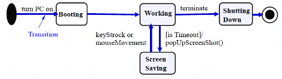

## Internal Activities
- State는 transition 없이 event에 반응 가능
- Event, Guard, activity를 state box 내부에 배치
- 두 가지 특별한 activity
    - Entry(진입) 및 exit(진출) activity
- Internal activity는 self-transition와 유사
- 그러나 Internal activity는 entry 및 exit activity를 촉발하지 않음.

| Typing |
| ------ |
| `entry/highlight all` `exit/update field` `character/ handle character` `help[verbose]/ open help page` `help[quiet]/ update status bar` |

## Activity States
- Regular activities
    - Instantaneous(순간적인) behavior
    - Interrupt(중단)될 수 없음.
- Normal state는 조용하며 다음 event를 기다린 후 무언가를 수행
- Do-activities(수행-활동)
    - Finite time(유한 시간) 소요
    - Interrupt될 수 있음. (멈출 수 있음.)
- Activity state(활동 상태)는 on-going work(진행 중인 작업)을 수행 중

## Superstates
- 여러 State가 공통의 transition 및 Internal activity를 공유
- 공유된 behavior를 superstate로 이동
- Behavior가 modular(모듈식)/hierarchical(계층적) 방식으로 표현될 수 있음.

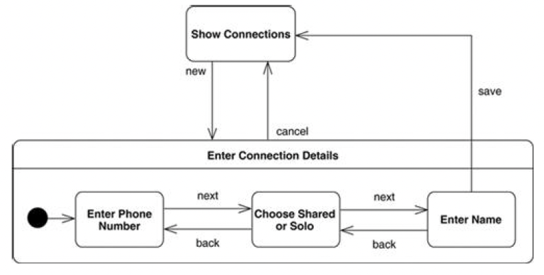

# Deployment Diagrams

## Deployment Diagrams
- Architecture 내 device, execution environment(실행 환경), artifact의 runtime architecture 표시
- System topology의 물리적인 설명
- Hardware unit의 구조와 각 유닛에서 실행되는 소프트웨어 기술

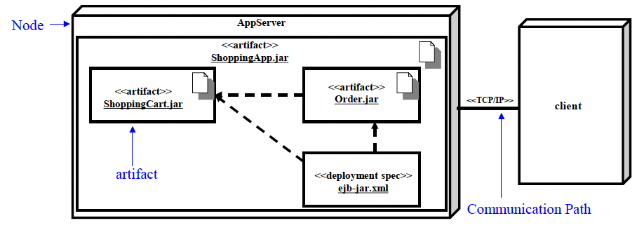

- Node
    - Artifact가 실행을 위해 배포될 수 있는 Computational resource(컴퓨팅 자원)
- Communication path
    - Node 간의 connection 표시
    - Stereotype은 통신 protocol이나 사용되는 network에 사용 가능
- Artifact
    - Software development process 또는 system의 배포 및 운영에 의해 사용되거나 생성되는 물리적 piece of information의 Specification(명세, 사양)
    - 예: 모델 파일, 소스 파일, 스크립트, 바이너리 실행 파일, 데이터베이스 시스템의 table, 개발 결과물, 워드 프로세싱 문서, 메일 message