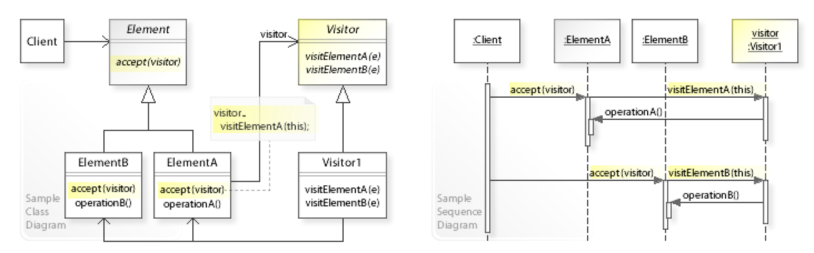

## $\text{Homework \#1-2}$
- Software Engineering (10780)
- 학번: 2021024057
- 이름: 김병준

## 1. 과제 분석 및 사용 Design Pattern

**Homework #1-2**의 주요한 목표는 소프트웨어의 유연성, 확장성, 유지보수성을 높이는 세 가지 design pattern을 적용하는 것입니다.

| # | 요구사항 | Design Pattern | Design Principle |
| - | - | - | - |
| **P1** | `java.io.Writer/Reader`에 암호화/복호화 기능 추가 | Decorator Pattern | Open-Closed Principle (OCP) |
| **P2** | 다양한 암호화 알고리즘 지원 기능 추가 | Strategy Pattern | Single Responsibility Principle (SRP) |
| **P3** | Directory 구조에서 keyword 검색 기능 구현 | Visitor Pattern | OCP 및 Dependency Inversion Principle (DIP) |

## 2. Design Pattern Implementation and Argument

### 2.1. **P1**: Decorator Pattern 기반 `EncryptWriter` 및 `DecryptReader` 구현

> **Decorator UML class diagram**[1]  

- Decorator Pattern은 객체의 기능에 새로운 responsibility를 동적으로 추가하는 구조적인 패턴입니다.
- Subclassing 대신 객체 구성을 통해 기능을 확장하는 대안을 제공합니다.
- 적용: 기존의 I/O 스트림 class(Writer, Reader)를 수정하지 않고, 그 위에 `EncryptWriter`와 `DecryptReader`라는 Decorator를 씌워 암호화/복호화 기능을 추가합니다.
- Design Pattern
    - `EncryptWriter`는 내부적으로 다른 Writer 객체를 참조하며, `write()`가 호출될 때 Caesar cipher (3칸 왼쪽 rotation)를 적용한 후, wrapping된 객체의 `write()`를 호출하여 데이터를 전달하게 됩니다.
    - `DecryptReader`는 wrapping된 Reader 객체에서 데이터를 읽어온 후, 역변환을 수행하여 복호화된 문자를 반환합니다.
- 이 구현은 OCP (Open-Closed Principle)를 만족시키게 됩니다. 기존의 `java.io` 스트림 class는 수정에 대해 closed되면서도, Decorator라는 새로운 wrapping class를 통해 암호화라는 새로운 기능을 확장에 대해 open되었습니다.

### 2.2. **P2**: Strategy Pattern을 활용한 알고리즘 확장

> **Strategy Pattern UML diagram**[2]  

- Strategy Pattern은 알고리즘군을 정의하고, 각 알고리즘을 encapsulization한 후, 이들을 상호 교환 가능하게 만드는 behavior pattern입니다.
- Strategy Design Pattern은 유연하고 재사용 가능한 객체 지향 소프트웨어를 설계하기 위해 반복되는 디자인 문제를 해결하는 방법
- "객체는 구현, 변경, 테스트, 재사용이 쉬워야 한다"의 내용을 포함한 23가지 GoF(Gang of Four) 디자인 패턴들 중 하나입니다.
- **P1**에서 구현된 `EncryptWriter`와 `DecryptReader`가 고정된 Ceaser 암호 알고리즘 대신 실행 시점에 (원하는) 암호화 방식을 선택할 수 있도록 유연성을 강화하였습니다.
- Design Pattern
    - Strategy: `EncryptionStrategy` 인터페이스를 정의하고, 모든 암호화 알고리즘이 이를 구현하도록 강제하고 있습니다.
    - Concrete Strategy: `CaesarCipherStrategy`와 `CaseSwapStrategy`가 여기에 해당합니다.
    - Context: `EncryptWriter`와 `DecryptReader`는 `EncryptionStrategy` 객체를 필드로 유지하며, 실제 암호화/복호화 logic을 이 객체에 위임합니다.
- 관련된 design principles
    1. SRP: `EncryptWriter`는 더 이상 "데이터 쓰기" 책임과 "암호화 알고리즘" 책임을 동시에 가지지 않게 됩니다. 알고리즘의 로직은 `Strategy` class로 분리되어 SRP를 만족합니다.
    2. OCP: 새로운 암호화 방식이 추가되어도 (like `SHA` or `AES`), Strategy 인터페이스를 구현하는 새로운 class만 추가하면 되고, 핵심 class인 `EncryptWriter`의 코드를 수정할 필요가 없을 것입니다.

### 2.3. **P3**: Visitor Pattern 기반 `FindVisitor` 구현

> **Visitor Pattern UML diagram**[3]  

- Visitor Pattern은 객체 구조(Directory 구조)를 변경하지 않고, 구조의 Element들에 대해 수행할 새로운 연산(Operation)을 정의할 수 있도록 하는 behavior pattern입니다.
- 적용: 파일 시스템의 Element (File 및 Directory) class에 keyword 검색이라는 새로운 기능을 추가합니다.
- Design Pattern
    - Element: Entry (File 및 Directory 의 상위 추상 class)는 `accept(Visitor v)` method를 정의하여 방문자를 받아들입니다.
    - Visitor: `Visitor` interface는 `visit(File)`과 `visit(Directory)`와 같이 각 Element 유형별 연산을 정의합니다.
    - Concrete Visitor: `FindVisitor`는 이 Visitor를 구현하여 visit method 내에서 이름에 keyword가 포함되어 있는지 검사하는 검색 logic을 수행합니다. Directory를 방문할 때는 재귀적으로 자식 Entry에 대해 `accept()`를 호출하여 구조 전체를 탐색합니다.
- 관련된 design principles
    1. OCP: 파일과 Directory를 나타내는 Element class에 별도의 수정 없이 `FindVisitor`라는 새로운 기능을 추가할 수 있습니다.
        - e.g., 추후에 '용량 계산'이라는 기능이 필요하게 되어도 `SizeVisitor`만 추가하면 될 것입니다.
    2. DIP: Element class는 detail한 `FindVisitor` class가 아닌 Visitor라는 추상화된 인터페이스에 의존합니다.
        - 이는 상위 모듈이 하위 모듈의 detail한 구현에 의존하는 것을 방지하여 의존성을 inversion시킵니다.

## 3. Conclusion
- **Homework #1-2**에서는 Design Pattern의 적절한 사용을 통해 소프트웨어 품질을 향상시키는 방법을 다루고 있습니다.
- 각 패턴들이 제공한 장점들
    1. Decorator Pattern & Strategy Pattern
        - Loose Coupling: I/O 처리와 암호화 로직을 분리하였고, 암호화 로직과 알고리즘을 분리하여 결합도를 최소화했습니다.
    1. Visitor Pattern
        - High Cohesion: 파일 시스템 순회 로직과 keyword 검색 로직을 분리하여 각 class의 응집도를 높였습니다.
    1. OCP/SRP/DIP 준수
        - 요구사항 변경 시 기존 코드의 수정 없이 새로운 기능을 확장할 수 있는 design을 확립했습니다.
- 각 패턴들은 상호보완적으로 작용하여
    1. 모듈화된
    2. 유연한
- 시스템을 구축하는 데 기여할 수 있었습니다.
- 이러한 이유로, 구현한 코드들은 design goal를 달성하였으며, design principle들을 준수한 객체 지향 solution이라고 할 수 있습니다.

## 4. Works Cited
- [1] Wikipedia, "Decorator pattern"
[https://en.wikipedia.org/wiki/Decorator_pattern](https://en.wikipedia.org/wiki/Decorator_pattern)

- [2] Wikipedia, "Strategy pattern"
[https://en.wikipedia.org/wiki/Strategy_pattern](https://en.wikipedia.org/wiki/Strategy_pattern)

- [3] Wikipedia, "Visitor pattern"
[https://en.wikipedia.org/wiki/Visitor_pattern](https://en.wikipedia.org/wiki/Visitor_pattern)