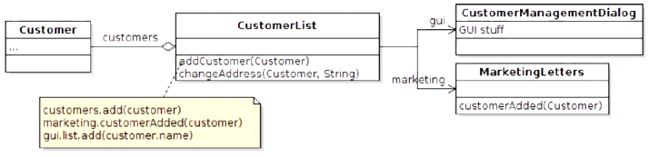
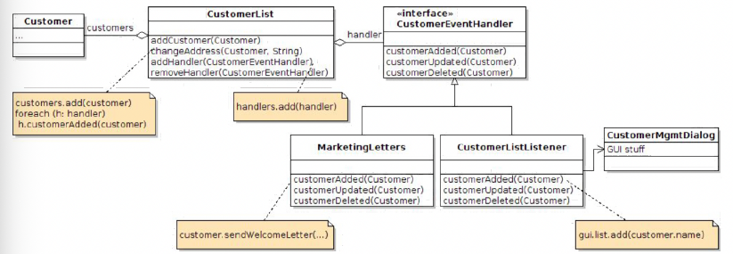
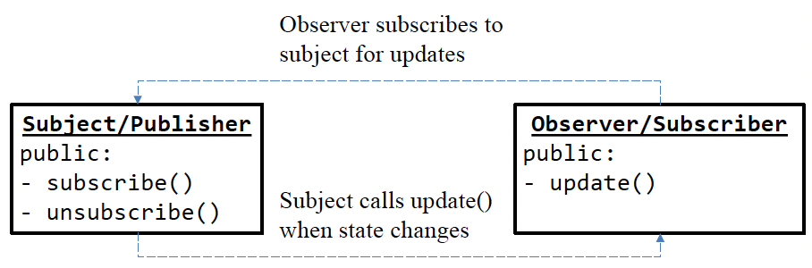
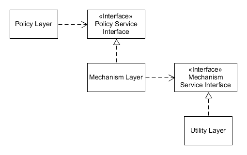

# $\text{Homework \#1-1}$

- Software Engineering (10780)
- 학번: 2021024057
- 이름: 김병준

## 1. 디자인 분석

> **Design A**

> **Design B**

- 위에 제시된 두 디자인은 모두 고객(`Customor`) 정보를 관리하는 시스템의 Class diagram을 나타내고 있습니다.
- 특히 `CustomerList` class에서 고객 정보가 변경될 때 다른 부분(`MarketingLetters`, `CustomerManagementDialog`)으로 **변경되었음을 전달**하는 방식에 차이가 있음을 확인할 수 있었습니다.

| 특징 | **Design A** | **Design B** |
| - | - | - |
| 변경 알림 방식 | `CustomerList`가 직접 다른 class의 method를 호출 | Observer Pattern 기반의 간접 호출 |
| `CustomerList`의 역할 | 고객 데이터 관리 및 UI/마케팅 로직 직접 처리 | 고객 데이터 관리 및 event 알림 역할만 수행 |
| Coupling(결합도) | `CustomerList`가 `MarketingLetters`와 `CustomerManagementDialog`에 직접 결합 | `CustomerList`가 `CustomerEventHandler` interface에만 간접 결합 |
| 확장/유지보수 | 새로운 기능을 추가하려면 `CustomerList`를 수정해야 함 | 새로운 Listener를 추가하여 기능 확장 가능 |

## 2. Design principle and pattern-based argue

### 2.1. (Design Pattern) Observer Pattern

> Observer Pattern (a.k.a. "Publish-Subscribe")  
> *"객체 간 일대다 종속성을 정의하여, 객체의 상태가 변경될 때 모든 종속 객체가 자동으로 통지받고 업데이트되도록 한다."* [1]

- **Design B**는 observer pattern을 명확하게 반영하고 있습니다.
    - Subject: `CustomerList` (이벤트 발생 시 observer들에게 알림)
    - Observer: `CustomerEventHandler` interface를 구현하는 `MarketingLetters`와 `CustomerListListener` (이벤트 수신 및 처리)
    - `CustomerList`는 어떤 class가 자신의 이벤트를 수신하게 되는지 알 필요가 없습니다.
    - Event를 `handler`에게 전파하기만 하면 됩니다.
        - 이는 Loose Coupling 조건을 충족합니다.

### 2.2. (Design Principle) Single Responsibility Principle(SRP)

> "*객체 지향 프로그래밍에서 **단일 책임 원칙**(single responsibility principle)이란 모든 클래스는 하나의 책임만 가지며, 클래스는 그 책임을 완전히 캡슐화해야 함을 일컫는다. 클래스가 제공하는 모든 기능은 이 책임과 주의 깊게 부합해야 한다.*" [2]

- **Design A**
    - `CustomerList`가 가지고 있는 responsibility들
        1. 고객 리스트 관리 (`customers.add(customer)`)
        2. 마케팅 편지 발송 처리 (`marketing.customerAdded(customer)`)
        3. UI 리스트 업데이트 처리 (`gui.list.add(customer.name)`)
    - 이는 SRP 위반에 해당합니다.
- **Design B**
    - `CustomerList`는 고객 리스트 관리 및 이벤트 발생 알림이라는 single responsibility만 가집니다.
    - 마케팅 관련 책임은 `MarketingLetters`에, UI 업데이트 관련 책임은 `CustomerListListener`를 구현하는 class에 분리되어 있습니다.
    - 이는 SRP를 만족시킨다고 할 수 있습니다.

### 2.3. (Design Pattern) Open-Closed Principle (OCP)

> "*개방-폐쇄 원칙(OCP, Open-Closed Principle)은 '소프트웨어 개체(클래스, 모듈, 함수 등등)는 확장에 대해 열려 있어야 하고, 수정에 대해서는 닫혀 있어야 한다'는 프로그래밍 원칙이다.*" [3]

- **Design A**
    - 고객 추가 시 다른 작업을 추가하려면 (`Accounting` 모듈에 알림 보내기 등), `CustomerList` class의 `addCustomer()` method를 수정해야 합니다. (기능 추가에 대해 closed되지 않음)
- **Design B**
    - 새로운 listener(예: `AccountingListener`)를 추가하고 `CustomerList`에 등록하기만 하면 됩니다.
    - `CustomerList` 자체의 코드는 수정할 필요가 없습니다. (확장에 대해 open, 수정에 대해 closed)
    - 이는 OCP를 만족시킨다고 할 수 있습니다.

### 2.4. (Design Principle) Dependency Inversion Principle (DIP)

> "*의존관계 역전 원칙은 소프트웨어 모듈들을 분리하는 특정 형식을 지칭한다. 이 원칙을 따르면, 상위 계층(정책 결정)이 하위 계층(세부 사항)에 의존하는 전통적인 의존관계를 반전(역전)시킴으로써 상위 계층이 하위 계층의 구현으로부터 독립되게 할 수 있다. 이 원칙은 다음과 같은 내용을 담고 있다.*" [4]
> 1. 상위 모듈은 하위 모듈에 의존해서는 안된다. 상위 모듈과 하위 모듈 모두 추상화에 의존해야 한다.
> 2. 추상화는 세부 사항에 의존해서는 안된다. 세부사항이 추상화에 의존해야 한다.

- **Design A**
    - High-level module인 `CustomerList`가 low-level moudule인 detail한 `MarketingLetters`와 `CustomerManagementDialog`에 직접 의존하고 있습니다. (detail한 것에 의존)
- **Design B**
    - `CustomerList`는 추상화된 `CustomerEventHandler` interface에만 의존합니다.
    - detail한 구현체(Listener)에 대한 의존성을 역전시킵니다. (추상적인 것에 의존)
    - 이는 DIP를 만족시킨다고 할 수 있습니다.

## 3. Conclusion
- **Design B**는 observer pattern을 사용하여 SRP, OCP, DIP와 같은 핵심 디자인 원칙을 준수하고 있습니다.
- 이를 통해
    1. 결합도는 낮추고 (느슨한 결합, low coupling)
    2. 응집도는 높이며
    3. 확장성과 유연성을 극대화하여
- 시스템의 유지보수성을 향상시킬 수 있습니다.

> 이러한 이유로, **Design B**가 더 우수한 소프트웨어 디자인이라고 평가할 수 있습니다.

## 4. Works Cited

[1] 수업 강의자료, Design Patterns
(https://learning.hanyang.ac.kr/courses/181214/modules/items/8362823?return_url=/courses/181214/external_tools/140)

[2] Wikipedia, "Single-Responsibility Principle"
(https://en.wikipedia.org/wiki/Single-responsibility_principle)

[3] Wikipedia, "Open-Closed Principle"
(https://en.wikipedia.org/wiki/Open%E2%80%93closed_principle)

[4] Wikipedia, "Dependency Inversion Principle"
(https://en.wikipedia.org/wiki/Dependency_inversion_principle)
